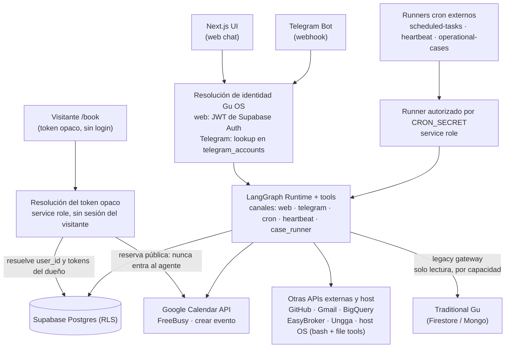

# Arquitectura Técnica — runtime implementado de Gu OS

> **Alcance:** este documento describe **lo que corre hoy**. Nació como el overview del *Agente Personal MVP* — de ahí el peso que todavía tienen aquí las secciones de chat, calendario y tareas programadas — pero el runtime implementado ya no es solo ese agente: incluye el subsistema de **casos operacionales**, los **workflows ejecutables** y el **substrato de Organización** de R1 (ver *Modelo de datos*). Lo que este overview corto **no** cubre en profundidad vive en los documentos enlazados abajo; lo que **no está implementado** no pertenece aquí.

> **Nota:** este documento es el overview tecnico corto del stack actual. Para una **guia narrativa** (menos tecnica, con foco en Skills y el mapa mental del sistema), ver [`docs/manuals/gu-os-understanding.md`](manuals/gu-os-understanding.md). Para el **manual tecnico** integrador, ver [`docs/manuals/architecture-manual.md`](manuals/architecture-manual.md). Para **principios agenticos externos** (Thin Harness / Fat Skills, alineacion con Gu OS), ver [`docs/manuals/agentic-principles-alignment.md`](manuals/agentic-principles-alignment.md). Para el **analisis de design space / riesgos** (paper Claude Code), ver [`docs/manuals/gu-os-agent-architecture-analysis.md`](manuals/gu-os-agent-architecture-analysis.md). La dirección futura de la interfaz operacional multimodal vive en [`docs/talk-to-gu/vision.md`](talk-to-gu/vision.md), con su spike ejecutable en [`docs/talk-to-gu/realtime-voice-implementation-plan.md`](talk-to-gu/realtime-voice-implementation-plan.md); no deben interpretarse como capacidades ya implementadas.

## Stack

| Capa                  | Tecnología                           | Paquete                              |
| --------------------- | ------------------------------------ | ------------------------------------ |
| Monorepo              | Turborepo + npm workspaces           | raíz                                 |
| Frontend / API routes | Next.js (App Router)                 | `apps/web`                           |
| Agente runtime        | LangGraph JS + LangChain core        | `packages/agent`                     |
| Base de datos + Auth  | Supabase (Postgres + Auth + RLS)     | `packages/db`                        |
| Tipos compartidos     | TypeScript                           | `packages/types`                     |
| Config compartida     | tsconfig                             | `packages/config`                    |
| Modelo LLM            | OpenRouter (varios roles; defaults en `model.ts`) | vía `@langchain/openai` con base URL |

### Proveedores de modelo

**Estado actual del código:** el LLM se invoca solo vía **OpenRouter** (`OPENROUTER_API_KEY`, `OPENROUTER_MAX_TOKENS`). Los **defaults y env IDs canónicos** viven en [`packages/agent/src/model.ts`](../packages/agent/src/model.ts); las factories de loop (main / compaction / selector / brain reviewer) también. Roles laterales (visión, listing copy, clasificador de casos) leen las mismas constantes desde su punto de uso.

| Rol | Env | Default en código |
| --- | --- | --- |
| Agente principal (web/telegram/cron/case_runner) | `MAIN_AGENT_MODEL_ID` | `openai/gpt-5.4-mini` |
| Heartbeat | `HEARTBEAT_MODEL_ID` (+ `HEARTBEAT_MAX_TOKENS`) | hereda main si se omite |
| Compaction / memory flush | `COMPACTION_MODEL_ID` | `anthropic/claude-haiku-4.5` |
| Skill selector | `SKILL_SELECTOR_MODEL_ID` | `anthropic/claude-haiku-4.5` |
| Business Brain reviewer | `BUSINESS_BRAIN_REVIEWER_MODEL_ID` | `anthropic/claude-haiku-4.5` |
| Clasificador conversacional de casos (+ 2ª opinión HITL `unclear`) | `OPERATIONAL_CONVERSATION_CLASSIFIER_MODEL_ID` | `openai/gpt-5.4-mini` |
| Intérprete semántico de admisión (R1) | `RELATIONSHIP_ADMISSION_MODEL_ID` | `openai/gpt-5.4-mini` |
| Juez de continuidad duplicado/supersesión (R1) | `RELATIONSHIP_CONTINUITY_MODEL_ID` | `openai/gpt-5.4-mini` |
| Vision / fotos | `IMAGE_VISION_MODEL_ID` | `openai/gpt-4.1-mini` |
| Copy de listing | `LISTING_COPY_MODEL_ID` | `openai/gpt-4.1-mini` |

Inventario + diseño multi-proveedor previsto: **[docs/tools-design/model-providers.md](tools-design/model-providers.md)**. Análisis de arquitectura (design space, riesgos): **[docs/manuals/gu-os-agent-architecture-analysis.md](manuals/gu-os-agent-architecture-analysis.md)**.

## Estructura del monorepo

```
agents/
├── apps/
│   └── web/                    # Next.js — UI + API routes
│       └── src/
│           ├── app/
│           │   ├── login/      # Autenticación
│           │   ├── signup/
│           │   ├── onboarding/ # Wizard multi-paso
│           │   ├── chat/       # Interfaz de chat
│           │   ├── book/       # Reserva pública (token en URL, sin login)
│           │   ├── settings/   # Ajustes post-onboarding
│           │   └── api/
│           │       ├── chat/           # POST → runAgent
│           │       ├── chat/confirm/   # POST → resume HITL (runAgent + resumeDecision)
│           │       ├── integrations/
│           │       │   ├── github/   # OAuth GitHub
│           │       │   └── google/   # OAuth Google Calendar
│           │       ├── calendar/
│           │       │   └── booking-link/  # POST — genera enlace de reserva (auth)
│           │       ├── public/
│           │       │   └── booking/[token]/ # GET/POST FreeBusy y reserva (sin auth)
│           │       ├── auth/signout/
│           │       ├── cron/
│           │       │   ├── scheduled-tasks/  # POST — runner externo (CRON_SECRET)
│           │       │   └── heartbeat/        # POST — runner Heartbeat (CRON_SECRET)
│           │       ├── scheduled-tasks/[id]/status/ # POST — pausar/reanudar tarea
│           │       └── telegram/
│           ├── lib/supabase/
│           └── middleware.ts
├── packages/
│   ├── agent/
│   │   └── src/tools/   # catalog, adapters, bashExec, fileTools, github-api, calendar-api, …
│   ├── db/
│   │   ├── src/google-calendar-oauth.ts  # refresh + getGoogleCalendarAccessToken
│   │   └── src/queries/booking-links.ts
│   └── types/
├── docs/
└── turbo.json
```

## Diagrama de componentes



**Los únicos caminos que entran a LangGraph son `ID → LG` y `RUNNER → LG`.** La reserva pública termina en Postgres y en la API de Google: no existe ninguna ruta dirigida de `/book` al agente.

Planos durables en Postgres (agrupados; la lista completa de migraciones vive en *Modelo de datos*):

| Plano | Tablas |
| --- | --- |
| Agente | `profiles`, `agent_sessions`, `agent_messages`, `tool_calls`, `memories`, `user_tool_settings`, `user_skill_settings`, `user_integrations`, `telegram_*`, `calendar_booking_links` |
| Proactivo | `scheduled_tasks`, `scheduled_task_runs`, `heartbeat_runs` |
| Casos operacionales | `operational_case_types`, `operational_cases`, `operational_case_events`, `case_facts`, `case_artifacts`, `artifact_inputs`, `case_approvals` |
| Workflows ejecutables | `workflow_definitions`, `account_feature_flags`, `evidence_records` |
| Organización (R1) | `organizations`, `organization_memberships`, `contacts`, `organization_feature_flags`, `organization_tool_secrets`, `organization_policies`, `source_events`, `external_identity_bindings`, `case_relationships` |
| Observabilidad | `ai_usage_events` |

Dos precisiones, porque la tabla de arriba muestra **schema** y el diagrama muestra **flujos que existen hoy**:

- El plano de Organización **existe en schema con RLS activa, pero ninguna ruta HTTP ni cron ejecuta hoy admisión ni resolución de relaciones**. Esos módulos (`apps/web/src/lib/relationship-admission/`, `relationship-resolution/`) no los importa ninguna route ni runner: se ejercitan por selftests, evals y los verificadores **operados a mano** `npm run verify:admission` / `npm run verify:resolution` contra el entorno hospedado de staging. No existe un runtime de aplicación Gu OS desplegado; `deliver-staging` entrega **migraciones** a un proyecto Supabase.
- El **legacy gateway sí está cableado** al runtime del agente (`apps/web/src/lib/agent/wire-tool-deps.ts` → `packages/agent/src/tools/legacy-gateway-adapters.ts`): lecturas acotadas por capacidad contra Traditional Gu, sin ninguna ruta de escritura.

## Integraciones OAuth (GitHub y Google Calendar)

- **Identidad del producto:** Supabase Auth (email/contraseña u otros proveedores de login).
- **GitHub / Google Calendar:** flujos OAuth **aparte**, iniciados desde Ajustes. Tokens cifrados en `user_integrations` (`encrypted_tokens`), `provider` = `github` | `google_calendar`.
- **GitHub:** se guarda el access token (texto cifrado).
- **Google Calendar:** se guarda JSON cifrado `{ access_token, refresh_token?, expires_at }`. `packages/db/src/google-calendar-oauth.ts` refresca el access token con `refresh_token` cuando está próximo a expirar y vuelve a persistir el blob.

### Disponibilidad para terceros (reservas)

Los visitantes **no** hacen OAuth con Google. Las rutas bajo `/api/public/booking/[token]` y la página `/book/[token]` usan un **token opaco** fila en `calendar_booking_links`. El servidor resuelve `user_id`, obtiene tokens del dueño con `getGoogleCalendarAccessToken`, y llama a la API de Google ([FreeBusy](https://developers.google.com/calendar/api/v3/reference/freebusy/query), crear evento) en su nombre.

## Flujo de un request de chat

1. Usuario envía mensaje (web POST `/api/chat` o Telegram webhook).
2. Se autentica al usuario (JWT en web, lookup `telegram_accounts` en Telegram).
3. Se carga o crea `agent_session` para el canal.
4. Se cargan `profile`, `user_tool_settings` e `integrations`.
5. Se obtiene `githubToken` (descifrado) y `googleCalendarAccessToken` (con refresh si aplica).
6. Se cargan `user_skill_settings` y el registry global de skills cuando aplica.
7. Se filtran las tools disponibles (allowlist + integración activa; la tool `bash` además exige `BASH_TOOL_ENABLED=true` en el servidor, y `read_file`/`write_file`/`edit_file` exigen `FILE_TOOLS_ENABLED=true` + `FILE_TOOLS_ROOT`).
8. Se invoca `runAgent()` con `userTimezone` desde `profiles.timezone`. El runtime puede seleccionar una skill pre-graph antes de compilar el loop; el racional y trade-offs frente al enfoque Claude Code están documentados en [`docs/tools-design/skill-routing.md`](tools-design/skill-routing.md).
9. Si una tool tiene riesgo medio/alto → `interrupt()` en el grafo, `pendingConfirmation` persistido (incl. `checkpointThreadId` para resume); confirmación en web o Telegram vía `runAgent({ resumeDecision })`.

### Skills / playbooks

- Las skills globales viven como directorios `skills/global/<slug>/SKILL.md`, con frontmatter (`name`, `description`, `scope`, `allowed_tools`, `includes`, `requires_tenant_context`, `memory_extraction`) y referencias opcionales en `references/`.
- `packages/agent/src/skills/*` implementa parsing, registry lazy, resolución de composites (`includes`) y selección pre-graph. El selector elige **una skill dominante** o `none`; composites siguen siendo explícitos.
- Cuando una skill está activa, `runAgent` inyecta el playbook al system prompt, puede añadir `[Contexto de tenant]`, y `buildLangChainTools` intersecta la superficie de tools con `allowed_tools`.
- `read_skill_reference` permite leer un archivo de referencia de la skill activa o incluida, sin cargar todos los documentos en el prompt inicial.
- Settings muestra el catálogo global agrupado por `scope` y persiste overrides en `user_skill_settings`. El panel de chat muestra habilidades candidatas en "Contexto preparado" y la skill aplicada en "Habilidades del turno".
- El modelo detallado y sus trade-offs están en **[docs/tools-design/skill-routing.md](tools-design/skill-routing.md)**; la secuenciación de producto vigente vive en **[docs/roadmap/gu-os-evolution-roadmap.md](roadmap/gu-os-evolution-roadmap.md)** (el antiguo `business-brain-evolution-roadmap.md` quedó **superseded** y hoy es solo un stub de redirección/procedencia).

### Herramienta `bash` (host del servidor)

No es una API externa ni OAuth: ejecuta un comando en el **mismo proceso/host** que sirve Next.js. Útil en desarrollo o despliegues self-hosted con control total del servidor; en serverless multi-instancia no hay terminal persistente (el campo `terminal` en la tool es solo etiqueta para logs). Variables: `BASH_TOOL_ENABLED`, opcionalmente `BASH_TOOL_CWD` (véase `apps/web/.env.example`). Detalle: **[docs/tools-design/bash-tool.md](tools-design/bash-tool.md)**.

### Herramientas de archivos (`read_file`, `write_file`, `edit_file`)

Manipulan archivos de texto dentro de una **raíz configurada** (`FILE_TOOLS_ROOT`, ruta absoluta). Todas las rutas que pasa el modelo son **relativas** a esa raíz; `resolveSafePath` en `packages/agent/src/tools/fileTools.ts` rechaza rutas absolutas, `..` que escapen, y null bytes. Activación fail-closed: si `FILE_TOOLS_ENABLED !== "true"` o falta `FILE_TOOLS_ROOT`, las tres tools no se registran. `read_file` es `low` (sin HITL); `write_file` es `medium` (crea o sobrescribe, con confirmación); `edit_file` es `high` (reemplazo literal único, con confirmación). Detalle: **[docs/tools-design/files.md](tools-design/files.md)**.

**Seguridad (host tools):** no apuntar `FILE_TOOLS_ROOT` a la raíz del monorepo si ahí vive `.env.local` — `read_file` podría leer secretos sin HITL. Preferir fail-closed (flags comentadas) o una carpeta dedicada. Las skills globales (`skills/global/`) **no** usan file tools: las carga el registry. Bash (`BASH_TOOL_ENABLED`) es host shell sin sandbox; mantenerlo off salvo self-hosted consciente.

### Tareas programadas (`schedule_task` + cron)

- La tool **`schedule_task`** (riesgo `medium`, HITL al **programar**) persiste filas en **`scheduled_tasks`** con `next_run_at` (one-time o recurrente vía `cron_expr` + zona IANA), `user_request` y `display_title` para UI legible.
- La tool **`manage_scheduled_tasks`** (riesgo `low`) permite **listar**, **pausar** y **reanudar** tareas del mismo usuario (`action=list|pause|resume`), sin borrar registros. Las acciones de cambio de estado validan ownership en DB por `task_id + user_id`.
- Para peticiones ambiguas tipo “pausa la de Hacker News”, el prompt obliga un flujo de desambiguación: `list` primero, pregunta corta, y `pause/resume` solo tras selección explícita del usuario.
- Un **runner externo** debe invocar periódicamente **`POST /api/cron/scheduled-tasks`** con cabecera **`Authorization: Bearer <CRON_SECRET>`** (variable en `apps/web`, no confundir con el webhook de Telegram). En producción puede ser **GCP Cloud Scheduler** o **Supabase `pg_cron` + `pg_net`** (`net.http_post`) llamando a la URL pública del despliegue; si el despliegue vive en GCP, Cloud Scheduler es el camino operativo recomendado. En local hace falta **HTTPS alcanzable** (p. ej. ngrok), porque un scheduler en la nube no puede abrir `localhost`.
- El handler en `apps/web/src/app/api/cron/scheduled-tasks/route.ts` usa **service role** contra Supabase, toma tareas vencidas, crea sesión **`agent_sessions.channel = cron`** y ejecuta **`runAgent({ ..., autoApproveTools: true })`**: el usuario ya aprobó al programar, así que las tools internas (p. ej. `bash`) no piden segunda confirmación. Las ejecuciones cron arrancan sin memoria corta ni memoria larga automática; el prompt programado debe ser self-contained y puede usar herramientas explícitas permitidas por la skill/política persistida. Además, `schedule_task` no se registra en canal `cron`, para que una tarea no pueda reprogramarse a sí misma. Antes de ejecutar, el prompt almacenado puede **sanearse** levemente (p. ej. separar puntuación española de palabras reservadas bash como `done.`) y se añade una nota de ejecución para obligar a responder el resultado ahora. La tool **`bash`** aplica política por turno en canal `cron`: deduplicación de comandos casi idénticos, validación pre-ejecución de errores de sintaxis obvios, y límite adaptativo de reintentos reales frente a bucles de variaciones cosméticas. Auditoría en **`scheduled_task_runs`**; notificación por defecto por Telegram. Concurrencia acotada por tick con **`SCHEDULED_TASKS_CONCURRENCY`** (default 5, env opcional).
- La UI muestra tareas programadas en Settings y en la tarjeta "Actividad proactiva" del panel derecho. El endpoint autenticado `/api/scheduled-tasks/[id]/status` permite pausar/reanudar tareas propias desde Settings.
- El modelo usa **temperatura por canal**: interacción Web/Telegram `~0.3` y cron `~0.1` (más determinista). El cap `maxTokens` es configurable con `OPENROUTER_MAX_TOKENS` (default `2048`) para evitar rechazos por crédito insuficiente. Se prevé separar proveedor y topes por canal cuando exista la fachada multi-proveedor (ver **[docs/tools-design/model-providers.md](tools-design/model-providers.md)**).
- **Política de reintentos (migración `00004_scheduled_tasks_retry.sql`):** ante un run fallido el runner decide entre reintento acotado y auto-pausa. Errores "persistentes" (contiene `402`/`401`/`403`/`400`/`requires more credits`) se auto-pausan de inmediato para no quemar créditos. Errores transitorios reintentan hasta `MAX_CONSECUTIVE_FAILURES=3` con `RETRY_GAP_MINUTES=2` (acotado al próximo tick natural del cron si es recurrente). Alcanzado el cap → `status='paused'`, se persiste `last_failure_error` y se avisa al usuario por Telegram. Un run OK o un `manage_scheduled_tasks(action=resume)` resetea `consecutive_failures=0`.
- Detalle de diseño, HITL y operación: **[docs/tools-design/scheduled-tasks.md](tools-design/scheduled-tasks.md)** y **[docs/tools-design/runbook-scheduled-tasks.md](tools-design/runbook-scheduled-tasks.md)**.

### Heartbeat proactivo

- Heartbeat es un runner periódico por cuenta, distinto de `scheduled_tasks`: usa configuración en `profiles.business_brain.heartbeat` (`enabled`, `interval_minutes`, `checklist_markdown`, `last_run_at`) y registra auditoría en **`heartbeat_runs`**.
- Un **runner externo** invoca `POST /api/cron/heartbeat` con `Authorization: Bearer <CRON_SECRET>`. El patrón operativo es el mismo que scheduled tasks: en producción se recomienda GCP Cloud Scheduler si el despliegue vive en GCP; en local se puede usar ngrok o llamadas manuales. Los tres runners cron (`scheduled-tasks`, `heartbeat`, `operational-cases`) deben permanecer como endpoints separados; en producción conviene **desfasar sus schedules** para evitar picos simultáneos (ver **[docs/tools-design/runbook-scheduled-tasks.md](tools-design/runbook-scheduled-tasks.md)** § Stagger).
- El endpoint selecciona usuarios vencidos según `interval_minutes`, crea sesión `agent_sessions.channel = heartbeat`, construye un prompt desde el checklist y ejecuta `runAgent({ channel: "heartbeat" })`.
- El canal `heartbeat` usa modelo/costos acotados (`HEARTBEAT_MODEL_ID`, `HEARTBEAT_MAX_TOKENS`, baja temperatura), no carga memoria corta de la sesión (evita repetir ticks anteriores) y restringe tools a una allowlist de solo lectura. Para personalización proactiva puede inyectar un set pequeño de memoria persistente **curada**, no por similitud semántica contra el prompt técnico del tick: memorias activas `procedural` y `semantic`, limitadas por conteo/tamaño.
- Las templates canónicas de checklist viven en `packages/agent/src/heartbeat/checklist.ts` (`HEARTBEAT_CHECKLIST_TEMPLATES`). El archivo `heartbeat/default-checklist.md` queda como referencia legacy, no como fuente de runtime.
- Para señales de umbral que no deben depender de que el LLM escoja una tool, Heartbeat soporta **prelecturas determinísticas** declaradas por skills `heartbeat: native` vía `heartbeat_signals`. El runner ejecuta prefetchers antes del LLM, persiste cada lectura en `tool_calls` con `executor_kind='deterministic'`, inyecta un bloque compacto al prompt y comparte el mismo `turn_id` con `runAgent`.
- La UI no tiene una caja separada de señales: tanto las llamadas emitidas por el modelo como las prelecturas determinísticas aparecen en **"Herramientas del turno"**, diferenciadas por badges `IA` / `Determinístico`. Detalle técnico: **[docs/heartbeat/deterministic-prefetchers.md](heartbeat/deterministic-prefetchers.md)**.
- Settings permite activar/desactivar Heartbeat, editar intervalo/checklist, resetear al default y ver historial reciente. El panel derecho muestra presencia viva en "Actividad proactiva" y en el mini-dashboard superior ("Heartbeat" Activo/Inactivo).

## LangGraph: grafo, compaction (memoria corta) y HITL

- **StateGraph** con nodos **`memory_injection`**, **`compaction`**, **`agent`** y **`tools`**. Flujo: `__start__` → `memory_injection` → `compaction` → `agent` → (condicional) → `tools` o `__end__`; tras ejecutar tools, **`tools` → `compaction` → `agent`**. Así, cada lote de `ToolMessage` pasa por compaction antes del siguiente turno del modelo principal. El nodo de inyección corre una sola vez por turno, antes de compaction, y es **no-op** en cron (`autoApproveTools`) y en resume HITL (ver *Memoria larga personal*).
- **Memoria de corto plazo (compaction):** `packages/agent/src/nodes/compaction_node.ts` — (1) *microcompact*: ofusca resultados de tools antiguos (`[tool result cleared]`) conservando los últimos N intactos; (2) *LLM compaction*: si la ventana estimada supera el umbral (default 80%), resume con el modelo de `createCompactionModel()` en `model.ts` (default `anthropic/claude-haiku-4.5`, override `COMPACTION_MODEL_ID`) y reinyecta un `SystemMessage` `[CONTEXTO COMPACTADO]`; circuit breaker tras fallos consecutivos del compactador. Estado centralizado en `packages/agent/src/state.ts`: `messages` con **`messagesStateReducer`** (LangGraph) para soportar `RemoveMessage` y reemplazos por `id`, más `compactionCount` e **`iterationCount`**.
- **Límite de iteraciones de tools:** hasta **10** (`MAX_TOOL_ITERATIONS` en `graph.ts`). El guard **`shouldContinue`** usa **`state.iterationCount`** (incrementado en `agent` cuando hay `tool_calls`), no el recuento de `AIMessage` en el historial, para que el límite siga aplicando aunque compaction borre mensajes viejos.
- **Checkpointer:** `PostgresSaver` si existe `DATABASE_URL` (URI Postgres directa); si no, `MemorySaver` en memoria del proceso.
- **`thread_id`:** por mensaje nuevo se usa un id único por turno (`sessionId` + timestamp) para no mezclar checkpoints; el resume tras HITL reutiliza el `checkpointThreadId` guardado en `structured_payload`.
- **Memoria larga personal (implementada):** `packages/agent/src/nodes/memory_injection_node.ts` recupera recuerdos por similitud (RPC `match_memories`, top-K con piso de similitud) y los antepone al primer `SystemMessage` conservando su `id`; `packages/agent/src/memory_flush.ts` (`flushSessionMemory`) extrae recuerdos post-turno con watermark y dedup por `content_hash`. Tabla `memories` + columnas de watermark en `agent_sessions`: migración `packages/db/supabase/migrations/00005_memories.sql`. Disparadores en `apps/web/src/lib/memory/trigger.ts`, invocados desde `/api/chat` y el webhook de Telegram. **Cobertura:** Web y Telegram; **cron** y **resume HITL** son no-op; **Heartbeat** inyecta un set curado `procedural`/`semantic` sin búsqueda semántica.
- **Diseño detallado de compaction:** **[docs/memory/short_memory_plan.md](memory/short_memory_plan.md)**. Diseño vigente y roadmap de memoria larga: **[docs/memory/long_term_memory_plan.md](memory/long_term_memory_plan.md)**; curación y endurecimiento del extractor: **[docs/memory/memory_curation_plan.md](memory/memory_curation_plan.md)**.
- Detalle de implementación, streaming, `__interrupt__` y regresiones evitadas: **[docs/tools-design/hitl.md](tools-design/hitl.md)** (sección *Implementación actual*).

## Herramientas: catálogo, ejecución y estilo de registro

- **`packages/agent/src/tools/catalog.ts`** — Definiciones de producto: `id`, descripción, `risk`, `requires_integration`, `parameters_schema`. No ejecuta llamadas externas. La tool **`bash`** (riesgo alto, sin OAuth) ejecuta un comando one-shot en el host del proceso Node si `BASH_TOOL_ENABLED=true` y el usuario la tiene habilitada en Ajustes; ver `packages/agent/src/tools/bashExec.ts` y `docs/tools-design/bash-tool.md`.
- **`packages/agent/src/tools/adapters.ts`** y módulos auxiliares (p. ej. `calendar-adapters.ts`, `github-api.ts`) — Ejecución real, esquemas Zod para LangChain, seguimiento en `tool_calls`, y `JSON.stringify` de resultados hacia el modelo. La confirmación humana (HITL) para riesgo medio/alto vive en **`graph.ts`** (`interrupt`), no en los adapters.

**Estilo de registro en el código actual:** `buildLangChainTools` construye la lista con bloques `if (isToolAvailable(...)) { tools.push(tool(...)) }`. Es válido y equivalente en robustez a otras formas de organizar el mismo comportamiento.

**Patrón alternativo (también válido):** un objeto **`TOOL_HANDLERS`**-style — mapa `toolId → async (input, ctx) => resultado` — y un **único bucle** sobre `TOOL_CATALOG` que envuelve cada handler (p. ej. con tracking compartido). Útil cuando quieres ver todos los handlers en una tabla o reducir repetición en el registro.

**Cuándo refactorizar:** no es obligatorio cambiar de estilo solo por preferencia. Tiene sentido **extraer helpers compartidos** (confirmación, `tool_call`, errores) y **dividir por dominio** en más archivos cuando `adapters.ts` crezca o añadas muchas tools nuevas; volver a un mapa de handlers por dominio es una opción razonable si mejora la lectura.

### Política del agente: system prompt vs. reglas en código

- **System prompt** — Texto base del perfil (`profiles.agent_system_prompt`) más **addendums** concatenados en `packages/agent/src/graph.ts` (GitHub, Calendar, saludos, etc.). Cubre muchas variantes de lenguaje natural con instrucciones claras y, si hace falta, ejemplos. El modelo **podría** ignorar parte del texto.
- **Reglas “duras” en código** — `isToolAvailable` en `adapters.ts` y heurísticas en módulos como `chat-greeting-intent.ts` o `calendar-period-intent.ts`: si una tool **no se registra** en LangChain ese turno, el modelo **no puede invocarla**, aunque el prompt diga lo contrario.
- **Recomendación práctica:** ampliar primero el **prompt** (instrucciones del usuario en Ajustes + addendums) para el comportamiento general; usar **filtros en código** cuando haya errores repetidos, costo alto (OAuth, creación de recursos) o ambigüedad que el modelo no respete solo con texto.
- **Trade-off:** muchos patrones regex o condiciones ad hoc implican **mantenimiento**; confiar solo en el prompt implica **menos garantías**. La combinación prompt + registro condicional de tools suele ser el equilibrio más fiable en producción.

## Modelo de datos

Las migraciones viven en **dos eras**; el detalle operativo está en [`development/release-path-playbook.md`](development/release-path-playbook.md) §2.

- **Era legacy congelada** — `packages/db/supabase/migrations/`. Histórica e **inmutable**, versión de 5 dígitos, aplicada por `npm run deliver:legacy` (ordered-apply). Tres versiones están duplicadas, así que el CLI de Supabase no puede aplicar ese directorio.
- **Era forward** — `packages/db/forward/supabase/migrations/`. Timestamp UTC de 14 dígitos, aplicada por el CLI de Supabase (`npm run deliver:forward`) y registrada en `supabase_migrations.schema_migrations`. **Es el único camino normal para migraciones nuevas.**

Selección de la era legacy congelada:

- `00001_initial_schema.sql` — perfiles, integraciones, sesiones, mensajes, tools, telegram, etc.
- `00002_calendar_booking_links.sql` — enlaces de reserva (`token`, `user_id`, `calendar_id`).
- `00003_scheduled_tasks.sql` — `scheduled_tasks`, `scheduled_task_runs`; extensión del `CHECK` de `agent_sessions.channel` para incluir `cron`.
- `00004_scheduled_tasks_retry.sql` — añade `consecutive_failures` y `last_failure_error` a `scheduled_tasks` para soportar reintentos acotados + auto-pausa (ver sección *Tareas programadas*).
- `00005`–`00012` — memoria larga, user skill settings, assets de perfil y endurecimientos incrementales de Business Brain/memoria.
- `00013_agent_turn_correlation.sql` — agrega `turn_id` a `agent_messages` y `tool_calls` para correlación por turno en UI/logs.
- `00014_heartbeat_runs.sql` — extiende `agent_sessions.channel` con `heartbeat` y crea `heartbeat_runs` con RLS/índices.
- `00015_scheduled_tasks_display_fields.sql` — agrega `user_request` y `display_title` a `scheduled_tasks` para UI legible.
- `00052_telegram_webhook_updates.sql` — ledger de idempotencia por `update_id` de Telegram (`processing` / `completed`, `turn_id`) para evitar respuestas duplicadas cuando el webhook se reentrega.
- `00064_ai_usage_events.sql` — ledger append-only de llamadas a modelos (tokens/costo por evento; observabilidad interna, no billing). Ver sección *Uso de IA* abajo.
- `00065_workflow_definitions.sql` — definiciones de workflow versionadas (`graph_jsonb` ejecutable, `definition_hash`, ownership global/user con partial unique indexes, lineage de forks); filas `published` inmutables por trigger. Ver sección *Workflows ejecutables* abajo.
- `00066_operational_cases_definition_pin.sql` — pin `workflow_definition_id`/`_version` en `operational_cases` + seed de definiciones globales v1 (`property_optioning`, `lead_follow_up`) generadas con el transformer real + backfill de todos los casos.
- `00067_account_feature_flags.sql` — flags por tenant (`flag_key`, `enabled`, `value_text`); primer consumidor: `workflow_enforcement_mode` (`off`/`advisory`/`enforcing`, default advisory).
- `00068_evidence_records.sql` — evidencia append-only de gates (replay/lab) pinneada a `artifact_hash`; `detail_jsonb` pasa por scrubber de secretos.
- `00080_organizations_core.sql` — substrato multi-tenant: `organizations`, `organization_memberships`, `organization_feature_flags`, `organization_tool_secrets` y `contacts`, con RLS por membresía (EXISTS) más políticas de service-role.
- `00081_operational_cases_organization.sql` — agrega `organization_id` y `runtime_authority` (`legacy` / `gu_os`) a `operational_cases`, y la unique `(id, organization_id)` sobre la que se apoyan los FK compuestos de tenancy de las tablas hijas.
- `00082_external_identity_bindings.sql` — `external_identity_bindings`: identidades externas opacas de Traditional Gu mapeadas estructuralmente a Organization / membresía / contacto / Case — exactamente una referencia tipada, con FK compuestos que garantizan misma-Organization sin triggers — más un unique global para las identidades críticas de routing. Introduce también el primer `bootstrap_organization(...)` idempotente (resolve-or-create), solo para `service_role`.
- `00083_case_relationships.sql` — `case_relationships`: vocabulario tipado de relaciones Case↔Case (ADR-109), con `uq_case_relationships_active_edge` (una arista activa por `(from, to, type)`).
- `00084_bootstrap_organization_provenance.sql` — reemplaza la firma original de `bootstrap_organization` por la versión con provenance: **dropea explícitamente** la de dos argumentos (un `CREATE OR REPLACE` dejaría un overload alcanzable, y con él la ruta que guardaba la clave sin normalizar) y crea la de tres. La clave legacy **normalizada** es la identidad de routing; la representación **cruda** (`users/<ownerUid>`) queda registrada como provenance en la misma operación de creación. No crea membresía y sigue siendo solo `service_role`.

Era forward (aplicada por el CLI de Supabase):

- `20260906040233_admission_policy_and_source_events.sql` — `organization_policies` (política de admisión versionada, ADR-108) y `source_events` (inbox de eventos de origen con claim/fencing).
- `20260907024941_resolution_artifact_identity.sql` — **solo índices**: `uq_case_facts_resolution_closure` y `uq_operational_case_events_relationship`, que dan identidad estructural a los dos artefactos no-arista que escribe una resolución duplicate/supersession.

## Uso de IA (observabilidad interna)

Medición de llamadas a modelos (Slice 0.4 / flexible-workflows plan). **No es facturación** ni UI para brokers.

| Pieza | Detalle |
| --- | --- |
| Tabla | `ai_usage_events` — una fila por llamada; append-only (trigger anti-update/delete) |
| Flag | `AI_USAGE_METERING_ENABLED=true` en el server (ver `apps/web/.env.example`) |
| Escritura | Service role desde rutas/crons (`packages/agent/src/usage/ai-usage-meter.ts`) |
| Lectura admin | `/settings/ai-usage` — solo `profiles.is_ungga_admin`; sidebar **Configuración → Uso de IA** |
| Costo contabilizado | `reported_cost_micro_usd ?? estimated_cost_micro_usd ?? 0` por evento |
| Catálogo | Snapshots inmutables en `packages/agent/src/usage/catalogs/` — ver [`docs/tools-design/model-providers.md`](tools-design/model-providers.md) |

Requisitos para activar: migración `00064` aplicada + flag en entorno. Rollback: desactivar flag; filas existentes quedan como auditoría inerte.

## Workflows ejecutables (Fase 1 — flexible workflows)

El plano de definición vive en `workflow_definitions`: `graph_jsonb` es el artefacto ejecutable (estados, transiciones con guards nombrados, bindings, completion) y `operational_flow_jsonb` en `operational_case_types` queda como metadata de presentación/QA. Cada caso queda **pinneado** a `(workflow_definition_id, version)` al crearse (privado publicado > global publicado).

| Pieza | Detalle |
| --- | --- |
| Paquete | `packages/workflows` — schema zod + gates estructurales, transformer flow→graph, hash canónico (`sha256:`), registry de guards puros, `evaluateTransition` (§20), replay histórico, scrubber de evidencia |
| Guards v1 | `step_order_no_regression`, `external_response_exists`, `publication_keys_protected` (lista canónica aquí; `publication-workflow.ts` la re-exporta), `completion_pairing`, `defensible_comparables_sample` |
| Modo | `account_feature_flags` → `workflow_enforcement_mode`: `off` / `advisory` (default, solo registra divergencias) / `enforcing` (rechaza) |
| Sitios evaluados | (1) adapter `operational_case_update_state` (proposer `model`); (2) decision handlers vía `advisedUpdateCase` (`decision_handler`); (3) clausura de publicación + sucesor de intake vía `advisedRuntimeCaseUpdate` (`runtime`); (4) tick compartido cron/webhook/lab (`agent_tick`) e invariants post-agente (`post_agent_invariants`); (5) batch docs/fotos + merge de características (`document_batch_completion`, `photo_batch_completion`, `characteristics_response`); (6) lab: safe check N0 (`lab_safe_check`) y merge determinista de respuesta del dueño (`lab_owner_simulation`) |
| Paridad lab/prod | Por construcción (S1.6): el lab usa el mismo tick/invariants/evaluador que producción; los seeds N3/N4 son teleports de fixture deliberados fuera del evaluador. Regenerar el caso lab re-pinnea la definición; `POST /api/operational-case-tests` acepta `workflow_definition_id` para probar drafts |
| Divergencias | Evento `state_changed` con `payload.kind = "transition_divergence"` (o `transition_rejected` en enforcing) + pin de definición (id/version/hash). Triage: `npm run triage:divergences --workspace @agents/web` (sites `lab_*` separados). Probe: `npx tsx --env-file=apps/web/.env.local apps/web/scripts/verify-workflow-enforcement.ts` |
| Evidencia | `evidence_records` (append-only, hash-pinned); replay histórico: `npm run test:replay --workspace @agents/web`; cada corrida del lab inserta evidencia `gate="lab_run_replay"` |

Estado (2026-07-31): **Phase 1 completa** con `enforcing` activo en el tenant piloto (triage + probe `transition_rejected` + rollback verificado). El soak de volumen orgánico se difiere a canary post-lanzamiento (aún no hay usuarios de mercado); Phase 2 puede arrancar desde el schema inerte (Slice 2.1). Detalle en `docs/manuals/gu-os-flexible-workflows-detailed-implementation-plan.md`.

## Seguridad

- **RLS** en tablas con datos de usuario; `calendar_booking_links` solo gestionada por el dueño vía policies. APIs públicas usan **service role** solo en el servidor para resolver el token sin sesión del visitante.
- **Tokens OAuth** cifrados en aplicación (`ENCRYPTION_KEY`).
- **Enlaces /book/**: tratar el token como secreto; HTTPS en producción.

### Tenencia por Organización (migraciones `00080`–`00084`)

El aislamiento por `auth.uid()` / `user_id` sigue vigente para todo lo personal, pero **ya no es el único modelo de tenencia**. Sobre las tablas de Organización aplica un segundo eje:

- **Pertenencia, no propiedad de fila.** La lectura se autoriza por **membresía activa**, vía el predicado `is_active_org_member` (SECURITY DEFINER) usado por las políticas de `organizations`, `organization_memberships`, `contacts`, `organization_feature_flags`, `organization_policies` y `case_relationships`. Una membresía `inactive` conserva identidad resoluble y **no otorga nada**.
- **Escritura solo desde el servidor.** Las tablas de Organización tienen políticas de `service_role` para escritura; `organization_tool_secrets` además **no tiene política de lectura para `authenticated`**. La autorización de negocio la hace la aplicación (`authorizeOrgAction`), no el cliente.
- **`operational_cases` es híbrida y compatible hacia atrás.** `organization_id` es *nullable*: las filas legacy con `NULL` conservan **exactamente** su semántica user-scoped anterior. Sobre las filas con Organización, `00081` añade lectura por membresía más políticas **RESTRICTIVE** de guardia de tenencia en `operational_cases`, `case_facts`, `case_artifacts`, `case_approvals` y `operational_case_events`, y hace la escritura server-only. La unique `(id, organization_id)` es el destino de los FK compuestos que hacen **estructuralmente imposible** cruzar tenants.
- **Identidad externa sin confianza implícita.** `external_identity_bindings` mapea identidades opacas de Traditional Gu a exactamente **una** referencia tipada (Organización / membresía / contacto / Caso), con FK compuestos que garantizan misma-Organización sin triggers. Es solo `service_role`.
- **`runtime_authority` no se mueve solo.** La columna (`legacy` / `gu_os`) es deliberadamente *nullable* y **sin default**: la autoridad de decisión solo cambia por una operación gobernada autorizada, nunca implícitamente al crear un Caso.
- **Alcance de despliegue.** Estas migraciones están aplicadas en el entorno hospedado de **staging**. Producción no las tiene: la Gate B del [playbook de release](development/release-path-playbook.md) §7 exige un preflight de solo lectura antes de que `00080`–`00084` lleguen a producción.

## Canales

- **Web:** POST `/api/chat`, confirmación `POST /api/chat/confirm`.
- **Telegram:** webhook; teclado inline con `✅ Aprobar` / `❌ Cancelar`; al pulsar, feedback inmediato (`answerCallbackQuery` + mensaje corto al chat) antes de reanudar el grafo con `runAgent({ resumeDecision })`. Idempotencia por `update_id` vía `telegram_webhook_updates` (claim con lease, completar al terminar el turno).
- **Cron (tareas programadas):** `POST /api/cron/scheduled-tasks` — invocado por jobs programados (p. ej. Supabase `pg_cron`), no por el navegador; autenticación `CRON_SECRET`. Ver subsección *Tareas programadas* arriba.
- **Heartbeat:** `POST /api/cron/heartbeat` — invocado por scheduler externo, crea runs con `agent_sessions.channel='heartbeat'`, allowlist de solo lectura y auditoría en `heartbeat_runs`.
- **Cron (casos operacionales):** `POST /api/cron/operational-cases` — tercer runner con `CRON_SECRET`; escanea casos vencidos, toma lock optimista por `version` y ejecuta `runAgent({ caseId, channel: 'case_runner' })`. Concurrencia vía `OPERATIONAL_CASES_CONCURRENCY`. Detalle: [`docs/operational-cases/architecture.md`](operational-cases/architecture.md) §4.
- **Reserva pública:** `GET /book/[token]`, APIs bajo `/api/public/booking/`.

## UI de chat (web)

- Al cargar `/chat`, el servidor concatena mensajes de las sesiones activas **web**, **cron** y **heartbeat** (hasta los **100** más recientes por consulta), filtrando ruido interno (no se muestran prompts internos de usuario en canales automáticos; los asistentes de cron/heartbeat sí). El chat es un **timeline único**: las salidas de tareas programadas y heartbeat aparecen con etiqueta de origen.
- Los mensajes del **usuario** se muestran como texto plano (con hora local en la burbuja).
- Los mensajes del **asistente** se renderizan como **Markdown** (`react-markdown` en `apps/web/src/app/chat/chat-interface.tsx`), con estilos vía el plugin `@tailwindcss/typography` cargado en `apps/web/src/app/globals.css`. Los enlaces abren en nueva pestaña (`target="_blank"`, `rel="noopener noreferrer"`).
- **Actualización en segundo plano:** `GET /api/chat/sync` (polling ~5 s con pestaña visible) trae mensajes nuevos de cron/heartbeat, `tool_calls`, resúmenes de `scheduled_tasks` y `heartbeat_runs` sin recargar la página.
- **Contexto del panel derecho:** el usuario puede hacer clic en un mensaje con `turn_id` para alinear herramientas/memoria/skills del panel con ese turno. Los mensajes nuevos automatizados **no sustituyen** ese foco mientras hay una respuesta web en curso (`loading`).
- El panel derecho "Colaborador en acción" muestra un mini-dashboard con métricas reales y no técnicas: **Heartbeat** (Activo/Inactivo desde `business_brain.heartbeat`), **Programadas** (conteo de `scheduled_tasks` activas) y **Por aprobar** (confirmación HITL pendiente en la vista).
- El panel derecho también muestra Flujo actual, Contexto preparado, Memoria del turno, Habilidades del turno, Herramientas del turno, Aprendizajes recientes y Actividad proactiva. En **Herramientas del turno**, cada tarjeta usa dos renglones compactos; acciones como `bigquery_run_query` y `read_skill_reference` pueden expandir **Ver detalle técnico** (SQL, params, resultado) sin ensuciar el hilo del chat. Los endpoints de chat devuelven filas completas de `tool_calls` (no solo nombres) para evitar stubs duplicados en el cliente. En **Tareas programadas**, la línea de próxima ejecución va primero y la etiqueta **Única vez / Recurrente** a la derecha; si hay un `scheduled_task_runs` en estado `running`, la UI muestra **Ejecutándose** en lugar de confundir el lock temporal (`markTaskRunning` pone `scheduled_tasks.status='paused'` durante la corrida) con una pausa manual.
- Los errores técnicos transitorios en `last_failure_error` (p. ej. conexión a Supabase) se muestran con texto amigable en UI en lugar del mensaje crudo del driver.
- El primer incremento de eventos operativos usa SSE: `GET /api/chat/events?turnId=...` y fan-out en memoria (`apps/web/src/lib/agent-turn-events.ts`). La persistencia multi-instancia de eventos sigue pendiente.

## Zona horaria

- `profiles.timezone` almacena un identificador **IANA** (p. ej. `America/Mexico_City`). En el esquema SQL el valor por defecto es `UTC`; si el perfil sigue en `UTC`, las horas y la abreviatura de zona que ve el usuario pueden mostrarse como UTC aunque el evento en Google esté en otra zona.
- El usuario puede fijar la zona en **onboarding** y en **Ajustes** (`/settings`); conviene revisarla tras el primer login si el calendario no coincide con la región esperada.
- Ese campo se pasa a `runAgent()` como `userTimezone` y se usa para interpretar períodos en lenguaje natural, construir `time_min` / `time_max` y el `timeZone` en creación/actualización de eventos en la API de Google.
- La tool `calendar_list_events` devuelve `start_display` y `end_display` ya en la zona del perfil; la abreviatura al final (p. ej. CST) se obtiene con `Intl` en `packages/agent/src/tools/calendar-event-display.ts`.

## Calendario en el agente (reglas en código)

- **Ventana de listado:** `packages/agent/src/tools/calendar-list-window.ts` corrige rangos inválidos o solo pasados y orienta al modelo cuando falta período (`needs_period`).
- **Instrucciones al modelo:** en `packages/agent/src/graph.ts`, el addendum de calendario fija interpretaciones como “esta semana” = semana calendario (lunes–domingo) en la zona del perfil, no “desde ahora + 7 días”.
- **Evitar confusión con GitHub:** si el último mensaje del usuario parece solo una aclaración de período de calendario (`packages/agent/src/tools/calendar-period-intent.ts`), `packages/agent/src/tools/adapters.ts` puede ocultar temporalmente `github_list_repos` / `github_list_issues` para ese turno, de modo que no sustituyan a `calendar_list_events`.
- **Bash vs listado de repos:** si el mensaje indica archivos/carpeta del servidor (`local-shell-intent.ts`), se ocultan `github_list_repos` / `github_list_issues` ese turno para que el modelo use la tool `bash` (si está habilitada). El prompt incluye un addendum en `graph.ts` que lo refuerza.
- **Saludos / presencia:** mensajes como «¿sigues ahí?» o «hola» sin pedir datos (`chat-greeting-intent.ts`) desactivan **todas** las tools de GitHub visibles ese turno (listado y creación); reglas equivalentes en el addendum `GITHUB_SOCIAL_ADDENDUM` en `graph.ts`.
