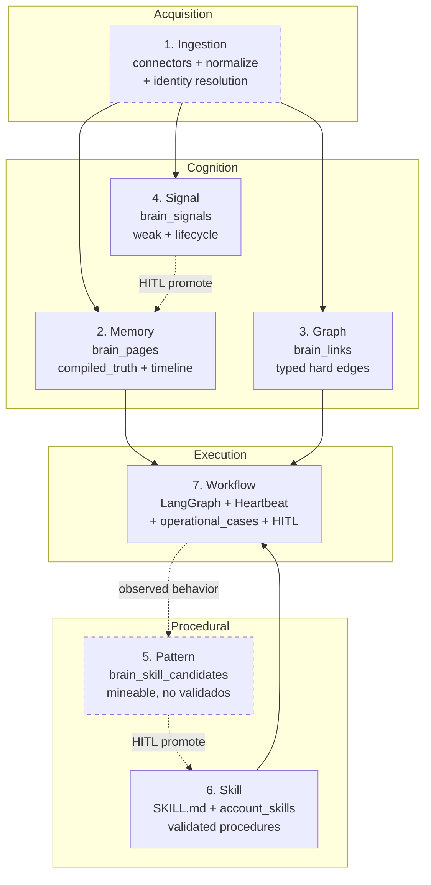
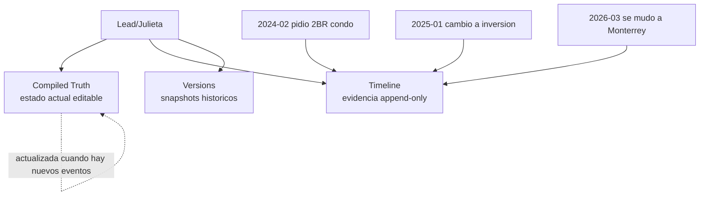
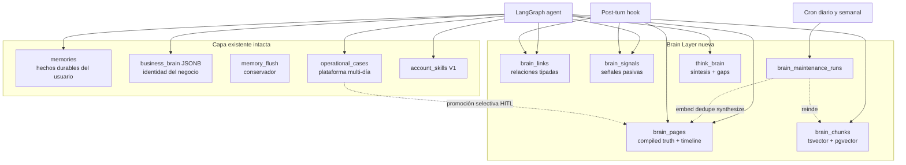
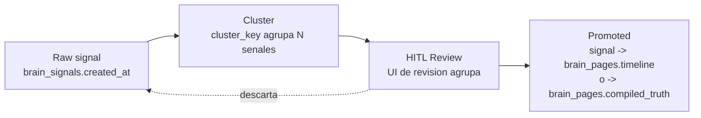
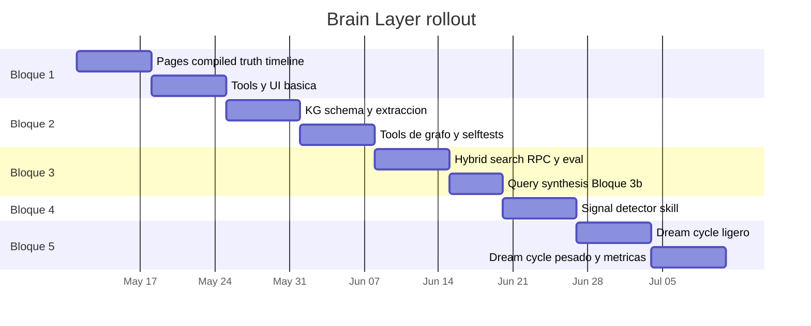
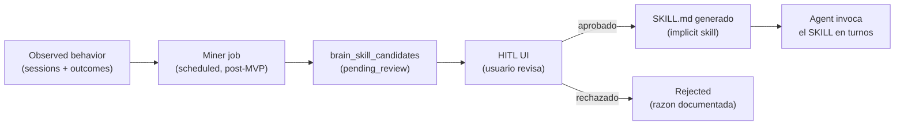

# Evaluación de G Brain y plan de integración con Ungga / Gu OS

> **Estado:** propuesta para revisión (actualizada agosto 2026)
> **Versión:** 1.6.1 (v1.6 + leftover v1.1: Brain no es cola de acción)
> **Audiencia:** Janot (arquitecto/dueño)
> **Decide:** si arrancamos la "Brain Layer" como capa nueva paralela a `memories`, siguiendo Opción B (portar **8 ideas** de G Brain sin importar su código), en convivencia explícita con `operational_cases` y `account_skills`
> **No decide:** si en el futuro lejano se integra G Brain como microservicio (Opción C) — eso queda como puerta abierta, con matiz post-company-brain (ver [§8](#8-recomendación-y-razones))
>
> **Frontera complementaria:** la distinción entre Business Brain y el
> conocimiento interno con el que Gu OS mejora su propio producto —sin duplicar
> el modelo de 7 capas— vive en
> [`business-and-platform-brain-boundary.md`](business-and-platform-brain-boundary.md).

### Cambios v1.6.1 vs v1.6

> Marcadores `[v1.6.1]`. Normalización editorial del leftover v1.1 que trataba `brain_pages` como cola de acción. **No reabre ownership:** Cases / `case_facts` / SOR / Brain siguen como en la Regla 5 y [`business-and-platform-brain-boundary.md`](business-and-platform-brain-boundary.md). Brain sigue post-workflows.

- **Principio 1.5.1:** "operacional" es el norte de producto (conocimiento que ayuda a ejecutar), no una licencia para que Brain posea `next_action` / `stage` / `due_at`. La cola de acción vive en Cases / Heartbeat / `scheduled_tasks`.
- **Bloque 1:** columnas `next_action`, `due_at`, `stage`, `priority`, `health` **fuera del schema MVP**. Si en el futuro se proyectan sobre una page, son compiladas, no-SOR, y nunca autoridad del Case.
- **§1.4.8, §12.1 y glosario:** "Operational Truth" = hecho vs interpretación *dentro* de Brain; no es el estado operativo del Case.
- Nota cruzada en el documento de frontera (2026-08-21).

### Cambios v1.6 vs v1.5.2

- Distingue SOR por plano: evidencia raw en Object Storage/SOR externo; conocimiento compilado, metadata, permisos e índices en Postgres; Markdown como representación y portabilidad.
- Define "empresa legible para IA" sin reducirla a archivos `.md`.
- Registra scopes `platform | industry | organization | team | user` y enlaza su semántica canónica.
- Amplía el modelo a artefactos de conocimiento y vistas regenerables sin convertirlos en una segunda fuente de verdad.
- Añade knowledge coverage y backlog de legibilidad como inputs del mantenimiento cognitivo.
- Mantiene alcance y secuencia: estas decisiones complementan el diseño; Brain sigue post-workflows.

### Cambios v1.5.2 vs v1.5.1

> Marcadores `[v1.5.2]` en sub-secciones nuevas/modificadas. Ronda de **coordinación** con [`gu-os-flexible-workflows-technical-plan.md`](../manuals/gu-os-flexible-workflows-technical-plan.md) y [`gu-os-qm-reference-analysis.md`](../manuals/gu-os-qm-reference-analysis.md) (agosto 2026). Sin cambio al alcance MVP ni a las 8 ideas de Opción B.

- **Secuencia (decisión del dueño, ago 2026):** la Brain Layer arranca **después** de las fases 0–4 del plan de flexible workflows. Este documento es plan de referencia, no cronograma paralelo.
- **Migraciones → placeholders relativos:** los números `00053`–`00059` reservados en v1.5 fueron consumidos por property optioning / workflows (`00053`–`00068` ocupadas; el plan detallado de workflows reserva `00069`–`00071` y seguirá consumiendo números). Los números brain en §9/§10/apéndices se leen como **base+N** (base+0 = `brain_pages`, …, base+6 = `brain_proposals`); la base real se toma de la siguiente secuencia libre al implementar (§1.3.1).
- **[§1.4.8](#148-casos-operacionales-vs-brain-layer-frontera-de-responsabilidades-v15) ampliada:** frontera con el **impact plane** de workflows Phase 3 (`case_facts` / `case_artifacts` / `artifact_inputs`): `case_facts` pasa a ser la **fuente preferida de promoción selectiva** hacia `brain_pages` (mejor provenance que `context_jsonb`); regla de clasificación assets-plantilla vs assets-conocimiento; nota forward-looking de **knowledge scoping** para colaboración multi-seat (QM ref §6).

### Cambios v1.5.1 vs v1.5

> Marcadores `[v1.5.1]` en sub-secciones nuevas/modificadas. Alineación documental con el patrón **Karpathy LLM Wiki** (gist canónico) — sin cambio de scope MVP ni migraciones.

- Nueva [§1.1](#11-genealogía-intelectual-karpathy-llm-wiki--g-brain--gu-os-v151) — genealogía Karpathy → G Brain → Gu OS; triada Ingest/Query/Lint; mapeo `index.md` / `log.md` / schema layer.
- Glosario (Apéndice C): **LLM Wiki**, **Raw Evidence Inbox**, **Query-to-Knowledge Feedback**, **Index page (complement)**.
- Bloque 3b: regla **Query-to-Knowledge Feedback** (respuestas durables → timeline/proposals).
- Apéndice B: link al gist Karpathy junto a G Brain.
- Enlaces cruzados a [`business-brain-evolution-roadmap.md`](../business-brain-evolution-roadmap.md) Inspiration 2, [`gu-os-understanding.md`](../manuals/gu-os-understanding.md), [`gu-os-glossary-commercial.md`](../manuals/gu-os-glossary-commercial.md).

### Cambios v1.5 vs v1.4.1

> Marcadores `[v1.5]` en sub-secciones nuevas/modificadas. Esta ronda es una **revisión de contexto** tras re-leer G Brain en GitHub (v0.42.56.0, julio 2026) y auditar el repo Gu OS: Brain Layer sigue sin implementarse; el subsistema de casos operacionales y `account_skills` V1 sí.

- **Referencia G Brain:** v0.28.3 → **v0.42.56.0**; nueva [§1.2](#12-evolución-de-g-brain-v028--v042-lo-relevante-para-gu-os) con deltas significativos (company brain, `gbrain think`, schema packs, facts/takes, dream cycle expandido, ingestion first-class, skillopt).
- Nueva [§1.3](#13-estado-de-gu-os-desde-v141-lo-construido-en-paralelo) — Brain Layer **no iniciada**; migraciones brain desde **00053+** (00019–00052 ya ocupadas); subsistema **casos operacionales como plataforma reutilizable** (`property_optioning` = primer flujo piloto, no el producto); `account_skills` V1 parcialmente implementada.
- **Modelo 7 capas (§1.4):** capa 7 ampliada con `operational_cases` como primitiva existente; capa 6 incluye `account_skills`; nueva [§1.4.8](#148-casos-operacionales-vs-brain-layer-frontera-de-responsabilidades-v15) — reglas de no-duplicación entre expediente multi-día y cognición de entidades.
- Flecha de promoción Pattern → Skill actualizada: destino **`SKILL.md` global OR `account_skills`** (§1.4.3).
- **Ficha comparativa (§2):** company brain multi-usuario, síntesis, reranker, schema packs, 43 skills, evals BrainBench, madurez Gu OS V1.6–V1.7.
- **Complementariedad (§4):** nuevas §4.8 (capa de síntesis / `think`), §4.9 (facts/takes), §4.4 dream cycle actualizado a ~25 fases; §4.3 nota reranker v1.1.
- **§5 "Lo que Gu OS ya tiene mejor":** reescrito — multi-tenancy matizado vs company brain G Brain; casos operacionales plataforma; account_skills; Telegram externo; warehouse BigQuery.
- **§6 discrepancia #6:** matizado — G Brain ya tiene company brain OAuth-scoped; Gu OS sigue con ventaja en RLS producto + runtime integrado.
- **Opción B:** **5 → 8 ideas** (§7, §8, §9); nuevo **Bloque 3b** (síntesis con gap analysis); dream cycle ampliado; integración explícita con operational_cases.
- **Migraciones renumeradas:** `00053`–`00059` (+ hooks `00055b`) en lugar de `00019`–`00024`.
- **§12.1:** contraste con modelo facts/takes de G Brain v0.31+.
- **§12.2:** referencia al contrato `IngestionSource` publicado en G Brain (`gbrain/ingestion`).
- **§12.3:** distinción **skill discovery** vs **skill optimization** (`skillopt`); `account_skills` como destino de promoción; scope note actualizada (V1 ya existe).
- **§13.2:** nota decisión **dominio fijo real estate** vs schema packs genéricos de G Brain.
- **Apéndices A/B** y glosario ampliados; próximos pasos actualizados.

### Cambios v1.4.1 vs v1.4

> Marcadores `[v1.4.1]` en notas nuevas. Esta ronda no cambia el plan MVP ni agrega schema. Solo alinea el plan con la guía narrativa `docs/manuals/gu-os-understanding.md` y con el roadmap de Business Brain: las skills propias futuras (`account_skills`) no deben asumirse solo de negocio/organización; también deben poder ser `personal` y `shared`.

- Principio 1.5.7: nueva nota **"personal playbooks no son memoria procedural"** — aclara que rutinas personales ejecutables (recoger hijos, preparación médica, viajes, cierre personal del día) deben modelarse como skills personales futuras, no como `memories.type='procedural'`.
- Sección 12.3: nueva **Scope note** — `Operational/Playbook Mining` sigue enfocado en comportamiento de negocio, pero eso no excluye una extensión hermana futura `Personal Pattern -> Personal Skill`.
- Sección 12.3: nueva sub-sección **"Extensión futura separada: Personal Pattern -> Personal Skill"** — documenta fuentes, métricas, riesgos, destino y gobernanza para no mezclar mining operacional de brokerage con rutinas personales del usuario.

### Cambios v1.4 vs v1.3

> Marcadores `[v1.4]` en sub-secciones nuevas/modificadas. Esta ronda surge de la observación crítica del usuario: el plan v1.3 responde "¿cómo modelamos lo que sabemos?" pero deja implícito "¿de dónde sale lo que sabemos?" y "¿cómo se aprende cómo opera la organización?". Ronda inspirada en feedback de ChatGPT 5.5 sobre bootstrap problem + procedural knowledge, refinada con verificación del código de G Brain (especialmente la fase `cycle/patterns.ts` que NO resuelve el problema procedural).

- Nueva **sección 1.4 "Modelo de capas (7 capas, 4 dominios)"** antes de los principios — formaliza el modelo arquitectural completo en el que la Brain Layer del v1.3 es UNA de cinco capas; las otras dos arriba (Ingestion) y dos abajo (Pattern, Skill — esta última ya existe en Ungga). Reemplaza al diagrama "agent + tools + brain" con uno de 7 capas
- Nuevo **principio 1.5.7 "Cinco destinos para conocimiento del negocio + tres personales intactos"** — codifica como regla rectora la decisión de a qué destino va cada tipo de conocimiento. Documenta la **regla de no-colisión** entre `memories.type='procedural'` (preferencias del usuario, intacto) y "Operational/Playbook Knowledge" (cómo opera el negocio, nuevo)
- **Lightweight hooks en migraciones existentes (Bloques 1 y 2)**: agregar `source_id text` + `source_meta jsonb` a `brain_pages` y `brain_links` para provenance (~4 líneas SQL); nuevas tablas vacías `brain_source_connectors` (catálogo) y `brain_skill_candidates` (cola HITL del futuro miner) en migración nueva 00019b. **Cero cambios al plan de 8 semanas**; las tablas vacías esperan a que las capas Ingestion y Pattern se construyan post-MVP
- Nueva **sección 12.2 forward-looking "Ingestion Layer"** — patrón Source Connector interface, orden recomendado de bootstrap por fuente (CRM → Calendar → WhatsApp → Drive → voice notes), safety gate al estilo `archive-crawler` de G Brain, identity resolution cross-source. NO implementación en MVP
- Nueva **sección 12.3 forward-looking "Operational/Playbook Mining"** — pipeline `Observe behavior → Extract candidate → HITL review → Promote to SKILL.md`, distinción explicit vs implicit skills, anti-pattern "Behavior ≠ best practice", advertencia explícita: la fase `patterns` del Dream Cycle de G Brain NO resuelve esto (verificado en `cycle/patterns.ts`)
- **Apéndice B** actualizado con nota crítica sobre `cycle/patterns.ts`: lo que realmente hace (introspective journaling para knowledge worker) vs lo que se necesita para SMB (organizational behavior mining)
- **Apéndice C glosario** actualizado con 6 nuevas entradas: **Source Connector**, **Ingestion Layer**, **Operational/Playbook Knowledge** (con regla de no-colisión), **Skill Candidate**, **Pattern Layer**, **Implicit vs Explicit Skill**

### Cambios v1.3 vs v1.2

> Marcadores `[v1.3]` en sub-secciones nuevas/modificadas. Esta ronda fue mayormente validación de v1.2; un solo agregado arquitectural (forward-looking, NO implementación inmediata) más 3 framings citables.

- Sección 1.5: nuevo **epígrafe rector** ("conservative intelligence amplification, not maximal autonomous complexity") como tagline del conjunto de principios
- Principio 1.5.3: framing citable agregado ("validate the graph SYSTEM before validating graph EXTRACTION")
- Principio 1.5.4: framing citable agregado ("you EARN autonomy, you do not assume it")
- Sección 12: nuevo punto **#7 forward-looking**: distinción entre **Operational Truth** vs **Cognitive Interpretation** como consideración arquitectural futura (NO cambio de schema en MVP — el v1 las separa parcialmente vía tablas; convertir en first-class si el dolor aparece). Incluye 3 opciones de implementación futura.
- Glosario: nueva entrada **"Operational Truth vs Cognitive Interpretation"**

### Cambios v1.2 vs v1.1

> Marcadores `[v1.2]` en sub-secciones nuevas/modificadas para localizarlas en una segunda lectura. (Marcadores `[v1.1]` permanecen para los cambios de la primera revisión.)

- Principio 1.5.1: explicación breve de qué es Obsidian para lectores que no lo conozcan
- Nuevo principio **1.5.5 Hard edges vs Soft signals** (nunca mezclarlos como compromise edges con `confidence` baja)
- Nuevo principio **1.5.6 Workflows first, not ontology first** (heurístico de validación: "¿qué pregunta humana real responde esta arista?")
- Sección 4.5 (Signal Detector): nueva sub-sección **"Ejemplos concretos en real estate"** con 5 casos (urgencia oculta, ansiedad de financiamiento, fuerza de relación, inteligencia de mercado, objeciones emocionales)
- Bloque 4: nueva sub-sección **"Signal Lifecycle (design intent)"** con el patrón Raw → Cluster → HITL → Compiled Truth
- Bloque 4 schema (migración 00022): agregar columna `cluster_key text` a `brain_signals` + índice
- Sección 13.2: dominio inicial reducido de 10 a 8 entidades (drop `listing` y `note`); nota explicando por qué
- Nuevo **Apéndice D — Lecturas recomendadas** sobre diseño de knowledge graphs
- Glosario: nueva entrada **"Signal Lifecycle"**

### Cambios v1.1 vs v1.0

> Marcadores `[v1.1]` en sub-secciones nuevas/modificadas para localizarlas en una segunda lectura.

- Nueva [sección 1.5: Principios rectores de la Brain Layer](#15-principios-rectores-de-la-brain-layer) (operacional no Obsidian, progressive synthesis, conservative-first, HITL obligatorio)
- Bloque 1 ampliado con columnas operacionales en `brain_pages` (`next_action`, `due_at`, `stage`, `priority`, `health`) y nueva sub-sección "Reglas de gobierno del Compiled Truth"
- Bloque 2: introducción del modo `manual` como default inicial de auto-extracción (3 modos en lugar de 2)
- Bloque 5 reestructurado en **5a** (mantenimiento mecánico autónomo, sin HITL) y **5b** (síntesis y dedupe con HITL **obligatorio**); corrección crítica: HITL en `synthesize` ya no es "opcional"
- Nueva migración 00024 con tablas `brain_dedupe_proposals` y `brain_synthesis_proposals` para encolar operaciones que requieren approval humano
- Sección 4.5 (Signal Detector) ampliada con justificación estratégica
- Glosario: definición de Compiled Truth complementada con governance (preservando la definición original)
- Sección 13.4: actualizada con los 3 modos de auto-extracción

---

## Tabla de contenidos

1. [Contexto y objetivo](#1-contexto-y-objetivo)
1.1. [Genealogía: Karpathy LLM Wiki → G Brain → Gu OS](#11-genealogía-intelectual-karpathy-llm-wiki--g-brain--gu-os-v151) `[v1.5.1]`
1.2. [Evolución de G Brain v0.28 → v0.42](#12-evolución-de-g-brain-v028--v042-lo-relevante-para-gu-os) `[v1.5]`
1.3. [Estado de Gu OS desde v1.4.1](#13-estado-de-gu-os-desde-v141-lo-construido-en-paralelo) `[v1.5]`
1.4. [Modelo de capas: 7 capas, 4 dominios](#14-modelo-de-capas-7-capas-4-dominios) `[v1.4]`
   - 1.4.8. [Casos operacionales vs Brain Layer (frontera)](#148-casos-operacionales-vs-brain-layer-frontera-de-responsabilidades-v15) `[v1.5]` `[v1.6.1]`
1.5. [Principios rectores de la Brain Layer](#15-principios-rectores-de-la-brain-layer) `[v1.1]` `[v1.6.1]`
   - 1.5.8. [Pipeline híbrido y legibilidad empresarial](#158-pipeline-híbrido-y-legibilidad-empresarial-v16) `[v1.6]`
   - 1.5.9. [Ownership scopes: platform → user](#159-ownership-scopes-platform--user-v16) `[v1.6]`
   - 1.5.10. [Artefactos, vistas regenerables y knowledge coverage](#1510-artefactos-vistas-regenerables-y-knowledge-coverage-v16) `[v1.6]`
2. [Ficha técnica comparativa](#2-ficha-técnica-comparativa)
3. [Traslapes reales](#3-traslapes-reales)
4. [Complementariedad real (lo que G Brain tiene y Ungga no)](#4-complementariedad-real)
5. [Lo que Ungga ya tiene mejor](#5-lo-que-ungga-ya-tiene-mejor)
6. [Discrepancias con la opinión de ChatGPT](#6-discrepancias-con-la-opinión-de-chatgpt)
7. [Tres opciones de integración](#7-tres-opciones-de-integración)
8. [Recomendación y razones](#8-recomendación-y-razones)
9. [Plan detallado de Opción B (semanas 1-8)](#9-plan-detallado-de-opción-b)
10. [Calendario visual](#10-calendario-visual)
11. [Riesgos y mitigaciones](#11-riesgos-y-mitigaciones)
12. [Lo que NO está en este plan (consciente)](#12-lo-que-no-está-en-este-plan)
13. [Decisiones de diseño que necesito que confirmes](#13-decisiones-de-diseño-a-confirmar)
14. [Apéndices](#14-apéndices)

---

## 1. Contexto y objetivo

**G Brain** ([github.com/garrytan/gbrain](https://github.com/garrytan/gbrain), **v0.42.56.0** al momento de esta revisión — julio 2026; referencia inicial del doc: v0.28.3) es un proyecto open source de Garry Tan (CEO de Y Combinator). Es una **infraestructura de cognición** para agentes de IA: memoria persistente estructurada, knowledge graph, retrieval híbrido + **capa de síntesis** (`gbrain think`), ciclos autónomos de mantenimiento (dream cycle / autopilot), ingestion con contrato versionado, y un sistema de skills declarativas (~43 skills). Desde v0.40+ promueve explícitamente el shape de **company brain** (memoria institucional multi-usuario con OAuth y sources federados).

Referencia local opcional: `C:\Users\janot\develop\gbrain-master\gbrain-master`. Para auditoría de cambios, el repo público en GitHub es la fuente de verdad ([`CHANGELOG.md`](https://github.com/garrytan/gbrain/blob/master/CHANGELOG.md), [`src/core/cycle.ts`](https://github.com/garrytan/gbrain/blob/master/src/core/cycle.ts)).

### Pregunta de la evaluación

¿Vale la pena integrar G Brain con el sistema agéntico de Ungga (Gu OS), y cómo?

### Lo que decide este documento

1. Si las **ideas** de G Brain son valiosas para Ungga (sí lo son).
2. Si el **código** de G Brain debe importarse, embeberse, conectarse vía MCP, o reescribirse en el stack de Ungga.
3. Qué pasos concretos seguir si elegimos la opción recomendada.

### Lo que NO decide

- La estrategia de producto a largo plazo de Gu OS.
- El roadmap de multi-tenancy organizacional (la decision aceptada vive en [`../adr/ADR-101-organization-tenancy.md`](../adr/ADR-101-organization-tenancy.md) y la secuenciacion en [`../roadmap/gu-os-evolution-roadmap.md`](../roadmap/gu-os-evolution-roadmap.md); el antiguo `business-brain-evolution-roadmap.md` quedo superseded).
- La fachada multi-LLM-provider (eso vive en `docs/tools-design/model-providers.md`).

### Marco mental rector `[v1.4]`

> *Actualizado en v1.4: el modelo de "agent + tools + brain" del v1.3 se promueve al modelo completo de **7 capas / 4 dominios** que se desarrolla en la [sección 1.4](#14-modelo-de-capas-7-capas-4-dominios). El diagrama abajo es la versión sintética; la sección 1.4 entra en detalle por capa.*




> Las cajas con borde **punteado** (Ingestion, Pattern) son **forward-looking**: en v1 tienen solo lightweight hooks de schema (sin implementación). Las capas 6–7 **ya existen** en Gu OS (skills + workflow, incluyendo casos operacionales). Las capas 2–4 se construyen en los Bloques 1–6 del plan.

G Brain ocupa principalmente las capas 2–4 (Memory + Graph + Signal) con touches en 1 (ingestion), 6 (skills) y síntesis cross-page (`think`). Gu OS hoy ocupa las capas 6–7 con profundidad real (`operational_cases` como plataforma, Heartbeat, scheduled_tasks) y una versión limitada de memoria personal (`memories` + `business_brain` JSONB). Esta evaluación trata de cómo construir las capas 2–4 inspirándose en G Brain v0.42, dejar hooks para 1 y 5, **integrar sin colisionar** con lo ya construido en 6–7, y reconocer las 7 capas como modelo único. La genealogía intelectual completa (Karpathy → G Brain → Gu OS) está en [§1.1](#11-genealogía-intelectual-karpathy-llm-wiki--g-brain--gu-os-v151).

---

## 1.1 Genealogía intelectual: Karpathy LLM Wiki → G Brain → Gu OS `[v1.5.1]`

> *Este plan detalla **cómo implementar** la Brain Layer vía G Brain como referencia técnica. El patrón cognitivo subyacente viene antes — del [LLM Wiki gist de Andrej Karpathy](https://gist.github.com/karpathy/442a6bf555914893e9891c11519de94f). Mapping extendido en [`business-brain-evolution-roadmap.md`](../business-brain-evolution-roadmap.md) Inspiration 2.*

### Cadena de influencia

```text
Karpathy LLM Wiki (gist, idea file)
  → compilar wiki persistente; raw inmutable; operaciones Ingest / Query / Lint
G Brain / Garry Tan (implementación OSS, v0.42+)
  → productiza: compiled_truth, timeline, dream cycle, hybrid search, think, company brain
Gu OS Opción B (Brain Layer en Postgres + RLS)
  → mismo espíritu cognitivo; verticalizado a brokerage inmobiliario;
     operacional (no Obsidian); multi-tenant; convive con operational_cases + account_skills
```

G Brain y Karpathy comparten el **medium** (markdown interlinkado + síntesis compilada). G Brain **productiza** lo que el gist deja abierto; Gu OS **verticaliza** con tenant safety, HITL comercial, warehouse tabular y plataforma de casos multi-día.

### Tres capas del gist → Gu OS

| Capa gist | Artefactos gist | Equivalente Gu OS (plan) |
|-----------|-----------------|--------------------------|
| Raw sources | `raw/` inmutable | Ingestion Layer + evidence inbox; `source_id` / `source_meta`; nunca overwrite de fuente |
| Wiki | `wiki/` mantenido por LLM | `brain_pages` (`compiled_truth` + `brain_timeline` + versions) + `brain_links` + `brain_signals` |
| Schema | `CLAUDE.md` / `AGENTS.md` co-evolucionado | Convenciones Brain en código + governance HITL; 8 `kind`s fijos MVP (§13.2); **no** markdown constitution por tenant en v1 |

### Triada Ingest / Query / Lint

| Operación gist | Qué hace | Bloque / artefacto Gu OS |
|----------------|----------|--------------------------|
| **Ingest** | Lee fuente → integra en wiki → actualiza entidades → flag contradicciones → append log | Ingestion Layer (§12.2); timeline append; contradicciones → `brain_synthesis_proposals` HITL |
| **Query** | Lee índice/páginas → sintetiza con citas; buenas respuestas pueden archivarse | Bloque 3 hybrid search + Bloque 3b `think_brain`; ver Query-to-Knowledge Feedback abajo |
| **Lint** | Orphans, stale, contradicciones, gaps, missing pages/links | Bloque 5 Dream Cycle (5a mecánico + 5b HITL) |

Karpathy usa `index.md` (catálogo) + `log.md` (cronología) como artefactos de navegación. En Gu OS:

- **`index.md` → Index pages (complement):** vistas/catálogos generados desde `brain_pages`; ayudan al modelo y al usuario; **no** reemplazan hybrid search multi-tenant.
- **`log.md` → Timeline + audit:** `brain_timeline` por entidad + filas de audit de ingest/query/lint (dream cycle runs, promotions) — mismo espíritu append-only.

### Ideas Karpathy explícitas en este plan

| Idea | Dónde en este doc | Nota |
|------|-------------------|------|
| Raw Evidence Inbox | §12.2, glosario | Evidencia con provenance antes de `compiled_truth` |
| Compiled Knowledge Pages | Bloque 1, §1.5.2 | Logs ≠ suficiente; estado compilado + evidencia |
| Query-to-Knowledge Feedback | Bloque 3b, glosario | Respuesta durable → timeline / proposal con provenance |
| Contradiction on ingest | Bloque 1 governance, Bloque 5 | Nuevo source vs compiled truth → flag/HITL, no silent overwrite |
| Index pages complement | §1.1, glosario | Post-MVP UI; generadas desde DB |
| Rechazo index-only (sin RAG) | Bloque 3, §5 | Válido personal ~100 fuentes; producto multi-tenant necesita hybrid |

**Fuentes secundarias:** post Beliaev (pre-gist; incluía fine-tuning — no en gist oficial); Cobus Greyling *LLM Wiki* (jul 2026) — guía práctica del mismo patrón.

---

## 1.2 Evolución de G Brain v0.28 → v0.42: lo relevante para Gu OS `[v1.5]`

> *Revisión julio 2026 contra [github.com/garrytan/gbrain](https://github.com/garrytan/gbrain) `master` (v0.42.56.0). No es changelog exhaustivo — solo deltas que cambian qué vale la pena portar o cómo leer la ficha comparativa.*

### 1.2.1 Company brain (multi-usuario) — ya no es "single-tenant only"

Entre v0.28 y v0.42, G Brain shipping un producto explícito de **memoria institucional compartida**:

- **Sources federados** dentro de un mismo brain (`shared`, `customers`, `internal`, etc.) con sync paralelo por source.
- **OAuth clients por persona** con `--source` (write scope) + `--federated-read` (read scope); aislamiento fuzz-tested en read paths.
- Tutorial [`docs/tutorials/company-brain.md`](https://github.com/garrytan/gbrain/blob/master/docs/tutorials/company-brain.md) (~90 min para 10–50 personas).
- Alineado con el [YC RFS de company brain](https://www.ycombinator.com/rfs#company-brain).

**Implicación para Gu OS:** la sección 5 ya no puede decir "G Brain es single-tenant por despliegue" sin matiz. G Brain **sí** resolvió multi-usuario — pero con un modelo distinto al nuestro (OAuth por source vs RLS Supabase por `auth.uid()`, markdown git como SOR vs BigQuery warehouse, runtime externo OpenClaw/Hermes vs LangGraph integrado). **Opción B sigue siendo la recomendada**; Opción C merece nota de reevaluación parcial para casos de "memoria institucional read-only" (ver [§8](#8-recomendación-y-razones)).

### 1.2.2 Capa de síntesis (`gbrain think`) — diferenciador de producto

G Brain ya no se posiciona solo como "search mejor que grep". El par explícito:

| Comando | Qué devuelve | Costo LLM |
|---------|--------------|-----------|
| `gbrain search` | Top páginas/chunks por hybrid score + evidence tags | Bajo (retrieval) |
| `gbrain think` | **Respuesta sintetizada** cross-page con citas + **gap analysis** ("qué no sabe el brain / qué está stale") | Alto (retrieval + composición) |

**Implicación:** nuestro Bloque 3 (hybrid search RPC) es necesario pero **insuficiente** como experiencia de producto. v1.5 añade **Bloque 3b** — capa de síntesis inspirada en `think`, no importación de código.

### 1.2.3 Schema packs y taxonomía evolutiva (v0.40.7+, `gbrain-base-v2`)

G Brain dejó de asumir un layout fijo de tipos de página. Ahora shippea:

- **`gbrain-base-v2`** — taxonomía DRY/MECE de 15 tipos canónicos (default desde v0.41.22).
- **Schema packs custom** — `gbrain schema detect/suggest/review-candidates`, mutaciones agent-authored vía MCP.
- Migración entre packs (`unify-types` job).

**Implicación:** nuestra decisión de **8 entidades fijas** de real estate (§13.2) sigue siendo válida para MVP, pero el doc debe registrar explícitamente que **no** adoptamos schema packs genéricos en v1 — dominio acotado a brokerage inmobiliario.

### 1.2.4 Modelo Facts / Takes / Consolidation (v0.31+)

G Brain separó first-class:

- **Facts** — hechos estructurados en fence `## Facts`, reconciliados en dream cycle (`extract_facts`).
- **Takes** — afirmaciones graduables con evidencia (`propose_takes` → `grade_takes` → `calibration_profile`).
- **Consolidate** — promoción facts → takes con audit trail (nunca DELETE).

Esto es **más sofisticado** que nuestra distinción forward-looking Operational Truth vs Cognitive Interpretation (§12.1). G Brain resolvió parte del problema con tablas y fases dedicadas, no solo governance de `compiled_truth`.

**Implicación:** MVP mantiene `brain_signals` + `compiled_truth`; v2 evalúa `brain_facts` / `brain_takes` si el dolor de mezcla aparece antes de lo previsto.

### 1.2.5 Dream cycle expandido (~25 fases)

El doc v1.4 describía 9 fases. v0.42 (`src/core/cycle.ts`) tiene **~25 fases**, incluyendo las más relevantes para portar ideas:

| Fase G Brain | ¿Portar idea a Gu OS? | Notas |
|--------------|----------------------|-------|
| `extract_facts` | **Sí (alta)** | Alinea con governance de compiled_truth |
| `consolidate` | Considerar v1.1 | Facts → síntesis auditables |
| `propose_takes` / `grade_takes` | Forward-looking | Similar a Signal → HITL → Memory |
| `enrich_thin` | **Sí para onboarding** | Páginas stub cuando brain está vacío |
| `skillopt` | Interesante | Optimiza SKILL.md existente — **no** descubre playbooks nuevos |
| `patterns` | **No para SMB ops** | Sigue siendo journaling introspectivo (análisis v1.4 vigente) |
| Split global vs per-source | Post-MVP | Relevante si ingestion multi-fuente |

También: reranker (ZeroEntropy default), modos de búsqueda (`conservative` / `balanced` / `tokenmax`), graph signals (adjacency boost, cross-source boost), evals en repo [`gbrain-evals`](https://github.com/garrytan/gbrain-evals).

### 1.2.6 Ingestion first-class + SkillOpt

- **Ingestion:** export `gbrain/ingestion`, contrato `IngestionSource`, `gbrain capture`, webhooks `/ingest` — ya no es solo "recipes en docs". Informa nuestro §12.2 como benchmark de diseño.
- **SkillOpt (v0.41.20):** optimización medible de SKILL.md con benchmarks — complementa (no sustituye) nuestro Operational/Playbook Mining (§12.3).

### 1.2.7 Lo que NO cambió (valida el plan v1.4)

- Runtime **Bun**; auto-link **off** en escrituras MCP remotas.
- G Brain **no es agent runtime** — loop en cliente externo.
- Fase **`patterns`** NO resuelve mining operacional de brokerage.
- Markdown git como SOR — sigue en conflicto con nuestro modelo Supabase-first.

---

## 1.3 Estado de Gu OS desde v1.4.1: lo construido en paralelo `[v1.5]`

> *Auditoría del repo `10x-builders-agent` julio 2026. El plan Brain Layer v1.4.1 **no se implementó**; en su lugar el equipo avanzó V1.6–V1.7 del [business-brain-evolution-roadmap.md](../business-brain-evolution-roadmap.md). En paralelo construyó la **plataforma de casos operacionales** — no un flujo aislado: `property_optioning` fue el **primer piloto** que validó patrones replicables (cron, expediente, HITL externo, autoría Skill Lab) sobre los cuales los siguientes flujos inmobiliarios deben apoyarse.*

### 1.3.1 Brain Layer: sin iniciar

| Artefacto planificado | Estado real |
|---------------------|-------------|
| Tablas `brain_*` | **No existen** — cero migraciones brain en `packages/db/supabase/migrations/` |
| `packages/agent/src/brain/` | **No existe** |
| Feature flag `profiles.feature_flags.brain_enabled` | **No implementado** (solo propuesto en §13.3) |

**Renumeración de migraciones:** el plan v1.4 reservaba `00019`–`00024` para brain. Esas secuencias están **ocupadas**:

| Migración | Contenido real |
|-----------|----------------|
| 00019 | `operational_cases` (subsistema base) |
| 00020 | `account_skills` V1 |
| 00021–00052 | Extensiones operational_cases, property optioning, Telegram, notificaciones, etc. |
| 00053–00068 `[v1.5.2]` | Más property optioning + arranque de flexible workflows (`00065_workflow_definitions`, `00066` pin, `00067` flags, `00068_evidence_records`) |
| 00069–00071 `[v1.5.2]` | **Reservadas** por el plan detallado de workflows (work plane, impact plane, worker profiles) |

**Próxima migración brain `[v1.5.2]`:** la renumeración v1.5 (`00053`–`00059`) también quedó obsoleta — esas secuencias fueron consumidas por workflows/property optioning, y las fases de workflows seguirán consumiendo números antes de que este plan arranque (decisión: Brain va **después** de las fases de workflows). Por eso los números de migración en §9, §10 y apéndices se leen como **placeholders relativos** `base+N` (base+0 = `brain_pages`, base+1 = `brain_links`, base+2b = hooks, base+3 = `brain_chunks_hybrid`, base+4 = `brain_signals`, base+5 = `brain_maintenance_runs`, base+6 = `brain_proposals`). La **base** se toma de la siguiente secuencia libre en `packages/db/supabase/migrations/` al momento de implementar (≥ `00072` hoy).

### 1.3.2 Subsistema de casos operacionales — plataforma, no un solo flujo

Desde v1.4.1 se construyó un **subsistema reutilizable** para procedimientos multi-día con esperas humanas externas. Documentación: [`docs/operational-cases/architecture.md`](../operational-cases/architecture.md), [`authoring-playbook.md`](../operational-cases/authoring-playbook.md).

**`property_optioning` es el primer flujo piloto**, no el alcance del subsistema. Su valor estratégico es haber validado la **plataforma** sobre la cual nuevos flujos inmobiliarios deben construirse más rápido:

| Pieza reutilizable | Qué aporta a flujos futuros |
|--------------------|----------------------------|
| `operational_case_types` + `operational_flow_jsonb` | Catálogo + documentación/UI del procedimiento |
| `operational_cases` + `operational_case_events` | Expediente vivo + timeline append-only |
| Cron `/api/cron/operational-cases` + lock optimista | Motor durable sin Temporal |
| Binding directo `case_type → default_skill_slug` | Orquestación por skill compuesta |
| `waiting_external` / `waiting_internal` + webhooks | Esperas humanas (Telegram hoy; WhatsApp mañana) |
| Skill Lab N0–N5 + E2E lab | Readiness antes de activar un nuevo `case_type` |
| Patrones documentados ([`operational-case-reusable-patterns.md`](../operational-cases/operational-case-reusable-patterns.md)) | Autoría acelerada: reutilizar tools, sub-skills, políticas de recordatorio |

**Segundo, tercer y N-ésimo flujo** (ej. seguimiento de lead caliente, coordinación de firma, onboarding de listing en otro portal) deben **reusar** cron, tablas, notify, HITL y patrones de autoría — construyendo solo lo particular (nuevo `case_type`, skill raíz compuesta, intake, tools específicas).

**Implicación para Brain Layer:** casos operacionales resuelven **ejecución procedural multi-día**; Brain Layer resuelve **cognición cross-entidad** (lead/property/deal como pages, relaciones, señales). Son complementarios — ver [§1.4.8](#148-casos-operacionales-vs-brain-layer-frontera-de-responsabilidades-v15).

### 1.3.3 `account_skills` V1 — parcialmente implementado

Migración [`00020_account_skills.sql`](../../packages/db/supabase/migrations/00020_account_skills.sql): skills propias por cuenta (`body_md`, `metadata_jsonb`, `status`). Runtime compone `account_skills(active) ∪ skills/global/*`; slug gana account.

v1.4.1 hablaba de `account_skills` como futuro V2+. **Hoy existe V1 mínima** (sin draft/review/rollback org-level). Destino válido de promoción Pattern → Skill además de `skills/global/*/SKILL.md`.

### 1.3.4 Otros avances relevantes al plan Brain

- **~29 skills globales** en `skills/global/` (umbral ~30 del selector en [`future-considerations.md`](../operational-cases/future-considerations.md) §2 se acerca).
- **Telegram externo** para contactos de casos (`waiting_external`, link tokens, conversation bindings) — conector operacional, aún no Ingestion Layer brain.
- **Notificaciones persistentes** (`internal_user_notifications`) — infra de notify reutilizable.
- **BigQuery + business_brain** intactos como warehouse/config — Brain Layer no los reemplaza.

---

## 1.4 Modelo de capas: 7 capas, 4 dominios `[v1.4]`

> *Esta sección formaliza el modelo arquitectural completo en el que el resto del plan opera. Hasta v1.3 el plan hablaba de "Brain Layer" como una caja monolítica; v1.4 reconoce que esa "Brain Layer" es en realidad el dominio Cognition (capas 2-4) de un modelo más amplio de 7 capas distribuidas en 4 dominios. Esta vista permite ubicar con precisión qué se construye en MVP, qué tiene lightweight hooks, qué ya existe en Ungga, y qué queda forward-looking.*

### 1.4.1 Las 7 capas con responsabilidades, lifecycles y v1 status


| #   | Dominio         | Capa          | Responsabilidad                                                                                                                                              | Lifecycle / governance                                                                         | Implementación en v1                                                                                                                                       |
| --- | --------------- | ------------- | ------------------------------------------------------------------------------------------------------------------------------------------------------------ | ---------------------------------------------------------------------------------------------- | ---------------------------------------------------------------------------------------------------------------------------------------------------------- |
| 1   | **Acquisition** | **Ingestion** | Conectores externos (WhatsApp, EasyBroker, Drive, Calendar, Outlook, voice notes) + normalización + dedupe + identity resolution + clasificación por destino | Append-only (raw), normalized routing                                                          | **Solo hooks**: `source_id` + `source_meta` en `brain_pages`/`brain_links`, tabla vacía `brain_source_connectors`. Sin implementación de conectores en MVP |
| 2   | **Cognition**   | **Memory**    | "Qué sabemos sobre cada entidad del negocio" — Compiled Truth (estado actual editable) + Timeline (evidencia append-only) + Versions (snapshots)             | Compiled Truth con HITL para destructive/synthetic; Timeline append-only; Versions automáticas | ✅ **Bloque 1** del plan (`brain_pages`, `brain_timeline`, `brain_page_versions`)                                                                           |
| 3   | **Cognition**   | **Graph**     | "Qué relaciones tipadas hard-edge existen entre entidades" — queryable, traversable                                                                          | Append-only; auto-extracción determinística (sin LLM); reconciliación stale                    | ✅ **Bloque 2** del plan (`brain_links`)                                                                                                                    |
| 4   | **Cognition**   | **Signal**    | "Qué observaciones débiles capturamos pasivamente" — intent, objection, trend, relationship warmth                                                           | Lifecycle `raw → cluster → HITL review → promoted` (a Memory.timeline o Graph)                 | ✅ **Bloque 4** del plan (`brain_signals` con `cluster_key`)                                                                                                |
| 5   | **Procedural**  | **Pattern**   | "Qué patrones operacionales emergen del comportamiento agregado" — candidatos de skills mineables, no validados aún                                          | Append-only candidates; HITL **obligatorio** para promover a Skill                             | **Solo hook**: tabla vacía `brain_skill_candidates`. Sin miner en MVP                                                                                      |
| 6   | **Procedural**  | **Skill**     | "Qué procedimientos validados puede ejecutar el agente" — markdown skills con frontmatter + skills de cuenta                                                                 | Versionados en git y/o `account_skills`; explicit (humano escribe) o implicit (mineado + HITL'd)                    | ✅ **Ya existe** — `skills/global/*` + **`account_skills` V1** ([00020](../../packages/db/supabase/migrations/00020_account_skills.sql)) `[v1.5]` |
| 7   | **Execution**   | **Workflow**  | "Cómo se orquesta todo turn-by-turn y multi-día" — LangGraph + Heartbeat + scheduled_tasks + **operational_cases** + HITL                                                  | Stateful por sesión/caso; checkpointed; HITL via `interrupt`                                                        | ✅ **Ya existe** — LangGraph + Heartbeat + **`operational_cases` plataforma** ([00019+](../../packages/db/supabase/migrations/00019_operational_cases.sql)) `[v1.5]` |


### 1.4.2 Por qué las 4 cajas de Cognition no son una sola

Tentación frecuente: "Memory + Graph + Signal viven en `brain_`* tables, son una sola Brain Layer". **No.** Cada una tiene un perfil de riesgo y governance cualitativamente distinto:


| Capa    | Confianza                    | Mutabilidad                    | Riesgo principal                                                                                                                      | Quién la escribe                      |
| ------- | ---------------------------- | ------------------------------ | ------------------------------------------------------------------------------------------------------------------------------------- | ------------------------------------- |
| Memory  | Alta (con governance)        | Editable con HITL              | Drift semántico (compiled_truth diverge de la realidad)                                                                               | Synthesizer + usuario                 |
| Graph   | Muy alta (verificable)       | Append-only                    | Ruido si se mezclan soft signals como hard edges (ver principio [1.5.5](#155-hard-edges-links-vs-soft-signals--nunca-mezclarlos-v12)) | Auto-extractor determinístico         |
| Signal  | Baja-media                   | Append-only hasta promoción    | Sobre-confianza (promover prematuramente como hecho)                                                                                  | Signal Detector (sub-agente paralelo) |
| Pattern | Candidata (no es verdad aún) | HITL obligatorio para promover | "Behavior ≠ best practice" (codificar malas prácticas accidentales)                                                                   | Skill miner (futuro)                  |


Aplanar las 4 en "Brain Layer" pierde exactamente la nuance que los principios 1.5.2 (governance del Compiled Truth), 1.5.4 (HITL obligatorio) y 1.5.5 (hard edges vs soft signals) trabajaron en construir. Las 4 son capas hermanas dentro del dominio Cognition, no una sola caja.

### 1.4.3 Las dos flechas de promoción HITL — el patrón rector

El modelo de 7 capas tiene **dos flechas críticas de promoción**, ambas con HITL **obligatorio**:

```
Signal  ──HITL──>  Memory   (cluster maduro entra a compiled_truth/timeline)
Pattern ──HITL──>  Skill    (candidate → SKILL.md global OR account_skills) `[v1.5]`
```

Es el **mismo patrón** en ambos lugares: **observación pasiva → candidato corroborado → revisión humana → realidad ejecutable/citable**. Esa simetría no es coincidencia; es la aplicación del principio "you EARN autonomy, you do not assume it" ([1.5.4](#154-hitl-obligatorio-para-todo-cambio-destructivo-o-sintético)) en dos puntos del sistema. Cualquier intento futuro de saltarse HITL en cualquiera de las dos promociones debe pasar por evidencia de approval rate sostenido (>95% en N runs) y permanecer revocable.

### 1.4.4 Mapping a código y tablas

Para el reviewer técnico que quiere ubicar dónde vive cada capa en el repo:


| Capa         | Tablas                                                                     | Módulos TS principales                                                                        | Status    |
| ------------ | -------------------------------------------------------------------------- | --------------------------------------------------------------------------------------------- | --------- |
| 1. Ingestion | `brain_source_connectors` (vacía MVP) + columnas `source_id`/`source_meta` | *futuro:* `packages/agent/src/ingestion/` (no existe)                                         | Hook only |
| 2. Memory    | `brain_pages` + `brain_timeline` + `brain_page_versions`                   | `packages/agent/src/brain/page.ts`, `packages/db/src/queries/brain-pages.ts`                  | Bloque 1  |
| 3. Graph     | `brain_links`                                                              | `packages/agent/src/brain/link-extraction.ts`, `packages/agent/src/brain/graph.ts`            | Bloque 2  |
| 4. Signal    | `brain_signals`                                                            | `packages/agent/src/brain/signal-detector.ts`                                                 | Bloque 4  |
| 5. Pattern   | `brain_skill_candidates` (vacía MVP)                                       | *futuro:* `packages/agent/src/brain/maintenance/pattern-mine.ts`                              | Hook only |
| 6. Skill     | `skills/global/*/SKILL.md` + **`account_skills`** ([00020](../../packages/db/supabase/migrations/00020_account_skills.sql)) | `packages/agent/src/skills/{select,runtime,parse}.ts`                                         | Existing `[v1.5]` |
| 7. Workflow  | `agent_sessions`, `agent_messages`, `tool_calls`, `scheduled_tasks`, **`operational_cases`**, **`operational_case_events`** | `packages/agent/src/graph.ts`, `packages/agent/src/heartbeat/*`, cron operational-cases       | Existing `[v1.5]` |


### 1.4.5 Trace end-to-end (un evento atravesando las 7 capas)

> **Evento ilustrativo:** llega un audio de WhatsApp del lead Julieta a Carlos: *"Sí me late la propiedad pero me preocupa el crédito. Y oye, ¿podemos verla el sábado a las 11?"*


| Paso | Capa(s) que tocan      | Qué pasa                                                                                                                                                                                                                                                                       |
| ---- | ---------------------- | ------------------------------------------------------------------------------------------------------------------------------------------------------------------------------------------------------------------------------------------------------------------------------ |
| 1    | **Ingestion** (futuro) | Descarga audio del WA Cloud API, transcribe (Whisper/Gemini), clasifica como "lead conversation" + intents `financing_concern`, `scheduling_request`, resuelve identidades (Carlos = `agent/carlos`, número = `lead/julieta`), emite `SourceItem` con `source_id='wa:msg:abc'` |
| 2    | **Memory**             | Append a `brain_timeline` de `lead/julieta`: "expressed financing concern + requested visit Sat 11am [^t12]". Posible update incremental al `compiled_truth` si la duda es nueva información                                                                                   |
| 3    | **Graph**              | Refuerzo (no nuevo) del link `lead/julieta --interested_in--> property/luxury-waves`; posible nuevo link `lead/julieta --requested_visit_for--> property/luxury-waves` con `link_source='chat'`                                                                                |
| 4    | **Signal**             | Insert en `brain_signals` con `signal_type='financing_concern'`, `cluster_key='lead/julieta:financing'`, `confidence=0.72`. Si el cluster crece, encola HITL review para promover a `compiled_truth`                                                                           |
| 5    | **Pattern** (futuro)   | Contribuye +1 evidencia al candidate `financing-concern-followup` (no escribe nada nuevo aún; solo incrementa el contador de evidencia para futuro mining)                                                                                                                     |
| 6    | **Skill**              | Si ya existe el SKILL `financing-concern-followup` (porque pasó por HITL en el pasado), el agente lo invoca proactivamente al detectar los triggers en el turno actual                                                                                                         |
| 7    | **Workflow**           | LangGraph: inyecta contexto desde Memory + Graph al system prompt; consulta slots de visita; ejecuta el SKILL si aplica; responde turno; agenda visita con HITL approval (`interrupt`) si tools de envío externo lo requieren                                                  |


**Lo crítico:** un mismo evento contribuye a **múltiples capas distintas con destinos distintos**, no se aplana todo en "memoria". Las dos flechas dotadas (`Signal -.HITL.-> Memory` y `Pattern -.HITL.-> Skill`) son la **gobierno duro** del sistema: nada se promueve sin humano, nunca.

### 1.4.6 Lo que NO está en este modelo (deliberado)

- **NO hay capa "Tools"** porque las tools son **medios** que las capas usan, no una capa en sí. La capa 7 (Workflow) las orquesta; las capas 2-6 las invocan. Modelarlas como capa propia confunde el grafo.
- **NO hay capa "Embedding/Retrieval"** separada porque retrieval (hybrid search con RRF, ver Bloque 3) es **transversal** a Memory, Graph y Signal — sirve a las tres pero no es una de ellas.
- **NO hay capa "User"** porque el usuario interactúa primariamente con la capa 7 (Workflow) y secundariamente con la 6 (Skills via `tool_approval_policy`). Modelarlo como capa rompe la metáfora de "capas internas del sistema".
- **NO hay capa "Personal Memory" del usuario** (las `memories` actuales con `episodic`/`semantic`/`procedural`) porque viven en una **dimensión paralela** al modelo de 7 capas: capturan al **usuario operador**, no al negocio. Coexisten con el modelo (ver principio [1.5.7](#157-cinco-destinos-para-conocimiento-del-negocio--tres-personales-intactos-v14)) sin ser parte de él.

### 1.4.7 Por qué este modelo importa estratégicamente

1. **Evita el colapso "todo a memoria"** — el riesgo más común en sistemas de "AI memory" es aplanar conocimiento procedural y operacional en pages textuales que el agente lee pero no ejecuta. El modelo de 7 capas hace explícito que **conocimiento procedural va a Skills, no a Memory**.
2. **Hace el bootstrap problem first-class** — separar Ingestion como capa 1 reconoce que "de dónde sale el conocimiento" es un problema arquitectural distinto de "cómo se modela", y obliga a diseñar conectores con criterio (no como parches puntuales).
3. **Establece el patrón de promoción HITL** — las dos flechas (Signal→Memory, Pattern→Skill) codifican como invariante arquitectural que la autonomía se gana, no se asume. Cualquier nueva capa o promoción futura debe encajar en este patrón.
4. **Respeta lo que ya funciona** — las capas 6 y 7 (Skill, Workflow) ya existen en Gu OS y **no se reemplazan**. La intervención de Brain Layer es quirúrgica en las capas 2–4, con hooks ligeros para 1 y 5, e **integración explícita** con `operational_cases` y `account_skills` (§1.4.8).

### 1.4.8 Casos operacionales vs Brain Layer: frontera de responsabilidades `[v1.5]` `[v1.6.1]`

> *El subsistema de casos operacionales no estaba en el modelo v1.4. v1.5 lo incorpora como primitiva existente de la capa 7. **`property_optioning` validó la plataforma**; flujos futuros reutilizan componentes y solo construyen lo particular.*

#### Dos problemas distintos


| Pregunta | Capa que responde | Primitiva Gu OS hoy |
|----------|-------------------|---------------------|
| "¿Cómo ejecuto este procedimiento multi-día con esperas externas?" | **Workflow (7)** + **Skill (6)** | `operational_cases` + skill raíz por `case_type` |
| "¿Qué sabemos sobre esta entidad y sus relaciones en el negocio?" | **Cognition (2–4)** | `brain_*` (planificado) + BigQuery on-demand |
| "¿Qué procedimiento validado invoco en este turno?" | **Skill (6)** | `selectSkillForTurn` / binding directo en case_runner |
| "¿Qué señales débiles acumulamos sobre leads/zonas?" | **Signal (4)** | `brain_signals` (planificado) |


#### Reglas de no-duplicación (obligatorias antes de implementar brain)

1. **Estado de un flujo multi-día** vive en `operational_cases` (`current_step`, `status`, `context_jsonb`, `next_action_at`) — **no** duplicar como `brain_pages` salvo que la entidad del negocio (lead/property) necesite cognición **cross-flujo** consultable fuera del caso.
2. **Timeline del flujo** vive en `operational_case_events` — **no** copiar eventos operacionales del caso a `brain_timeline` automáticamente. Promoción selectiva post-HITL: solo hechos de negocio duraderos ("lead confirmó precio mínimo") → `brain_pages.timeline` de la entidad relacionada.
3. **Procedimiento ejecutable** vive en SKILL.md / `account_skills` — el `operational_flow_jsonb` documenta y prueba; **no** es source of truth del runtime (ver [`authoring-playbook.md`](../operational-cases/authoring-playbook.md)).
4. **BigQuery** sigue siendo SOR tabular transaccional — Brain Layer **sintetiza y relaciona**, no reemplaza warehouse.

#### Diagrama de convivencia

```mermaid
flowchart LR
  subgraph Workflow_Existente
    OC[operational_cases<br/>expediente multi-día]
    EVT[operational_case_events]
    CF[case_facts / case_artifacts<br/>impact plane — workflows Phase 3]
    SK[Skill raíz por case_type]
  end

  subgraph Brain_Planificado
    BP[brain_pages]
    BL[brain_links]
    BS[brain_signals]
  end

  subgraph Datos
    BQ[BigQuery warehouse]
  end

  OC --> SK
  SK --> BQ
  SK -.consulta contexto.-> BP
  SK -.consulta relaciones.-> BL
  BS -.HITL promote.-> BP
  EVT -.promoción selectiva HITL.-> BP
  CF -.fuente preferida — regla 5, v1.5.2.-> BP
```

#### Cuándo un nuevo flujo inmobiliario usa qué

| Tipo de flujo | Plataforma | Brain Layer |
|---------------|------------|-------------|
| Opcionar propiedad, coordinar firma multi-día, onboarding listing | **`operational_cases`** (nuevo `case_type`) | Consulta entidades; no orquesta el expediente |
| "¿Qué leads mencionaron financiamiento este mes?" | — | **`brain_signals`** + graph |
| "¿Qué relación tiene Julieta con estas 3 propiedades?" | — | **`brain_links`** + pages |
| "Recordatorio one-shot el lunes 9am" | **`scheduled_tasks`** | — |
| "Revisar checklist cada hora" | **Heartbeat** | — |

#### Frontera con los planes de flexible workflows (work/impact planes) `[v1.5.2]`

> *Las reglas 1–4 de arriba se escribieron contra el subsistema `operational_cases` de julio 2026. Desde entonces, [`gu-os-flexible-workflows-technical-plan.md`](../manuals/gu-os-flexible-workflows-technical-plan.md) introduce en su Phase 3 un **impact plane** (`case_facts`, `case_artifacts`, `artifact_inputs`, `case_approvals` — plan técnico §11) que este plan debe reconocer. **Secuencia decidida (ago 2026): la Brain Layer arranca después de las fases de workflows**, así que esta sub-sección es una nota de coordinación, no un cronograma.*

**Regla 5 — `case_facts` es la fuente preferida de promoción selectiva.** `case_facts` (append-only, con `source_kind`/`source_ref`, confianza y supersession) es la **verdad comercial del caso**; `brain_pages` (compiled truth + timeline) es **cognición cross-caso de entidades** (lead/property/zona). No son lo mismo y no se fusionan. Cuando el Brain arranque, el camino de promoción hacia `brain_pages` es `case_facts → HITL selectivo → brain_pages.timeline / compiled_truth` — **no** minar `context_jsonb` (la regla 2 se actualiza en espíritu: `case_facts` trae provenance y supersession de fábrica, `context_jsonb` no). Sin auto-copy: la regla HITL de la regla 2 aplica igual.

`[v1.6.1]` La regla 1 cubre también el leftover v1.1: **no** copiar `status`, `current_step`, `next_action_at`, commitments ni stage del expediente a columnas de `brain_pages`. Esas columnas (`next_action`, `due_at`, `stage`, `priority`, `health`) **no entran al schema MVP**. Si más adelante se proyectan sobre una entidad, son compiladas y no-SOR — nunca la cola de acción. Ver principio 1.5.1 y Bloque 1.

**Regla 6 — assets: insumo operativo ≠ conocimiento.** Con la taxonomía de assets del plan técnico §11 y de [`gu-os-qm-reference-analysis.md`](../manuals/gu-os-qm-reference-analysis.md) §5:

| Clase de asset | ¿Knowledge-bearing? | Camino al Brain |
|---|---|---|
| Plantilla / prerequisito de tenant (`account_assets`) | **No** — insumo del capability plane (produce documentos) | Ninguno |
| Documento de caso (`operational_case_documents`) | A veces — raw evidence; escrituras/contratos contienen hechos duraderos | Extracción existente → `case_facts` → promoción selectiva (regla 5). Nunca ingesta directa del archivo |
| Artefacto generado (`case_artifacts`: comparables, valuación) | Sí — conocimiento de zona/precios reutilizable cross-caso | Candidato natural de promoción selectiva; misma puerta HITL |
| Vista channel-linked (futuro) | No — vista sobre verdad, efímera | Ninguno |

**Anti-patrón a vigilar:** cuando exista el panel de assets del Studio (plan detallado de workflows, Slice 2.7), contenido cuyo propósito es **informar al agente** (dossier de zona, guía de brokerage) no debe subirse como `account_assets` solo porque ahí hay UI de upload — pertenece al Brain/knowledge (o, si es procedimiento, a `account_skills`). `account_assets` es exclusivamente para insumos que **producen** documentos.

**Nota forward-looking — knowledge scoping multi-seat.** El MVP brain sigue siendo tenant = usuario (RLS por `auth.uid()`). Si se activa la capa colaborativa (QM ref §6; plan técnico §28.9 `owner_scope = organization`), el conocimiento necesitará la misma dimensión de scope que `workflow_definitions` ya reservó: personal (leads del asesor) / team / org (dossiers de zona, playbooks de la inmobiliaria), siempre **tenant-first** (los grants nunca cruzan tenants). Prior art ya analizado: G Brain company brain (§1.2.1, sources federados + OAuth) y la memoria scope-owned de QM. **No agregar schema por esto en MVP** — solo dejar la pregunta registrada para el diseño de las tablas `brain_*` (un `owner_scope` nullable-futuro es aceptable si sale gratis; nada más).

---

## 1.5 Principios rectores de la Brain Layer

`[v1.1]` Antes de entrar en arquitectura, fijar 4 principios rectores. Si el plan se desvía de cualquiera de estos, hay que parar y replantear.

> **Tagline rector `[v1.3]`** — La Brain Layer está optimizada para **conservative intelligence amplification**, NO para **maximal autonomous complexity**. Toda decisión de diseño debe leerse a la luz de esa preferencia. Cuando dudes entre dos caminos, elige el más conservador y demuestra que la versión más ambiciosa es necesaria antes de ir por ella.

### 1.5.1 Operacional, no Obsidian `[v1.6.1]`

> *Nota `[v1.2]`: para lectores que no conozcan Obsidian — es una herramienta popular de "second brain" / personal knowledge management basada en archivos markdown con wikilinks `[[entre-corchetes]]` y visualización de grafo. Optimiza para **exploración intelectual** (investigadores, escritores, founders tomando notas). G Brain heredó muchos de sus patrones (markdown como source of truth, links wiki, grafo navegable). El principio aquí dice: **adoptamos los patrones, NO la mentalidad de "knowledge garden"**. Tu producto optimiza para ejecución operacional (cerrar deals, no perder leads), no para reflexión.*

La Brain Layer existe para **mejorar outcomes operacionales** (cerrar deals, no perder leads, priorizar follow-ups), no para "almacenar conocimiento bonito".

`[v1.6.1]` "Operacional" es el **norte de producto** (el conocimiento debe ayudar a ejecutar), no una licencia para que Brain sea una segunda cola de trabajo. La responsabilidad operativa —expediente, paso, esperas, `next_action_at`, commitments— vive en Cases / Heartbeat / `scheduled_tasks`. Brain consulta y contextualiza; no posee el inbox.

Esto significa:

- Schema y tools priorizan **cognición accionable**: compiled truth, timeline y relaciones de entidades que el agente usa *mientras* Cases ejecutan. No columnas de autoridad `next_action`, `due_at`, `stage`, `priority`, `health` en `brain_pages` (fuera del MVP; ver Bloque 1).
- Tools que se priorizan: `get_brain_page` y retrieval de entidad/grafo por encima de un `list_pages_needing_action` que duplique el board de Cases. La pregunta "qué hay que hacer hoy" se responde desde Cases / Heartbeat, no desde pages.
- UI futura: el dashboard accionable ("3 leads sin tocar") sale del plano operativo. Brain puede alimentar contexto ("qué sabemos de este lead"), no el vencimiento canónico.
- Lo que se evita: tags coloridos, edición rica de markdown como feature destacada, visualización de grafos como elemento principal de UX, "knowledge garden" mentality — y el anti-patrón de copiar estado del Case a la page.

Sin este norte, el equipo termina agregando accidental complexity de Obsidian/Notion y la Brain Layer se vuelve un knowledge garden — o un segundo CRM. **Test rápido:** si una decisión de diseño no tiene un caminito claro hacia "el agente cierra un deal antes" o "el usuario no pierde un lead", probablemente sobra. Si el caminito es "duplicar `next_action` en la page", también sobra.

### 1.5.2 Progressive synthesis, NOT creative rewriting

Compiled Truth es poderoso pero peligroso si se sobreescribe mal. Reglas:

- **Conservative updates:** el synthesizer prefiere agregar matices a borrar texto.
- **Additive refinement:** nuevos hechos se incorporan; afirmaciones previas no se borran sin evidencia que las contradiga.
- **Evidence-linked:** toda afirmación en `compiled_truth` debe ser trazable a `brain_timeline` entries.
- **Uncertainty preservation:** hedges como "probablemente", "según una sola conversación", "sin confirmar" se preservan; el synthesizer no puede convertir en certeza lo que era duda.

Implementación concreta de estas reglas: ver "Reglas de gobierno del Compiled Truth" en el [Bloque 1](#bloque-1--semanas-1-2-compiled-truth--timeline--versions).

### 1.5.3 Conservative-first en auto-extracción

El grafo se vuelve operacional y cognitivamente caro rápido si se extrae todo de todo. Empezar con cero ruido y subir agresividad solo tras validación:

- **Default inicial:** extracción `manual` (solo wikilinks `[[lead/julieta]]` explícitos).
- Subir a `conservative` (regex + dictionary lookup contra pages existentes) tras 2-4 semanas de validación.
- `aggressive` (creación automática de pages huérfanas) es opt-in por usuario avanzado, no default.

La alternativa ("no tener KG") también es cara — solo se paga el costo en otro lado (relaciones perdidas, queries imposibles, trabajo repetido). El balance correcto es **grafo de alta confianza**, no "más grafo" ni "nada de grafo".

> **Framing `[v1.3]`** — el modo `manual` inicial sirve para **validar el graph SYSTEM antes de validar graph EXTRACTION**. Son problemas distintos: que la pipeline (pages, links, traversals, retrieval, UI) funcione no implica que la extracción sea correcta. Resolver el primero antes hace el segundo barato y reversible.

### 1.5.4 HITL obligatorio para todo cambio destructivo o sintético

- **Mecánico autónomo (sin HITL):** lint, backlinks repair, embed stale, orphan reports, dedupe **detection-only**.
- **Sintético / destructivo (HITL obligatorio inicial):** synthesize de compiled_truth, merge de duplicados, eliminación de pages.

Tu sistema actual de `tool_approval_policy` por skill/canal es perfecto para esto. Métricas de approval rate después de 3+ meses pueden justificar relajar HITL en operaciones específicas — pero "approval rate alto" se gana, no se asume.

> **Framing `[v1.3]`** — **You EARN autonomy. You do not assume it.** Esa es la línea que separa sistemas operacionales serios de demos. La autonomía se gana operación por operación, con métricas reales (approval rate sostenido >95% en una ventana de N runs) y revocable si la calidad cae. Cualquier "default autonomous" sin esa evidencia es deuda escondida.

### 1.5.5 Hard edges (links) vs Soft signals — nunca mezclarlos `[v1.2]`

Dos tipos de información sobre relaciones, dos tablas distintas, dos pipelines distintos:


| Tipo            | Tabla           | Naturaleza                                                           | Confianza              | Quién la crea                                                          |
| --------------- | --------------- | -------------------------------------------------------------------- | ---------------------- | ---------------------------------------------------------------------- |
| **Hard edge**   | `brain_links`   | Relación operacional verificable                                     | Alta (cuasi-cierta)    | Auto-extractor determinístico (regex + dictionary) o usuario explícito |
| **Soft signal** | `brain_signals` | Observación probabilística sobre intent/objection/trend/relationship | Baja-media (revisable) | Signal Detector (sub-agente paralelo)                                  |


**Regla dura:** **NUNCA** modelar señales como aristas con `confidence` baja en `brain_links`. Suena pragmático ("¿no podemos ahorrarnos una tabla?") y es exactamente el camino al desastre:

- El KG se vuelve "ruidoso por diseño": queries simples como `traverse(lead -> interested_in -> property)` empiezan a regresar resultados con confianza 0.3 mezclados con 1.0, y el agente no sabe distinguir.
- El boost por backlinks de hybrid search (Bloque 3) se contamina: pages con muchos backlinks "soft" reciben el mismo boost que pages con backlinks "hard".
- Maintenance del grafo se vuelve imposible: dedupe y orphan detection no pueden discriminar.

**Si alguna vez tienes la tentación de meter una señal como link con `confidence` baja:** la respuesta correcta es (a) capturarla como `brain_signal`, (b) esperar corroboración (cluster_key, ver Bloque 4), (c) HITL la promueve a `brain_link` solo cuando sea hard.

### 1.5.6 Workflows first, not ontology first `[v1.2]`

Heurístico de validación para CADA nueva entidad, kind, link_type o columna que se proponga agregar al schema:

> **¿Qué pregunta humana real responde esto? ¿Qué decisión operacional cambia?**

Si la respuesta es "ninguna en concreto, pero por completitud ontológica lo modelamos así" → **NO se agrega**. Si la respuesta es "el agente puede responder X que hoy no puede" o "el dashboard muestra Y" → se agrega.

**Ejemplos:**


| Propuesta                                              | ¿Qué workflow real habilita?                                                                                   | Decisión                                       |
| ------------------------------------------------------ | -------------------------------------------------------------------------------------------------------------- | ---------------------------------------------- |
| `link_type='interested_in'` (Lead → Property)          | Recommendation: "muéstrame pipeline de propiedades por lead"; follow-up: "lead vio 3 props sin agendar visita" | **Agregar**                                    |
| `link_type='casually_mentioned'` (Lead → Neighborhood) | Ninguna decisión clara; ruido potencial                                                                        | **No agregar** (capturar como signal si acaso) |
| `kind='ejido'`                                         | Workflow real: ¿el agente clasifica deals por régimen legal? Si la respuesta es no por ahora → **No agregar**  | Diferir                                        |
| Columna `Lead.preferred_color`                         | Probablemente ninguna decisión operacional                                                                     | **No agregar**                                 |


Anti-patrón a evitar: diseñar la "ontología real estate completa" antes de validar qué queries el agente realmente necesita responder. Las taxonomías exhaustivas son knowledge-engineering hell. Empieza con el subset operacional, agrega cuando el dolor del workflow lo justifique.

**Corolario práctico:** cuando algún colaborador (humano o IA) proponga "deberíamos modelar también X", la primera respuesta es: "¿qué tool/dashboard/decisión necesita X que hoy no funciona?". Si no hay respuesta concreta → diferir.

### 1.5.7 Cinco destinos para conocimiento del negocio + tres personales intactos `[v1.4]`

> *Refinamiento crítico de v1.4: el plan v1.3 implícitamente asumía que todo lo que el sistema aprendiera del negocio se modelaba como page (compiled_truth + timeline). Eso colapsa cuatro tipos cualitativamente distintos de conocimiento en un solo destino. Este principio codifica como regla rectora la decisión de a qué destino va cada tipo de conocimiento — y reconcilia el choque de terminología con `memories.type='procedural'` ya existente en Ungga.*

**Regla rectora:** para CADA cosa nueva que entra al sistema, primero clasifica de qué **tipo de conocimiento** es. Luego dirígela al destino correcto. Si el destino correcto no existe, **no la metas en cualquier destino "que ya está"** — ese es el camino al colapso semántico.

#### Cinco destinos para conocimiento del NEGOCIO (Brain Layer + Skill Layer)


| #   | Tipo de conocimiento                             | Destino                                        | Capa del modelo 1.4         | Ejemplo concreto                                                        |
| --- | ------------------------------------------------ | ---------------------------------------------- | --------------------------- | ----------------------------------------------------------------------- |
| 1   | **Semantic** (sobre entidad)                     | `brain_pages.compiled_truth`                   | Memory (capa 2)             | "Property/luxury-waves: 3 recámaras, 12M MXN, terminada Q3"             |
| 2   | **Episodic** (evento pasado)                     | `brain_pages.timeline`                         | Memory (capa 2)             | "2026-05-12: visita confirmada de Lead/julieta a Property/luxury-waves" |
| 3   | **Relational** (entre entidades)                 | `brain_links`                                  | Graph (capa 3)              | `lead/julieta --interested_in--> property/luxury-waves`                 |
| 4   | **Soft observational** (probabilístico)          | `brain_signals` (con lifecycle a HITL)         | Signal (capa 4)             | "Lead/julieta parece ansiosa por financiamiento (cluster, conf 0.72)"   |
| 5   | **Operational/Playbook** (cómo opera el negocio) | `brain_skill_candidates` → SKILL.md (vía HITL) | Pattern → Skill (capas 5→6) | "Mandar video de financing en <2h cuando lead expresa duda"             |


#### Tres destinos para conocimiento PERSONAL del usuario (intactos en v1.4)

Ungga ya tiene su sistema de memoria personal del usuario en `memories` (migración 00005). **NADA en v1.4 lo cambia.** Coexiste con la Brain Layer en una dimensión paralela: captura al usuario operador, no al negocio.


| #   | Tipo de conocimiento                                               | Destino                      | Ejemplo concreto (verificado en `memory_flush.ts`)              |
| --- | ------------------------------------------------------------------ | ---------------------------- | --------------------------------------------------------------- |
| 6   | **Semantic-personal** (sobre el usuario)                           | `memories.type='semantic'`   | "Es asesor inmobiliario en Mazatlán con 8 años de experiencia"  |
| 7   | **Episodic-personal** (evento del usuario)                         | `memories.type='episodic'`   | "Mudó su negocio a Guadalajara en enero"                        |
| 8   | **Procedural-personal** (preferencias del usuario sobre el agente) | `memories.type='procedural'` | "Prefiere respuestas en bullets cortos y firma 'Saludos, Juan'" |


#### Nota v1.4.1 — personal playbooks no son memoria procedural

La aclaración anterior NO significa que el producto deba ignorar procedimientos personales propios del usuario. Gu OS busca ayudar al profesional que mezcla operación inmobiliaria y vida personal; por tanto, en V2+ debe existir espacio para **account skills personales** (por ejemplo, checklist para recoger hijos, preparación de citas médicas, rutinas de viaje, cierre personal del día).

La regla de destino es:

- Preferencias sobre **cómo el agente debe responder/trabajar contigo** → `memories.type='procedural'`.
- Procedimientos personales **ejecutables** con pasos, triggers y tools → `account_skills` futuro (o SKILL.md explícito), no `memories`.
- Patrones personales sugeridos por observación futura → candidato + HITL → skill personal; nunca auto-promoción directa desde memoria.

Esto mantiene intacta la separación central: `memories` captura facts/preferencias personales; Skills capturan procedimientos ejecutables.

#### Regla de no-colisión `procedural` (CRÍTICA)

> `memories.type='procedural'` **(existente, intacto) y "Operational/Playbook Knowledge" NO son lo mismo.**
>
> El primero es **personalización del agente** ("así me gusta que TÚ trabajes conmigo, agente"). Captura preferencias del usuario operador sobre cómo el agente debe responderle. Vive en `memories` con su check constraint actual.
>
> El segundo es **inteligencia operacional de la organización** ("así opera tu NEGOCIO mejor"). Captura patrones mineables de comportamiento agregado de muchas sesiones/agentes. Vive en `brain_skill_candidates` y, tras HITL, se materializa como SKILL.md ejecutable.
>
> Mismo nombre clásico ("procedural" en cognitive science de Tulving cubre ambos), problemas distintos, destinos distintos. Para evitar la confusión: en TODO el plan se usa "Operational/Playbook" para el destino #5 y se reserva "procedural" exclusivamente para el destino #8 existente. Cualquier PR futuro que intente meter "cómo opera el negocio" en `memories.type='procedural'` debe rechazarse en review.

#### Test rápido para clasificar nueva información

Cuando llegue cualquier nueva pieza de información (de Ingestion, de un turno del agente, de un tool output), aplica este árbol de decisión antes de elegir destino:

```
¿Es sobre el USUARIO operador (preferencias / hechos personales / vida)?
├─ SÍ → memories (destinos 6-7-8 según tipo clásico)
└─ NO → es sobre el negocio
        │
        ¿Es una afirmación verificable y específica sobre una ENTIDAD?
        ├─ SÍ → ¿Es estado actual o evento pasado?
        │        ├─ Estado actual editable → compiled_truth (destino 1)
        │        └─ Evento pasado → timeline (destino 2)
        │
        ¿Es una RELACIÓN tipada y verificable entre dos entidades?
        ├─ SÍ → brain_links (destino 3)
        │
        ¿Es una observación PROBABILÍSTICA sobre intent / objection / warmth?
        ├─ SÍ → brain_signals con cluster_key (destino 4, lifecycle a HITL)
        │
        ¿Es CÓMO opera el negocio / un patrón de workflow / una mejor práctica?
        └─ SÍ → brain_skill_candidates (destino 5, lifecycle a HITL → SKILL.md)
```

**Anti-patrón crítico a evitar:** "no me cabe claro de qué tipo es, lo meto en `compiled_truth` que es lo que siempre queda corto". Esa decisión, repetida muchas veces, es exactamente cómo `compiled_truth` se vuelve un dump donde conviven hechos verificables, interpretaciones probabilísticas, relaciones que deberían ser links, y procedimientos que deberían ser skills. **Si dudas del destino, defiere a HITL** (escribe a `brain_signals` o `brain_skill_candidates` como candidato), nunca al destino más generoso.

**Corolario para diseño de tools:** cada tool nueva que escribe al Brain Layer debe declarar explícitamente a qué destino(s) escribe. Una tool que escribe a 3+ destinos simultáneamente es señal de que hace demasiado y probablemente debería separarse en tools especializadas. Mismo principio que en el extractor: separación de responsabilidades por destino.

### 1.5.8 Pipeline híbrido y legibilidad empresarial `[v1.6]`

La frase "Postgres es source of truth del Brain" aplica al **conocimiento compilado**, no a todos los bytes que produce una empresa. La arquitectura separa:

```text
raw evidence -> parse/normalize -> chunks/index -> distill -> artifacts/actions -> outcomes/learning
```

| Plano | SOR | Ejemplos |
| --- | --- | --- |
| Evidencia original | Object Storage privado o sistema externo | PDF, DOCX, email MIME, audio, transcript, evento CRM |
| Derivados de parsing | Regenerables, ligados por hash/source_id | Texto, Markdown, OCR, estructura, metadata |
| Índices | Postgres | chunks, tsvector, embeddings, índices generados |
| Conocimiento compilado | Postgres Brain | pages, timeline, links, signals, versions |
| Procedimiento | Skills/workflow definitions | Cómo actuar, permisos y gates |
| Artefactos/vistas | Impact/UI planes | Reportes, manuales, dashboards, mapas, calculadoras |

El original nunca se sustituye por Markdown. Markdown es excelente para authoring, agentes, diff, import/export y auditoría, pero no resuelve por sí solo identidad, ACL, RLS, concurrencia, queries operacionales, provenance ni retención.

**Empresa legible para IA** significa que datos, decisiones, reglas, excepciones, criterios de calidad y razones son accesibles bajo permisos deliberados, con identidad, temporalidad y provenance. También requiere schemas, IDs, relaciones, APIs, políticas y evals. No significa "todo visible a todo modelo" ni "capturar todo".

**Decisiones y compromisos no equivalen a transcripts.** Reuniones, llamadas, mensajes y notas de voz pueden ser evidencia original, pero el objetivo cognitivo es extraer candidatos estructurados —decisión, rationale, compromiso, owner, due date, participantes y source reference— y enviarlos al destino que corresponda:

- decisiones/aprobaciones de un caso permanecen en el case/impact plane;
- compromisos ejecutables se convierten en next action, work item o scheduled task;
- hechos durables sobre una entidad pueden promoverse a timeline/Brain con provenance y HITL según riesgo;
- cambios de política o procedimiento se proponen como Skill/workflow versionado; y
- el transcript crudo conserva su política de fuente, acceso y retención; no se vuelve memoria universal por defecto.

La captura debe ser source-specific y consent-aware. Una reunión importante que no produjo ninguna decisión o compromiso puede conservarse sólo como evidencia o no ingerirse; que algo sea capturable no lo hace conocimiento durable.

### 1.5.9 Ownership scopes: platform → user `[v1.6]`

El conocimiento se autoriza en una dimensión distinta de su tipo cognitivo:

- `platform`: conocimiento general curado por Gu OS.
- `industry`: conocimiento semántico compartido de real estate u otra vertical.
- `organization`: políticas, dossiers y conocimiento de una inmobiliaria.
- `team`: conocimiento de área, sucursal, región, pod o proyecto.
- `user`: conocimiento privado del operador.

El MVP Brain permanece `user_id`-scoped. La activación de organization/team depende de `organizations` + memberships y RLS org-aware. Platform/industry son superficies compartidas de lectura curada; nunca convierten memoria tenant-owned en cross-tenant.

Autorización se filtra **antes** del ranking. Retrieval conserva scope y provenance. La precedencia de configuración `user > team > organization > industry > platform` no sustituye autoridad factual/legal: conflictos se muestran, no se fusionan silenciosamente.

Semántica canónica y puente con `org_id`, `super-admin` y `vendedor`: [`knowledge-scope-and-ownership.md`](../manuals/knowledge-scope-and-ownership.md).

### 1.5.10 Artefactos, vistas regenerables y knowledge coverage `[v1.6]`

Una page no es la única expresión del Brain. El conocimiento puede producir:

- Manual o dossier regenerable.
- Reporte/deck durable y versionado.
- Dashboard, mapa o calculadora como vista sobre facts/artifacts.
- Índice jerárquico para humano/agente.

La vista nunca es un segundo SOR. Un snapshot aprobado sí puede persistirse como artefacto con inputs, hash, provenance y versión. Regenerar por cambios de inputs es reparación; cambiar la lógica porque outcomes fueron pobres es self-improvement y sigue propuesta → eval → aprobación → canary/publicación → medición/rollback.

El Dream Cycle debe reportar cobertura, no solo higiene:

- Fuentes esperadas conectadas/no conectadas.
- Páginas/claims stale o sin evidencia.
- Contradicciones y entidades huérfanas.
- Preguntas repetidas sin respuesta.
- Decisiones sin rationale.
- Compromisos sin owner, due date, source o seguimiento.
- Reuniones/conversaciones importantes cuyas decisiones aprobadas nunca llegaron al timeline operacional.
- Procedimientos tácitos sin Skill.
- Outputs valiosos pendientes de promoción.

Estos gaps forman un backlog gobernado de legibilidad; no autorizan ingestión indiscriminada.

---

## 2. Ficha técnica comparativa


| Dimensión              | **G Brain** (v0.42.56.0, [github.com/garrytan/gbrain](https://github.com/garrytan/gbrain)) | **Gu OS** (`10x-builders-agent`)                                                                                       |
| ---------------------- | ------------------------------------------------------------------------------------------- | ---------------------------------------------------------------------------------------------------------------------- |
| Runtime base           | TypeScript + **Bun** (>=1.3.10)                                                             | TypeScript + **Node** (Next.js 16)                                                                                     |
| Producto               | CLI + servidor MCP (stdio + HTTP+OAuth) + librería + plugin OpenClaw                        | App web Next.js + paquete `agent` (LangGraph) + UI producto                                                            |
| Orquestador del agente | **No existe en el repo** — loop en cliente (Claude Code, OpenClaw, Hermes); G Brain expone operaciones + síntesis | **LangGraph JS**: `memory_injection -> compaction -> agent -> tools -> compaction` + **`operational_cases` cron** + HITL |
| Persistencia primaria  | **Markdown en git + Postgres/PGLite (índice)** + `pgvector`                                 | **Supabase Postgres + `pgvector`** (sin markdown como SOR) + **BigQuery** warehouse                                    |
| Modelo de página       | Schema packs + `frontmatter` + `compiled_truth` + timeline + `page_versions` + **facts/takes** | Filas relacionales (`memories`, `agent_messages`, `profiles.business_brain` JSONB); **`brain_*` planificado**          |
| Knowledge graph        | **Sí** — `links` tipados, auto-link determinístico, traversals, graph signals en search       | **No** (plan: `brain_links`) — entidades planas + cosine en `memories`                                                 |
| Retrieval + respuesta  | **Híbrido** (keyword + vector + RRF + reranker + graph signals) + **`gbrain think`** (síntesis + gap analysis) | **Solo vector** en `match_memories`; hybrid + síntesis planificados (Bloques 3 + 3b)                                   |
| Loops autónomos        | **Dream cycle / autopilot** ~25 fases (lint, sync, extract_facts, consolidate, embed, skillopt, …) | **Heartbeat** + `scheduled_tasks` + **cron operational-cases** (expedientes multi-día)                                 |
| Background workers     | **Minions** (cola Postgres) + Subagents LLM                                                 | Prefetchers Heartbeat (`executor_kind='deterministic'`) + case_runner                                                  |
| Skills                 | ~**43** skills; brain-first; skillopt; RESOLVER.md                                          | ~**29** skills globales + **`account_skills` V1**; `allowed_tools`, `heartbeat`, `requires_tenant_context`             |
| Multi-tenancy          | **Company brain**: OAuth por source + federated-read; PGLite personal / Postgres compartido `[v1.5]` | **RLS por `auth.uid()`** en producto; org-level V3 roadmap                                                             |
| LLM provider           | AI Gateway multi-provider                                                                   | **OpenRouter** (multi-provider en diseño)                                                                              |
| Embedding default      | ZeroEntropy / OpenAI / Voyage / etc. (matriz de providers)                                   | `google/gemini-embedding-001` (1536 dims)                                                                              |
| Auth / UI              | OAuth 2.1 MCP + admin dashboard; sin UI chat producto                                         | Supabase Auth + UI completa (chat, settings, casos, memory, booking)                                                   |
| Madurez                | v0.42.56.0 producción Garry Tan; evals BrainBench + [`gbrain-evals`](https://github.com/garrytan/gbrain-evals) | V1.6–**V1.7** (account_skills + **operational_cases plataforma**); Brain Layer **pendiente** `[v1.5]`                  |


---

## 3. Traslapes reales

ChatGPT te dijo que el solapamiento es "substancial". Es cierto a nivel filosófico. A nivel de código, esto es lo que **ya tienes implementado** y G Brain también:

1. **Skills como Markdown con frontmatter inyectado al prompt.** Filosofía idéntica ("thin harness, fat skills"). Tu `selectSkillForTurn` + `buildPlaybookInjection` cumple lo mismo que el `RESOLVER.md` de G Brain. Formato sutilmente distinto pero conceptualmente isomorfo. Mapping ampliado a los ensayos GStack (2026): [`docs/manuals/agentic-principles-alignment.md`](../manuals/agentic-principles-alignment.md).
2. **pgvector como vector store.** Tú con `memories` (1536 dims, `ivfflat`); G Brain con `content_chunks` (1536 dims también).
3. **Brain-first.** Tu `memory_injection_node` corre **antes** de cualquier tool. La convención `brain-first.md` de G Brain dice exactamente lo mismo: `search -> query -> get_page` antes de APIs externas.
4. **Determinístico vs LLM.** Ya tienes la distinción operacional: tus prefetchers de Heartbeat son `executor_kind='deterministic'`, registrados en `tool_calls`. G Brain le llama Minions vs Subagents. Mismo patrón.
5. **Background jobs persistidos en Postgres.** Tú con `scheduled_tasks` + `scheduled_task_runs` + `heartbeat_runs`. G Brain con su cola Minions sobre Postgres.
6. **HITL / approvals.** Tú vía `interrupt` de LangGraph + `tool_approval_policy` JSONB en `scheduled_tasks` (migración 00016). G Brain **no tiene sistema HITL nativo** — esto es algo que tú haces mejor.

**Conclusión del traslape:** la columna vertebral filosófica es la misma. **No vale la pena reemplazar tu runtime.**

---

## 4. Complementariedad real

Aquí está el oro. Estos son los conceptos donde G Brain te lleva ventaja medible y donde sí valdría la pena copiar (no necesariamente importar):

### 4.1 Knowledge Graph tipado

**En G Brain:** tabla `links` con columnas `link_type` (`works_at`, `attended`, `invested_in`, `founded`, `advises`, `mentions`, `source`...), `context`, `link_source` (`markdown` | `frontmatter` | `manual`), origin/target page, `resolution_type`. Más auto-extracción determinística (regex sobre `[[wikilinks]]` + reglas de prioridad en `inferLinkType`, sin gastar LLM).

**Archivos de referencia:**

- `C:\Users\janot\develop\gbrain-master\gbrain-master\src\core\schema-embedded.ts` líneas 233-253 (esquema de tabla `links`)
- `C:\Users\janot\develop\gbrain-master\gbrain-master\src\core\link-extraction.ts` líneas 401-570 (`inferLinkType` con prioridades)
- `C:\Users\janot\develop\gbrain-master\gbrain-master\src\commands\graph-query.ts` líneas 50-79 (CLI `gbrain graph-query`)

**Por qué te importa:** real estate **es nativamente un grafo** (Lead <-> Agent <-> Brokerage <-> Property <-> Developer <-> MortgageBroker <-> Visit <-> Notario <-> Referral). Tu modelo actual lo aplana en `memories.content` + `business_brain` JSONB. Estás dejando relaciones implícitas en texto cuando podrían ser aristas tipadas consultables.

### 4.2 Compiled Truth + Timeline (el patrón más valioso conceptualmente)

**En G Brain:** toda página se parsea con `parseMarkdown` en dos secciones: arriba el "estado compilado actual" (verdad sintetizada), abajo `<!-- timeline -->` con evidencia append-only. Más una tabla `page_versions` con snapshots históricos.

**Archivos de referencia:**

- `C:\Users\janot\develop\gbrain-master\gbrain-master\src\core\markdown.ts` líneas 40-59 (estructura del documento)
- `C:\Users\janot\develop\gbrain-master\gbrain-master\src\core\schema-embedded.ts` líneas 306-314 (tabla `page_versions`)
- `C:\Users\janot\develop\gbrain-master\gbrain-master\docs\GBRAIN_RECOMMENDED_SCHEMA.md` líneas 37-47 (justificación del patrón)

**Por qué te importa:** tu modelo actual de `memories` es append-only puro (cada extracción es una fila). Eso es exactamente el problema "CRM = log de eventos" que ChatGPT señaló. Para entidades como **Lead, Property, Deal**, donde el estado evoluciona (intent change, financing change, location change), `compiled_truth + timeline` es un patrón superior a tu enfoque actual y a un CRM tradicional.

**Visualización del patrón:**




### 4.3 Hybrid Search con RRF + boosts

**En G Brain:** `src/core/search/hybrid.ts` ejecuta keyword + vector en paralelo, fusiona con **Reciprocal Rank Fusion** (`RRF_K=60`), boostea chunks de `compiled_truth` x2.0, re-scorea por coseno y aplica un **boost por backlinks** (entidades muy referenciadas suben). Más expansión multi-query con LLM (Haiku por defecto, sanitizada contra inyección).

**Archivos de referencia:**

- `C:\Users\janot\develop\gbrain-master\gbrain-master\src\core\search\hybrid.ts` líneas 1-31 (constantes y pipeline)
- `C:\Users\janot\develop\gbrain-master\gbrain-master\src\core\search\hybrid.ts` líneas 111-170 (ejecución en paralelo y fusión)
- `C:\Users\janot\develop\gbrain-master\gbrain-master\src\core\search\expansion.ts` líneas 56-80 (sanitización anti-inyección)

**Por qué te importa:** tu retrieval actual es solo cosine sobre `memories`. En cuanto el corpus crezca (y crece rápido en B2B), vas a degradar precisión. RRF es trivial de portar a una RPC de Postgres. **v1.5:** G Brain v0.42 añade **reranker** (ZeroEntropy default), modos `conservative`/`balanced`/`tokenmax`, y **graph signals** — marcar como mejoras v1.1 post-MVP, no sorpresa futura.

### 4.4 Dream Cycle (mantenimiento autónomo de la memoria) `[v1.5 actualizado]`

**En G Brain v0.42:** `gbrain dream` / `gbrain autopilot` ejecuta **~25 fases** orquestadas en [`src/core/cycle.ts`](https://github.com/garrytan/gbrain/blob/master/src/core/cycle.ts). Núcleo heredado del doc v1.4: `lint → backlinks → sync → synthesize → extract → embed → orphans → purge`. Fases añadidas relevantes:

- `extract_facts` — reconcilia fence `## Facts` con índice DB (governance de verdad estructurada).
- `consolidate` — promueve facts → takes con audit trail.
- `propose_takes` / `grade_takes` / `calibration_profile` — calibración de afirmaciones graduables.
- `enrich_thin` — desarrolla páginas stub (útil en brain vacío).
- `skillopt` — optimiza SKILL.md existentes con benchmarks (**no** descubre playbooks nuevos).
- `patterns` — **sigue siendo** journaling introspectivo (§12.3, análisis v1.4 vigente).

**Archivos de referencia:**

- [`src/core/cycle.ts`](https://github.com/garrytan/gbrain/blob/master/src/core/cycle.ts) — `ALL_PHASES`, split global vs per-source
- [`src/core/cycle/extract-facts.ts`](https://github.com/garrytan/gbrain/blob/master/src/core/cycle/extract-facts.ts)

**Por qué te importa:** tu Heartbeat ejecuta checklist *del usuario*; operational_cases mantiene *expedientes* multi-día. **Ninguno** sustituye un loop que mantenga el índice cognitivo (`brain_chunks`, links stale, dedupe). Portar ideas de `extract_facts` + embed stale en Bloque 5a; `enrich_thin` como opción post-MVP para onboarding.

### 4.5 Signal Detector (skill always-on en sub-agente paralelo)

**En G Brain:** skill que corre **en paralelo** a la conversación principal con un sub-agente barato, captura ideas/entidades sueltas que el agente principal no atendería ("el mercado de Puerta de Hierro se está enfriando"), y persiste señales con guardrails contra inyección.

**Archivos de referencia:**

- `C:\Users\janot\develop\gbrain-master\gbrain-master\skills\signal-detector\SKILL.md` líneas 1-76

**Por qué te importa:** ChatGPT acertó completamente aquí. En real estate y ventas en general, **el intent leak es continuo**: el cliente filtra constantemente intent de compra, urgencia, financiamiento, objeciones, lifestyle, comparaciones con competencia, frustraciones — y se pierde si no hay un detector pasivo. Tu `memory_flush.ts` extrae al final del turno con criterio conservador (Regla 5 prohíbe entidades transaccionales); no hay un detector latente paralelo que capture señales débiles para revisión posterior.

**Por qué es estratégicamente subvalorado `[v1.1]`:** la mayoría de sistemas de ventas pierden 100% de las señales débiles. Capturar siquiera el 30% de ellas en un brain consultable cambia el promedio de calidad del follow-up del agente. En el mediano plazo, el corpus de señales se vuelve materia prima para detectar **patrones organizacionales** (qué objeciones aumentan trimestre a trimestre, qué desarrolladores empiezan a salir mucho en conversaciones, qué zonas se enfrían). Eso es organizational intelligence — y empieza con capturar señales débiles que hoy se pierden. Por eso, aunque arquitectónicamente Signal Detector va en Bloque 4 (porque necesita pages + links del Bloque 1+2 para attach `related_slugs`), su **valor estratégico es comparable al de Compiled Truth**.

**Ejemplos concretos en real estate `[v1.2]`:** los siguientes 5 casos muestran el tipo de señales que un detector pasivo capturaría y que hoy se pierden. Cada uno termina como una fila en `brain_signals` con `signal_type`, `content`, `related_slugs` y `confidence`.

1. **Urgencia oculta.** El cliente dice casualmente: *"idealmente nos mudaríamos antes de que los niños empiecen el ciclo escolar."* Esto rara vez se convierte en `move_deadline = "2026-08-15"` en un CRM, pero es estratégicamente clave para priorización y tono de follow-up.
  - `{ signal_type: "urgency", content: "Cliente prefiere mudarse antes del inicio del año escolar", related_slugs: ["lead/julieta-evelia"], confidence: 0.81 }`
2. **Ansiedad de financiamiento.** El cliente dice: *"no estoy seguro de que el banco nos apruebe."* Implica baja confianza, fricción potencial, hesitación emocional, o un issue de calificación oculto.
  - `{ signal_type: "financing_concern", content: "Lead duda sobre aprobación de hipoteca", related_slugs: ["lead/julieta-evelia"], confidence: 0.78 }`
  - Acción posterior: una skill puede sugerir proactivamente prequalificación con un mortgage broker, ajustar rango de propiedades recomendadas.
3. **Fuerza de relación.** El cliente repetidamente dice cosas como: *"gracias Carlos, de verdad agradezco tu ayuda."* Acumulación de varias señales de este tipo permite inferir alta confianza, calidez relacional, responsiveness alta.
  - `{ signal_type: "relationship_strength", content: "Lead expresa agradecimiento explícito al agente Carlos", related_slugs: ["lead/julieta-evelia", "agent/carlos"], confidence: 0.65 }`
  - Útil para: priorizar agentes con historial de buenas relaciones para nuevos leads similares; alertar cuando una relación previamente fuerte se está enfriando.
4. **Inteligencia de mercado.** Múltiples agentes mencionan en distintas conversaciones: *"el inventario de lujo en Puerta de Hierro se está moviendo más lento."* Individualmente son señales débiles; agregadas son intelligence organizacional accionable.
  - `{ signal_type: "market_trend", content: "Inventario de lujo en Puerta de Hierro percibido como lento", related_slugs: ["zone/puerta-de-hierro"], confidence: 0.55 }`
  - Tras corroboración (3+ señales similares en 30 días) se promueve a una observación de mercado consultable.
5. **Objeciones emocionales.** El lead dice: *"la casa se siente muy aislada."* Tradicionalmente se pierde porque no encaja en ningún campo CRM. Como señal queda disponible para mejorar futuras recomendaciones.
  - `{ signal_type: "lifestyle_objection", content: "Lead percibe propiedad como aislada", related_slugs: ["lead/julieta-evelia", "property/reforma-123"], confidence: 0.72 }`
  - Acción posterior: el agente filtra siguientes recomendaciones excluyendo zonas con baja densidad/walkability.

**Principio de diseño crítico:** Signal Detector NO debe optimizar para "extraer todo lo extraíble" (eso degenera en garbage rápido). Debe optimizar para **valor estratégico futuro potencial**. Los ejemplos de arriba comparten una propiedad: cada uno informa una decisión operacional concreta más adelante (priorización, tono, recomendación, alerta). Si una señal candidata no tiene ese caminito hacia "esto cambia algo después", probablemente no vale la pena capturarla.

### 4.6 Auto-link determinístico + page versioning

**En G Brain:** tabla `page_versions` con `snapshot_at`, `compiled_truth`, frontmatter. Operaciones `get_versions`, `revert_version` (`src\core\operations.ts` líneas 1597-1611). Más extracción de relaciones sin gastar LLM (regex + reglas).

**Por qué te importa:** auditabilidad y reversión gratis. Hoy tus `memories` no tienen historial de cambios.

### 4.7 Eval reproducible (`gbrain eval`)

Suite de evaluación de retrieval y calidad. G Brain v0.42 incluye LongMemEval, BrainBench, NamedThingBench en CI, repo hermano [`gbrain-evals`](https://github.com/garrytan/gbrain-evals). Tú no tienes eso — el germen en Bloque 3 sigue siendo el punto de partida.

### 4.8 Capa de síntesis (`gbrain think`) `[v1.5]`

**En G Brain:** además de `search` (retrieval crudo), `think` ejecuta retrieval + **composición LLM** de respuesta cross-page con:

- Citas explícitas a source pages
- **Gap analysis** — qué no sabe el brain, qué está stale, qué canales no ve

**Por qué te importa:** en Gu OS el agente ya responde en chat, pero la tool `query_brain` planificada en Bloque 3 devolvía chunks. Para preguntas tipo *"¿qué necesito saber antes de la reunión con Julieta?"*, chunks ≠ respuesta. **Bloque 3b** porta la *idea* (síntesis + gaps + HITL donde aplique), no el código de G Brain.

**Referencia:** README sección "Two ways to query your brain"; [`docs/architecture/RETRIEVAL.md`](https://github.com/garrytan/gbrain/blob/master/docs/architecture/RETRIEVAL.md).

### 4.9 Facts / Takes (separación verdad vs interpretación) `[v1.5]`

**En G Brain v0.31+:** modelo first-class distinto de `compiled_truth` monolítico:

- **Facts** — hechos en fence estructurado, reconciliados en dream cycle
- **Takes** — afirmaciones graduables con evidencia y calibración
- **Consolidate** — facts → takes sin borrar audit trail

**Por qué te importa:** complementa §12.1 (Operational Truth vs Cognitive Interpretation). MVP Gu OS puede empezar con `brain_signals` + governance de `compiled_truth`; si el dolor aparece antes, evaluar tablas análogas en v1.5+ del brain (no confundir con versión de *este* documento).

**Referencia:** [`docs/takes-vs-facts.md`](https://github.com/garrytan/gbrain/blob/master/docs/takes-vs-facts.md).

---

## 5. Lo que Gu OS ya tiene mejor `[v1.5 reescrito]`

Para que no te deslumbres con G Brain, esto es real y valioso — **actualizado** tras v0.42 y V1.7:

1. **Producto multi-tenant integrado con RLS Supabase.** G Brain shipping **company brain** (OAuth + sources federados, ver §1.2.1), pero Gu OS tiene **UI + runtime + datos** en un solo producto con `auth.uid()` en todas las tablas de usuario. No dependes de OpenClaw/Hermes + MCP thin-client por teammate.

2. **Runtime agéntico completo en el repo.** LangGraph + HITL nativo + canales (`web`, `telegram`, `heartbeat`, `case_runner`, cron). G Brain expone operaciones; **no** reemplaza tu loop conversacional ni tus políticas de aprobación por tool/skill.

3. **Subsistema de casos operacionales como plataforma reutilizable.** [`operational_cases`](../operational-cases/architecture.md) resuelve workflows **multi-día** con esperas externas, timeline append-only, binding skill, notify multi-canal. **`property_optioning` es el primer piloto** que validó patrones (autoría compuesta, Telegram externo, HITL comercial, Skill Lab N0–N5) — **no** el límite del subsistema. G Brain no tiene equivalente first-class; sus crons operan sobre el brain, no sobre expedientes de negocio con `waiting_external`.

4. **`account_skills` V1.** Skills propias por cuenta en Postgres ([00020](../../packages/db/supabase/migrations/00020_account_skills.sql)) — destino real de playbooks personales/de negocio sin pasar por git. G Brain skills viven en workspace del agente externo.

5. **HITL nativo** vía `interrupt` + `tool_approval_policy` + aprobaciones en flujos operacionales (`waiting_internal`, price approval). G Brain no tiene sistema de aprobaciones humanas en el runtime.

6. **Integraciones de negocio en runtime:** Google Calendar CRUD, GitHub OAuth, **Telegram** (webhook + contactos externos de casos + link tokens), booking público, BigQuery warehouse, EasyBroker tools en property optioning. G Brain tiene recipes/docs e ingestion genérica — tú tienes **tools productivas** acopladas al dominio inmobiliario.

7. **Modelo de datos de negocio:** `business_brain` JSONB + BigQuery con skills `company-data` / `business-data-core` y esquema CRM real estate. G Brain es genérico (people/companies/deals); tú tienes **dominio vertical**.

8. **Heartbeat operacional** con prefetchers determinísticos, checklists templates, métricas por run — checklist *del usuario*, no solo mantenimiento de índice cognitivo.

9. **Tool catalog tipado con Zod** + políticas por canal (web vs cron vs heartbeat vs telegram vs case_runner).

10. **Selección de skill pre-grafo** (~29 skills globales hoy; umbral de escalado ~30 en [`future-considerations.md`](../operational-cases/future-considerations.md)).

**Matiz multi-tenancy:** G Brain ya no es "solo single-tenant" — pero su modelo (OAuth source scoping + markdown git) **no sustituye** tu RLS producto + warehouse. Ventaja Gu OS: un brokerage = una app, no N clientes MCP configurados a mano por agente.

---

## 6. Discrepancias con la opinión de ChatGPT

ChatGPT te pintó G Brain como una "infraestructura de cognición lista para enchufar". Técnicamente hay varios matices que él no podía ver porque no leyó el código:

1. **G Brain corre en Bun, no en Node.** No es un detalle menor. Tu stack es Node 20 + Next.js 16. Para "embeber" G Brain necesitarías o (a) correrlo como proceso aparte (MCP/HTTP), o (b) portar a Node, o (c) usarlo solo vía CLI/MCP. La fricción es real.
2. **El "auto-linking" automático no funciona desde callers MCP remotos.** Esto es crítico y ChatGPT no lo mencionó. En `src/core/operations.ts` líneas 391-415, el post-hook de auto-link **se omite explícitamente para escrituras MCP remotas** por modelo de amenaza (prompt injection que mete `[[people/X]]` en cuerpos de mensajes). O corres ciclos "trusted" o llamas `gbrain extract links` aparte. Si integras vía MCP, **pierdes la magia del grafo automático**.
3. **G Brain no es un agent runtime.** El loop conversacional vive en el cliente (Claude Code, OpenClaw). G Brain expone ~30 operaciones MCP. Tu LangGraph no lo necesita: ya tiene su loop. Lo que G Brain ofrece es **memoria + retrieval + grafo + dream cycle**, no "el cerebro pensante".
4. **Las "skills" no son ejecutables por sí mismas** ni en G Brain ni en Ungga. Son markdown que el agente lee. La diferencia entre los dos formatos de skill es real pero menor; no se pueden "trasplantar" sin reescritura porque tu frontmatter incluye conceptos (`heartbeat`, `requires_tenant_context`, `allowed_tools`) que G Brain no tiene.
5. **"OpenClaw/Hermes + GBrain"** que ChatGPT menciona como su modelo mental — esos no están en este repo. Son productos separados de Garry Tan. G Brain solo, sin un cliente que lo orqueste, no hace nada por sí mismo.
6. **Multi-tenancy: modelos distintos, no "G Brain = single-tenant".** `[v1.5]` G Brain v0.42 shipping **company brain** (OAuth clients, sources federados, tutorial multi-usuario). Para B2B brokerage **sigue habiendo fricción** si intentas subordinar Gu OS a G Brain tal cual: OAuth por source ≠ RLS Supabase producto; markdown git SOR ≠ BigQuery + operational_cases; un brain compartido ≠ expedientes multi-día por usuario. Tu RLS integrado en app sigue siendo ventaja operacional para **producto SaaS**; G Brain es ventaja para **memoria institucional MCP-first** desplegada aparte.

ChatGPT acertó al 100% en lo conceptual y arquitectural. Donde subestimó es en la **fricción de integración técnica**.

---

## 7. Tres opciones de integración

### Opción A — Adoptar G Brain como subsistema embebido

Importar `@garrytan/gbrain` como dependencia y/o desplegar `gbrain serve` como proceso lateral. Migrar `memories` a páginas markdown. Construir un "brain repo" por tenant.


| Pros                                                                                                              | Contras                                                                                                                                                                                                                                                                      | Esfuerzo                                          |
| ----------------------------------------------------------------------------------------------------------------- | ---------------------------------------------------------------------------------------------------------------------------------------------------------------------------------------------------------------------------------------------------------------------------- | ------------------------------------------------- |
| Acceso inmediato a hybrid search, KG, dream cycle, signal detector, page versioning, ~30 operations battle-tested | Bun runtime aparte; multi-tenancy a resolver tú (un brain por usuario = N procesos o N DBs); perder Supabase como source of truth para entidades operativas (leads, properties, bookings); conflicto filosófico (markdown en disco vs Postgres); MCP remoto pierde auto-link | **Alto** (3-6 meses de integración + operaciones) |


### Opción B — Portar las 8 ideas clave a tu stack (sin código de G Brain) `[v1.5]`

Implementar dentro de `packages/agent` y `packages/db`:

1. KG schema en Supabase con auto-extracción regex
2. Compiled Truth + Timeline + Versions
3. Hybrid search RPC con RRF (+ reranker opcional v1.1)
4. **Query synthesis con gap analysis** (inspirado en `gbrain think`) — **Bloque 3b**
5. Dream cycle runner (mantenimiento cognitivo; distinto de Heartbeat y operational_cases)
6. Signal detector skill
7. **Integración explícita con `operational_cases`** — frontera §1.4.8; promoción selectiva evento → brain
8. Ingestion hooks + contrato connector (post-MVP; benchmark G Brain `IngestionSource`)


| Pros                                                                                                                                                | Contras                                                                                                          | Esfuerzo                                                       |
| --------------------------------------------------------------------------------------------------------------------------------------------------- | ---------------------------------------------------------------------------------------------------------------- | -------------------------------------------------------------- |
| Un solo runtime (Node/Next.js), una sola DB (Supabase), RLS multi-tenant intacto, sin Bun, sin OAuth doble. Convive con **plataforma operational_cases** ya validada | Trabajo de implementación real (no copy-paste); no bug fixes upstream; mantener tú; **8 semanas** apretadas si incluyes 3b | **Medio** (6–10 semanas para las 8 ideas en orden de prioridad) |


### Opción C — Bridge MCP por tenant (híbrido)

Desplegar un proceso `gbrain serve --http` por tenant (o un proceso compartido con esquema `tenant_id`) y exponer sus operations como tools al agente LangGraph vía un cliente MCP en `packages/agent`. Supabase sigue siendo la fuente de verdad para entidades transaccionales. G Brain solo para "memoria + retrieval + grafo + síntesis".


| Pros                                                                                                                       | Contras                                                                                                                                                                                                      | Esfuerzo                                          |
| -------------------------------------------------------------------------------------------------------------------------- | ------------------------------------------------------------------------------------------------------------------------------------------------------------------------------------------------------------ | ------------------------------------------------- |
| Separación limpia de responsabilidades; aprovechas G Brain donde es fuerte sin tocar tu stack Next.js/Supabase; reversible | Un proceso Bun por tenant es operacionalmente caro; doble vector store; doble fuente de verdad; auto-link no aplica en MCP remoto; sincronización entre datos transaccionales y brain pages es trabajo nuevo | **Medio-alto** (6-10 semanas + ops de N procesos) |


---

## 8. Recomendación y razones

**Opción B**, ejecutada en orden de ROI decreciente.

### Por qué B y no A o C (todavía)

- Tu **producto integrado** (RLS + UI + LangGraph + operational_cases + BigQuery) es más maduro que embeber G Brain como subsistema Bun/markdown.
- G Brain **company brain** (§1.2.1) hace Opción C *ligeramente* más viable para memoria institucional MCP — pero **no** resuelve expedientes multi-día, HITL comercial, ni warehouse tabular. Sigue habiendo doble SOR y auto-link off en MCP remoto.
- Tu **HITL + tool_approval_policy + canales** no existe en G Brain y es crítico para B2B real estate.
- Tu **runtime LangGraph** ya está integrado con UI, Calendar, Telegram, **case_runner**. Reemplazarlo es cirugía mayor.
- **Bun + MCP remoto sin auto-link + sync brain↔BigQuery** = fricción operacional si Opción C es default.

### Frase rectora

Las **ideas** de G Brain valen oro. El **código** de G Brain encaja mal con tu stack producto hoy. **Toma las ideas, no el código** — en convivencia con la **plataforma operational_cases** ya construida.

### Puerta abierta `[v1.5 ampliada]`

Escenarios donde **Opción C** (MCP bridge) podría reevaluarse **sin reemplazar** Brain Layer nativa:

- Memoria **institucional read-only** cross-brokerage (playbooks, notas de mercado) mientras Cognition operacional por usuario vive en Supabase.
- Clientes avanzados que ya corren OpenClaw + G Brain y quieren **leer** contexto Ungga vía MCP delgado.
- Piloto "company brain" interno Ungga staff antes de V3 organizations.

Requisito: Brain Layer Gu OS **bien encapsulada** (tools `brain-*` + RPC) para no duplicar lógica si más tarde expones MCP propio.

---

## 9. Plan detallado de Opción B

### Filosofía rectora

Una sola DB (Supabase), un solo runtime (Node/Next.js), RLS multi-tenant intacto. Las **8 ideas** de G Brain (§7) se implementan como **Brain Layer** paralela a `memories` — sin tocar memoria larga personal ni **sin reemplazar** `operational_cases` / `account_skills`. Ver [§1.4.8](#148-casos-operacionales-vs-brain-layer-frontera-de-responsabilidades-v15).

**Migraciones brain `[v1.5.2]`:** los números `00053`–`00059` (+ `00055b` hooks) usados en los bloques de esta sección son **placeholders relativos** (`base+0`…`base+6`; ver §1.3.1) — esas secuencias ya fueron consumidas por workflows/property optioning. La base real se toma de la siguiente secuencia libre al implementar (≥ `00072` hoy, y creciendo mientras avancen las fases de workflows, que van primero).

### Hallazgo crítico que justifica la separación

Tu [packages/agent/src/memory_flush.ts](../../packages/agent/src/memory_flush.ts) **explícitamente prohíbe** extraer datos transaccionales del CRM:

> Regla 5: NO EXTRAIGAS DATOS TRANSACCIONALES DE NEGOCIO sobre TERCEROS DEL FLUJO DE TRABAJO del usuario que aparezcan como input a una tarea. Específicamente: nombres, teléfonos, emails o IDs de leads, prospectos, clientes [...] Estas entidades viven en sistemas externos (CRM, BigQuery, calendario) y el agente las consulta con tools cuando las necesita.

Eso significa: el KG de real estate (Lead/Property/Deal) **debe ser una capa nueva paralela a `memories`**, no una extensión. La separación no es opcional, es una decisión de diseño que ya tomaste.

### Arquitectura objetivo




---

### Bloque 1 — Semanas 1-2: Compiled Truth + Timeline + Versions

**Objetivo:** modelar entidades de dominio con estado evolutivo + historial. Resuelve el dolor más grande de tu modelo actual ("CRM = log de eventos" sin verdad sintetizada).

#### Migración SQL completa

`**packages/db/supabase/migrations/00053_brain_pages.sql`**

```sql
create extension if not exists pgcrypto;

create table public.brain_pages (
  id              uuid primary key default gen_random_uuid(),
  user_id         uuid not null references public.profiles(id) on delete cascade,
  kind            text not null,                       -- 'lead' | 'property' | 'deal' | ...
  slug            text not null,                       -- p.ej. 'lead/julieta-evelia-mtz'
  title           text not null,
  compiled_truth  text not null default '',            -- sintesis editable (gobierno: principio 1.5.2)
  frontmatter     jsonb not null default '{}'::jsonb,  -- aliases, tags, refs externas (BigQuery id, Calendar id, etc.)
  body_hash       text not null,                       -- sha256(compiled_truth) para dedupe / change detection

  -- [v1.6.1] NO agregar next_action / due_at / stage / priority / health.
  -- Esas columnas fueron leftover v1.1 (Brain como cola de accion) y
  -- contradicen §1.4.8 / principio 1.5.1. La cola vive en Cases.
  -- Una proyeccion compilada futura, si existe, es no-SOR y no entra al MVP.

  -- Provenance [v1.4] (lightweight hook para Ingestion Layer futura, ver seccion 12.2)
  -- NULL = page creada por usuario directamente o por agente turn-by-turn.
  -- Cuando exista Ingestion Layer, source_id y source_meta llevan trazabilidad
  -- al SourceItem que origino la page (e.g. 'wa:msg:abc', easybroker_lead_id, etc).
  -- En MVP estos campos no se llenan; existen solo para evitar migracion futura.
  source_id       text,                                -- ID externo de la fuente que origino la page
  source_meta     jsonb not null default '{}'::jsonb,  -- {connector, raw_url, ingested_at, ...}

  archived_at     timestamptz,
  created_at      timestamptz not null default now(),
  updated_at      timestamptz not null default now(),
  unique (user_id, slug)
);

create index brain_pages_user_kind_idx on public.brain_pages (user_id, kind);
create index brain_pages_user_updated_idx on public.brain_pages (user_id, updated_at desc);

alter table public.brain_pages enable row level security;
create policy "Users manage own brain pages"
  on public.brain_pages for all using (auth.uid() = user_id);

-- ============================================================
-- Timeline: evidencia append-only por pagina
-- ============================================================
create table public.brain_timeline (
  id           uuid primary key default gen_random_uuid(),
  user_id      uuid not null references public.profiles(id) on delete cascade,
  page_id      uuid not null references public.brain_pages(id) on delete cascade,
  occurred_at  timestamptz not null,                   -- fecha del evento (no insert time)
  source       text not null,                          -- 'chat' | 'tool' | 'cron' | 'heartbeat' | 'manual' | 'signal'
  source_ref   jsonb,                                  -- { session_id, message_id, tool_call_id, ... }
  content      text not null,
  created_at   timestamptz not null default now()
);

create index brain_timeline_page_idx on public.brain_timeline (page_id, occurred_at desc);
create index brain_timeline_user_idx on public.brain_timeline (user_id, occurred_at desc);

alter table public.brain_timeline enable row level security;
create policy "Users manage own timeline"
  on public.brain_timeline for all using (auth.uid() = user_id);

-- ============================================================
-- Versions: snapshots de compiled_truth para revert
-- ============================================================
create table public.brain_page_versions (
  id              uuid primary key default gen_random_uuid(),
  user_id         uuid not null references public.profiles(id) on delete cascade,
  page_id         uuid not null references public.brain_pages(id) on delete cascade,
  compiled_truth  text not null,
  frontmatter     jsonb not null,
  body_hash       text not null,
  edited_by       text not null,                       -- 'agent' | 'user' | 'cron' | 'maintenance'
  edit_reason     text,
  snapshot_at     timestamptz not null default now()
);

create index brain_page_versions_page_idx on public.brain_page_versions (page_id, snapshot_at desc);

alter table public.brain_page_versions enable row level security;
create policy "Users read own versions"
  on public.brain_page_versions for select using (auth.uid() = user_id);
create policy "Service role writes versions"
  on public.brain_page_versions for insert with check (true);

-- Trigger: snapshot automatico cuando body_hash cambia
create or replace function public.snapshot_brain_page()
returns trigger as $$
begin
  if old.body_hash is distinct from new.body_hash then
    insert into public.brain_page_versions(user_id, page_id, compiled_truth, frontmatter, body_hash, edited_by, edit_reason)
    values (old.user_id, old.id, old.compiled_truth, old.frontmatter, old.body_hash,
            coalesce(current_setting('app.edited_by', true), 'unknown'),
            coalesce(current_setting('app.edit_reason', true), null));
  end if;
  new.updated_at := now();
  return new;
end;
$$ language plpgsql security definer;

create trigger brain_pages_snapshot
  before update on public.brain_pages
  for each row execute procedure public.snapshot_brain_page();
```

#### Código nuevo


| Archivo                                                   | Propósito                                                                                                                                                    |
| --------------------------------------------------------- | ------------------------------------------------------------------------------------------------------------------------------------------------------------ |
| `packages/agent/src/brain/page.ts`                        | `renderPage()`, `parsePage()` (compiled_truth + timeline a markdown opcional), `computeBodyHash()`                                                           |
| `packages/agent/src/brain/slug.ts`                        | Slugify determinístico con namespace (`lead/`, `property/`, ...); resolve por `slug` o `frontmatter.aliases`                                                 |
| `packages/db/src/queries/brain-pages.ts`                  | `getPage`, `upsertPage`, `appendTimeline`, `listPages`, `searchPagesByText` (ILIKE), `getVersions`, `revertVersion`                                          |
| `packages/agent/src/tools/brain-page-tools.ts`            | Tools tipados con Zod: `get_brain_page`, `list_brain_pages`, `append_brain_timeline`, `update_brain_compiled_truth` (este último con HITL: `risk: 'medium'`) |
| `apps/web/src/app/api/brain/pages/route.ts`               | GET (list) / POST (create)                                                                                                                                   |
| `apps/web/src/app/api/brain/pages/[id]/route.ts`          | GET / PUT / DELETE (archive)                                                                                                                                 |
| `apps/web/src/app/api/brain/pages/[id]/versions/route.ts` | GET versions / POST revert                                                                                                                                   |


#### Wiring en el agente

1. Registrar tools en [packages/agent/src/tools/catalog.ts](../../packages/agent/src/tools/catalog.ts).
2. `update_brain_compiled_truth` -> riesgo `medium` -> dispara `interrupt` HITL en el grafo (mismo patrón que tools de envío de mensajes).
3. **No** tocar `memory_injection_node` todavía. Las brain pages se cargan **on demand** vía tools en este bloque.

#### Selftests

- `packages/agent/src/brain/page.selftest.ts` — render/parse roundtrip, hash estable, slugify.
- `packages/db/src/queries/brain-pages.selftest.ts` — RLS, dedupe por slug, snapshot trigger dispara version.

#### Convenciones de entidad por kind `[v1.1]` `[v1.6.1: no son columnas MVP]`

`[v1.6.1]` Las columnas `stage`, `health`, `next_action`, `due_at` y `priority` **no forman parte del schema MVP** de `brain_pages`. El leftover v1.1 las trataba como cola de acción por entidad; eso contradice §1.4.8 y el principio 1.5.1. Stage / due / next action del **expediente** viven en Cases. Stage comercial de una **propiedad o deal** en el SOR (CRM / BigQuery), no como autoridad en Brain.

La tabla de abajo es vocabulario de dominio, no DDL. Si más adelante se materializa una proyección compilada (p. ej. `health` cross-caso de un lead), es **no-SOR**, se deriva con provenance, y nunca sustituye `operational_cases.next_action_at` ni `case_facts`.


| Kind        | Stages típicos (dueño: Case / SOR, no Brain)                                                       | Health (solo si un día se proyecta, no-SOR)                                              | Notas                                                                 |
| ----------- | -------------------------------------------------------------------------------------------------- | ---------------------------------------------------------------------------------------- | --------------------------------------------------------------------- |
| `lead`      | `nuevo`, `calificado`, `visita_agendada`, `oferta_presentada`, `cerrado_ganado`, `cerrado_perdido` | `hot` / `warm` / `cold` / `stale` como lectura compilada, no inbox                       | Próximo touchpoint = Case / Heartbeat                                 |
| `property`  | `disponible`, `apartada`, `en_oferta`, `bajo_contrato`, `vendida`, `retirada`                      | n/a típicamente                                                                          | Fecha de retiro / contrato = SOR                                      |
| `deal`      | `negociacion`, `oferta`, `acepteado`, `due_diligence`, `firma`, `cerrado`                          | n/a                                                                                      | Fecha objetivo de firma = Case / SOR                                  |
| `developer` | n/a                                                                                                | `warm` / `cold` como lectura, no tarea                                                   | Próxima reunión = Case / Calendar                                     |
| `visit`     | `agendada`, `realizada`, `cancelada`, `no_show`                                                    | n/a                                                                                      | Fecha de la visita = Case                                             |


Esta tabla es **convención de lenguaje**, no enum ni columnas. Ningún check constraint las impone en `brain_pages`.

#### Reglas de gobierno del Compiled Truth `[v1.1]`

Estas reglas aplican a TODO escritor de `brain_pages.compiled_truth` (agente, usuario, dream cycle synthesize). Implementación es responsabilidad de los call sites + selftests.

1. **Trazabilidad de evidencia.** Convención: cada afirmación no-trivial en `compiled_truth` debe ser respaldada por uno o más `brain_timeline` entries. Dos opciones de implementación:
  - **Liviana (MVP, Bloque 1):** convención de footnote markers tipo `[^t<id>]` al final de cada oración significativa, donde `t<id>` referencia un `brain_timeline.id`. El selftest valida que los IDs referenciados existan en `brain_timeline` para esa page.
  - **Estructurada (v2, evaluable en Bloque 5):** columna nueva `brain_pages.compiled_truth_evidence jsonb` mapeando `statement_id -> [timeline_entry_id, ...]`. Más estricto pero más caro de mantener.
   Para el MVP: liviana. Si el dream cycle synthesize lo necesita, evaluar estructurada en Bloque 5b.
2. **Synthesizer produce DIFF, no rewrite.** El LLM devuelve `{additions: [...], removals: [...], modifications: [...]}`. Las **removals y modifications requieren HITL approval**; las additions pueden auto-aplicarse si caben dentro del cap del punto 4. Esta regla es la que garantiza "progressive synthesis, not creative rewriting" (principio 1.5.2).
3. **Preservar marcadores de incertidumbre.** El system prompt del synthesizer incluye reglas duras: "no conviertas en certeza lo que era duda; preserva 'probablemente', 'según una conversación', 'sin confirmar'". Selftest sobre fixture: dado un compiled_truth con N hedges, el output del synthesizer debe contener al menos N hedges (puede agregar, no quitar).
4. **Cap de cambios por run.** Máximo **30%** del texto puede ser eliminado o sustituido en un solo run del synthesizer. Si el diff propuesto excede el cap, se descarta el diff completo, se persiste en `brain_synthesis_proposals` con `cap_exceeded=true, status='auto_rejected'`, y se loguea como `synthesizer_drift_detected`. Esto previene drift catastrófico por una mala generación.
5. **Auditoría siempre disponible.** El trigger `snapshot_brain_page` ya creado garantiza que toda versión previa de `compiled_truth` queda en `brain_page_versions`. Revert es one-click. Esta es la red de seguridad final cuando todo lo demás falla.

#### Definition of done

- Puedes crear manualmente una `brain_page` para un Lead en el chat ("crea la página de Julieta Evelia"), agregar 3 timeline entries, editar `compiled_truth`, y al revisar versions ver los snapshots.
- El Heartbeat / cron drena Cases vencidos (`next_action_at`). Puede **consultar** la `brain_page` de la entidad relacionada para contexto ("qué sabemos de este lead"); **no** decide due/priority/inbox desde columnas de la page.
- Selftest de governance pasa: footnote markers existen en timeline, hedges se preservan en fixture, cap del 30% rechaza diffs grandes.
- Selftest negativo `[v1.6.1]`: la migración de `brain_pages` **no** declara `next_action`, `due_at`, `stage`, `priority` ni `health`.

---

### Bloque 2 — Semanas 3-4: Knowledge Graph + auto-extracción determinística

**Objetivo:** relaciones tipadas entre entidades, extraídas sin gastar LLM.

#### Migración SQL completa

`**packages/db/supabase/migrations/00054_brain_links.sql`**

```sql
create table public.brain_links (
  id                uuid primary key default gen_random_uuid(),
  user_id           uuid not null references public.profiles(id) on delete cascade,
  origin_page_id    uuid not null references public.brain_pages(id) on delete cascade,
  target_page_id    uuid references public.brain_pages(id) on delete cascade,
  target_slug       text not null,                 -- siempre presente, incluso si target no existe (orfandad)
  link_type         text not null,                 -- 'works_with' | 'shows_property' | 'represents' | ...
  context           text,                          -- snippet textual donde se vio la relacion
  link_source       text not null,                 -- 'chat' | 'frontmatter' | 'manual' | 'tool'
  origin_session_id uuid,                          -- trazabilidad: en que sesion se creo
  origin_message_id uuid,

  -- Provenance [v1.4] (lightweight hook para Ingestion Layer futura, ver seccion 12.2)
  -- NULL en MVP. Cuando exista Ingestion Layer, lleva el SourceItem que origino el link
  -- (e.g. 'easybroker:lead-property-relationship:xyz').
  source_id         text,
  source_meta       jsonb not null default '{}'::jsonb,

  created_at        timestamptz not null default now()
);

create index brain_links_origin_idx on public.brain_links (origin_page_id, link_type);
create index brain_links_target_idx on public.brain_links (target_page_id, link_type);
create index brain_links_user_type_idx on public.brain_links (user_id, link_type);
create unique index brain_links_dedupe
  on public.brain_links (origin_page_id, target_slug, link_type);

alter table public.brain_links enable row level security;
create policy "Users manage own links"
  on public.brain_links for all using (auth.uid() = user_id);
```

#### Catálogo de relaciones por dominio (sugerencia inicial — itérala)


| Origin -> Target                                 | link_type                            | Ejemplo                           |
| ------------------------------------------------ | ------------------------------------ | --------------------------------- |
| Lead -> Agent                                    | `assigned_to`                        | "Julieta es lead de Carlos"       |
| Lead -> Property                                 | `interested_in`                      | "Julieta vio la casa de Reforma"  |
| Lead -> MortgageBroker                           | `financing_with`                     | "está pre-aprobada por BBVA"      |
| Visit -> Lead, Visit -> Property, Visit -> Agent | `attendee`, `subject`, `host`        | tres aristas por visita           |
| Property -> Developer                            | `developed_by`                       |                                   |
| Property -> Listing                              | `listed_as`                          |                                   |
| Deal -> Lead, Deal -> Property, Deal -> Agent    | `buyer`, `subject`, `representative` |                                   |
| Brokerage -> Agent                               | `employs`                            |                                   |
| Brokerage -> Brokerage                           | `collaborates_with`                  | acuerdos de inventario compartido |
| Page -> Page                                     | `mentions`                           | fallback genérico                 |


#### Código nuevo


| Archivo                                         | Propósito                                                                                                                                                                                                                                                                                                                  |
| ----------------------------------------------- | -------------------------------------------------------------------------------------------------------------------------------------------------------------------------------------------------------------------------------------------------------------------------------------------------------------------------- |
| `packages/agent/src/brain/link-extraction.ts`   | **Sin LLM**. Regex sobre wikilinks `[[lead/julieta-evelia]]`, regex sobre menciones nombradas con dictionary lookup contra `brain_pages` por usuario, reglas de `inferLinkType` por verbos cercanos ("le mostré", "está interesada en", "asignado a"). Inspirado directamente en `src/core/link-extraction.ts` de G Brain. |
| `packages/agent/src/brain/graph.ts`             | `getBacklinks(pageId)`, `getLinks(pageId, types?)`, `traverseGraph(startSlug, edges, maxDepth)` con CTE recursivo en SQL                                                                                                                                                                                                   |
| `packages/agent/src/brain/extract-from-turn.ts` | Hook post-turno: dado el último `assistant`+`tool` output, intenta crear/actualizar pages y links. Corre **fuera del grafo** (igual que `flushSessionMemory`), fire-and-forget desde `apps/web/src/app/api/chat/route.ts`.                                                                                                 |
| `packages/db/src/queries/brain-links.ts`        | CRUD + queries del grafo                                                                                                                                                                                                                                                                                                   |
| `packages/agent/src/tools/brain-graph-tools.ts` | Tools: `search_brain_entities` (por nombre/alias/ILIKE), `traverse_brain_graph`, `get_entity_backlinks`                                                                                                                                                                                                                    |


#### Modos de auto-extracción `[v1.1]`

> *Refinado en v1.1: 3 modos en lugar de 2 (`manual` agregado como default inicial). Implementa el principio 1.5.3 (conservative-first).*

Configurable vía env `BRAIN_AUTOEXTRACT_MODE`. Niveles, en orden de agresividad creciente:

- `**manual`** (default inicial al desplegar Bloque 2): solo extrae links cuando hay `[[wikilink]]` explícito en el texto del agente, usuario o tool output. **Cero regex sobre nombres propios. Cero dictionary lookup.** Esto valida el pipeline de pages + links sin generar ruido. El agente puede crear wikilinks intencionalmente al redactar resúmenes; el usuario puede usarlos al teclear; el tool output enriquecido puede incluirlos. Todo lo demás se ignora. Recomendado mantener este modo durante 2-4 semanas.
- `**conservative`** (activable cuando se valide que `manual` no produce ruido): regex sobre nombres propios + dictionary lookup contra `brain_pages` que **YA existen** del usuario. Si "Julieta" aparece y existe `lead/julieta-evelia-mtz` con alias "Julieta" en frontmatter, se crea el link. Si "Julieta" aparece y NO existe ninguna page, se persiste como `brain_signal` con `signal_type='potential_entity'` para revisión humana en Bloque 4 (no se crea page automática).
- `**aggressive`** (futuro, opt-in por usuario avanzado): regex amplio + creación automática de pages huérfanas a partir de menciones. **No se planea para v1**; queda como puerta abierta.

Cambio de modo es trivial: env var + restart. Ningún cambio de schema.

#### Wiring importante

- **Auto-extracción solo en canales `web` y `telegram`**. **Skip en `cron` y `heartbeat`** (igual lógica defensiva que tu `memory_injection_node` con `state.autoApproveTools`).
- Persistir `origin_session_id` y `origin_message_id` en cada link -> trazabilidad y reversión por mensaje.
- **No persistir links para tools que no consumen `brain_pages`** (Calendar event create no debería crear `mentions`).
- `[v1.1]` En modo `conservative`, dictionary lookup escaneable: cargar lista `(slug, aliases[])` por usuario en memoria al inicio del proceso, refrescar cada N minutos o ante INSERT en `brain_pages`. Cap de 10K pages por usuario para escaneo en memoria; arriba de eso, escalar a búsqueda Postgres.

#### Selftests

- `link-extraction.selftest.ts`: dado un transcript fixture, extrae N links determinísticos en cada modo (`manual`, `conservative`).
- `graph.selftest.ts`: traversal con casos límite (orfandad, ciclos, profundidad límite).
- `[v1.1]` `mode-manual.selftest.ts`: confirma que en `manual` un texto sin wikilinks NO crea ningún link, ni siquiera si menciona nombres propios obvios.

#### Definition of done

- En modo `manual`: una conversación con `[[lead/julieta]]` explícito crea el link `mentions`; una conversación sin wikilinks crea cero links. Validación del pipeline aislada de la heurística.
- Tras subir a `conservative`: una conversación tipo "Carlos me dijo que Julieta quiere ver la casa de Reforma 123" después del turno crea/actualiza pages para `lead/julieta`, `agent/carlos`, `property/reforma-123` (si ya existían como pages o aliases) y aristas `assigned_to`, `interested_in`, `mentions`.
- Tool `traverse_brain_graph` responde "qué leads están viendo propiedades de Desarrollos XYZ".

---

### Bloque 2b — Lightweight hooks v1.4 (Ingestion + Pattern Layer placeholders) `[v1.4]`

> *Sub-bloque agregado en v1.4. NO agrega trabajo de implementación al plan de 8 semanas — son ~50 líneas de SQL aditivo que crean dos tablas vacías. El propósito es que cuando se construyan las capas Ingestion (sec [12.2](#122-forward-looking-ingestion-layer-v14)) y Pattern (sec [12.3](#123-forward-looking-operationalplaybook-mining-v14)) post-MVP, el contrato de schema ya esté listo y no requieran migración disruptiva sobre tablas con datos.*

**Objetivo:** crear las tablas `brain_source_connectors` (catálogo de Source Connector configurations) y `brain_skill_candidates` (cola HITL para futuro Operational/Playbook Miner) — vacías en MVP, con esquema completo + RLS + índices listos para uso futuro.

#### Migración SQL completa

`**packages/db/supabase/migrations/00055b_brain_layer_hooks.sql*`*

```sql
-- ============================================================
-- Brain Layer hooks v1.4
-- Tablas vacias en MVP. Existen para que cuando se construyan
-- Ingestion Layer (sec 12.2) y Operational/Playbook Miner (sec 12.3)
-- el contrato de schema ya este establecido, sin migracion disruptiva.
-- ============================================================

-- ============================================================
-- brain_source_connectors: catalogo de configuraciones de Source Connectors
-- (capa 1 del modelo de 7 capas). En MVP: vacia.
-- En v1.5+: una fila por (user_id, connector_kind) configurado.
-- ============================================================
create table public.brain_source_connectors (
  id              uuid primary key default gen_random_uuid(),
  user_id         uuid not null references public.profiles(id) on delete cascade,
  connector_kind  text not null,                            -- 'whatsapp'|'easybroker'|'gdrive'|'gmail'|'gcal'|'outlook'|'voice_notes'|...
  config          jsonb not null default '{}'::jsonb,       -- {credentials, scopes, schedule, allow_lists, deny_lists, ...}
  status          text not null default 'inactive'
                  check (status in ('inactive','active','paused','error')),
  last_run_at     timestamptz,
  last_error      text,
  created_at      timestamptz not null default now(),
  updated_at      timestamptz not null default now(),
  unique (user_id, connector_kind)
);

create index brain_source_connectors_user_status_idx
  on public.brain_source_connectors (user_id, status);

alter table public.brain_source_connectors enable row level security;
create policy "Users manage own connectors"
  on public.brain_source_connectors for all using (auth.uid() = user_id);

-- ============================================================
-- brain_skill_candidates: cola HITL del futuro Operational/Playbook Miner
-- (capa 5 del modelo de 7 capas). En MVP: vacia.
-- En v1.5+: el miner inserta candidatos aqui; el HITL flow los promueve a SKILL.md.
-- ============================================================
create table public.brain_skill_candidates (
  id                  uuid primary key default gen_random_uuid(),
  user_id             uuid not null references public.profiles(id) on delete cascade,
  candidate_kind      text not null,                       -- 'lead_followup_sequence'|'objection_handling'|'qualification_pattern'|...
  observation         text not null,                       -- descripcion del patron en lenguaje natural
  evidence_refs       jsonb not null,                      -- array de refs: {session_ids[], page_ids[], signal_ids[], deal_outcomes[]}
  observed_frequency  int,                                  -- cuantas veces se observo el patron
  confidence          float check (confidence is null or confidence between 0 and 1),
  estimated_impact    text,                                 -- 'high'|'medium'|'low' (estimado por miner, validable por humano)
  status              text not null default 'pending_review'
                      check (status in ('pending_review','approved','rejected','superseded')),
  human_decision      text,                                 -- razonamiento del humano al aprobar/rechazar
  promoted_skill_path text,                                 -- path al SKILL.md generado si fue aprobado (e.g. 'skills/global/financing-concern-followup/SKILL.md')
  created_at          timestamptz not null default now(),
  decided_at          timestamptz,
  decided_by          uuid references public.profiles(id)
);

create index brain_skill_candidates_user_status_idx
  on public.brain_skill_candidates (user_id, status, created_at desc);
create index brain_skill_candidates_user_kind_idx
  on public.brain_skill_candidates (user_id, candidate_kind);

alter table public.brain_skill_candidates enable row level security;
create policy "Users manage own skill candidates"
  on public.brain_skill_candidates for all using (auth.uid() = user_id);
```

#### Notas operacionales

- **Tablas vacías en MVP.** No hay código en MVP que escriba a ellas. Su existencia es **defensiva**: prevenir migración disruptiva post-MVP cuando se construyan Ingestion y el Miner.
- **No agrega tools nuevas en MVP.** Las tools que escriben a estas tablas son parte de las secciones forward-looking [12.2](#122-forward-looking-ingestion-layer-v14) y [12.3](#123-forward-looking-operationalplaybook-mining-v14).
- **RLS desde día 1.** Mismo patrón que el resto de Brain Layer: `auth.uid() = user_id`. Cuando llegue el modelo `organizations` será cambio mecánico.
- **Hooks de provenance ya en `brain_pages` y `brain_links`.** Los campos `source_id` + `source_meta` agregados en migraciones **00053** y **00054** son los que usarán los Source Connectors para trazabilidad. Hoy NULL; cuando llegue Ingestion Layer, se llenan automáticamente.

#### Selftest mínimo

- `brain_layer_hooks.selftest.ts`: insert + select de un row dummy en cada tabla con un `user_id` fixture; valida RLS bloquea a otro usuario; valida que el insert no triggerea ningún side effect en otras tablas (las dos tablas son verdaderamente independientes en MVP).

---

### Bloque 3 — Semana 5: Hybrid Search con RRF

**Objetivo:** retrieval medible mejor que cosine plano. Una sola RPC, sin lib externa.

#### Migración SQL completa

`**packages/db/supabase/migrations/00056_brain_chunks_hybrid.sql`**

```sql
create table public.brain_chunks (
  id                uuid primary key default gen_random_uuid(),
  user_id           uuid not null references public.profiles(id) on delete cascade,
  page_id           uuid not null references public.brain_pages(id) on delete cascade,
  chunk_index       int not null,
  source_section    text not null,        -- 'compiled_truth' | 'timeline' | 'frontmatter'
  content           text not null,
  content_tsv       tsvector
                    generated always as (to_tsvector('spanish', coalesce(content, ''))) stored,
  embedding         vector(1536),
  embedding_model   text not null default 'google/gemini-embedding-001',
  created_at        timestamptz not null default now(),
  unique (page_id, chunk_index)
);

create index brain_chunks_user_idx on public.brain_chunks (user_id);
create index brain_chunks_page_idx on public.brain_chunks (page_id);
create index brain_chunks_embedding_ivfflat
  on public.brain_chunks using ivfflat (embedding vector_cosine_ops) with (lists = 100);
create index brain_chunks_tsv_idx on public.brain_chunks using gin (content_tsv);

alter table public.brain_chunks enable row level security;
create policy "Users manage own chunks"
  on public.brain_chunks for all using (auth.uid() = user_id);

-- ============================================================
-- RPC: hybrid_brain_search
--   - Keyword (ts_rank_cd) y vector (cosine) en paralelo
--   - Reciprocal Rank Fusion (k=60) para mezclar
--   - Boost x2 a chunks de compiled_truth
--   - Boost por backlinks (entidades muy referenciadas)
-- ============================================================
create or replace function public.hybrid_brain_search(
  p_user_id            uuid,
  p_query              text,
  p_query_embedding    vector(1536),
  p_limit              int default 10,
  p_kinds              text[] default null,
  p_rrf_k              int default 60,
  p_compiled_boost     float default 2.0
)
returns table (
  page_id        uuid,
  chunk_id       uuid,
  page_kind      text,
  page_slug      text,
  page_title     text,
  content        text,
  fused_score    float,
  vector_rank    int,
  keyword_rank   int,
  backlink_count int
)
language plpgsql
stable
security definer
as $$
begin
  return query
  with kw as (
    select c.id as chunk_id, c.page_id,
           row_number() over (order by ts_rank_cd(c.content_tsv, plainto_tsquery('spanish', p_query)) desc) as r
      from public.brain_chunks c
      join public.brain_pages p on p.id = c.page_id
     where c.user_id = p_user_id
       and (p_kinds is null or p.kind = any(p_kinds))
       and c.content_tsv @@ plainto_tsquery('spanish', p_query)
     order by r asc
     limit 100
  ),
  vec as (
    select c.id as chunk_id, c.page_id,
           row_number() over (order by c.embedding <=> p_query_embedding asc) as r
      from public.brain_chunks c
      join public.brain_pages p on p.id = c.page_id
     where c.user_id = p_user_id
       and c.embedding is not null
       and (p_kinds is null or p.kind = any(p_kinds))
     order by c.embedding <=> p_query_embedding asc
     limit 100
  ),
  fused as (
    select coalesce(kw.chunk_id, vec.chunk_id) as chunk_id,
           coalesce(kw.page_id, vec.page_id) as page_id,
           kw.r as keyword_rank,
           vec.r as vector_rank,
           coalesce(1.0 / (p_rrf_k + kw.r), 0) +
           coalesce(1.0 / (p_rrf_k + vec.r), 0) as base_score
      from kw full outer join vec on kw.chunk_id = vec.chunk_id
  ),
  scored as (
    select f.*, c.source_section, c.content, p.kind, p.slug, p.title,
           (select count(*) from public.brain_links l where l.target_page_id = f.page_id) as backlinks
      from fused f
      join public.brain_chunks c on c.id = f.chunk_id
      join public.brain_pages p on p.id = f.page_id
  )
  select s.page_id, s.chunk_id, s.kind, s.slug, s.title, s.content,
         (s.base_score
           * (case when s.source_section = 'compiled_truth' then p_compiled_boost else 1.0 end)
           * (1.0 + ln(1 + s.backlinks) * 0.1)) as fused_score,
         s.vector_rank, s.keyword_rank, s.backlinks::int
    from scored s
   order by fused_score desc
   limit p_limit;
end;
$$;

revoke all on function public.hybrid_brain_search(uuid, text, vector, int, text[], int, float) from public;
grant execute on function public.hybrid_brain_search(uuid, text, vector, int, text[], int, float) to service_role;
```

#### Código nuevo


| Archivo                                             | Propósito                                                                                                                                                                                                                         |
| --------------------------------------------------- | --------------------------------------------------------------------------------------------------------------------------------------------------------------------------------------------------------------------------------- |
| `packages/agent/src/brain/chunker.ts`               | Chunking determinístico de `compiled_truth` y `timeline` (<=500 tokens, ~1800 chars; preserva oraciones)                                                                                                                          |
| `packages/agent/src/brain/reindex.ts`               | `reindexPage(pageId)`: borra chunks + recrea + embeddings (batch). Llamado desde el caller post-update y desde dream cycle                                                                                                        |
| `packages/db/src/queries/brain-search.ts`           | `hybridSearch(userId, query, opts)` con cliente Supabase RPC                                                                                                                                                                      |
| `packages/agent/src/tools/brain-search-tools.ts`    | Tool `query_brain` (la "operation" análoga a `gbrain query`)                                                                                                                                                                      |
| `packages/agent/src/nodes/memory_injection_node.ts` | **EDITAR** — agregar paso opcional `hybridBrainSearch` con `BRAIN_INJECTION_ENABLED` env flag. Se inyecta en un bloque adicional `[CONOCIMIENTO RELEVANTE — entidades de tu negocio]` separado del bloque `[MEMORIA DEL USUARIO]` |


#### Wiring importante

- **Trigger en `brain_pages` UPDATE** debe encolar reindexación, **no** correrla síncrona (LLM call para embeddings -> no en trigger SQL). Patrón: marcar `chunks_dirty=true` en columna nueva en `brain_pages` y procesarla en dream cycle, **o** llamar `reindexPage` desde el caller después del update (más simple para MVP).
- Mantén `match_memories` intacto. La inyección al prompt suma ambos bloques.

#### Eval mínimo (germen del `gbrain eval`)

`packages/agent/src/brain/eval/retrieval.eval.ts`:

- Fixture: 50 brain pages sintéticas + 20 queries con expected page_ids.
- Métricas: `MRR@10`, `Recall@10`, comparación cosine-only vs hybrid.
- CI gate suave (warning, no fail).

#### Definition of done

- "qué desarrolladores hemos mencionado este mes" devuelve resultados ordenados por relevancia, no random.
- MRR@10 mide >=30% mejor que `match_memories` plano sobre fixture sintético.

---

### Bloque 3b — Semana 5–6 (paralelo o inmediato post-3): Query synthesis + gap analysis `[v1.5]`

**Objetivo:** no devolver solo chunks — devolver **respuesta compuesta** con citas y honestidad sobre lagunas (inspirado en `gbrain think`, §4.8). Distinto de la respuesta conversacional del agente: esta tool es **consulta estructurada al brain**.

#### Sin migración SQL nueva

Reutiliza `hybrid_brain_search` + `brain_pages` + `brain_links`. Opcional: tabla `brain_query_log` post-MVP para eval replay.

#### Código nuevo


| Archivo | Propósito |
| ------- | --------- |
| `packages/agent/src/brain/synthesize-answer.ts` | Pipeline: hybrid search → selección top-K chunks → LLM composición con citas `[slug]` → sección **Gaps** (páginas stale, entidades mencionadas sin page, canales no ingeridos) |
| `packages/agent/src/tools/brain-think-tools.ts` | Tool `think_brain` (análoga operacional a `gbrain think`; nombre interno configurable) |
| `packages/agent/src/brain/eval/synthesis.eval.ts` | Fixture: 10 preguntas + rubric (citas presentes, gaps honestos, no alucinación fuera de retrieval) |

#### Reglas de governance

- **Grounded-only:** cada afirmación debe citar chunk/page recuperado; si retrieval vacío → decirlo explícitamente.
- **Gaps obligatorios:** si última evidencia en timeline > N días (configurable), marcar stale.
- **No sustituye HITL comercial** en operational_cases — síntesis es lectura, no envío a leads.
- **Cost cap:** env `BRAIN_THINK_MAX_CHUNKS=12`, modelo barato default (mismo tier que compaction).
- **Query-to-Knowledge Feedback `[v1.5.1]`:** respuestas de alto valor (análisis cross-entidad, comparaciones, informes) pueden proponerse como entrada en `brain_timeline` o `brain_synthesis_proposals` — solo con provenance explícita y aprobación HITL si tocan `compiled_truth`. No toda respuesta de chat se archiva (patrón gist Query → file back; ver [§1.1](#11-genealogía-intelectual-karpathy-llm-wiki--g-brain--gu-os-v151)).

#### Wiring con operational_cases

Skills de case_runner pueden llamar `think_brain` para **contexto cross-entidad** ("¿qué sabemos de este lead fuera de este expediente?") sin duplicar estado del caso en `brain_pages`.

#### Definition of done

- Pregunta *"¿qué necesito saber antes de reunión con lead X?"* devuelve prosa citada + al menos un gap cuando falte evidencia reciente.
- Eval synthesis: 0 afirmaciones sin cita en fixture de 10 preguntas.

---

### Bloque 4 — Semana 6–7: Signal Detector skill

**Objetivo:** capturar señales sueltas que el agente principal ignora ("el mercado de Puerta de Hierro se está enfriando").

#### Migración SQL completa

`**packages/db/supabase/migrations/00057_brain_signals.sql`**

```sql
create table public.brain_signals (
  id              uuid primary key default gen_random_uuid(),
  user_id         uuid not null references public.profiles(id) on delete cascade,
  session_id      uuid references public.agent_sessions(id) on delete set null,
  message_id      uuid references public.agent_messages(id) on delete set null,
  signal_type     text not null,                  -- 'urgency' | 'financing_concern' | 'relationship_strength' | 'market_trend' | 'lifestyle_objection' | 'lead_intent' | 'objection' | 'opportunity' | 'risk' | 'preference' | 'potential_entity' | 'other'
  content         text not null,
  related_slugs   text[] not null default '{}',   -- paginas potencialmente relacionadas (sin promover a links hasta validacion)
  confidence      float not null default 0.5,     -- 0..1

  -- [v1.2] Soft cluster identifier para corroboracion pasiva.
  -- Convencion: <slug_principal>:<signal_type>, ej. 'lead/julieta:financing_concern'.
  -- N senales con el mismo cluster_key se agrupan en la UI de revision y suman
  -- evidencia para promocion HITL. Implementa el Signal Lifecycle (ver design intent
  -- abajo). Computado por el detector al momento de extraer; null si no aplica.
  cluster_key     text,

  promoted_to_page boolean not null default false, -- true cuando un link/page real se creo a partir de la senal
  created_at      timestamptz not null default now()
);

create index brain_signals_user_idx on public.brain_signals (user_id, created_at desc);
create index brain_signals_unpromoted_idx on public.brain_signals (user_id) where promoted_to_page = false;
-- [v1.2] Indice para agrupar por cluster_key en la UI de revision
create index brain_signals_user_cluster_idx
  on public.brain_signals (user_id, cluster_key) where cluster_key is not null;

alter table public.brain_signals enable row level security;
create policy "Users manage own signals" on public.brain_signals for all using (auth.uid() = user_id);
```

#### Signal Lifecycle (design intent) `[v1.2]`

Las señales NO son hechos. Son **observaciones provisionales** sujetas a corroboración. El lifecycle conceptual:




**Reglas operacionales del lifecycle:**

1. **Raw signal:** detector extrae y persiste. `confidence` baja-media. Sin efectos en `brain_pages` ni `brain_links`.
2. **Cluster:** múltiples señales con el mismo `cluster_key` se agrupan automáticamente en la UI. Convención de naming: `<slug_principal>:<signal_type>` (ej. `lead/julieta:financing_concern`, `zone/puerta-de-hierro:market_trend`). Si el detector no puede determinar un slug principal, deja `cluster_key=null`.
3. **HITL Review:** UI muestra clusters ordenados por (cantidad de señales, confidence promedio, recencia). Humano decide: promover, ignorar, o seguir esperando.
4. **Promoted:** la promoción aplica el cambio según el tipo:
  - Si la señal aporta un hecho operacional (`urgency`, `financing_concern`, `lifestyle_objection`) → se agrega como `brain_timeline` entry de la `brain_page` relevante (más, opcionalmente, propuesta de update a compiled_truth siguiendo gobernanza Bloque 1).
  - Si la señal sugiere una nueva relación (`potential_entity`) → se promueve a `brain_link` en `brain_links`.
  - Si la señal es agregada/organizacional (`market_trend`) → puede generar una `brain_page` de tipo `market_observation` o quedar como insight registrado.
  - Marcar `promoted_to_page=true` en TODAS las señales del cluster.

**Lo que NO se implementa en MVP (queda como evolución v1.5+):**

- **Promoción semi-automática por umbral:** "si N+ señales con mismo `cluster_key` y confidence promedio > 0.7 → auto-promover". Atractivo pero peligroso (mismo riesgo que synthesize sin HITL). Mantener HITL obligatorio inicialmente; relajar solo con métricas de approval rate (mismo criterio que Bloque 5b).
- **Tabla intermedia `brain_insights`:** ChatGPT propuso un step "Promoted insight" entre cluster y compiled_truth. Para MVP el cluster_key + UI de revisión hacen el trabajo con menos machinery. Reevaluar en v1.5 si la UI queda saturada.
- **Decay temporal:** señales >180 días sin corroboración podrían marcarse como `stale`. Patrón futuro; por ahora el dream cycle 5a se encarga de orphan reports.

**Principio rector del Signal Detector (consistente con 1.5.5):** **observations, NOT facts**. Mientras una señal vive en `brain_signals`, es ruidosa y revisable. Solo después de HITL pasa a `brain_pages` / `brain_links` donde se trata como hecho operacional.

#### Código nuevo


| Archivo                                          | Propósito                                                                                                                         |
| ------------------------------------------------ | --------------------------------------------------------------------------------------------------------------------------------- |
| `skills/global/signal-detector/SKILL.md`         | Skill always-on. Frontmatter: `scope: passive`, `mutating: true`, `writes_to: brain_signals`                                      |
| `packages/agent/src/brain/signal-detector.ts`    | Sub-llamada paralela con `createCompactionModel()` (Haiku barato), prompt corto que devuelve JSON array tipo `flushSessionMemory` |
| `packages/agent/src/tools/brain-signal-tools.ts` | Tool `list_unpromoted_signals` (para que skills de revisión humana las suban)                                                     |
| `apps/web/src/app/api/chat/route.ts`             | **EDITAR** — agregar `void detectSignals(...)` fire-and-forget tras `runAgent` (junto al `flushSessionMemory` actual)             |


#### Wiring importante

- **No** corre el detector durante `cron` ni `heartbeat` (mismo guard que el resto).
- Modelo barato (Haiku/Gemini Flash) para que la señal cueste centavos.
- Las señales **NO** se promueven automáticamente a `brain_pages`. Eso lo hace una skill de revisión que tú ejecutas o programas (similar a tu `memory-curate`).

#### Definition of done

- Tras una conversación de 10 turnos sobre un lead, hay 0-3 señales nuevas en `brain_signals` con `confidence` y `signal_type`.
- UI nueva mínima `apps/web/src/app/brain/signals/page.tsx` para revisar y promover/descartar.

---

### Bloque 5 — Semanas 7-8: Dream Cycle (mantenimiento autónomo)

> *Refinado en v1.1: dividido en **5a** (mecánico autónomo, sin HITL) y **5b** (sintético con HITL **obligatorio**); corrección crítica: HITL en `synthesize` es ahora **obligatorio**, no "opcional"; tablas `brain_dedupe_proposals` y `brain_synthesis_proposals` añadidas en migración **00059**. Implementa el principio 1.5.4 (HITL obligatorio para todo cambio destructivo o sintético).*

**Objetivo:** mantener el cerebro sano sin intervención. Sin esto, en 6-12 meses tu pgvector se llena de duplicados y stale. Pero — y esto es el matiz crítico — **autonomía total solo para operaciones no-destructivas y no-sintéticas**. Todo lo que reescribe `compiled_truth` o fusiona pages requiere approval humano inicial.

#### Migración SQL completa — runs

`**packages/db/supabase/migrations/00058_brain_maintenance_runs.sql`**

```sql
create table public.brain_maintenance_runs (
  id            uuid primary key default gen_random_uuid(),
  user_id       uuid not null references public.profiles(id) on delete cascade,
  cycle_kind    text not null check (cycle_kind in ('5a_mechanical', '5b_synthetic')),  -- [v1.1]
  started_at    timestamptz not null default now(),
  finished_at   timestamptz,
  status        text not null default 'running',  -- 'running' | 'success' | 'partial' | 'failed'
  phases        jsonb not null default '{}'::jsonb, -- { lint: {ok, ms, count}, embed: {ok, ms, count}, ... }
  error_message text
);

create index brain_maintenance_user_started_idx on public.brain_maintenance_runs (user_id, started_at desc);
create index brain_maintenance_user_kind_idx on public.brain_maintenance_runs (user_id, cycle_kind, started_at desc);

alter table public.brain_maintenance_runs enable row level security;
create policy "Users read own maintenance runs"
  on public.brain_maintenance_runs for select using (auth.uid() = user_id);
```

#### Migración SQL adicional — propuestas de HITL `[v1.1]`

`**packages/db/supabase/migrations/00059_brain_proposals.sql**`

```sql
-- ============================================================
-- brain_dedupe_proposals
-- Detector encola, humano decide cual sobrevive (merge_target_id),
-- merger aplica solo despues de status='approved'.
-- ============================================================
create table public.brain_dedupe_proposals (
  id              uuid primary key default gen_random_uuid(),
  user_id         uuid not null references public.profiles(id) on delete cascade,
  page_a_id       uuid not null references public.brain_pages(id) on delete cascade,
  page_b_id       uuid not null references public.brain_pages(id) on delete cascade,
  similarity      float not null,                     -- 0..1 cosine sobre titulo
  rationale       text,                               -- por que el detector cree que son duplicados
  status          text not null default 'pending'
                  check (status in ('pending', 'approved', 'rejected', 'applied')),
  resolved_at     timestamptz,
  resolved_by     uuid references public.profiles(id),
  merge_target_id uuid references public.brain_pages(id),  -- cual sobrevive (decidido por humano)
  created_at      timestamptz not null default now()
);

create index brain_dedupe_proposals_user_status_idx
  on public.brain_dedupe_proposals (user_id, status, created_at desc);

alter table public.brain_dedupe_proposals enable row level security;
create policy "Users manage own dedupe proposals"
  on public.brain_dedupe_proposals for all using (auth.uid() = user_id);

-- ============================================================
-- brain_synthesis_proposals
-- Synthesizer produce diff (additions, removals, modifications).
-- Cap del 30%: si excedido, status='auto_rejected' inmediatamente.
-- removals/modifications requieren approval; additions auto-apply.
-- ============================================================
create table public.brain_synthesis_proposals (
  id              uuid primary key default gen_random_uuid(),
  user_id         uuid not null references public.profiles(id) on delete cascade,
  page_id         uuid not null references public.brain_pages(id) on delete cascade,
  diff            jsonb not null,                     -- { additions: [...], removals: [...], modifications: [...] }
  evidence_refs   jsonb not null default '[]'::jsonb, -- timeline entry IDs que justifican el diff
  cap_exceeded    boolean not null default false,    -- true si el diff fue rechazado automaticamente por exceder 30%
  status          text not null default 'pending'
                  check (status in ('pending', 'approved', 'rejected', 'applied', 'auto_rejected')),
  resolved_at     timestamptz,
  resolved_by     uuid references public.profiles(id),
  created_at      timestamptz not null default now()
);

create index brain_synthesis_proposals_user_status_idx
  on public.brain_synthesis_proposals (user_id, status, created_at desc);

alter table public.brain_synthesis_proposals enable row level security;
create policy "Users manage own synthesis proposals"
  on public.brain_synthesis_proposals for all using (auth.uid() = user_id);
```

#### Bloque 5a — Semana 7: Mantenimiento mecánico autónomo (sin HITL) `[v1.1]`

**Fases que corren sin intervención humana** porque son no-destructivas o detection-only:


| Fase               | Archivo                                                 | Propósito                                                                                                                                                                                              |
| ------------------ | ------------------------------------------------------- | ------------------------------------------------------------------------------------------------------------------------------------------------------------------------------------------------------ |
| `lint`             | `packages/agent/src/brain/maintenance/lint.ts`          | Pages sin título, sin compiled_truth, slugs duplicados con aliases — solo reporta                                                                                                                      |
| `backlinks_repair` | `packages/agent/src/brain/maintenance/backlinks.ts`     | Re-resuelve `target_slug -> target_page_id` cuando páginas huérfanas se crean — write-only resolución, no destructivo                                                                                  |
| `embed_stale`      | `packages/agent/src/brain/maintenance/embed.ts`         | Re-embedea chunks con `embedding IS NULL` o con `embedding_model` viejo — no destructivo                                                                                                               |
| `orphan_report`    | `packages/agent/src/brain/maintenance/orphans.ts`       | Reporta links huérfanos y pages sin backlinks — solo reporta                                                                                                                                           |
| `dedupe_detect`    | `packages/agent/src/brain/maintenance/dedupe-detect.ts` | Detecta pages potencialmente duplicadas (mismo kind, similaridad coseno > 0.95 sobre títulos), las **encola** en `brain_dedupe_proposals` con `status='pending'` para revisión humana — **NO fusiona** |


**Cron sugerido:** diario 03:00 hora del usuario (tomada de `profiles.timezone`).

`**packages/agent/src/brain/maintenance/run-mechanical.ts`** — orquestador del 5a, persiste en `brain_maintenance_runs` con `cycle_kind='5a_mechanical'`.

`**apps/web/src/app/api/cron/brain-maintenance/route.ts**` — endpoint con `CRON_SECRET`, parámetro `?kind=mechanical|synthetic` o ruta dedicada `/cron/brain-maintenance-mechanical` y `/cron/brain-maintenance-synthetic`.

#### Bloque 5b — Semana 8: Síntesis y consolidación (HITL obligatorio) `[v1.1]`

**Fases que producen propuestas pero requieren approval humano** antes de aplicar cambios destructivos o sintéticos:


| Fase                 | Archivo                                                | Propósito                                                                                                                                                                                                                                                                                                                                                          | Approval                                                                                  |
| -------------------- | ------------------------------------------------------ | ------------------------------------------------------------------------------------------------------------------------------------------------------------------------------------------------------------------------------------------------------------------------------------------------------------------------------------------------------------------ | ----------------------------------------------------------------------------------------- |
| `synthesize_propose` | `packages/agent/src/brain/maintenance/synthesize.ts`   | Para pages con N+ timeline entries nuevos desde el último synthesize, llama LLM y produce **diff** `{additions, removals, modifications}` siguiendo las reglas de gobierno (sección 1.5.2 + Bloque 1). Encola en `brain_synthesis_proposals`. **Sample**: 5 pages por run. Cap del 30%: diffs grandes → `cap_exceeded=true, status='auto_rejected'` inmediatamente | **Obligatorio** para `removals` y `modifications`; `additions` auto-apply si caben en cap |
| `dedupe_merge`       | `packages/agent/src/brain/maintenance/dedupe-merge.ts` | Toma propuestas de `brain_dedupe_proposals` con `status='approved'` y aplica el merge: copia timeline de `loser` a `winner` (`merge_target_id`), redirige links, snapshot previo en `brain_page_versions`, marca page perdedora como `archived_at`, propuesta a `status='applied'`                                                                                 | **Obligatorio** antes de cualquier merge                                                  |


**Cron sugerido:** semanal domingos 04:00 hora del usuario.

`**packages/agent/src/brain/maintenance/run-synthetic.ts`** — orquestador del 5b, persiste en `brain_maintenance_runs` con `cycle_kind='5b_synthetic'`.

**UI mínima de revisión:** `apps/web/src/app/brain/proposals/page.tsx` — lista paginada de pending proposals (synthesis + dedupe), botones approve/reject por propuesta, diff viewer para synthesis. Reusar el patrón de aprobación del HITL del agente.

**Métricas de relajación de HITL:** después de 3+ meses con approval rate >95% por tipo de operación, evaluar opt-in a auto-apply para esa operación específica. Hasta entonces, HITL es no-negociable. Métricas registradas en `brain_maintenance_runs.phases.synthesize_propose.approval_rate`.

#### Definition of done

- **5a (semana 7):** tras 1 semana en producción con un usuario activo, dashboard muestra: chunks re-embedded > 0, dedupe proposals encoladas > 0, orphan reports actualizados. **Cero merges automáticos. Cero pages modificadas sin trazabilidad.** Selftest confirma que `dedupe_detect` nunca llama a `apply_merge`.
- **5b (semana 8):** tras 1 semana adicional, hay propuestas de synthesis con diffs aplicados (post-approval) y `compiled_truth` se mantiene sincronizado con `brain_timeline`. Métrica clave: approval rate por tipo de operación, registrada para futura evaluación de relajación de HITL.

---

## 10. Calendario visual


| Semana | Entrega                                                                      | Migración | Desplegable                                  |
| ------ | ---------------------------------------------------------------------------- | --------- | -------------------------------------------- |
| 1      | Schema pages/timeline/versions + queries                                     | 00053     | Sí (UI manual + tools básicas)               |
| 2      | Tools `update_compiled_truth` con HITL + UI básica de pages                  | —         | Sí (uso interno)                             |
| 3      | Schema links + extracción regex + traversal + hooks (`00055b`)               | 00054     | Sí (auto-extracción en chat)                 |
| 4      | Tools `traverse_graph`, `search_entities` + selftests                        | —         | Sí                                           |
| 5      | Hybrid search RPC + chunker + reindex + eval (Bloque 3)                      | 00056     | Sí (mejora retrieval)                        |
| 6      | Query synthesis + gap analysis (Bloque 3b) + Signal detector (inicio)        | 00057     | Sí (think + señales) `[v1.5]`                |
| 7      | Signal UI + Bloque 5a: embed_stale, orphan_report, dedupe_detect               | 00058     | Sí (cron diario, sin HITL)                   |
| 8      | Bloque 5b: synthesize_propose, dedupe_merge + UI propuestas + métricas        | 00059     | Sí (cron semanal, HITL obligatorio)          |

> **Nota `[v1.5]`:** calendario extendido a **8 semanas efectivas** con Bloque 3b; si el equipo prefiere MVP mínimo, Bloque 3b puede diferirse una semana sin desbloquear Bloque 4. Migraciones `00019`–`00052` ya ocupadas por operational_cases (ver §1.3.1).
>
> **Nota `[v1.5.2]`:** los números de migración de esta tabla son placeholders relativos (§1.3.1); además, este calendario arranca **después** de las fases 0–4 del plan de flexible workflows (decisión ago 2026) — las semanas son relativas al "go", no a una fecha.





---

## 11. Riesgos y mitigaciones


| Riesgo                                                                               | Mitigación                                                                                                                                                                                      |
| ------------------------------------------------------------------------------------ | ----------------------------------------------------------------------------------------------------------------------------------------------------------------------------------------------- |
| Auto-extracción crea ruido (slugs falsos en menciones triviales)                     | Whitelist por kind. Solo extraer link si `target_page` ya existe o si la mención es nominal con `[[wikilink]]` explícito. Conservador como tu `memory_flush.ts`                                 |
| Cost de embeddings del KG se dispara                                                 | Embedea solo `compiled_truth`, no timeline. Reembed solo si `body_hash` cambió. Cap por usuario por día (env `BRAIN_MAX_EMBEDDINGS_PER_DAY=200`)                                                |
| Dream cycle synthesize alucina y borra info real                                     | Synthesize escribe `compiled_truth` nuevo + snapshot anterior automático en `brain_page_versions`. Trigger ya creado. Revert de un click                                                        |
| Cron `/api/cron/brain-maintenance` se cae a la mitad                                 | `phases` jsonb persiste avance parcial; el siguiente run reanuda desde fase pendiente                                                                                                           |
| Multi-tenant: brain de tenant A leakea a B                                           | Toda RPC y query filtra por `p_user_id`. Tests RLS dedicados por tabla nueva (replicar pattern de `memories.selftest.ts`)                                                                       |
| Tu `memory_flush.ts` y `extract-from-turn.ts` extraen lo mismo y entran en conflicto | Por contrato: `memory_flush` solo extrae **hechos sobre el usuario**. `extract-from-turn` solo extrae **entidades de negocio + relaciones**. Audita en code review que las reglas no se solapen |


---

## 12. Lo que NO está en este plan

Decisiones conscientes de descartar para esta fase:

1. **Markdown como source of truth universal en disco** — descartado por fricción multi-tenant. Markdown sí se conserva como authoring de conocimiento global/industry, representación derivada, import/export, auditoría/git y posible vault compatible; endpoint `/api/brain/export` en futura fase. Originales permanecen en Object Storage/SOR externo y el Brain compilado en Postgres.
2. **MCP server propio** — no es necesario para Ungga hoy. Si en el futuro otros clientes (p. ej. Claude Code de tus brokers) deben acceder al brain, montar un MCP server delgado que envuelva las tools de `brain-*-tools.ts`. 1-2 semanas de trabajo adicional cuando se justifique.
3. **Multi-LLM provider** — sigue siendo OpenRouter. La fachada multi-provider es Fase 8 de tu plan original (`docs/tools-design/model-providers.md`).
4. **Importar código de G Brain** — todo es nuevo en tu stack. Las ideas vienen de leer los archivos del repo G Brain como referencia conceptual. **No hay copy-paste** ni dependencia de `@garrytan/gbrain`.
5. **Migración del modelo `organizations`** — multi-tenant se mantiene por usuario (RLS sobre `auth.uid()`). Cuando llegue el modelo organizacional (V3 del roadmap), las tablas `brain_*` se ajustan mecánicamente agregando `organization_id` y políticas RLS sin cambio estructural.
6. **Reemplazo del `memory_injection_node`** — solo se **extiende** (Bloque 3) para sumar un bloque adicional de "conocimiento del negocio". El bloque `[MEMORIA DEL USUARIO]` actual se mantiene intacto.
7. **Operational Truth vs Cognitive Interpretation como concepto first-class** `[v1.3]` — distinción **arquitectural diferida** para v1, documentada explícitamente como consideración futura. Ver detalle abajo. Contraste G Brain facts/takes en §12.1.
8. **Reemplazo de `operational_cases` por brain pages** `[v1.5]` — descartado. Los expedientes multi-día siguen en la plataforma operational_cases; Brain Layer complementa con cognición cross-entidad (§1.4.8). `[v1.6.1]` Tampoco se copian columnas de cola de acción (`next_action`, `due_at`, `stage`, `priority`, `health`) a `brain_pages`.

### 12.1 Forward-looking: Operational Truth vs Cognitive Interpretation `[v1.3]` `[v1.6.1]`

> *Esta sub-sección NO propone cambios al MVP. Documenta una distinción que la Brain Layer maneja de forma parcial/implícita en v1, y que probablemente necesite volverse first-class si el dolor aparece. El propósito es dejarlo escrito hoy para que cuando el dolor llegue (mes 6-12 estimado) la solución no se invente desde cero.*

`[v1.6.1]` Esta distinción es **interna a Brain**: hecho verificable vs lectura inferida *dentro de una page*. **No** asigna a Brain el estado del Case. La verdad comercial del expediente vive en `case_facts`; el estado del flujo vive en `operational_cases`; CRM/BigQuery siguen siendo SOR transaccional. Ver §1.4.8 Regla 5.

**Dos tipos de información cualitativamente distintos** conviven dentro de una page:


| Tipo                                    | Ejemplos                                                                                                                                                   | Naturaleza                                        | Estabilidad esperada                          |
| --------------------------------------- | ---------------------------------------------------------------------------------------------------------------------------------------------------------- | ------------------------------------------------- | --------------------------------------------- |
| **Operational Truth** (hechos)          | "Lead asignado a Carlos", "Visit agendada 12-may", "Property price = 12M MXN", "Mortgage preaprobada", "Contrato firmado el 3-mar"                         | Concreta, externamente verificable, transaccional | Alta (cambios trazables a evento operacional) |
| **Cognitive Interpretation** (lecturas) | "Lead parece ansioso por financiamiento", "Relación con Carlos enfriándose", "Posible señal de urgencia por mudanza", "Interés cooling tras visita de hoy" | Inferida, probabilística, interpretativa          | Baja (revisable conforme llega más evidencia) |


**Cómo el v1 las separa parcialmente (estado actual del plan):**

- Hechos durables promovidos a `brain_timeline` / `compiled_truth` (provenance + HITL, Regla 5) → **Operational Truth** compilada; no autoridad del Case ni del SOR
- `brain_links` (hard edges) → **Operational Truth** relacional (verificable)
- `brain_signals` (con `cluster_key` y lifecycle) → **Cognitive Interpretation** explícita (raw → cluster → HITL → promoted)
- `brain_pages.compiled_truth` → **mezcla ambas** una vez que un signal cluster es promovido (acá vive el riesgo)

Las columnas `stage` / `due_at` / `priority` / `health` / `next_action` **ya no** son el slot de Operational Truth estructurada. Ese leftover v1.1 quedó fuera del schema MVP (§1.5.1, Bloque 1).

**El problema futuro previsible:** una vez que el synthesizer empiece a integrar señales promovidas al `compiled_truth`, el agente leerá ambas como "el mismo tipo de cosa". Eso es operacionalmente peligroso en sales/financiamiento/legal: citar "el cliente está ansioso" con la misma confianza con la que cita "el precio es 12M" lleva a malas decisiones.

**Tres opciones de implementación si el dolor aparece** (en orden creciente de invasividad sobre el schema):

1. **Marcadores en `compiled_truth` (más liviano).** Análogo a los footnote markers de evidencia (`[^t<id>]`), pero distinguiendo origen: `[fact:^t12]` vs `[interp:^c5]`. Cero cambio de schema. El render del compiled_truth puede usar tipografía/color distinto. Permite al agente filtrar al inyectar prompt: "solo facts" vs "facts + interpretations explícitas".
2. **Source-side separation, render unificado (intermedia, recomendada como primera apuesta).** No cambiar `compiled_truth` directamente; en vez de eso, definir que su contenido se **renderiza** desde dos buckets distintos en runtime: `compiled_facts` (derivado de hechos promovidos + traversal de hard edges) y `compiled_interpretation` (derivado de signals promovidos + síntesis LLM). El `compiled_truth` storage se vuelve un **view materializado o caché** del render, no la fuente. Permite consultar cada bucket por separado (tools como `get_compiled_facts(page_id)` vs `get_compiled_interpretation(page_id)`).
3. **Schema split (más invasiva).** Dos campos en `brain_pages`: `compiled_facts text` + `compiled_interpretation text`, cada uno con su propio versionado y synthesizer separado. Más limpio conceptualmente, pero rompe compatibilidad y duplica governance.

**Cuándo migrar:** señales tempranas que justifican mover a v1.5+:

- El synthesizer empieza a producir afirmaciones tipo "el cliente está decidido" cuando solo hay 1-2 signals soft promovidos (overconfidence).
- El agente cita interpretaciones como hechos en outputs visibles al usuario final (broker enseñando un resumen al lead).
- Aparecen disputas: "no es cierto que estuviera ansioso, eso fue mi interpretación de un mensaje".
- El equipo empieza a pedir "reporte solo de hechos verificables" y la query no es trivial.

**Acción para el MVP:** ninguna. Este punto queda documentado y los reviewers de PRs futuros sobre `compiled_truth` deben verificar si están introduciendo esta mezcla y si vale la pena anticipar la migración.

**Contraste G Brain v0.31+ `[v1.5]`:** G Brain implementó separación más explícita con **Facts** (fence `## Facts`, fase `extract_facts`) y **Takes** (`propose_takes` → `grade_takes` → `calibration_profile`). Ver §4.9 y [`docs/takes-vs-facts.md`](https://github.com/garrytan/gbrain/blob/master/docs/takes-vs-facts.md). Si el dolor aparece antes del mes 6–12 estimado, la opción 3 de arriba puede evolucionar hacia tablas análogas (`brain_facts` / `brain_takes`) en lugar de solo marcar `compiled_truth`.

### 12.2 Forward-looking: Ingestion Layer `[v1.4]` `[v1.5: benchmark G Brain]`

> *Capa 1 del modelo de 7 capas (sec [1.4](#14-modelo-de-capas-7-capas-4-dominios)). NO se construye en MVP. Esta sección documenta el problema, propone un patrón arquitectural, y da el orden recomendado de bootstrap por fuente para SMB real estate. Los lightweight hooks ya están en v1 (Bloque [2b](#bloque-2b--lightweight-hooks-v14-ingestion--pattern-layer-placeholders-v14)): `source_id`/`source_meta` en pages/links + tabla vacía `brain_source_connectors`.*
>
> **Benchmark upstream `[v1.5]`:** G Brain v0.42 exporta contrato publicado [`gbrain/ingestion`](https://github.com/garrytan/gbrain/blob/master/src/core/ingestion/index.ts) (`IngestionSource`), CLI `gbrain capture`, webhook `/ingest`, inbox folder, skillpacks por fuente ([`docs/skillpack-anatomy.md`](https://github.com/garrytan/gbrain/blob/master/docs/skillpack-anatomy.md)). Nuestro `SourceConnector` (abajo) debe ser **isomorfo en responsabilidades**, no copy-paste de API. Telegram externo de operational_cases hoy es conector **operacional**, no brain ingestion — no confundir.

#### Frontera con continuidad conversacional cross-channel `[v1.5.2]`

La Ingestion Layer resuelve **identidad de entidades entre fuentes** (“Carlos de
WhatsApp = Carlos del CRM = Carlos de Calendar”) y convierte evidencia durable
en candidatos para Memory/Graph/Signal. No resuelve a qué turno previo se refiere
un mensaje como “de los diez leads que me diste en web”.

Esa segunda tarea pertenece a la capa de interacción: routing de casos/HITL y,
si se prioriza, resolución conservadora de antecedentes sobre turnos/artefactos
recientes. Brain puede consumir posteriormente un artefacto canónico que tenga
valor durable, pero no debe ser el transcript corto ni ingerir automáticamente
cada lista/query result transitorio. Documento rector:
[Gu OS Cross-channel Continuity Architecture](../manuals/gu-os-cross-channel-continuity-architecture.md).

#### Por qué es una capa, no un parche por fuente

La tentación natural cuando llega "necesitamos integrar EasyBroker" es escribir un script ad-hoc que importa leads y los inserta en `brain_pages`. Repetida esa decisión 8 veces (EasyBroker, WhatsApp, Drive, Calendar, Outlook, voice notes, Excel, scrapers), termina con 8 scripts incompatibles, sin contrato común, sin retry, sin dedupe cross-source, sin identity resolution. El **bootstrap problem** (cómo nace el brain de cada nuevo cliente) se vuelve el cuello de botella de adopción.

Reconocer Ingestion como **capa con contrato común** evita ese fallo. Toda fuente externa pasa por la misma interfaz, con las mismas garantías de provenance, dedupe, identity resolution y safety gate.

#### Patrón propuesto: Source Connector interface

Cada conector implementa el mismo contrato mínimo. Esquema indicativo (forward-looking, sin compromiso de API):

```ts
// packages/agent/src/ingestion/types.ts (futuro)
interface SourceConnector {
  kind: 'whatsapp' | 'easybroker' | 'gdrive' | 'gmail' | 'gcal' | 'voice_notes' | ...;
  
  // Auth & lifecycle
  validateConfig(config: ConnectorConfig): Promise<ValidationResult>;
  authenticate(userId: string): Promise<AuthSession>;
  
  // Three modes of pulling data
  paginateHistorical(userId: string, opts: { since?: Date; pageSize?: number }): AsyncIterable<SourceItem>;
  webhook(userId: string, payload: unknown): Promise<SourceItem[]>;  // push from external
  scheduledPull(userId: string): Promise<SourceItem[]>;              // cron-driven incremental
  
  // Normalization to common SourceItem shape
  normalize(rawItem: unknown): SourceItem;
}

interface SourceItem {
  source_id: string;                  // 'wa:msg:abc' | 'easybroker:lead:xyz' | ...
  connector_kind: string;
  occurred_at: Date;
  raw_url?: string;                   // pointer al raw (storage cloud si > N MB)
  payload: NormalizedPayload;         // texto + metadata + entidades preliminares
  identity_hints: IdentityHint[];     // pistas para identity resolution (phone, email, name)
  classification?: ContentClass;      // 'lead_conversation' | 'document' | 'event' | ...
}
```

Después del normalizer, un **classifier** decide a qué destino del modelo de 7 capas va cada `SourceItem` (aplicando el árbol de decisión del principio [1.5.7](#157-cinco-destinos-para-conocimiento-del-negocio--tres-personales-intactos-v14)). Y un **dedupe + identity resolver** decide si crea page nueva o actualiza existente.

#### Orden recomendado de bootstrap por fuente para SMB real estate

> *Justificación: el principio rector es maximizar valor operacional inmediato sin caer en "ingest everything". Cada fuente se prioriza por la pregunta "¿qué decisión operacional habilita en las primeras 2 semanas del cliente?".*


| Orden | Fuente                                                                 | Por qué primero                                                                                                                                                                | Connector kind               | Riesgo / safety gate                                                                           |
| ----- | ---------------------------------------------------------------------- | ------------------------------------------------------------------------------------------------------------------------------------------------------------------------------ | ---------------------------- | ---------------------------------------------------------------------------------------------- |
| 1     | **CRM operacional** (EasyBroker u otro)                                | Trae el seed inmediato de las 8 entidades canónicas (`lead`, `property`, `deal`, `agent`, etc.). Sin esto el brain está vacío y el agente "parece tonto" en día 1              | `easybroker` (o equivalente) | Bajo: API estructurada con scopes claros                                                       |
| 2     | **Calendar** (Google Calendar / Outlook)                               | Episodic + relacional barato (visitas, reuniones con desarrolladores, citas con notario). Corrobora identity resolution con el CRM                                             | `gcal` / `outlook`           | Bajo: OAuth, scopes read-only                                                                  |
| 3     | **WhatsApp** (Cloud API o Twilio Business)                             | Es donde vive el 60-80% de la conversación de SMB real estate. Pero tiene la complejidad más alta (privacidad, voice notes, identity resolution con leads que no están en CRM) | `whatsapp`                   | **Medio-alto**: mensajes privados, requiere consent explícito por chat group                   |
| 4     | **Google Drive / Dropbox** (PDFs, brochures, contracts)                | Catálogo de propiedades + documentos legales. Habilita queries del tipo "muéstrame el contrato de Property X"                                                                  | `gdrive` / `dropbox`         | **Medio**: requiere safety gate al estilo `archive-crawler` (allow-list explícita de carpetas) |
| 5     | **Voice notes** (transcripción de audios WhatsApp / llamadas grabadas) | Después de WhatsApp text, agrega valor incremental porque captura tono / intent que el texto pierde                                                                            | `voice_notes`                | **Alto**: voice biometrics + privacidad de terceros que no consintieron                        |
| 6     | **Email** (Gmail / Outlook threads relevantes)                         | Útil para coordinación con desarrolladores / notarios / financiamiento. Bajo valor en lead-facing                                                                              | `gmail` / `outlook_mail`     | **Medio**: filtrar threads relevantes evita ruido masivo                                       |
| 7     | **Excel / sheets dispersos**                                           | Catch-all para datos legacy (listings históricos, base de leads viejos). Bootstrap puntual, no continuo                                                                        | `excel_import` (one-shot)    | Bajo: explícito por archivo                                                                    |


#### Safety gate al estilo `archive-crawler` de G Brain

G Brain tiene una buena lección en su skill `archive-crawler`: **REFUSES to run unless `archive-crawler.scan_paths:` is explicitly set in `gbrain.yml`**. Sin allow-list explícita, el agente no infiere qué es seguro de leer. Misma filosofía aplica para nuestros conectores:

- **Cada conector requiere config explícita** en `brain_source_connectors.config` antes de activarse: scopes, allow-lists de carpetas/chats, deny-lists, schedule.
- **Status `inactive` por defecto.** Activar requiere acción explícita del usuario en UI (no automatizable por agente).
- **Per-connector cap:** nunca >N items por scheduled pull (configurable por kind), para evitar avalancha.
- **Dry-run obligatorio en first activation:** primer pull en `--dry-run` para que el usuario revise qué se va a ingerir antes del bulk.

#### Identity resolution cross-source

Problema: "este Carlos del WhatsApp = ese Carlos del CRM = aquel Carlos del Calendar". Sin resolución, terminas con 3 pages distintas para la misma persona.

Estrategia conservadora propuesta:

1. **Hard signals primero:** phone number, email, EasyBroker ID, externalRefs explícitos en frontmatter. Match exacto → mismo entity_id.
2. **Soft signals con HITL:** match parcial por nombre + heurística (mismo dominio temporal, mismo contexto de conversación). Si confidence > threshold pero no exact match → encolar HITL "¿este Carlos del WhatsApp es el mismo Carlos del CRM (90% confianza)?".
3. **Nunca auto-merge sin HITL.** Mismo principio que `Signal -> Memory`: la decisión de unificar identidades es destructiva (perder evidence de fuente) y debe pasar por humano.

#### Test-before-bulk (portado de G Brain)

Cuando se active un connector nuevo, el primer pull obligatoriamente corre en sample mode (3-5 items) antes de bulk. El usuario revisa la calidad del normalizer + classifier + identity resolution sobre la muestra; si algo está mal, se ajusta el conector ANTES de procesar miles de items. La lección de G Brain: *"el costo marginal de testear 3 items primero es cercano a cero. El costo de limpiar 100 pages malas es enorme."*

#### Acción para el MVP: ninguna implementación

- Los hooks de schema están en Bloque 2b (`brain_source_connectors` vacía + `source_id`/`source_meta` en pages/links).
- La construcción del primer connector (recomendado: EasyBroker o equivalente del cliente real) es trabajo POST-Bloque 6, contingente a tener al menos 1 cliente piloto identificado.
- El orden propuesto arriba es revisable conforme aparezca evidencia real de cliente; no es decisión cerrada.

### 12.3 Forward-looking: Operational/Playbook Mining `[v1.4]`

> *Capas 5 → 6 del modelo de 7 capas (sec [1.4](#14-modelo-de-capas-7-capas-4-dominios)) — la flecha de promoción `Pattern → Skill` mediada por HITL. NO se construye en MVP. Esta sección documenta el problema, el pipeline propuesto, los anti-patrones críticos, y advierte explícitamente sobre por qué la fase `patterns` del Dream Cycle de G Brain NO resuelve esto.*

> **Scope note `[v1.4.1]` / actualizado `[v1.5]`:** esta sección describe mining de **Operational/Playbook Knowledge del negocio**. Skills personales/de negocio propias pueden vivir hoy en **`account_skills` V1** ([00020](../../packages/db/supabase/migrations/00020_account_skills.sql)) con `scope` en metadata — el miner de esta sección sigue enfocado en comportamiento operacional agregado porque sus fuentes, métricas de outcome y riesgos son distintos.

#### Skill discovery vs skill optimization `[v1.5]`

Dos problemas que G Brain v0.42 trata por separado y que **no debemos confundir**:


| | **Skill discovery** (esta sección) | **Skill optimization** (G Brain `skillopt`) |
|--|-----------------------------------|---------------------------------------------|
| Pregunta | "¿Qué procedimiento nuevo debería existir?" | "¿Cómo mejorar un SKILL.md que ya existe?" |
| Fuente | Sesiones agregadas + outcomes | Benchmark `skillopt-benchmark.jsonl` del skill |
| Destino | `brain_skill_candidates` → HITL → SKILL.md / `account_skills` | Ediciones propuestas al SKILL.md (bundled: review only) |
| En G Brain | **No resuelto** para SMB ops (`patterns` ≠ esto) | Dream cycle fase `skillopt` (v0.41.20+) |
| En Gu OS MVP | Forward-looking post-Bloque 6 | Forward-looking; Skill Lab N0–N5 cubre readiness manual |


**Implicación:** portar `skillopt` es complementario y posterior a tener skills + evals estables; **no** sustituye Operational/Playbook Mining ni la autoría de nuevos `case_type` en la plataforma operational_cases.

#### El problema: cómo aprender cómo opera el negocio (no solo qué sabe el negocio)

Las capas 2-4 (Memory + Graph + Signal) capturan **conocimiento del negocio sobre entidades y eventos**: quién es Julieta, qué propiedades vio, cuándo, con quién. Eso es valioso pero **no captura cómo opera el negocio bien o mal**: qué secuencia de follow-up convierte mejor, qué objections aparecen recurrentemente y cómo los mejores agentes las manejan, qué timing de touchpoint correlaciona con cierre.

Ese conocimiento — **operacional / procedural / playbook** — debe materializarse en algo que el **agente pueda EJECUTAR**, no solo leer. La diferencia es crítica:

- Si lo metes en `compiled_truth` de una page → el agente lo lee como contexto, pero no lo invoca proactivamente
- Si lo materializas como **Skill** (markdown con triggers + contract + phases) → el agente lo invoca **automáticamente** cuando detecta los triggers en el turno

Ese es el destino correcto del 5to tipo de conocimiento (principio [1.5.7](#157-cinco-destinos-para-conocimiento-del-negocio--tres-personales-intactos-v14)): Operational/Playbook Knowledge → `brain_skill_candidates` → HITL → SKILL.md.

#### Pipeline propuesto




#### Distinción explicit vs implicit skills

Después de v1.4 hay dos PATHs para que un SKILL.md exista en el sistema:


| Tipo               | Cómo nace                                                           | Quién lo escribe                   | Trazabilidad                                              |
| ------------------ | ------------------------------------------------------------------- | ---------------------------------- | --------------------------------------------------------- |
| **Explicit skill** | Humano escribe directamente el SKILL.md (lo que pasa hoy en Ungga)  | Desarrollador / dueño del producto | Git history del archivo                                   |
| **Implicit skill** | Pattern candidate aprobado en HITL → miner genera SKILL.md derivado | Miner + humano que aprobó          | Row en `brain_skill_candidates` con `promoted_skill_path` |


**Ambos coexisten.** El skills system actual de Ungga (capa 6) los recibe igual: una vez que existe el SKILL.md, el `select.ts` y `runtime.ts` no distinguen origen.

#### Anti-pattern crítico: "Behavior ≠ Best Practice"

El sistema puede aprender:

- **Malas prácticas:** "los agentes mandan 5 mensajes seguidos sin esperar respuesta" — repetido sí, recomendable no.
- **Sesgos:** "se filtran leads por código postal" — patrón observado puede ser discriminación oculta.
- **Workflows ineficientes:** "se preguntan 4 veces los mismos datos al lead" — patrón observado, dolor para el usuario.
- **Local optima:** "este agente convierte mejor con un truco específico de su mercado" — no generalizable.
- **Anti-patterns:** "se prometen plazos imposibles de cierre para empujar deals" — mala práctica corrosiva.

**Por eso HITL es OBLIGATORIO en la promoción Pattern → Skill.** El humano que revisa el candidate debe responderse:

1. ¿El patrón es **causal** o solo correlacional con el outcome (deal cerrado)?
2. ¿Es **ético** y compatible con la marca / valores del brokerage?
3. ¿Es **generalizable** o solo aplica al agente específico que lo originó?
4. ¿Los **side effects** del patrón son aceptables (e.g. no satura al lead, no contradice otra skill activa)?
5. ¿El patrón **escala** (qué pasa si TODOS los agentes lo aplican)?
6. ¿Es **MECE** con skills activas? ¿Qué skill deja de hacer este trabajo o cuál es la frontera con near-miss evals? Ver [`skills-tools-architecture.md`](../skills-tools-architecture.md) §12.3.

Si cualquiera de las 6 respuestas es "no claro", el candidate se rechaza o se devuelve para más evidencia. Mismo patrón que el HITL del Bloque 5b para `synthesize`: la autonomía se gana, no se asume.

#### Ejemplo concreto end-to-end

> **Observación del miner (futuro):** Analizando 47 deals cerrados vs 156 deals perdidos en los últimos 6 meses, encuentra que en 12 de los 47 deals cerrados, el lead expresó preocupación de financiamiento dentro de la primera conversación, y el agente respondió mandando un **video explicativo de opciones de financiamiento dentro de las 2h siguientes**, antes de insistir con propiedades. Conversion rate observado: **38% en ese subgrupo vs 12% baseline**.
>
> **Insert en `brain_skill_candidates`:**
>
> ```yaml
> candidate_kind: lead_followup_sequence
> observation: "Cuando lead expresa duda de financiamiento en primera conversación,
>               mandar video explicativo de opciones de financiamiento dentro de 2h
>               antes de insistir con propiedades adicionales."
> evidence_refs:
>   session_ids: [s_123, s_456, ..., s_789]      # 12 sesiones de deals cerrados
>   signal_ids: [sig_111, sig_222, ...]          # signals de financing_concern correlacionados
>   deal_outcomes: [{deal_id, outcome, time_to_close}]
> observed_frequency: 12
> confidence: 0.65
> estimated_impact: high
> status: pending_review
> ```
>
> **HITL UI muestra al usuario:** "El sistema observó este patrón con evidencia X. ¿Quieres convertirlo en una skill que el agente invoque automáticamente cuando detecte los triggers?"
>
> **Si usuario aprueba:** miner genera el SKILL.md siguiente y guarda el path en `promoted_skill_path`:
>
> ```markdown
> ---
> name: financing-concern-followup
> source: implicit_mined
> source_candidate_id: <uuid>
> triggers:
>   - "lead expresa duda de financiamiento"
>   - "preocupa el crédito"
>   - "no me alcanza con [banco]"
> tools: [send_video, schedule_callback]
> requires_human_approval: medium
> ---
> # Financing Concern Follow-up
>
> ## Triggers
> Cuando un lead expresa duda de financiamiento en una conversación reciente.
>
> ## Procedure
> 1. Identificar la opción de financiamiento más apropiada al perfil del lead.
> 2. Mandar video explicativo en <2h.
> 3. NO insistir con propiedades adicionales hasta que el lead responda al video.
> ...
> ```
>
> A partir de aquí, el agente invoca este SKILL automáticamente cuando un Signal Detector marca `financing_concern` en una conversación. **Cero intervención humana per-turn**, pero todo el path desde observación hasta ejecución pasó por una decisión humana **una sola vez**.

#### ⚠️ Advertencia crítica: la fase `patterns` de G Brain NO resuelve esto

Verificado en código (`C:\Users\janot\develop\gbrain-master\gbrain-master\src\core\cycle\patterns.ts` líneas 1-211): la fase `patterns` del Dream Cycle de G Brain (v0.23+) es **introspective journaling pattern detection**, NO organizational behavior mining.

Lo que realmente hace, citando el comentario del archivo y el prompt al LLM:

- Lee solo páginas con prefijo `wiki/personal/reflections/%` (escritos introspectivos del usuario tipo journal)
- Detecta "recurring themes, anxieties, decision patterns, relationship dynamics, self-knowledge motifs"
- Escribe a `wiki/personal/patterns/<topic-slug>` para que el usuario los lea como reflexión

**Eso es para un knowledge worker que escribe diario y quiere meta-insights de sí mismo.** No es para un brokerage que quiere mineable practices de cómo operan sus agentes top.

**Anti-pattern explícito documentado:** un futuro contributor podría intentar "portar la fase patterns de G Brain" pensando que resuelve este problema. **No lo hace.** Si alguien lo propone:

1. Confirmar que entendió la diferencia (lee el archivo y los ejemplos de cada uno)
2. Si insiste, requerir evidencia explícita de que el algoritmo de G Brain (single LLM subagent leyendo reflexiones para detectar temas) aplica a comportamiento agregado de sesiones operacionales (no aplica)
3. Diseñar el miner desde cero con principios distintos: análisis cuantitativo de outcomes (deals cerrados/perdidos), correlación de secuencias de acciones con outcomes, threshold de evidencia robustos, HITL obligatorio

#### Acción para el MVP: ninguna implementación

- El hook de schema está en Bloque 2b (`brain_skill_candidates` vacía).
- La construcción del miner es trabajo POST-Bloque 6, contingente a tener:
  1. Suficientes sesiones operacionales reales (estimado: 200+ sesiones con outcomes etiquetados)
  2. Acuerdo sobre métrica primaria de "outcome" (deal cerrado, lead retenido, etc.)
  3. UI de HITL review diseñada
- En el ínterim, los skills siguen siendo **explicit only** (humano escribe SKILL.md o `account_skills` directamente). Ese path sigue funcionando perfectamente — incluyendo **nuevos flujos inmobiliarios** vía plataforma operational_cases sin esperar al miner.

#### Extensión futura separada: Personal Pattern → Personal Skill

Es razonable que Gu OS eventualmente sugiera skills personales propias del usuario (por ejemplo, rutina de recoger hijos, preparación de una cita médica, checklist de viaje familiar, cierre personal del día). Pero ese flujo debe tratarse como una extensión hermana, no como parte del miner operacional de brokerage:


| Dimensión          | Operational/Playbook Mining                                      | Personal Pattern Mining futuro                                                         |
| ------------------ | ---------------------------------------------------------------- | -------------------------------------------------------------------------------------- |
| Fuente principal   | Sesiones operacionales, deals, outcomes, signals de negocio      | Rutinas personales, calendario, preferencias explícitas, patrones de tareas personales |
| Métrica de calidad | Conversión, follow-up, retención de lead, eficiencia operacional | Utilidad percibida por el usuario, reducción de olvidos, consistencia de rutina        |
| Riesgo principal   | Codificar mala práctica de negocio o sesgos                      | Invadir privacidad o automatizar vida personal sin consentimiento                      |
| Destino            | `brain_skill_candidates` → business/shared Skill (git o `account_skills`) | **`account_skills`** con `scope='personal'` o `shared` (V1 hoy; V2 versioning después) |
| Gobernanza         | HITL obligatorio                                                 | HITL obligatorio, opt-in todavía más explícito                                         |


Regla: una rutina personal observada nunca debe guardarse como `memories.type='procedural'` si lo que realmente se quiere es un procedimiento ejecutable. Debe convertirse, con aprobación humana, en una skill personal.

---

## 13. Decisiones de diseño a confirmar

Antes de tocar código necesito confirmación explícita en estos puntos. Si discrepas en alguno cambia migraciones y nombres; mejor decidirlo ahora.

### 13.1 Las decisiones rectoras `[v1.5: +1]`

1. **`memories` queda intacto** (preferencias/hechos durables del usuario). El KG vive en tablas nuevas `brain_*`.
2. **`operational_cases` queda intacto** — Brain Layer no orquesta expedientes multi-día; conviven con reglas §1.4.8.
3. **Multi-tenant desde día 1**: cada tabla nueva lleva `user_id uuid not null references profiles(id)` + RLS por `auth.uid()`. Cuando llegue el modelo `organizations` (V3 del roadmap) será cambio mecánico.
4. **Source of truth = Postgres**, no markdown en disco (al revés que G Brain). Renderizar a `.md` es opcional para auditar/exportar.
5. **Embeddings con la misma stack actual**: `google/gemini-embedding-001` (1536 dims) vía `generateEmbedding` en [packages/agent/src/embeddings.ts](../../packages/agent/src/embeddings.ts). Sin nuevo provider en MVP.
6. **Dominio**: las entidades canónicas iniciales son **8** `[v1.2]`: `lead`, `property`, `deal`, `developer`, `brokerage`, `agent` (interno del brokerage), `mortgage_broker`, `visit`. Schema extensible vía `kind text` (no enum) para no requerir migración por cada nuevo tipo.
7. **No schema packs genéricos en MVP** — dominio fijo real estate; G Brain `gbrain-base-v2` es referencia, no target de port (ver §13.2).

### 13.2 Dominio inicial de entidades `[v1.2]`

> *Refinado en v1.2 aplicando el principio 1.5.6 (workflows first, not ontology first).*

**Decisión schema packs vs dominio fijo `[v1.5]`:** G Brain v0.42 usa **schema packs** evolutivos (`gbrain-base-v2`, detección custom). Gu OS MVP elige **taxonomía fija de 8 `kind`s** acotada a brokerage inmobiliario porque: (a) ya tenemos dominio vertical en BigQuery/skills; (b) operational_cases modela flujos, no tipos de página genéricos; (c) schema packs genéricos retrasan MVP sin beneficio inmediato. Reevaluar packs solo si aparecen >15 kinds distintos con workflows reales que no caben en extensión `kind text`.

**Dominio inicial reducido a 8 entidades** (de 10 originales en v1.1):

- `lead` — prospecto (persona física o jurídica que mostró interés)
- `property` — activo físico inmobiliario
- `deal` — transacción en proceso (oferta, negociación, cierre)
- `developer` — desarrollador inmobiliario / constructor
- `brokerage` — inmobiliaria
- `agent` — asesor interno de un brokerage
- `mortgage_broker` — broker hipotecario / fuente de financiamiento
- `visit` — evento de visita a una propiedad

**Entidades dropeadas en v1.2 (vs v1.1):**


| Entidad   | Por qué se drop                                                                                                                                                                                                                                                                                                                                                 |
| --------- | --------------------------------------------------------------------------------------------------------------------------------------------------------------------------------------------------------------------------------------------------------------------------------------------------------------------------------------------------------------- |
| `listing` | El distinción `property` (activo) vs `listing` (oferta puntual con precio/términos) es real en real estate. Pero para MVP **ningún workflow se rompe colapsando listing dentro de property**: cambios de precio/términos van al timeline. Reintroducir si aparece un workflow concreto que lo requiera (ej. histórico de listings cruzando agentes/brokerages). |
| `note`    | Catch-all genérico. Como `kind` es `text` libre (no enum), si necesitas una nota suelta puedes crear `kind='thought'`, `kind='market_intel'`, `kind='reminder'` ad-hoc sin migración. **Tener `note` como built-in es innecesario** y rompe el principio 1.5.6 (no aporta workflow específico).                                                                 |


**Entidades a evaluar más adelante (NO en MVP):**

Cada una se reevalúa cuando aparezca un workflow concreto que la requiera. El test del principio 1.5.6: *"¿qué pregunta humana real responde esta nueva entidad? ¿qué decisión operacional cambia?"*

- `notario` — agregar cuando: el agente coordina firma con notario y necesita saber "qué notarios usamos en Guadalajara" o "qué notario está cerca del cliente".
- `tasador` — agregar cuando: gestión de avalúos sea un flujo recurrente del producto.
- `condominio` / `fraccionamiento` — agregar cuando: queries del tipo "qué propiedades tengo en Andares" se vuelvan frecuentes y dejar de modelarlas pierda valor (hoy se puede aproximar con `property.frontmatter.zone`).
- `ejido` / `documento_legal` — agregar solo si el régimen legal se vuelve un filtro recurrente en deals.
- `referrer` — agregar cuando: fuentes de referido externas (no agentes internos) sean trackeables y la atribución de comisión lo amerite.

**Decisión que necesito que confirmes:** ¿de acuerdo con dropear `listing` y `note` del MVP? Si tienes un workflow específico que requiera alguna de las 5 entidades futuras desde día 1, decime cuál y la traemos al dominio inicial.

### 13.3 Estrategia de feature flag

Propuesta: **flag por usuario en `profiles.feature_flags.brain_enabled`** para rollout gradual. Permite habilitar usuarios piloto sin afectar al resto. Migración trivial: `alter table profiles add column feature_flags jsonb not null default '{}'::jsonb;` si no existe ya.

Alternativa: env var global `BRAIN_LAYER_ENABLED=true` (más simple, menos granular).

### 13.4 Auto-extracción: modo inicial `[v1.1]`

> *Refinado en v1.1: tres perfiles en lugar de dos. Implementa el principio 1.5.3 (conservative-first).*

Tres perfiles posibles, en orden de agresividad creciente:

- `**manual` (recomendado como default Bloque 2 inicial):** solo extraer links cuando hay `[[wikilink]]` explícito en texto del agente, usuario o tool output. Cero regex sobre nombres propios. Cero dictionary lookup. Cero ruido. Validas el pipeline de pages + links sin contaminar el grafo. Mantener 2-4 semanas. Subir a `conservative` cuando se valide que el pipeline funciona y el dominio de pages está estable.
- `**conservative`:** regex sobre nombres propios + dictionary lookup contra `brain_pages` que **YA existen** del usuario. No crea pages nuevas a partir de menciones (las menciones a páginas inexistentes se loguean en `brain_signals` con `signal_type='potential_entity'` para revisión humana en el flujo del Bloque 4).
- `**aggressive`:** regex amplio + creación automática de pages huérfanas. **No** se planea para v1; opt-in futuro por usuario avanzado, no default.

**Default propuesto:** `manual` para Bloque 2 inicial, transición a `conservative` cuando se valide que el pipeline no genera ruido. Configurable vía env `BRAIN_AUTOEXTRACT_MODE=manual|conservative|aggressive` (cambio de modo es restart, sin migración).

**Decisión que necesito que confirmes:** ¿de acuerdo con `manual` como punto de partida, o prefieres saltar directo a `conservative` (más cobertura, más riesgo de ruido)?

---

## 14. Apéndices

### Apéndice A — Mapa de archivos de Ungga referenciados

Verificados en el repo (paths reales):

**Migraciones existentes (00068 ocupada; `00069`–`00071` reservadas por workflows — ver §1.3.1). Próximas brain: siguiente secuencia libre al implementar `[v1.5.2]`:**

- [packages/db/supabase/migrations/00019_operational_cases.sql](../../packages/db/supabase/migrations/00019_operational_cases.sql) — plataforma casos operacionales
- [packages/db/supabase/migrations/00020_account_skills.sql](../../packages/db/supabase/migrations/00020_account_skills.sql) — skills propias V1
- [packages/db/supabase/migrations/00001_initial_schema.sql](../../packages/db/supabase/migrations/00001_initial_schema.sql)
- [packages/db/supabase/migrations/00005_memories.sql](../../packages/db/supabase/migrations/00005_memories.sql)
- [packages/db/supabase/migrations/00009_business_brain.sql](../../packages/db/supabase/migrations/00009_business_brain.sql)
- [packages/db/supabase/migrations/00014_heartbeat_runs.sql](../../packages/db/supabase/migrations/00014_heartbeat_runs.sql)
- [packages/db/supabase/migrations/00016_scheduled_tasks_skill_policy.sql](../../packages/db/supabase/migrations/00016_scheduled_tasks_skill_policy.sql)
- [packages/db/supabase/migrations/00017_heartbeat_checklist_templates.sql](../../packages/db/supabase/migrations/00017_heartbeat_checklist_templates.sql)
- [packages/db/supabase/migrations/00018_tool_calls_executor_kind.sql](../../packages/db/supabase/migrations/00018_tool_calls_executor_kind.sql)

**Subsistema operational_cases (referencia):**

- [docs/operational-cases/architecture.md](../operational-cases/architecture.md)
- [docs/operational-cases/authoring-playbook.md](../operational-cases/authoring-playbook.md)
- [apps/web/src/app/api/cron/operational-cases/route.ts](../../apps/web/src/app/api/cron/operational-cases/route.ts)

**Runtime del agente:**

- [packages/agent/src/graph.ts](../../packages/agent/src/graph.ts) — orquestador LangGraph
- [packages/agent/src/nodes/memory_injection_node.ts](../../packages/agent/src/nodes/memory_injection_node.ts) — nodo brain-first
- [packages/agent/src/memory_flush.ts](../../packages/agent/src/memory_flush.ts) — extracción post-sesión (con la Regla 5 que justifica la separación de capas)
- [packages/agent/src/embeddings.ts](../../packages/agent/src/embeddings.ts) — `generateEmbedding`, `cosineSimilarity`, `DEFAULT_EMBEDDING_MODEL`
- [packages/agent/src/model.ts](../../packages/agent/src/model.ts) — `createChatModel`, `createCompactionModel`
- [packages/agent/src/checkpointer.ts](../../packages/agent/src/checkpointer.ts) — persistencia LangGraph
- [packages/agent/src/skills/types.ts](../../packages/agent/src/skills/types.ts) — frontmatter schema de skills
- [packages/agent/src/skills/select.ts](../../packages/agent/src/skills/select.ts) — selección pre-grafo
- [packages/agent/src/skills/runtime.ts](../../packages/agent/src/skills/runtime.ts) — inyección al system prompt
- [packages/agent/src/heartbeat/checklist.ts](../../packages/agent/src/heartbeat/checklist.ts)
- [packages/agent/src/heartbeat/prefetchers/registry.ts](../../packages/agent/src/heartbeat/prefetchers/registry.ts)
- [packages/agent/src/tools/catalog.ts](../../packages/agent/src/tools/catalog.ts)
- [packages/agent/src/tools/adapters.ts](../../packages/agent/src/tools/adapters.ts)
- [packages/agent/src/business-brain/compiler.ts](../../packages/agent/src/business-brain/compiler.ts)
- [packages/agent/src/business-brain/tenant-context.ts](../../packages/agent/src/business-brain/tenant-context.ts)

**Queries DB:**

- [packages/db/src/queries/memories.ts](../../packages/db/src/queries/memories.ts) — `searchMemories`, `saveMemory`
- [packages/db/src/queries/sessions.ts](../../packages/db/src/queries/sessions.ts)
- [packages/db/src/queries/scheduled-tasks.ts](../../packages/db/src/queries/scheduled-tasks.ts)
- [packages/db/src/queries/heartbeat-runs.ts](../../packages/db/src/queries/heartbeat-runs.ts)
- [packages/db/src/queries/skills.ts](../../packages/db/src/queries/skills.ts)
- [packages/db/src/queries/profiles.ts](../../packages/db/src/queries/profiles.ts)

**API routes relevantes:**

- [apps/web/src/app/api/chat/route.ts](../../apps/web/src/app/api/chat/route.ts)
- [apps/web/src/app/api/chat/confirm/route.ts](../../apps/web/src/app/api/chat/confirm/route.ts)
- [apps/web/src/app/api/cron/scheduled-tasks/route.ts](../../apps/web/src/app/api/cron/scheduled-tasks/route.ts)
- [apps/web/src/app/api/cron/heartbeat/route.ts](../../apps/web/src/app/api/cron/heartbeat/route.ts)
- [apps/web/src/app/api/telegram/webhook/route.ts](../../apps/web/src/app/api/telegram/webhook/route.ts)

**Documentación previa relevante:**

- [docs/architecture.md](../architecture.md)
- [docs/plan.md](../plan.md)
- [docs/heartbeat/implementation-plan.md](../heartbeat/implementation-plan.md)
- [docs/heartbeat/deterministic-prefetchers.md](../heartbeat/deterministic-prefetchers.md)
- [docs/memory/long_term_memory_plan.md](../memory/long_term_memory_plan.md)
- [docs/memory/memory_curation_plan.md](../memory/memory_curation_plan.md)
- [docs/memory/extractor_hardening_proposal.md](../memory/extractor_hardening_proposal.md)
- [docs/memory/short_memory_plan.md](../memory/short_memory_plan.md)
- [docs/business-brain-evolution-roadmap.md](../business-brain-evolution-roadmap.md)
- [docs/manuals/architecture-manual.md](../manuals/architecture-manual.md)
- [docs/manuals/gu-os-understanding.md](../manuals/gu-os-understanding.md)
- [docs/tools-design/hitl.md](../tools-design/hitl.md)
- [docs/tools-design/skill-routing.md](../tools-design/skill-routing.md)
- [docs/tools-design/model-providers.md](../tools-design/model-providers.md)

### Apéndice B — Mapa de archivos referenciados: G Brain + Karpathy LLM Wiki `[v1.5.1 actualizado]`

**Karpathy LLM Wiki (patrón cognitivo — idea file, no código):**

- [gist.github.com/karpathy/442a6bf555914893e9891c11519de94f](https://gist.github.com/karpathy/442a6bf555914893e9891c11519de94f) — fuente canónica: raw/wiki/schema, Ingest/Query/Lint, `index.md`, `log.md`
- Mapping Gu OS: [`business-brain-evolution-roadmap.md`](../business-brain-evolution-roadmap.md) Inspiration 2; genealogía [§1.1](#11-genealogía-intelectual-karpathy-llm-wiki--g-brain--gu-os-v151)

**G Brain v0.42.56.0** — [github.com/garrytan/gbrain](https://github.com/garrytan/gbrain). Paths locales opcionales en `C:\Users\janot\develop\gbrain-master\gbrain-master\`.

**Configuración y entrada:**

- [`package.json`](https://github.com/garrytan/gbrain/blob/master/package.json) — v0.42.56.0, Bun >=1.3.10, export `gbrain/ingestion`
- [`src/cli.ts`](https://github.com/garrytan/gbrain/blob/master/src/cli.ts) — `gbrain think`, `gbrain capture`, `gbrain dream`
- [`src/mcp/server.ts`](https://github.com/garrytan/gbrain/blob/master/src/mcp/server.ts) — MCP stdio + HTTP + OAuth

**Modelo de página (Compiled Truth + Timeline + Facts):**

- [`src/core/markdown.ts`](https://github.com/garrytan/gbrain/blob/master/src/core/markdown.ts)
- [`src/core/schema-embedded.ts`](https://github.com/garrytan/gbrain/blob/master/src/core/schema-embedded.ts) — `links`, `page_versions`
- [`src/core/operations.ts`](https://github.com/garrytan/gbrain/blob/master/src/core/operations.ts) — skip auto-link MCP remoto (~391–415)
- [`docs/takes-vs-facts.md`](https://github.com/garrytan/gbrain/blob/master/docs/takes-vs-facts.md)

**Knowledge graph:**

- [`src/core/link-extraction.ts`](https://github.com/garrytan/gbrain/blob/master/src/core/link-extraction.ts)
- [`src/commands/graph-query.ts`](https://github.com/garrytan/gbrain/blob/master/src/commands/graph-query.ts)

**Retrieval + síntesis:**

- [`src/core/search/hybrid.ts`](https://github.com/garrytan/gbrain/blob/master/src/core/search/hybrid.ts) — RRF, reranker hooks, graph signals
- [`src/core/search/expansion.ts`](https://github.com/garrytan/gbrain/blob/master/src/core/search/expansion.ts)
- Comando `think` — ver README sección "Two ways to query your brain"

**Dream cycle (~25 fases):**

- [`src/core/cycle.ts`](https://github.com/garrytan/gbrain/blob/master/src/core/cycle.ts) — `ALL_PHASES`, `GLOBAL_PHASES` / `NON_GLOBAL_PHASES`
- [`src/core/cycle/extract-facts.ts`](https://github.com/garrytan/gbrain/blob/master/src/core/cycle/extract-facts.ts)
- [`src/core/cycle/patterns.ts`](https://github.com/garrytan/gbrain/blob/master/src/core/cycle/patterns.ts) — **⚠️ journaling introspectivo, NO SMB ops mining** (análisis v1.4 vigente)
- [`src/skillopt/`](https://github.com/garrytan/gbrain/tree/master/src/skillopt) — skill optimization (≠ skill discovery)

**Ingestion + company brain:**

- [`src/core/ingestion/index.ts`](https://github.com/garrytan/gbrain/blob/master/src/core/ingestion/index.ts) — contrato `IngestionSource`
- [`docs/tutorials/company-brain.md`](https://github.com/garrytan/gbrain/blob/master/docs/tutorials/company-brain.md)
- [`docs/architecture/schema-packs.md`](https://github.com/garrytan/gbrain/blob/master/docs/architecture/schema-packs.md)

**Skills y ethos:**

- [`skills/signal-detector/SKILL.md`](https://github.com/garrytan/gbrain/blob/master/skills/signal-detector/SKILL.md)
- [`skills/conventions/brain-first.md`](https://github.com/garrytan/gbrain/blob/master/skills/conventions/brain-first.md)
- [`docs/ethos/THIN_HARNESS_FAT_SKILLS.md`](https://github.com/garrytan/gbrain/blob/master/docs/ethos/THIN_HARNESS_FAT_SKILLS.md)

**Evals:**

- [`github.com/garrytan/gbrain-evals`](https://github.com/garrytan/gbrain-evals) — BrainBench, metodología retrieval

### Apéndice C — Glosario

**Compiled Truth** — sección editable de una página que contiene la "mejor síntesis actual" del estado de una entidad. Distinta del Timeline que es append-only. `[v1.1]` Sujeta a governance estricta (ver [sección 1.5.2](#152-progressive-synthesis-not-creative-rewriting) y [Reglas de gobierno del Compiled Truth](#reglas-de-gobierno-del-compiled-truth-v11) en Bloque 1): cada afirmación trazable a evidencia en el timeline (footnote markers `[^t<id>]`), cambios destructivos requieren HITL, marcadores de incertidumbre se preservan, synthesizer produce **diff** (no rewrite) con cap del 30% por run.

**Timeline** — sección append-only debajo de Compiled Truth con eventos cronológicos que componen la evidencia. Nunca se borra.

**RRF (Reciprocal Rank Fusion)** — algoritmo para fusionar resultados de múltiples rankings (p. ej. keyword + vector). Score de un documento = sum(1 / (k + rank_i)) para cada ranking i. `k` típicamente 60. No requiere normalizar scores entre rankings.

**Dream Cycle** — proceso periódico de mantenimiento del índice cognitivo (embed stale, dedupe, synthesize pages, extract_facts en G Brain v0.42+). Distinto de **Heartbeat** (checklist usuario) y de **cron operational-cases** (expedientes multi-día). `[v1.5]`

**Query synthesis / `think_brain`** `[v1.5]` — capa que transforma retrieval en **respuesta compuesta** con citas y gap analysis (inspirado en `gbrain think`). Bloque 3b del plan. Distinto de la respuesta conversacional libre del agente en chat.

**Company brain** `[v1.5]` — shape G Brain v0.40+ para memoria institucional multi-usuario: sources federados + OAuth scoped + tutorial dedicado. Modelo distinto al RLS producto de Gu OS (ver §1.2.1).

**Casos operacionales (plataforma)** `[v1.5]` — subsistema Gu OS (`operational_cases`, `operational_case_events`, cron case_runner) para workflows multi-día. **`property_optioning` = primer piloto**; nuevos flujos reutilizan la plataforma. Complementa Brain Layer; no la sustituye (§1.4.8).

**Skill discovery vs Skill optimization** `[v1.5]` — discovery: inferir playbooks nuevos desde comportamiento → `brain_skill_candidates`. Optimization (G Brain `skillopt`): mejorar SKILL.md existente con benchmarks. Problemas distintos (§12.3).

**LLM Wiki (patrón Karpathy)** `[v1.5.1]` — patrón de knowledge base donde el LLM **compila y mantiene** un wiki persistente (no RAG efímero por query). Tres capas: raw inmutable, wiki interlinkado, schema (`CLAUDE.md`). Tres operaciones: Ingest, Query, Lint. Fuente: [gist Karpathy](https://gist.github.com/karpathy/442a6bf555914893e9891c11519de94f). Gu OS lo implementa como Brain Layer Postgres + HITL — ver [§1.1](#11-genealogía-intelectual-karpathy-llm-wiki--g-brain--gu-os-v151).

**Raw Evidence Inbox** `[v1.5.1]` — destino inicial de información externa: evidencia con provenance y review state antes de promover a `compiled_truth` o `memories`. Inspirado en capa `raw/` del LLM Wiki gist. Ver §12.2.

**Query-to-Knowledge Feedback** `[v1.5.1]` — respuestas de consulta de alto valor (análisis, comparaciones, informes) pueden archivarse en el brain como timeline entries o synthesis proposals — solo con provenance y HITL si afectan compiled truth. Patrón gist: *good answers filed back into wiki*. Ver Bloque 3b.

**Index page (complement)** `[v1.5.1]` — catálogo human-readable de entidades/pages (equivalente espiritual a `index.md` del gist). Generado desde `brain_pages`; complementa hybrid search — no es SOR ni reemplazo de retrieval multi-tenant.

**Signal Detector** — skill always-on que corre en paralelo a la conversación principal con un sub-agente barato, detectando información latente que el agente principal no procesaría directamente.

**Signal Lifecycle** `[v1.2]` — patrón arquitectural del Signal Detector: `Raw signal → Cluster (cluster_key) → HITL Review → Promoted (a brain_pages.timeline o brain_links)`. Las señales nunca son hechos hasta que un humano las promueve. Múltiples señales con el mismo `cluster_key` (ej. `lead/julieta:financing_concern`) se agrupan automáticamente para corroboración. Implementa el principio "observations, NOT facts". Detalle completo: ver [Signal Lifecycle (design intent)](#signal-lifecycle-design-intent-v12) en Bloque 4.

**Hard edges vs Soft signals** `[v1.2]` — distinción arquitectural: relaciones operacionales verificables van a `brain_links` (alta confianza, queryables como grafo), observaciones probabilísticas van a `brain_signals` (baja-media confianza, sujetas a corroboración antes de promoción). NUNCA se mezclan modelando señales como links con `confidence` baja. Ver [principio 1.5.5](#155-hard-edges-links-vs-soft-signals--nunca-mezclarlos-v12).

**Operational Truth vs Cognitive Interpretation** `[v1.3]` `[v1.6.1]` — distinción **forward-looking** e **interna a Brain** entre dos tipos de información cualitativamente distintos dentro de una page: hechos verificables ("Property price = 12M MXN", "Lead confirmó precio mínimo") vs interpretaciones inferidas ("Lead parece ansioso por financiamiento", "Relación enfriándose"). **No** es el estado operativo del Case (`status`, `next_action_at`, commitments) ni la verdad comercial del expediente (`case_facts`). El v1 las separa parcialmente (hechos promovidos + `brain_links`; interpretations en `brain_signals`), pero `compiled_truth` puede mezclarlas tras síntesis. Las columnas operacionales v1.1 ya no son el slot de hechos. Documentado como consideración arquitectural diferida — no es cambio de schema en MVP. Ver [sección 12.1](#121-forward-looking-operational-truth-vs-cognitive-interpretation-v13).

**Facts / Takes** `[v1.5]` — modelo G Brain v0.31+ para separar verdad estructurada de interpretación graduable. **Facts:** hechos en fence `## Facts`, reconciliados en dream cycle (`extract_facts`). **Takes:** afirmaciones con evidencia y calibración (`propose_takes` → `grade_takes`). Referencia para evolucionar §12.1 si el dolor de mezcla en `compiled_truth` aparece antes del mes 6–12; MVP Gu OS puede bastar con `brain_signals` + governance de síntesis.

**Brain-first** — convención arquitectural: el agente debe consultar la memoria/brain **antes** de invocar tools externas o APIs. Reduce calls innecesarias y aumenta coherencia con contexto histórico.

**Minions** (terminología G Brain) — workers determinísticos en cola Postgres durable, para trabajo que no requiere razonamiento LLM (importar datos, parsear, sincronizar). Equivalente conceptual a tus **prefetchers determinísticos** del Heartbeat.

**Subagents** (terminología G Brain) — agentes con LLM y persistencia de turnos para trabajo de juicio. Equivalente a tu LangGraph principal con HITL.

**Page Versioning** — snapshot automático de Compiled Truth cuando cambia, con `edited_by` y `edit_reason`. Permite revert.

**Auto-link** — extracción determinística (regex + reglas) de relaciones tipadas entre entidades a partir de texto libre. Sin gastar LLM. Solo se ejecuta en contextos "trusted" para evitar prompt injection.

**Hybrid Search** — búsqueda que combina keyword (BM25 / ts_rank) + vector (cosine) + traversal de grafo, fusionando con RRF y aplicando boosts (compiled_truth, backlinks).

**Knowledge Graph (KG)** — representación de entidades como nodos y relaciones como aristas tipadas. Permite queries que la búsqueda por similitud no puede responder ("qué leads están viendo propiedades de Desarrollos XYZ").

**Source Connector** `[v1.4]` — adaptador externo que trae datos de una fuente específica (WhatsApp, EasyBroker, Drive, Calendar, voice notes) al Ingestion Layer. Implementa una interfaz común con `validateConfig`, `authenticate`, `paginateHistorical`, `webhook`, `scheduledPull`, `normalize`. Catálogo de connectors configurados vive en `brain_source_connectors`. Ver [sección 12.2](#122-forward-looking-ingestion-layer-v14) para el patrón completo. Forward-looking: cero implementación en MVP, solo schema hooks.

**Ingestion Layer** `[v1.4]` — capa 1 del modelo de 7 capas (sec [1.4](#14-modelo-de-capas-7-capas-4-dominios)). Conectores externos + normalize + dedupe + identity resolution + classify por destino. Es la capa que **trae datos del mundo exterior** al sistema y los enruta al destino correcto del modelo de 5+3 destinos (principio [1.5.7](#157-cinco-destinos-para-conocimiento-del-negocio--tres-personales-intactos-v14)). Forward-looking: cero implementación en MVP; solo lightweight hooks (`source_id` + `source_meta` en pages/links + tabla vacía `brain_source_connectors`).

**Pattern Layer** `[v1.4]` — capa 5 del modelo de 7 capas. Donde viven los **Skill Candidates** mineados de comportamiento operacional agregado, antes de ser promovidos a SKILL.md ejecutables. Vive en `brain_skill_candidates`. Forward-looking: la implementación del miner es post-MVP; en v1 solo existe la tabla vacía.

**Skill Candidate** `[v1.4]` — patrón operacional mineado por el Pattern Layer, con evidencia (`evidence_refs`), confianza estimada y status `pending_review`. Aún no es ejecutable. Pasa por HITL review obligatorio (sec [12.3](#123-forward-looking-operationalplaybook-mining-v14)) antes de promoverse a SKILL.md. Mismo patrón de governance que `Signal -> Memory.compiled_truth`.

**Implicit vs Explicit Skill** `[v1.4]` — dos PATHs por los cuales un procedimiento ejecutable llega al sistema. **Explicit:** humano escribe SKILL.md en git o **`account_skills`**. **Implicit:** Skill Candidate aprobado en HITL → miner genera body en git o `account_skills`. Coexisten; el runtime no distingue origen una vez activo.

**Operational/Playbook Knowledge** `[v1.4]` — el 5to destino del conocimiento del negocio (principio [1.5.7](#157-cinco-destinos-para-conocimiento-del-negocio--tres-personales-intactos-v14)): *cómo opera el negocio*. Destino: `brain_skill_candidates` → HITL → SKILL.md / `account_skills`. **NO confundir** con `memories.type='procedural'` (preferencias personales del operador). Flujos multi-día explícitos viven en **operational_cases**, no aquí.

**Modelo de 7 capas / 4 dominios** `[v1.4]` `[v1.5]` — modelo arquitectural completo (sec [1.4](#14-modelo-de-capas-7-capas-4-dominios)). Capas 2–4 = Brain Layer planificada; capas 6–7 **existen** (skills + `account_skills`, LangGraph + Heartbeat + **operational_cases plataforma**); capas 1 y 5 = hooks forward-looking. Flechas HITL: `Signal → Memory`, `Pattern → Skill (git | account_skills)`.

### Apéndice D — Lecturas recomendadas sobre diseño de Knowledge Graphs `[v1.2]`

Material complementario que **no es prerequisito** para implementar el plan, pero útil cuando se profundice en decisiones de modelado del KG (Bloque 2) o cuando se evalúe si una nueva relación/entidad amerita agregarse (principio 1.5.6).

**Modelado práctico de grafos:**

- [Neo4j Graph Data Modeling Guidelines](https://neo4j.com/developer/guide-data-modeling/) — punto de referencia más práctico. Tabla de mapeo "preguntas que el negocio hace → estructura del grafo". Es Neo4j-céntrico pero los patrones aplican a cualquier KG sobre Postgres también.
- [Neo4j Graph Modeling Anti-Patterns](https://neo4j.com/blog/dataviz/graph-data-modeling-pitfalls/) — el más útil para evitar overengineering. Lectura recomendada antes de proponer cualquier nuevo `link_type`.
- [Neo4j: Refactoring Property Graphs](https://neo4j.com/developer/modeling-tips/) — qué hacer cuando descubres que el modelo inicial no escaló.

**Conceptual / arquitectural:**

- Martin Fowler — [Patterns of Enterprise Application Architecture](https://martinfowler.com/eaaCatalog/) (capítulos sobre Domain Model y Identity Map; el libro completo es 2002 pero los patrones aplican).
- [Google Knowledge Graph blog post original (2012)](https://blog.google/products/search/introducing-knowledge-graph-things-not/) — framing histórico del concepto "things not strings".
- [AWS Best Practices for Knowledge Graphs (Neptune)](https://docs.aws.amazon.com/neptune/latest/userguide/best-practices.html) — práctico para operación a escala (no aplicable a Postgres en MVP, útil cuando llegues a millones de nodos).

**Específico a sistemas agénticos / cognición:**

- [G Brain README v0.42+](https://github.com/garrytan/gbrain) — fuente conceptual actualizada (think, company brain, ingestion, skillopt). Genealogía de Compiled Truth + Timeline + KG + Dream Cycle + Signal Detector.
- [Karpathy LLM Wiki gist](https://gist.github.com/karpathy/442a6bf555914893e9891c11519de94f) — patrón cognitivo upstream (Ingest/Query/Lint, raw/wiki/schema). Mapping Gu OS: [`business-brain-evolution-roadmap.md`](../business-brain-evolution-roadmap.md) Inspiration 2, §1.1 de este doc.
- **Garry Tan — *Thin Harness, Fat Skills*** (GStack, abril 2026) — cinco definiciones (skill, harness, resolver, latent/deterministic, diarization), arquitectura de tres capas y guía skill-vs-code. Mapping explícito a Gu OS: [`docs/manuals/agentic-principles-alignment.md`](../manuals/agentic-principles-alignment.md).
- **Garry Tan — *Homebrew for Personal AI*** (GStack, abril 2026) — markdown como paquete distribuible, recipes y "agent as package manager". Complementa la sección de capability packs en `business-brain-evolution-roadmap.md`; mismo doc de alineación arriba.
- Anthropic blog: ["Building effective agents"](https://www.anthropic.com/research/building-effective-agents) — patrón "augmented LLM" (memoria + retrieval + tools); coincide con el frame brain-first del plan.

**Sobre ontologías y cuándo NO sobre-modelar:**

- [Ontology engineering anti-patterns (W3C)](https://www.w3.org/TR/swbp-thesaurus-pubguide/) — referencia técnica densa, útil para entender por qué taxonomías exhaustivas fallan en producto.
- ["Ontology Engineering for Big Data" (Gangemi 2014)](https://www.sciencedirect.com/topics/computer-science/ontology-engineering) — buen contraste entre ontología exhaustiva (academia) vs schema operacional (industria). Tu producto debe optar por el segundo.

**Sobre el riesgo de "knowledge garden":**

- [Andy Matuschak — Evergreen notes](https://notes.andymatuschak.org/Evergreen_notes) — buena articulación del paradigma "second brain" / Obsidian. **Lectura útil para saber qué NO hacer en Gu**: Matuschak diseña para reflexión y exploración intelectual; Gu diseña para ejecución operacional. Mismo medio (markdown + links), propósitos opuestos.
- [Maggie Appleton — A brief history of knowledge graphs](https://maggieappleton.com/kg-brief-history) — visualización del espectro "personal wiki ↔ enterprise KG"; ayuda a ubicar dónde NO debe quedar Gu (ni el extremo personal ni el extremo enterprise pesado).

**Patrón de uso recomendado:** lee Neo4j Modeling + Anti-Patterns antes de Bloque 2; lee G Brain docs en cualquier momento para contexto; reserva los demás para cuando aparezca dolor concreto que justifique profundizar.

---

## Próximos pasos concretos `[v1.5]`

Después de tu revisión:

1. Confirmar las **7 decisiones rectoras** del punto [13.1](#131-las-decisiones-rectoras-v15-1) (incluye frontera operational_cases y no schema packs).
2. Confirmar el **dominio inicial de entidades** del punto [13.2](#132-dominio-inicial-de-entidades-v12).
3. Decidir la **estrategia de feature flag** del punto [13.3](#133-estrategia-de-feature-flag).
4. Decidir la **agresividad de auto-extracción** del punto [13.4](#134-auto-extracción-modo-inicial-v11).
5. Validar que **Bloque 3b** (síntesis) entra en el primer rollout o se difiere una semana.
6. Cuando digas "go" (recordatorio `[v1.5.2]`: el "go" es **post-fases de workflows**), abrir rama `brain-layer-bloque-1` y empezar por la migración `<base>_brain_pages.sql` (base = siguiente secuencia libre, §1.3.1) + `packages/agent/src/brain/page.ts` con selftests — **después** de revisar §1.4.8 (incluida la frontera con el impact plane: `case_facts` como fuente de promoción) para no duplicar estado de operational_cases ni verdad comercial del caso.

Si tienes preguntas o quieres profundizar (SQL hybrid search, frontera brain vs case, signal detector, cron maintenance), avísame y lo ampliamos sobre este documento.