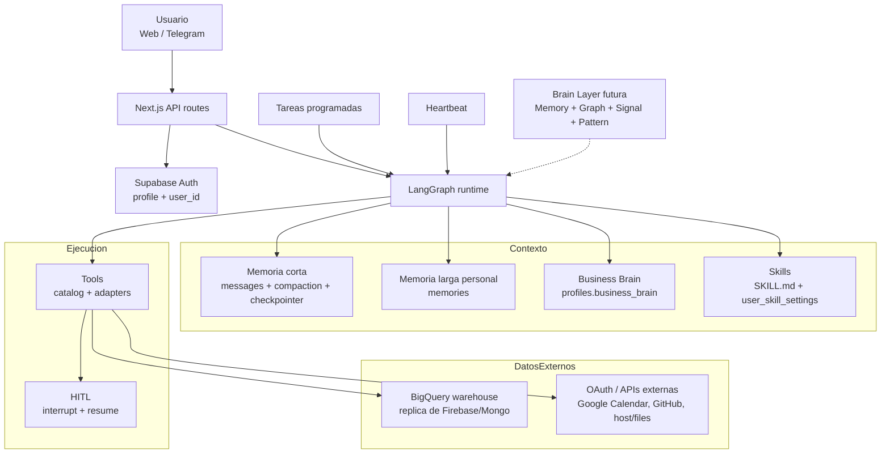

# Gu OS - Manual de arquitectura del agente

> **Estado:** documento maestro integrador
> **Audiencia:** producto, operaciones e ingenieria
> **Alcance:** anatomia del agente/sistema Gu OS: memoria, skills, tools, modelos, runtime, tareas programadas, Heartbeat, datos de negocio, identidad usuario/organizacion y Brain Layer futura
> **Relacion con `docs/architecture.md`:** `docs/architecture.md` es la vista corta del stack. Este documento es la lectura larga e integradora.
> **Relacion con la guia narrativa:** para entender Gu OS con lenguaje accesible, analogias y foco en Skills vs catálogo global, ver [`gu-os-understanding.md`](gu-os-understanding.md).
> **Relacion con planes:** este documento NO es un plan de implementacion. Describe lo que existe hoy y lo que esta previsto, marcando explicitamente el estado de cada pieza.

## Como leer este documento

Cada seccion sigue el mismo patron:

1. **Explicacion clara:** que es la pieza y por que existe, sin exigir conocimiento tecnico profundo.
2. **Detalle tecnico:** donde vive, que tablas/codigo usa, como se relaciona con otras piezas.
3. **Estado:** que esta implementado hoy, que esta previsto y que no existe todavia.

El objetivo no es reemplazar los documentos especificos de memoria, tools, Heartbeat o Brain Layer. Este manual los **orquesta** y duplica lo necesario para que alguien pueda entender el sistema completo sin saltar constantemente entre archivos. Cuando se necesite mas profundidad, cada seccion enlaza a los documentos fuente.

### Leyenda de estado

| Marca | Significado |
|---|---|
| **Hoy** | Existe en el codigo actual o en el modelo de datos actual. |
| **Configurado hoy / manual** | Existe, pero requiere configuracion manual por usuario/entorno. |
| **Previsto** | Esta disenado o documentado, pero no implementado completamente. |
| **Futuro** | Direccion probable; no debe tratarse como contrato actual. |

---

## 1. Resumen ejecutivo

Gu OS es un agente operativo que combina:

- **Runtime conversacional:** LangGraph decide, responde y llama tools.
- **Memoria de corto plazo:** mantiene contexto del turno/sesion, compacta cuando crece demasiado.
- **Memoria de largo plazo personal:** guarda hechos duraderos sobre el usuario operador.
- **Contexto de negocio estructurado:** usa `business_brain` y BigQuery para responder preguntas de datos de la organizacion.
- **Skills:** playbooks de negocio/personales/compartidos que ensenan al agente como actuar en un dominio.
- **Tools:** capacidades atomicas y auditables que ejecutan acciones o lecturas.
- **HITL:** confirmacion humana para acciones riesgosas.
- **Tareas programadas y Heartbeat:** ejecucion proactiva fuera del chat normal.
- **Brain Layer futura:** memoria operacional del negocio con pages, graph, signals, ingestion y skill mining.

La distincion mas importante:

| Concepto | Que es | Ejemplo | Donde vive hoy |
|---|---|---|---|
| **Memoria corta** | Contexto operativo de la conversacion actual | "Hace 2 mensajes el usuario pidio febrero" | `agent_messages`, LangGraph state, checkpointer, compaction |
| **Memoria larga personal** | Hechos duraderos sobre el usuario operador | "Prefiere respuestas en bullets" | `memories` |
| **Business Brain** | Configuracion/contexto estable del perfil y fuente de datos | `organization_id`, estilo, contexto de negocio | `profiles.business_brain` |
| **Datos operativos del negocio** | Leads, propiedades, deals, mensajes, usuarios operativos | "Cuantos leads llegaron en abril" | BigQuery hoy; Firebase/Mongo como fuente operativa externa |
| **Skills** | Procedimientos que guian al agente | `company-data`, `memory-curate`, `personal-day-briefing` | `skills/global/*/SKILL.md` + `user_skill_settings` |
| **Tools** | Funciones atomicas que ejecutan algo | `bigquery_run_query`, `calendar_create_event`, `schedule_task` | `TOOL_CATALOG`, adapters, `tool_calls` |
| **Brain Layer futura** | Cognicion operacional del negocio | `lead/julieta`, links, signals, playbooks mineados | Previsto en `docs/brain/gbrain-evaluation-and-plan.md` |

Regla corta:

- **Memoria** responde "que sabemos".
- **Skills** responden "como deberia trabajar el agente".
- **Tools** responden "que puede ejecutar el sistema".
- **Heartbeat / scheduled tasks** responden "cuando debe trabajar sin que el usuario escriba ahora".
- **LLMs** son el motor de razonamiento, seleccion, compactacion y extraccion.

---

## 2. Vista global de la anatomia

### Explicacion clara

Gu OS no es un solo "chat con memoria". Es una combinacion de capas. El usuario conversa desde web o Telegram; el runtime carga contexto, selecciona una skill si aplica, decide si necesita tools, pide aprobacion cuando el riesgo lo requiere y guarda trazas. En paralelo, algunas piezas trabajan fuera del turno normal: tareas programadas y Heartbeat.

### Diagrama de alto nivel



### Detalle tecnico

| Pieza | Estado | Fuente principal |
|---|---|---|
| Next.js UI/API | Hoy | `apps/web` |
| Runtime LangGraph | Hoy | `packages/agent/src/graph.ts` |
| Estado del grafo | Hoy | `packages/agent/src/state.ts` |
| Compaction | Hoy | `packages/agent/src/nodes/compaction_node.ts` |
| Memoria larga personal | Hoy | `packages/agent/src/nodes/memory_injection_node.ts`, `packages/agent/src/memory_flush.ts`, tabla `memories` |
| Skills | Hoy | `skills/global/*/SKILL.md`, `packages/agent/src/skills/*` |
| Tools | Hoy | `packages/agent/src/tools/catalog.ts`, `packages/agent/src/tools/adapters.ts` |
| HITL | Hoy | `interrupt()` en `packages/agent/src/graph.ts`, `tool_calls`, `agent_messages.structured_payload` |
| Scheduled tasks | Hoy | `scheduled_tasks`, `scheduled_task_runs`, `/api/cron/scheduled-tasks` |
| Heartbeat | Hoy | `heartbeat_runs`, `profiles.business_brain.heartbeat`, `/api/cron/heartbeat` |
| Casos operacionales | Hoy | `operational_cases`, `operational_case_events`, `/api/cron/operational-cases` — ver §13b |
| Plano de impacto (facts/artefactos) | Hoy | `case_facts`, `case_artifacts`, `artifact_inputs`, `case_approvals` (`00070`) |
| Workflows ejecutables | Hoy | `workflow_definitions` (`00065`), `packages/workflows` |
| Substrato de Organizacion (R1) | Hoy en schema; cobertura de runtime parcial | `organizations` y tablas hermanas (`00080`–`00084`, era forward) — ver §3 y §17 |
| Business data / warehouse | Configurado hoy / manual | BigQuery + `business_brain` binding |
| Multi-proveedor LLM | Previsto | `docs/tools-design/model-providers.md` |
| Brain Layer G Brain-inspired | Previsto | `docs/brain/gbrain-evaluation-and-plan.md` |

---

## 3. Identidad, usuario y organizacion

### Explicacion clara

Hay que separar dos identidades:

1. **Identidad del usuario que usa Gu OS:** quien inicia sesion y conversa con el agente.
2. **Identidad de la organizacion operativa:** inmobiliaria/negocio cuyos leads, propiedades, deals y mensajes viven en el sistema operativo externo.

Hoy Gu OS guarda sus propios usuarios y sesiones en Supabase. El sistema operativo existente usa Firebase/Mongo y una tabla como `firestore_users.users_light`, donde viven `organization_id`, `org_name` y `role_user`. BigQuery replica esa informacion para consultas analiticas.

La meta futura es que el usuario no sienta dos sistemas ni dos logins: Gu OS deberia tomar los IDs necesarios del sistema operativo. Hoy, el binding de `organization_id` se configura manualmente desde Ajustes.

### Estado actual

Hay que separar **dos** cosas que antes eran una sola. El `organization_id` del sistema operativo externo sigue siendo el binding de warehouse en `business_brain`. Pero desde la migracion `00080` existe ademas una tabla **`organizations` nativa de Gu OS** con membresias propias. No son sinonimos y no se sustituyen: la primera dice *contra que datos externos consulto*, la segunda dice *quien es el tenant dentro de Gu OS*.

| Tema | Hoy | Futuro esperado |
|---|---|---|
| Login de Gu OS | Supabase Auth | Login consolidado con el sistema operativo externo |
| Usuario del agente | `profiles.id` (`user_id`) | Seguir siendo la identidad del runtime, posiblemente enlazada a identidad externa |
| Tenant nativo de Gu OS | **Hoy:** `organizations` + `organization_memberships` (`00080`) | Cobertura de runtime mas amplia; hoy alcanza al plano de Organizacion, no a todo el agente |
| Binding de datos externos | `organization_id` configurado en `business_brain` / Ajustes | Derivado automaticamente del sistema operativo externo |
| Vinculo entre ambas identidades | **Hoy:** `external_identity_bindings` (`00082`), incluido `legacy_organization_key` | Cobertura de mas tipos de identidad externa |
| Fuente de datos operativa | BigQuery replica Firebase/Mongo | Posible acceso directo a Firebase/Mongo si conviene |
| Multi-org por usuario | **Si, estructuralmente:** `organization_memberships` es unique por `(organization_id, user_id)`, asi que un usuario puede tener membresia activa en varias Organizaciones | La experiencia de producto para cambiar de Organizacion no esta resuelta |

> **Precision importante.** Que el substrato exista no significa que todo el agente sea multi-tenant. El aislamiento por `user_id` sigue siendo el modelo del plano personal (chat, memoria, skills, tools, tareas). Lo que `00080`–`00084` anaden es un **segundo eje** que hoy gobierna el plano de Organizacion y las filas de `operational_cases` que tienen `organization_id`. Ver §17.

### Detalle tecnico

En Supabase:

- `profiles.id` referencia `auth.users(id)`.
- Las tablas del **plano personal** del agente se aislan por `user_id` y RLS.
- Las tablas del **plano de Organizacion** (`00080`+) se aislan por **membresia activa**, no por propiedad de fila: el predicado `is_active_org_member` (SECURITY DEFINER) alimenta las policies de `organizations`, `organization_memberships`, `contacts`, `organization_feature_flags`, `organization_policies` y `case_relationships`. La escritura es de `service_role`; `organization_tool_secrets` ademas no tiene policy de lectura para `authenticated`.
- `profiles.business_brain` guarda contexto por cuenta, incluyendo datos de warehouse.
- `profiles.is_ungga_admin` permite modo staff/cross-tenant en BigQuery.

En el sistema operativo externo:

- `firestore_users.users_light.organization_id` identifica la organizacion.
- `firestore_users.users_light.org_name` da nombre legible.
- `firestore_users.users_light.role_user` puede ser `super-admin` o `vendedor`.
- `super-admin` representa al usuario principal de la organizacion/negocio al que se asocian leads entrantes de fuentes como campañas o portales.
- `vendedor` representa agentes inmobiliarios no principales.

En Gu OS hoy:

- Ajustes permite configurar la **Fuente de datos principal** con `organization_id`.
- Ese `organization_id` debe coincidir con el que existe en BigQuery/Firebase.
- Si se configura un ID inexistente o incorrecto, los queries de negocio fallan o devuelven vacio. No es un fallo de razonamiento del agente; es un binding inconsistente.

### Modelo de tenant: hoy y direccion V3

El `organization_id` externo ya identifica a la inmobiliaria. `org_name` es un atributo legible y mutable; no debe usarse como clave. `role_user='super-admin'` identifica al usuario principal que administra o recibe leads, pero **no convierte al usuario en la organizacion**. Esto permite cambiar al administrador, tener varios administradores o reasignar vendedores sin cambiar la identidad del negocio.

```text
organization (external org_id)
├── owner / super-admin
├── org admins
├── vendedores / asesores
├── legal / marketing / operaciones
└── teams
```

Ese modelo conceptual dejo de ser enteramente futuro. Lo que ya existe y lo que sigue pendiente:

| Pieza | Estado | Como esta implementada |
|---|---|---|
| **Membership:** a que organizacion pertenece el usuario | **Hoy** | `organization_memberships`, con ciclo de vida suave (`status active/inactive`, nunca hard-delete) para que las referencias historicas de identidad sigan resolviendose |
| **Role:** que puede hacer | **Hoy, acotado** | `check (role in ('owner','org_admin','advisor'))`. La propia migracion advierte que es el **mapeo inicial** desde `super-admin`/`admin`/`vendedor`, **no el modelo de autorizacion permanente** |
| **Conservar el ID externo** | **Hoy, pero no como columna** | No es `organizations.external_org_id`: se resolvio con `external_identity_bindings` (`00082`), una identidad externa opaca por fila con **exactamente una** referencia tipada y FK compuestos que garantizan misma-Organizacion sin triggers. La clave legacy **normalizada** es la identidad de routing; la cruda queda como provenance (`00084`) |
| **Assignment:** de que lead, caso o work item es responsable | **Parcial** | `operational_cases.assigned_to_user_id` existe; no hay un modelo de asignacion transversal |
| **Team:** con quien comparte trabajo o conocimiento | **Previsto** | No hay tabla de equipos |
| **DRI:** quien responde por el outcome | **Previsto** como concepto de runtime | Hoy vive en artefactos de desarrollo (Slice Plan), no en el schema |

La autorizacion de negocio no la hace RLS sola: las escrituras del plano de Organizacion pasan por `authorizeOrgAction` en el servidor. **Una membresia `inactive` conserva identidad resoluble y no otorga nada** — la autorizacion se evalua siempre contra `status='active'` en el momento de la accion.

Para leads, la propiedad logica es de la organizacion aunque el sistema externo hoy la resuelva indirectamente mediante el usuario `super-admin`. Gu OS puede empezar con el adapter `lead -> receiving user -> external org_id`; el contrato futuro preferido es `lead.organization_id` + `lead.assigned_to_user_id`. El sistema externo sigue siendo SOR de intake/asignacion mientras Gu OS referencia `external_lead_id`, `external_org_id` y el assignee vigente.

No confundir tres autoridades:

- `profiles.is_ungga_admin`: staff interno de la plataforma.
- `role_user='super-admin'`: owner/admin externo de una inmobiliaria.
- DRI de un caso/loop: humano accountable por un outcome concreto.

### Matriz de propiedad de datos

| Tipo | Ejemplo | Propietario logico | Storage actual | Notas |
|---|---|---|---|---|
| Perfil de uso de Gu OS | nombre, timezone, prompt base | Usuario | `profiles` | RLS por `auth.uid()` |
| Memoria personal | preferencias del usuario, hechos personales | Usuario | `memories` | No debe guardar CRM/leads |
| Settings de tools | tool habilitada / deshabilitada | Usuario | `user_tool_settings` | Por cuenta |
| Settings de skills | skill habilitada / config | Usuario | `user_skill_settings` | Por cuenta |
| Business Brain | org binding, contexto, voz, heartbeat | Usuario/cuenta hoy; organizacion en direccion futura | `profiles.business_brain` | Es el puente actual hacia datos de organizacion |
| Tenant nativo y su gente | Organizacion, membresias, contactos | Organizacion | `organizations`, `organization_memberships`, `contacts` | **Hoy.** RLS por membresia activa; escritura solo service role |
| Configuracion y secretos de Organizacion | flags, credenciales de tool, politica de admision | Organizacion | `organization_feature_flags`, `organization_tool_secrets`, `organization_policies` | **Hoy.** `organization_tool_secrets` no tiene lectura para `authenticated` |
| Identidad externa vinculada | clave legacy, numero de WhatsApp, lead legacy | Organizacion | `external_identity_bindings` | **Hoy.** Solo service role; una referencia tipada por fila |
| Datos operativos | leads, propiedades, mensajes, deals | Organizacion externa | BigQuery replica Firebase/Mongo | Consultado por `bigquery_run_query` |
| Brain Layer futuro | pages, links, signals del negocio | Usuario hoy; organizacion cuando exista modelo org | `brain_*` previsto | Debe evolucionar a org/memberships |

---

## 4. Canales, sesiones y flujo de un turno

### Explicacion clara

El agente puede recibir trabajo desde varios canales:

- Web chat.
- Telegram.
- Tareas programadas.
- Heartbeat.
- Confirmaciones HITL que reanudan una ejecucion pausada.

No todos los canales deben usar la memoria igual. Un chat normal debe recordar contexto y puede extraer memoria personal. Un cron programado debe ejecutar un prompt autocontenido, sin contaminar memoria personal. Heartbeat opera con reglas todavia mas conservadoras.

### Detalle tecnico

| Canal | Tabla/sesion | Memoria corta | Memoria larga personal | HITL |
|---|---|---|---|---|
| `web` | `agent_sessions.channel='web'` | Si | Inyecta y puede flush post-turno | Si |
| `telegram` | `agent_sessions.channel='telegram'` | Si | Inyecta y puede flush post-turno | Si, via inline keyboard |
| `cron` | `agent_sessions.channel='cron'` | No depende de historial previo normal | No inyecta ni flush | Auto-aprueba tools segun politica de tarea |
| `heartbeat` | `agent_sessions.channel='heartbeat'` | No usa historia corta normal | Puede inyectar set curado `semantic`/`procedural` | Read-heavy; writes fuera de scope salvo diseno futuro |
| resume HITL | mismo checkpoint | Reusa checkpoint | No reinicia inyeccion | Reanuda con decision approve/reject |

Flujo normal web/Telegram:

1. API autentica usuario.
2. Carga o crea `agent_session`.
3. Carga perfil, tools habilitadas, integraciones, skills habilitadas y contexto de negocio.
4. `runAgent()` arma el system prompt efectivo.
5. Entra al grafo: `memory_injection -> compaction -> agent -> tools -> compaction -> agent`.
6. Si una tool requiere aprobacion, LangGraph pausa con `interrupt()`.
7. Al terminar el turno, el endpoint puede disparar `flushSessionMemory` fuera del grafo.

Documentos fuente:

- `docs/architecture.md`
- `docs/memory/long_term_memory_plan.md`
- `docs/tools-design/hitl.md`

---

## 5. Modelos IA / LLMs ("cerebro")

### Explicacion clara

Gu OS usa varios modelos con responsabilidades distintas. No hay un solo "cerebro" haciendo todo:

- Un modelo principal conversa y decide tools.
- Un modelo pequeno selecciona skills.
- Un modelo pequeno compacta contexto.
- Un modelo pequeno extrae memorias.
- Un modelo genera embeddings para busqueda semantica.
- Heartbeat y cron pueden usar configuraciones mas baratas/deterministas.

Separar responsabilidades permite controlar costo, latencia y calidad.

### Detalle tecnico actual

| Responsabilidad | Default en codigo | Donde se configura | Estado |
|---|---|---|---|
| Chat principal | `openai/gpt-5.4-mini` | `MAIN_AGENT_MODEL_ID` + `OPENROUTER_MAX_TOKENS` (`model.ts`) | Hoy |
| Compaction / memory flush | `anthropic/claude-haiku-4.5` | `COMPACTION_MODEL_ID` (`model.ts`) | Hoy |
| Selector de skills | `anthropic/claude-haiku-4.5` | `SKILL_SELECTOR_MODEL_ID` (`model.ts`) | Hoy |
| Reviewer de Business Brain | `anthropic/claude-haiku-4.5` | `BUSINESS_BRAIN_REVIEWER_MODEL_ID` (`model.ts`) | Hoy |
| Clasificador conversacional de casos (+ HITL `unclear`) | `openai/gpt-5.4-mini` | `OPERATIONAL_CONVERSATION_CLASSIFIER_MODEL_ID` (constante en `model.ts`; uso en web) | Hoy |
| Vision / fotos | `openai/gpt-4.1-mini` | `IMAGE_VISION_MODEL_ID` (constante en `model.ts`; uso en realestate adapters) | Hoy |
| Copy de listing | `openai/gpt-4.1-mini` | `LISTING_COPY_MODEL_ID` (constante en `model.ts`; uso en realestate adapters) | Hoy |
| Embeddings memoria | `google/gemini-embedding-001` | `MEMORY_EMBEDDING_MODEL`, `MEMORY_EMBEDDING_DIM=1536` | Hoy |
| Cron | mismo factory `createChatModel`, temperatura baja | `DEFAULT_CRON_TEMPERATURE=0.1` | Hoy |
| Heartbeat | hereda main si se omite | `HEARTBEAT_MODEL_ID`, `HEARTBEAT_MAX_TOKENS` | Hoy |
| Multi-proveedor directo | OpenRouter + Google directo | `docs/tools-design/model-providers.md` | Previsto |

Inventario canónico y riesgos de host tools: [`docs/tools-design/model-providers.md`](../tools-design/model-providers.md). Análisis profundo: [`gu-os-agent-architecture-analysis.md`](gu-os-agent-architecture-analysis.md).

### Regla conceptual

- **El modelo no es la fuente de verdad.** La fuente de verdad son datos, tablas, skills, tools y aprobaciones.
- **El modelo interpreta y orquesta.** Decide que tool usar, que skill aplicar y como responder.
- **Las reglas duras viven fuera del modelo.** Si una tool no se registra, el modelo no puede llamarla. Si RLS o SQL validator bloquean algo, el modelo no puede saltarlo.

---

## 6. Memoria de corto plazo

### Explicacion clara

La memoria de corto plazo es lo que el agente necesita para mantener continuidad en la conversacion actual: mensajes recientes, resultados de tools y resumen compactado cuando el historial crece. No es "recuerdo permanente"; es contexto operativo del turno/sesion.

Ejemplos:

- "El usuario acaba de pedir febrero y ahora dice 'y marzo?'".
- "La tool de calendario devolvio estos eventos hace un momento".
- "Ya se pidio aprobacion para crear este evento".

### Detalle tecnico

Componentes:

- `agent_messages`: historial persistido por sesion.
- LangGraph `GraphState.messages`: estado activo del grafo.
- `messagesStateReducer`: permite append, reemplazo por `id` y `RemoveMessage`.
- `compaction_node`: controla crecimiento del historial.
- `checkpointer`: guarda/reanuda estado del grafo, especialmente para HITL.

Compaction tiene dos etapas:

1. **Microcompact:** reemplaza resultados antiguos de tools por `[tool result cleared]`, preservando los ultimos resultados.
2. **LLM compaction:** cuando se supera un umbral de ventana, Haiku resume y reinyecta un `[CONTEXTO COMPACTADO]`.

Estado actual:

- Implementado.
- Documentado en `docs/memory/short_memory_plan.md`.
- No reemplaza memoria larga ni business data.

### Que NO debe hacer la memoria corta

- No debe convertirse en sistema de conocimiento permanente.
- No debe guardar facts del negocio.
- No debe reemplazar `memories`, BigQuery ni la Brain Layer futura.

---

## 7. Memoria de largo plazo personal

### Explicacion clara

La memoria de largo plazo personal guarda hechos duraderos sobre el **usuario operador**, no sobre leads, propiedades o deals. Sirve para que el agente recuerde preferencias, contexto personal/profesional estable y como el usuario quiere que trabaje.

Ejemplos que SI van aqui:

- "Es asesor inmobiliario en Mazatlan con 8 anos de experiencia".
- "Prefiere respuestas cortas en bullets".
- "Su contadora se llama Lucia".

Ejemplos que NO van aqui:

- "El lead Julieta tiene telefono X".
- "La propiedad Reforma 123 cuesta 4.5M".
- "Pedro pidio cita el viernes".

Eso es negocio/CRM y debe vivir en fuentes operativas o, futuro, Brain Layer.

### Detalle tecnico

Tabla `memories`:

| Campo | Rol |
|---|---|
| `user_id` | Propietario de la memoria |
| `type` | `episodic`, `semantic`, `procedural` |
| `content` | Frase corta en espanol |
| `content_hash` | Deduplicacion |
| `embedding` | Busqueda semantica |
| `retrieval_count` | Senal de uso |
| `archived_at` | Soft-delete (migracion posterior) |

Tres tipos:

| Tipo | Significado en Gu OS |
|---|---|
| `semantic` | Preferencias, relaciones o contexto durable del usuario |
| `episodic` | Algo concreto que hizo o le paso al usuario |
| `procedural` | Como el usuario quiere que el agente trabaje con el |

Pipeline:

1. `memory_injection_node` corre al inicio del grafo en web/Telegram.
2. Genera embedding del ultimo mensaje del usuario.
3. Busca recuerdos similares con `match_memories`.
4. Anteponer `[MEMORIA DEL USUARIO]` al primer `SystemMessage`.
5. Marca `memoryFlushPending` si detecta cambio de tema.
6. Despues del turno, el endpoint puede llamar `flushSessionMemory`.
7. `flushSessionMemory` extrae facts con Haiku, genera embeddings y guarda en `memories`.

### Curacion

La skill `memory-curate` permite listar, buscar, archivar o borrar memorias personales.

Tools relevantes:

- `list_user_memories`
- `search_user_memories`
- `archive_user_memory`
- `delete_user_memory`

Archivar es reversible; borrar es permanente. Ambas acciones de escritura pasan por HITL cuando corresponde.

### Estado

- Memoria personal larga: **Hoy**.
- Curacion por skill/tools: **Hoy**.
- TTL/decay mas avanzado: **Previsto / futuro segun roadmap de curacion**.

Documentos:

- `docs/memory/long_term_memory_plan.md`
- `docs/memory/memory_curation_plan.md`

---

## 8. Business Brain y datos estructurados del negocio

### Explicacion clara

`Business Brain` no es lo mismo que `memories`. Es un contenedor estructurado de configuracion/contexto por cuenta: identidad del agente, tono, contexto de negocio, preferencias operativas y fuente de datos principal.

Tambien contiene el binding hacia el warehouse: `organization_id`, `org_name`, project/location/datasets. Ese binding permite que una skill como `company-data` consulte BigQuery de forma correcta y aislada.

### Detalle tecnico

Storage:

- `profiles.business_brain` (JSONB).
- `profiles.is_ungga_admin` para personal interno de Ungga.

Slots importantes:

| Slot | Uso |
|---|---|
| `agent_identity` | Quien es el agente para esta cuenta |
| `soul` | Voz, tono, estilo, brevedad (campos editables en Settings) |
| `soul_effective` | Resumen compilado y coherente inyectado al prompt (`summary`, `source`, warnings); se genera al guardar/revisar Alma |
| `business_context` | Contexto estable del negocio |
| `operating_preferences` | Preferencias operativas editables |
| `data_sources.warehouse` | Binding moderno a BigQuery |
| `identity` / `bigquery` | Compatibilidad legacy |
| `heartbeat` | Configuracion de Heartbeat |

`getBusinessBrainWarehouse()` resuelve el binding efectivo. Los valores modernos en `data_sources.warehouse` ganan; si faltan, usa `identity` / `bigquery`.

### Relacion con BigQuery, Firebase y Mongo

Hoy:

- BigQuery replica datos operativos de Firebase/Mongo.
- El `organization_id` usado por Gu OS debe coincidir con el de BigQuery/Firebase.
- El binding se configura manualmente desde Ajustes.
- Cada usuario se asocia a una sola organizacion (`organization_id`, `org_name`).

Futuro:

- Login e identidad deberian consolidarse para que el usuario no configure manualmente IDs.
- Podria convenir leer directo de Firebase/Mongo en algunos flujos.
- Multi-org por usuario no esta decidido.

### Relacion con skills

La skill `company-data`:

- Tiene `scope: business`.
- Usa `bigquery_run_query`.
- Tiene `requires_tenant_context: true`.
- Marca `memory_extraction: ephemeral` para no guardar inputs transaccionales en memoria personal.
- Incluye `business-data-core`.

Cuando esta activa, `runAgent` inyecta `[Contexto de tenant]`, que indica:

- Modo obligatorio para usuario regular.
- `organization_id` efectivo.
- Project/location de BigQuery.
- Reglas para admin Ungga/cross-tenant.

---

## 9. Skills

### Explicacion clara

Una skill es un **playbook**: instrucciones estructuradas que ensenan al agente como manejar un tipo de trabajo. No ejecuta por si sola. El agente la lee y, con base en ella, decide que decir y que tools usar.

Ejemplos:

- `company-data`: responder metricas de negocio con BigQuery.
- `memory-curate`: administrar recuerdos personales guardados.
- `personal-day-briefing`: preparar o programar un brief del dia.
- `business-data-core`: capa compartida de referencias para skills de datos.

### Tipos de skills

| Scope | Significado | Ejemplo |
|---|---|---|
| `business` | Opera sobre datos/procesos del negocio | `company-data` |
| `personal` | Ayuda al usuario como individuo | `personal-day-briefing`, `memory-curate` |
| `shared` | Puede servir a ambos ambitos | `doc-coauthoring`, futuras file skills |

### Detalle tecnico

Las skills globales viven en:

```text
skills/global/<slug>/SKILL.md
```

Frontmatter relevante:

| Campo | Uso |
|---|---|
| `name` | ID de la skill |
| `description` | Cuando debe usarse |
| `scope` | `business`, `personal`, `shared` |
| `allowed_tools` | Tools que puede usar cuando esta activa |
| `includes` | Composicion explicita de skills |
| `requires_tenant_context` | Si necesita `[Contexto de tenant]` |
| `memory_extraction` | `default` o `ephemeral` |
| `heartbeat` | `native`, `compatible`, `blocked` |
| `heartbeat_signals` | Prefetchers deterministicas para Heartbeat |

Runtime:

1. `runAgent` carga registry global.
2. El selector de skills elige una skill dominante o `none`.
3. Si hay skill activa, se resuelve (incluyendo `includes`).
4. Se inyecta el playbook al system prompt.
5. Se intersectan tools disponibles con `allowed_tools`.
6. Si `requires_tenant_context`, se inyecta el bloque de tenant.

### Account skills (V1 Opción B)

Además del catálogo global en `skills/global/*`, una cuenta de usuario puede
tener **skills propias** persistidas en la tabla `account_skills` (ver
migración `00020_account_skills.sql`):

- Una fila por skill, con `body_md` (contenido completo del SKILL.md
  incluyendo frontmatter), `metadata_jsonb` (cache parseada),
  `status` (`draft|active|archived`) y `version`.
- El runtime compone el registry con `getSkillRegistryForUser(db, userId)`:
  `account_skills(status='active') ∪ skills/global/*`. **En colisión por
  slug, gana la account.**
- Validación Zod idéntica a la de skills globales; `parseAccountSkillSource`
  rechaza al guardar si el frontmatter está mal.
- UI mínima en `/settings/account-skills` (textarea + frontmatter).

Casos de uso:

- Una inmobiliaria customiza `property-optioning-coach` con su propia
  voz/recordatorios sin tocar el catálogo global.
- Un usuario crea una skill nueva específica de su flujo, sin que pase por
  el repo.

Evoluciones futuras (versionado completo, draft/review/active/archived con
rollback, organization-level skills): ver
[`docs/operational-cases/future-considerations.md`](../operational-cases/future-considerations.md)
sección 6.

### Skills de usuario vs organizacion

Hoy:

- Las skills son globales en repo.
- `user_skill_settings` permite toggles/config por cuenta.
- No hay `organization_id` nativo para skills compartidas por organizacion.

Futuro:

- `account_skills` versionadas.
- Skills compartidas por organizacion cuando exista modelo `organizations` + memberships.
- Skills implicitas generadas desde `brain_skill_candidates` tras HITL.

### Operational/Playbook vs `memories.type='procedural'`

No son lo mismo:

- `memories.type='procedural'`: preferencias personales del usuario sobre como quiere que el agente trabaje.
- Operational/Playbook Knowledge: como opera mejor el negocio; debe terminar en Skill, no en `memories`.

Este punto esta formalizado en `docs/brain/gbrain-evaluation-and-plan.md`.

Documentos:

- `docs/tools-design/skill-routing.md`
- `docs/business-brain-evolution-roadmap.md`

---

## 10. Tools

### Explicacion clara

Una tool es una capacidad atomica que el agente puede llamar: leer calendario, crear evento, consultar BigQuery, programar una tarea, leer un archivo, etc.

La diferencia con una skill:

- **Skill:** procedimiento / instrucciones.
- **Tool:** funcion ejecutable.

Ejemplo:

- Skill `company-data`: "como responder preguntas de datos de negocio".
- Tool `bigquery_run_query`: "ejecuta este SQL read-only en BigQuery".

### Detalle tecnico

Catalogo:

- `packages/agent/src/tools/catalog.ts`
- Define `id`, `description`, `risk`, `requires_integration`, `parameters_schema`.

Ejecucion:

- `packages/agent/src/tools/adapters.ts` y adapters por dominio.
- `buildLangChainTools()` decide que tools se registran en ese turno.
- Si una tool no se registra, el modelo no puede llamarla.

Auditoria:

- `tool_calls` registra argumentos, resultado, status, turn_id y `executor_kind`.
- `executor_kind='agent'`: la llamo el LLM.
- `executor_kind='deterministic'`: la llamo el sistema (por ejemplo, Heartbeat prefetcher).

Riesgo:

| Risk | Ejemplo | Comportamiento |
|---|---|---|
| `low` | listar eventos, consultar BigQuery read-only | Sin tarjeta HITL |
| `medium` | crear tarea programada, archivar memoria | Requiere confirmacion |
| `high` | borrar memoria, bash, editar archivos, crear repo | Requiere confirmacion |

Tools relevantes por dominio:

| Dominio | Tools |
|---|---|
| Perfil/config | `get_user_preferences`, `list_enabled_tools` |
| Calendario | `calendar_list_events`, `calendar_create_event`, `calendar_update_event`, `calendar_delete_event` |
| Tareas programadas | `schedule_task`, `manage_scheduled_tasks` |
| Skills | `read_skill_reference` |
| Business data | `bigquery_run_query` |
| Memoria personal | `list_user_memories`, `search_user_memories`, `archive_user_memory`, `delete_user_memory` |
| Archivos servidor | `read_file`, `write_file`, `edit_file` |
| Host/server | `bash` |
| GitHub | `github_*` |

---

## 11. HITL y permisos

### Explicacion clara

HITL ("human in the loop") es la frontera entre "el agente puede proponer" y "el agente puede ejecutar". Si una accion puede modificar el mundo o borrar datos, el usuario debe aprobar.

### Detalle tecnico

Hoy el sistema usa `interrupt()` de LangGraph:

1. El agente decide llamar una tool.
2. Si la tool es `medium` o `high`, el nodo de tools llama `interrupt(payload)`.
3. LangGraph guarda el estado en el checkpointer.
4. El UI o Telegram muestra una tarjeta/boton de aprobacion.
5. Al aprobar/rechazar, `runAgent({ resumeDecision })` reanuda el checkpoint.
6. La tool se ejecuta o se omite y el agente responde con continuidad.

Persistencia:

- `tool_calls.status`: `pending_confirmation`, `approved`, `rejected`, `executed`, `failed`.
- `agent_messages.structured_payload`: guarda la confirmacion para sobrevivir refresh.
- `checkpointThreadId`: permite resume del grafo correcto.

Relaciones:

- Tools usan HITL por `risk`.
- Scheduled tasks usan HITL al programar.
- Cron puede auto-aprobar tools internas porque el usuario ya aprobo la tarea.
- Brain Layer futura usara HITL para `Signal -> Memory` y `Pattern -> Skill`.

Documento:

- `docs/tools-design/hitl.md`

---

## 12. Tareas programadas

### Explicacion clara

Una tarea programada es una instruccion guardada para que el agente la ejecute despues o de forma recurrente. Es para peticiones tipo:

- "Todos los lunes resumeme mis issues abiertos".
- "Manana a las 9 revisa mis eventos y mandame un brief".

El usuario aprueba la tarea al programarla. Luego el runner la ejecuta automaticamente.

### Detalle tecnico

Tablas:

- `scheduled_tasks`: definicion de la tarea.
- `scheduled_task_runs`: auditoria de ejecuciones.

Tools:

- `schedule_task` (`medium`): crea tarea; requiere HITL.
- `manage_scheduled_tasks` (`low`): lista, pausa, reanuda; no borra.

Runner:

- `POST /api/cron/scheduled-tasks`
- Protegido con `CRON_SECRET`.
- Usa service role.
- Selecciona tareas vencidas.
- Procesa con concurrencia acotada (`SCHEDULED_TASKS_CONCURRENCY`, default 5).
- Crea sesion `channel='cron'`.
- Llama `runAgent({ autoApproveTools: true })`.
- Registra resultado y notifica por Telegram si esta vinculado.
- Operacion: desfasar schedules respecto a heartbeat y operational-cases (runbook § Stagger).

Diferencia con Heartbeat:

| Tareas programadas | Heartbeat |
|---|---|
| El usuario define una instruccion concreta | El sistema revisa una checklist recurrente |
| Cada row tiene su prompt | Checklist vive en Business Brain / templates |
| Auto-approval deriva de aprobar la tarea | Read-heavy y mas conservador |
| Ideal para "haz X a tal hora" | Ideal para "vigila estas cosas periodicamente" |

---

## 13. Heartbeat

### Explicacion clara

Heartbeat es el pulso proactivo del agente. No espera una pregunta del usuario. Cada cierto intervalo revisa una checklist y puede detectar excepciones: reuniones proximas, tareas vencidas, approvals pendientes o, futuro, leads en riesgo.

No es lo mismo que una tarea programada. Heartbeat no guarda un prompt arbitrario por row; sigue una politica/checklist de monitoreo.

### Detalle tecnico

Config:

- `profiles.business_brain.heartbeat`
- templates en `packages/agent/src/heartbeat/checklist.ts`

Auditoria:

- `heartbeat_runs`
- sesiones `agent_sessions.channel='heartbeat'`

Runner:

- `POST /api/cron/heartbeat`
- Protegido con `CRON_SECRET`
- Selecciona usuarios vencidos por `interval_minutes`
- Construye prompt desde checklist
- Llama `runAgent({ channel: 'heartbeat' })`

Prefetchers deterministicas:

- Para senales que no deben depender de que el modelo elija la tool.
- Actualmente `calendar_events` y `calendar_tasks`.
- Guardan resultado en `tool_calls` con `executor_kind='deterministic'`.
- El UI muestra badge `Deterministico` vs `IA`.

Estado:

- Heartbeat runtime: **Hoy**.
- Prefetchers calendar/tasks: **Hoy**.
- Senales futuras de negocio (leads, inventario, aprobaciones): **Previsto / futuro**.

Documentos:

- `docs/heartbeat/deterministic-prefetchers.md`
- `docs/heartbeat/implementation-plan.md`

---

## 13b. Casos operacionales (subsistema)

### Explicacion clara

Algunas operaciones del negocio NO son ni un turno de chat ni un pulso de
Heartbeat: son procedimientos **multi-día con esperas humanas externas**
(ej. "opcionar una propiedad" implica pedir documentos al dueño, esperar
respuesta, hacer comparables, preparar contrato, coordinar fotos,
publicar). El subsistema de **casos operacionales** es la primitiva
persistente para este tipo de workflows.

El cron del subsistema escanea casos vencidos, los entrega al agente con
binding directo a la skill correspondiente, y el agente decide la siguiente
acción. La historia completa vive append-only en eventos.

### Detalle tecnico

Tablas (migración `00019_operational_cases.sql`):

- `operational_case_types`: catálogo de tipos (`case_type`,
  `default_skill_slug`, `default_reminder_policy_jsonb`).
- `operational_cases`: instancias vivas (status, current_step,
  next_action_at, due_at, context_jsonb, version para optimistic locking,
  external_contact_jsonb).
- `operational_case_events`: timeline append-only (triggers SQL bloquean
  UPDATE/DELETE).

Runtime:

- Cron `/api/cron/operational-cases` (`CRON_SECRET`, concurrencia
  configurable vía `OPERATIONAL_CASES_CONCURRENCY`).
- Lock optimista por `version` (no bloqueo de fila): otro worker que
  encuentre `version` distinta, salta.
- `runAgent({ caseId, channel: 'case_runner' })` carga el caso y los
  últimos eventos en el bloque `[Caso operacional activo]` del system
  prompt. Si el `case_type` tiene `default_skill_slug`, hace **binding
  directo** (salta el selector libre).

Webhook entrante:

- `/api/telegram/webhook` detecta si el `chat_id` es contacto externo de un
  caso `waiting_external` y, en ese caso, inserta evento
  `external_response` y mueve `next_action_at = now()` para que el cron lo
  procese inmediatamente.
- Idempotencia: `telegram_webhook_updates` (migration `00052`) registra cada
  `update_id` con claim `processing` / `completed` para no ejecutar dos veces
  el mismo mensaje de Telegram (reentregas del webhook o doble POST).

Comunicación con el humano interno (`notify_user`):

- Helper en `apps/web/src/lib/notify/index.ts`.
- Lee `user_notification_preferences.channels_priority_jsonb` y elige
  canal por preferencia + presencia + urgencia.

Tools del subsistema (en `packages/agent/src/tools/operational-cases-adapters.ts`):

- `operational_case_update_state` (`medium`, requiere `expected_version`).
- `operational_case_add_event` (`low`).
- `notify_user` (`low`).

Tools del dominio inmobiliario (en `packages/agent/src/tools/realestate-adapters.ts`):

- `telegram_send_message_to_contact` (`high`, HITL): mensajes outbound al
  dueño.
- `easybroker_search_listings`, `easybroker_search_closed_deals` (**implementadas**
  vía Playwright MLS; provider `easybroker_web` en `account_tool_secrets`; POC
  `pocs/easybroker-mls-cli/`). La API pública de EasyBroker no expone la bolsa
  completa; la búsqueda de comparables usa automatización web con credenciales del
  cliente, storage state y prueba de conexión no headless cuando aplica reCAPTCHA.
  Si el storage state expira, el adapter intenta login con email/password antes
  de pedir login asistido. Contrato de filtros para valuación/comparables:
  zona, operación, tipo y banda de área canónica (residencial `strict`
  asimétrica −15%/+85%). `bedrooms`/`bathrooms`/`parking_spaces` exactos y
  `min_*` son para búsquedas de opciones (comprador/rentador), no para el
  flujo de opinión de valor. `easybroker_search_closed_deals` verifica
  `Estatus=Solo cerradas` antes de tratar resultados como históricos.
  `shared_commission_only` activa el filtro de comisión compartida cuando el
  caso/skill lo requiere.
- `easybroker_create_listing`, `easybroker_upload_images` (**implementadas** HTTP
  write; provider `easybroker` + API key; fallback legacy `EASYBROKER_API_KEY`;
  `risk='high'`/HITL). `create` usa `POST /v1/properties` y crea por default
  `status=not_published`; `upload_images` usa `PATCH /v1/properties/{id}` con
  URLs firmadas para paths privados de Storage. Las fotos operativas son
  artefactos de caso/prueba; la readiness UI las modela como colección temporal
  declarativa (`asset_profile.test`, `param=image_paths`, hasta 30 fotos), no como
  30 campos fijos. La prueba real controlada de upload requiere
  `FOTOS A BORRADOR`, intenta reutilizar el último `listing_id` creado por
  `easybroker_create_listing` y debe usarse sólo sobre borradores de prueba
  porque EasyBroker reemplaza el arreglo de imágenes de la ficha. EasyBroker
  limita `images[].url` a 255 caracteres; el adapter usa URLs públicas cortas de
  Gu OS que redirigen a Supabase Storage cuando hay base URL pública configurada.
  En local se prueba con `ngrok http 3000` y
  `EASYBROKER_PUBLIC_ASSET_BASE_URL=https://<ngrok>`; en producción/GCP debe
  existir `NEXT_PUBLIC_SITE_URL` con un dominio público HTTPS (o una base pública
  específica para EasyBroker).
  La pantalla de readiness permite una prueba real controlada de create-listing:
  requiere `CREAR BORRADOR`, fuerza `not_published` y prefija `[PRUEBA - BORRAR]`.
  El schema real de create se validó contra el OpenAPI Markdown publicado vía
  `https://dev.easybroker.com/llms.txt`: `location.name` debe ser la ubicación
  completa registrada, `show_exact_location` va top-level y `operations[]`
  requiere `type`, `amount`, `currency`, `active` (más `unit=total`). Si no se
  manda `agent`, el adapter usa como default el email de `easybroker_web` para
  que EasyBroker asigne el usuario/agente correspondiente. La respuesta conserva
  `public_url` y deriva `agent_url` para el panel interno de EasyBroker.
- `bigquery_lookup_local_comparables` (wrapper BigQuery read-only sobre
  `firestore_properties.properties_light`; devuelve inventario interno publicado
  como `asking_price`, no cierres reales, y stats de precio cuando `price_display`
  se puede parsear).
- `generate_document_from_template` (DOCX desde `account_assets`; PDF queda
  pendiente de conversión).
- `image_watermark` (Sharp + watermark de `account_assets`; genera imágenes
  marcadas en el bucket privado `account-assets`).
- `ungga_publish_listing` (API interna preferida: POST a `{api_base}/v1/internal/listings`
  con Bearer; provider `ungga_api`; fallback CLI Playwright `pocs/ungga-cli/` con
  provider `ungga` y dry-run HITL cuando no hay API estable).

**Readiness y backlog de tools:** `GET /api/tool-readiness?case_type_id=…` (sin
componer el body completo de la skill; sólo metadata). Solicitudes cuando falta
capacidad global: tabla `global_tool_requests` + `POST/GET /api/global-tool-requests`.
UI: Ajustes → Capacidades → Solicitudes (`/settings?view=capabilities&section=requests`);
la ruta legacy `/settings/tool-requests` redirige allí.
Los assets se resuelven de forma declarativa: el catálogo de tools define
`asset_profile.account` / `asset_profile.test` y cada flow puede sobrescribir con
`required_assets` / `test_assets` sin cambios de código por caso nuevo.
Detalle arquitectónico: [`docs/operational-cases/architecture.md`](../operational-cases/architecture.md) §10.
Para entender la diferencia entre skills user-facing, skills de referencia,
tools técnicas y wrappers de negocio, ver
[`docs/skills-tools-architecture.md`](../skills-tools-architecture.md).

Skill compuesta de referencia:

- `skills/global/property-optioning-coach/SKILL.md` + 7 atómicas
  (`request-property-documents`, `extract-property-characteristics`,
  `perform-comparable-analysis`, `prepare-listing-price`,
  `prepare-commission-contract`, `request-property-photos`,
  `publish-listing-package`).

Documentos:

- [`docs/operational-cases/plan.md`](../operational-cases/plan.md): plan de
  implementación.
- [`docs/operational-cases/architecture.md`](../operational-cases/architecture.md):
  detalle técnico del subsistema.
- [`docs/operational-cases/future-considerations.md`](../operational-cases/future-considerations.md):
  cuándo justificar subagentes, escalar el selector, migrar a Temporal,
  browser automation, WhatsApp Cloud API.

POCs (en `pocs/`; instalar con `npm run setup:pocs` en la raíz del monorepo):

- `pocs/easybroker-mls-cli/`: Playwright contra la bolsa MLS de EasyBroker
  (`/agent/mls_properties`); usado en runtime por `easybroker_search_*`.
- `pocs/ungga-cli/`: Playwright contra `app.ungga.com` (staging); fallback de
  `ungga_publish_listing`.
- `pocs/ungga-api/`: cliente y OpenAPI del endpoint interno propuesto.

Estado:

- Subsistema base: **Hoy** (migraciones, cron, runtime, webhook, tools).
- Credenciales por cuenta: **Hoy** (`easybroker`, `easybroker_web`, `ungga_api`,
  `ungga`; tabla + API + UI + prueba de conexión).
- EasyBroker búsqueda MLS: **Hoy** (Playwright + `easybroker_web`).
- EasyBroker create/upload: **Hoy** — write HTTP real (`POST /v1/properties`,
  `PATCH /v1/properties/{id}`), `risk='high'`/HITL, con selftests de payload y
  ubicación. *(Esta línea decía "Stub hasta mapear endpoints write de la API" y
  contradecía el cuerpo de esta misma sección; los endpoints ya están mapeados.)*
- Templates DOCX y watermark: **Hoy** (`docxtemplater` + `pizzip`; `sharp` con
  composite sobre el bucket privado `account-assets`). **Conversión a PDF: pendiente.**
- Ungga publish: **Parcial** (API si hay credencial; CLI Playwright como fallback).
- Tenencia por Organización en `operational_cases`: **Hoy en schema, cobertura de
  runtime parcial** — ver el bloque siguiente.

### Tenencia por Organización y autoridad de runtime (`00081`)

Este subsistema dejó de ser exclusivamente user-scoped, **sin romper nada de lo anterior**:

- `operational_cases.organization_id` es *nullable*, y **nunca se infiere del usuario**.
  Las guardas **RESTRICTIVE** de `00081` **sí participan en la evaluación de toda fila**,
  incluidas las legacy: están escritas de modo que `organization_id is null` las
  satisfaga — la guardia de tenencia es
  `organization_id is null or is_active_org_member(organization_id)`, y las de escritura
  son `organization_id is null`. El efecto es que **para las filas con `NULL` preservan
  la semántica user-scoped previa**, no que dejen de aplicarse. El `with check` de la
  guardia de UPDATE hace trabajo real ahí: impide que un dueño autenticado **adopte** su
  propio Caso legacy dentro de una Organización asignándole `organization_id`.
- Sobre las filas con Organización, `00081` añade lectura por membresía activa más
  policies **RESTRICTIVE** de guardia de tenencia en `operational_cases`, `case_facts`,
  `case_artifacts`, `case_approvals` y `operational_case_events`, y hace la escritura
  server-only. La unique `(id, organization_id)` es el destino de los FK compuestos
  que hacen estructuralmente imposible que una fila hija cruce de tenant.
- `operational_cases.runtime_authority` (`legacy` / `gu_os`) es deliberadamente
  *nullable* y **sin default**: un Caso de relación se crea en `legacy` porque el
  sistema legacy sigue decidiendo, y la autoridad solo se mueve por una operación
  gobernada autorizada — nunca implícitamente al crear el Caso.
- `case_relationships` (`00083`) expresa relaciones Caso↔Caso tipadas
  (`duplicate_of`, `superseded_by`, `split_from`, `transaction_association`) con una
  sola arista activa por `(from, to, type)`. Las relaciones se representan como
  aristas: **no mutan las filas de Caso**.

**Qué NO implica esto.** El cron y el runtime de casos descritos arriba siguen siendo
el camino de los casos operativos user-scoped. La admisión que crea Casos Oportunidad
sombra a partir de `source_events` **no la ejecuta hoy ninguna ruta HTTP ni cron**:
vive en `apps/web/src/lib/relationship-admission/` y se ejercita por selftests, evals y
verificadores operados a mano contra staging. Ver [`docs/architecture.md`](../architecture.md).

---

## 14. Brain Layer futura

### Explicacion clara

La Brain Layer futura extiende el sistema mas alla de memoria personal y BigQuery. Su objetivo es crear memoria operacional del negocio: entidades, relaciones, senales y playbooks aprendidos.

No reemplaza `memories`. No reemplaza BigQuery. Es una capa nueva para conocimiento de negocio que hoy no encaja bien en memoria personal ni en SQL analitico.

### Modelo de 7 capas

| # | Capa | Estado |
|---|---|---|
| 1 | Ingestion | Previsto; hooks schema en plan |
| 2 | Memory (`brain_pages`) | Previsto |
| 3 | Graph (`brain_links`) | Previsto |
| 4 | Signal (`brain_signals`) | Previsto |
| 5 | Pattern (`brain_skill_candidates`) | Previsto / hook |
| 6 | Skill | Hoy existe; se extendera |
| 7 | Workflow | Hoy existe |

### Cinco destinos de conocimiento del negocio

| Tipo | Destino |
|---|---|
| Semantic | `brain_pages.compiled_truth` |
| Episodic | `brain_pages.timeline` |
| Relational | `brain_links` |
| Soft observational | `brain_signals` |
| Operational/Playbook | `brain_skill_candidates -> SKILL.md` |

### Estado

- Documento de evaluacion y plan v1.4: **Hoy como doc**.
- Implementacion Brain Layer: **Previsto**.
- Ingestion connectors: **Futuro**.
- Skill mining: **Futuro**.

Documento:

- `docs/brain/gbrain-evaluation-and-plan.md`

### Pipeline hibrido de conocimiento

La Brain Layer no implica guardar todos los bytes empresariales en Postgres ni convertir toda fuente a Markdown como unica copia. La arquitectura integrada es:

```text
1. Raw evidence
   PDF, DOCX, PPTX, email MIME, audio, imagen, transcript, API event
   -> bytes inmutables en Object Storage o referencia al SOR externo

2. Parse / normalize
   texto o Markdown derivado, estructura, metadata, identidad y provenance

3. Index
   chunks, full-text, embeddings e indices jerarquicos, filtrados por tenant/scope

4. Distill
   facts, timeline, compiled truth, hard links, soft signals y playbooks candidatos

5. Act / express
   skills, tools, operational cases, artefactos y vistas compartibles

6. Evaluate / learn
   outcomes, evidencia, costo, intervencion humana y propuestas de mejora gobernadas
```

Fuentes de verdad por plano:

- **Object Storage / fuente externa:** evidencia original e inmutable.
- **Postgres:** metadata, permisos, provenance, indices, estado operacional y conocimiento compilado.
- **BigQuery/CRM:** registros transaccionales donde asi se declare.
- **Markdown:** representacion legible, authoring, import/export y portabilidad; no SOR universal.
- **Artefactos/vistas:** productos regenerables de hechos y conocimiento; no otra fuente de verdad.

Una empresa es "legible para IA" cuando sus datos, decisiones, reglas, excepciones, criterios de calidad y razones son accesibles bajo permisos deliberados, con identidad, tiempo y provenance. Markdown ayuda, pero legibilidad tambien requiere schemas, IDs, relaciones, ACL, APIs y evals.

### Mapa de loops AI-native

Gu OS no es solo un agente con memoria. Es una plataforma de **loops gobernados** que observan, deciden, actuan, evaluan y —cuando la evidencia lo permite— proponen mejoras:

```text
Observe -> Decide -> Act -> Evaluate -> Learn -> Repeat
```

| Loop | Estado |
|---|---|
| Turno interactivo (chat/Telegram) | **Hoy** |
| Casos operacionales + cron | **Hoy** (+ impact plane previsto) |
| Heartbeat | **Hoy** (read-oriented V1) |
| Scheduled tasks | **Hoy** |
| Workflow lifecycle (definition → verify → publish) | **Parcial** Phase 1; fases posteriores previstas |
| Brain Ingest / Query / Lint / Dream Cycle | **Previsto** |
| Pattern → Skill | **Previsto** (proposal + HITL) |

Cada loop debe declarar outcome, sensores, politica, escalacion, tools, evaluacion, memoria, improvement targets y DRI. Detalle canónico: [`ai-native-loops.md`](ai-native-loops.md). Autonomia se gana por operacion con evidencia; no se asume porque un cron se repita.

---

## 15. Ingestion y fuentes externas

### Explicacion clara

Ingestion responde: "como nace el conocimiento del sistema". Para un nuevo cliente, mucho conocimiento ya existe en CRM, WhatsApp, calendarios, documentos, Excel, Drive, Firebase/Mongo, etc. Ingestion debe traerlo de forma segura, normalizada y deduplicada.

### Estado actual

Hoy no existe una Ingestion Layer **general** dentro de Gu OS — eso sigue siendo cierto. Pero ya no es cierto que no exista **ninguna** ruta de admision estructurada. Lo mas cercano hoy:

- BigQuery como fuente estructurada para consultas.
- Integraciones OAuth (Google Calendar, GitHub, Gmail).
- Tools especificas.
- Binding manual de `organization_id`.
- **`source_events` (era forward):** un inbox de eventos de origen con `dedup_key` unico por Organizacion, y claim con fencing y expiracion (`pending` / `processing` / `completed` / `failed`). Es admision acotada a Relationship Operations, con `organization_policies` como politica de admision **versionada**, no un conector generico.
- **Legacy gateway (R1 SL-1):** lecturas **acotadas por capacidad** contra Traditional Gu, con allowlist de colecciones en codigo, chequeo de binding por Organizacion en cada lectura y provenance. No es ingesta masiva: no hay capacidad que devuelva un documento crudo ni que acepte un nombre de coleccion, y ninguna llega a una escritura.

Ambas piezas son **acotadas por diseno** y no reemplazan el `SourceConnector` generico descrito abajo.

### Futuro previsto

El plan Brain Layer propone `SourceConnector` con:

- `validateConfig`
- `authenticate`
- `paginateHistorical`
- `webhook`
- `scheduledPull`
- `normalize`

Y hooks:

- `brain_source_connectors`
- `source_id` / `source_meta` en pages/links futuras

Prioridad sugerida para real estate:

1. CRM / EasyBroker o equivalente.
2. Calendar.
3. WhatsApp.
4. Drive/PDFs.
5. Voice notes.
6. Email.
7. Excel/sheets.

Regla: no "ingest everything". Primero fuentes de alto valor operacional, con dry-run y safety gates.

La captura masiva debe respetar consentimiento, minimizacion, retencion, PII, borrado, legal hold y permisos por fuente. El original nunca se sustituye por la extraccion. Texto/Markdown y chunks son derivados regenerables; solo conocimiento durable y relevante se promueve al Brain.

---

## 16. UI y observabilidad del turno

### Explicacion clara

El usuario no solo ve texto del asistente. El UI tambien muestra actividad: memoria usada, skills aplicadas, tools llamadas, tareas proactivas y aprobaciones pendientes. Esto ayuda a construir confianza.

### Detalle tecnico

En chat web:

- Mensajes web, cron y heartbeat aparecen en un timeline unificado.
- Panel derecho muestra contexto preparado, memoria del turno, skills, tools y actividad proactiva.
- `turn_id` correlaciona `agent_messages` y `tool_calls`.
- `GET /api/chat/sync` trae nuevas salidas de cron/heartbeat.
- SSE `GET /api/chat/events?turnId=...` existe para eventos operativos iniciales; multi-instancia persistente sigue pendiente.

### Estado

- UI de chat y panel derecho: **Hoy**.
- Persistencia multi-instancia de eventos SSE: **Pendiente**.

---

## 17. Seguridad, aislamiento y fuentes de verdad

### Explicacion clara

El agente no debe mezclar usuarios, organizaciones ni permisos. Hay tres mecanismos complementarios:

1. **RLS en Supabase** para datos propios del usuario.
2. **Tenant context** para datos de negocio en BigQuery.
3. **HITL y tool gating** para acciones riesgosas.

### Reglas actuales

| Area | Regla |
|---|---|
| Supabase — plano personal | RLS por `auth.uid()` / `user_id` |
| Supabase — plano de Organizacion (`00080`+) | RLS por **membresia activa** (`is_active_org_member`), no por propiedad de fila; escritura solo `service_role`; `organization_tool_secrets` sin lectura para `authenticated` |
| `operational_cases` | Hibrida: `organization_id` NULL conserva la semantica user-scoped; las filas con Organizacion suman policies **RESTRICTIVE** de guardia de tenencia y FK compuestos contra cruce de tenant |
| Autorizacion de negocio | `authorizeOrgAction` en el servidor. RLS es el piso, no la autorizacion completa. Una membresia `inactive` no otorga nada |
| Autoridad de runtime | `operational_cases.runtime_authority` es *nullable* y sin default: solo se mueve por una operacion gobernada autorizada |
| Lectura de Traditional Gu | Solo lectura, por capacidad, con allowlist de colecciones en codigo y chequeo de binding por Organizacion en cada lectura. Ninguna ruta a escritura |
| Integraciones OAuth | Tokens por usuario en `user_integrations`, cifrados |
| MCP (diferido) | Transporte externo, no 4ª pestaña: conectar bajo Conexiones; tools solo vía catálogo governado tras allowlist (finding 27 / Technical Plan §28.14). Cerrado hasta sandboxing + necesidad real. |
| BigQuery usuario regular | Debe filtrar por `organization_id` |
| BigQuery admin Ungga | Puede operar cross-tenant bajo reglas explicitas |
| Tools riesgosas | HITL por risk `medium/high` |
| Cron | Auto-aprueba porque la tarea fue aprobada al programarse |
| Heartbeat | Read-heavy, allowlist conservadora |
| Memoria personal | No debe guardar datos transaccionales del negocio |

### Riesgos principales a vigilar

- Guardar leads/propiedades en `memories`.
- Consultar BigQuery sin tenant filter en modo usuario regular.
- Confundir `role_user='super-admin'` externo con `profiles.is_ungga_admin`.
- Tratar `business_brain` como modelo organizacional completo cuando hoy es binding/config por usuario.
- Promover signals o skill candidates sin HITL en Brain Layer futura.

---

## 18. Matriz: que vive donde

| Pregunta | Respuesta corta | Storage |
|---|---|---|
| Quien es el usuario de Gu OS | `profiles` / Supabase Auth | Supabase |
| Que dijo en este chat | `agent_messages` | Supabase |
| Que estado necesita LangGraph para resume | checkpointer | PostgresSaver o MemorySaver |
| Que recuerda de largo plazo sobre el usuario | `memories` | Supabase + pgvector |
| Que contexto de negocio/config tiene la cuenta | `profiles.business_brain` | Supabase JSONB |
| A que organizacion apunta para datos | `business_brain.data_sources.warehouse.organization_id` | Supabase, debe coincidir con BigQuery/Firebase |
| Donde estan leads/propiedades/deals hoy | BigQuery replica Firebase/Mongo | Externo/warehouse |
| Como sabe consultar BigQuery | `company-data` + `business-data-core` | Skills + references |
| Que tools puede usar | `TOOL_CATALOG` + `user_tool_settings` | Codigo + Supabase |
| Que skill se aplico | selector + `AppliedSkill`/logs/UI | Runtime/logs/UI |
| Que ejecuto realmente | `tool_calls` | Supabase |
| Que tarea futura existe | `scheduled_tasks` | Supabase |
| Que pulso proactivo corrio | `heartbeat_runs` | Supabase |
| Que skill propia tiene la cuenta | `account_skills` | Supabase |
| Que canal prefiere para notificaciones | `user_notification_preferences` | Supabase |
| Que casos operacionales estan vivos | `operational_cases` | Supabase |
| Que paso/historico tiene un caso | `operational_case_events` (append-only) | Supabase |
| Que tipos de procedimiento existen | `operational_case_types` | Supabase |
| Donde viven los archivos originales | Buckets privados / SOR externo + metadata | Object Storage / externo + Supabase |
| Donde vive texto o Markdown extraido | Derivado asociado a archivo/fuente | Supabase; schema general previsto |
| Que hechos y artefactos produjo un caso | `case_facts`, `case_artifacts`, `artifact_inputs` | Supabase (`00070`); implementado y escrito desde runtime |
| Quien es el tenant nativo y quien pertenece a el | `organizations`, `organization_memberships` | Supabase; RLS por membresia activa |
| Que Organizacion es dueña de un caso | `operational_cases.organization_id` (NULL = legacy user-scoped) | Supabase |
| Que runtime decide sobre una Oportunidad | `operational_cases.runtime_authority` (`legacy` / `gu_os`) | Supabase; sin default, solo por operacion gobernada |
| Como se relacionan dos casos entre si | `case_relationships` (arista tipada, no mutacion) | Supabase |
| Que identidad externa corresponde a que Organizacion | `external_identity_bindings` | Supabase; solo service role |
| Que vista se comparte con un usuario interno/externo | Vista autorizada sobre facts/artifacts | Previsto; nunca segundo SOR |
| Que costo IA tuvo una instancia de caso | `ai_usage_events.operational_case_id` | Supabase; implementado |
| Que memoria operacional del negocio existira | `brain_*` | Previsto |

---

## 19. Glosario corto

**Agente:** runtime que interpreta mensajes, usa modelos, skills y tools.

**LLM / modelo:** proveedor de razonamiento. En el sistema no es fuente de verdad.

**Tool:** funcion atomica ejecutable y auditable.

**Skill:** playbook en markdown que guia al agente.

**Memoria corta:** contexto operativo de la conversacion actual.

**Memoria larga personal:** hechos duraderos sobre el usuario operador.

**Business Brain:** JSONB de perfil con contexto/config de cuenta y fuente de datos.

**Tenant context:** bloque inyectado cuando una skill necesita aislar datos de negocio por organizacion.

**HITL:** aprobacion humana antes de ejecutar acciones riesgosas.

**Heartbeat:** pulso proactivo del agente basado en checklist.

**Scheduled task:** prompt programado por el usuario para ejecutarse una vez o recurrentemente.

**Brain Layer:** capa futura de memoria operacional del negocio, inspirada en G Brain.

**Operational/Playbook Knowledge:** conocimiento sobre como opera mejor el negocio; debe terminar en skills, no en `memories`.

**Caso operacional:** instancia de un procedimiento multi-día con esperas humanas (ej. "opcionar propiedad"). Vive en `operational_cases`, su historia en `operational_case_events`, su tipo en `operational_case_types`. El cron `/api/cron/operational-cases` lo procesa cuando vence.

**Account skill:** skill propia de una cuenta de usuario, persistida en `account_skills`. En el registry, prevalece sobre la skill global del mismo slug.

**Binding directo de skill:** cuando hay `case_id` activo y el `case_type` define `default_skill_slug`, el agente la carga sin pasar por el selector libre. Reduce el riesgo de "el modelo elige otra skill por confusión".

**Artefacto:** resultado durable y versionable derivado de hechos/otros artefactos, con inputs y provenance declarados.

**Vista regenerable:** interfaz o documento proyectado desde hechos/artefactos. Puede ser compartible, pero no es una segunda fuente de verdad.

**Software situacional:** codigo regenerable para una necesidad acotada. La UI puede ser efimera; datos, reglas criticas, permisos y evidencia permanecen durables.

**Loop AI-native:** sistema gobernado que observa, decide, actua, evalua, aprende y repite con un DRI y limites explicitos de mejora.

---

## 20. Documentos relacionados

| Tema | Documento |
|---|---|
| Guia narrativa (entender sin implementar) | [`docs/manuals/gu-os-understanding.md`](gu-os-understanding.md) |
| Arquitectura corta del sistema | [`docs/architecture.md`](../architecture.md) |
| Memoria corta / compaction | [`docs/memory/short_memory_plan.md`](../memory/short_memory_plan.md) |
| Memoria larga personal | [`docs/memory/long_term_memory_plan.md`](../memory/long_term_memory_plan.md) |
| Curacion de memoria | [`docs/memory/memory_curation_plan.md`](../memory/memory_curation_plan.md) |
| HITL | [`docs/tools-design/hitl.md`](../tools-design/hitl.md) |
| Skill routing | [`docs/tools-design/skill-routing.md`](../tools-design/skill-routing.md) |
| Tareas programadas | [`docs/tools-design/scheduled-tasks.md`](../tools-design/scheduled-tasks.md) |
| Runbook tareas programadas | [`docs/tools-design/runbook-scheduled-tasks.md`](../tools-design/runbook-scheduled-tasks.md) |
| Heartbeat deterministic prefetchers | [`docs/heartbeat/deterministic-prefetchers.md`](../heartbeat/deterministic-prefetchers.md) |
| Multi-proveedor LLM | [`docs/tools-design/model-providers.md`](../tools-design/model-providers.md) |
| BigQuery env/setup | [`docs/env-bigquery-setup.md`](../env-bigquery-setup.md) |
| Roadmap Business Brain / Skills / Heartbeat | [`docs/business-brain-evolution-roadmap.md`](../business-brain-evolution-roadmap.md) |
| Brain Layer futura | [`docs/brain/gbrain-evaluation-and-plan.md`](../brain/gbrain-evaluation-and-plan.md) |
| Indice documental | [`docs/README.md`](../README.md) |
| Knowledge scope y ownership | [`docs/manuals/knowledge-scope-and-ownership.md`](knowledge-scope-and-ownership.md) |
| Loops AI-native | [`docs/manuals/ai-native-loops.md`](ai-native-loops.md) |
| ADRs | [`docs/adr/README.md`](../adr/README.md) |
| Flexible workflows (plan tecnico) | [`docs/manuals/gu-os-flexible-workflows-technical-plan.md`](gu-os-flexible-workflows-technical-plan.md) |
| Casos operacionales (plan) | [`docs/operational-cases/plan.md`](../operational-cases/plan.md) |
| Casos operacionales (arquitectura) | [`docs/operational-cases/architecture.md`](../operational-cases/architecture.md) |
| Casos operacionales (consideraciones futuras) | [`docs/operational-cases/future-considerations.md`](../operational-cases/future-considerations.md) |

---

## 21. Preguntas abiertas / decisiones futuras

Estas preguntas no bloquean el entendimiento del sistema actual, pero conviene resolverlas antes de escalar multi-organizacion:

1. **Modelo organizacional nativo:** cuando migrar de `user_id` como unidad principal a `organizations` + memberships + RLS por org.
2. **Multi-org por usuario:** si un usuario podra operar varias inmobiliarias desde una sola cuenta.
3. **Fuente directa vs warehouse:** cuando leer directo Firebase/Mongo vs BigQuery.
4. **Ingestion Layer:** primer connector real y politica de consent/dry-run.
5. **Brain Layer:** orden de implementacion de `brain_pages`, `brain_links`, `brain_signals`.
6. **Skill mining:** cuanto dato operacional y que metrica de outcome se requieren antes de proponer skills implicitas.
7. **Multi-proveedor LLM:** cuando implementar Google directo / Vertex y fallback por canal.
8. **Skills por organizacion:** como versionar playbooks compartidos por brokerage sin permitir codigo arbitrario.
9. **Knowledge scopes:** cuando activar organization/team y que grants/precedencia aplican.
10. **Artefactos compartibles:** criterios de activacion para links internos autenticados y externos firmados.
11. **Outcome economics:** que outcomes y human touches se unen al costo por caso ya instrumentado.
12. **Improvement authority:** que loops pueden proponer o publicar cambios a contexto, skills, workflows, codigo o politicas.

---

## 22. Regla final de diseno

Cuando haya duda sobre donde guardar o ejecutar algo, usar este filtro:

1. **Es contexto temporal del turno?** Memoria corta.
2. **Es un hecho duradero sobre el usuario operador?** `memories`.
3. **Es configuracion/contexto estable de la cuenta?** `business_brain`.
4. **Es dato operacional estructurado de la organizacion?** Fuente operativa / BigQuery hoy; Brain Layer futuro segun tipo.
5. **Es una relacion verificable entre entidades?** Graph futuro.
6. **Es una senal probabilistica?** Signal futuro + HITL.
7. **Es como debe operar el agente?** Skill.
8. **Es una accion/lectura concreta?** Tool.
9. **Debe ocurrir despues o periodicamente?** Scheduled task o Heartbeat, segun si es instruccion puntual del usuario o checklist proactiva del sistema.
10. **Es un procedimiento multi-día con esperas humanas externas?** Caso operacional (`operational_cases`), con su skill atada por `case_type`.

Si no encaja con claridad, no lo metas en el destino mas flexible. Documenta la duda, pide HITL o difiere el diseno.
