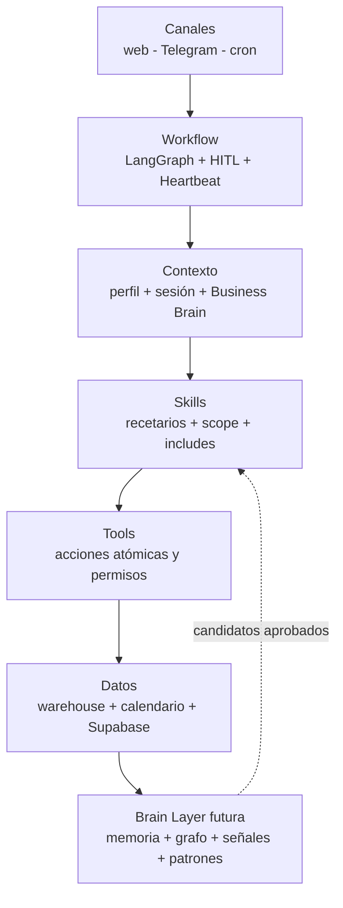
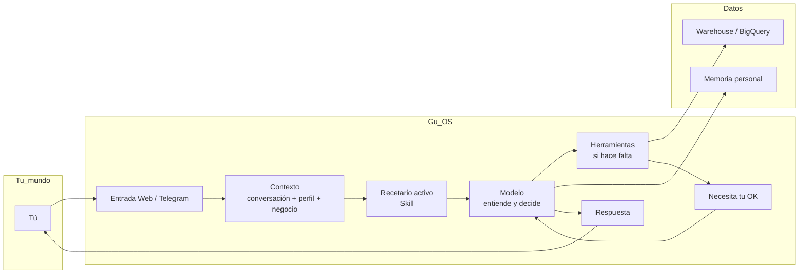
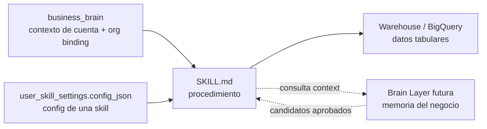
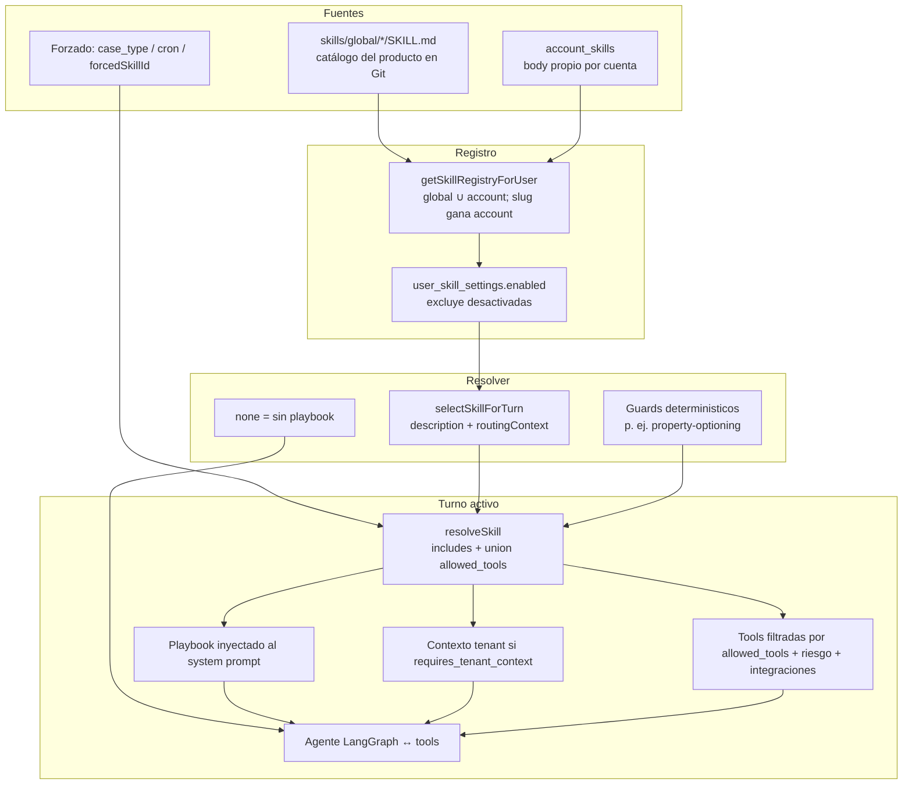
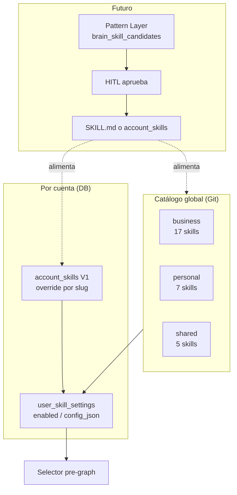
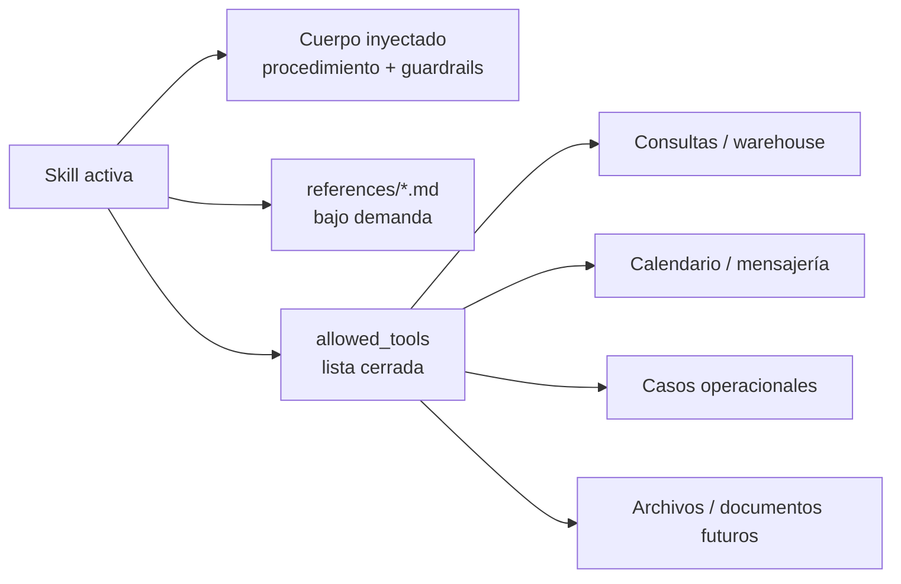
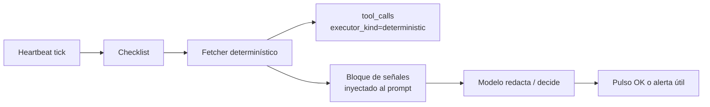

# Gu OS — Guía para entender el sistema

Este documento está pensado para **entender** Gu OS con la cabeza, no para implementar. Va en **español narrativo**: primero la idea en lenguaje accesible, y cuando ayuda, un bloque breve “**Para quien quiera el detalle**” con términos técnicos y enlaces.

Si buscas tablas, rutas de código y contratos de base de datos, usa el manual técnico: [`architecture-manual.md`](architecture-manual.md).

---

## 1. Qué estamos construyendo (en una frase)

**Gu OS es un asistente operativo**: conversa contigo, recuerda lo que conviene recordar, consulta datos del negocio cuando los tienes conectados, puede usar herramientas (calendario, consultas, archivos…) y pide tu visto bueno cuando la acción es sensible. Además puede **trabajar solo a horas fijas** o con un **pulso periódico** que revisa una lista de chequeo.

No pretendemos que “la IA piense sola” todo el tiempo. El diseño prioriza **control, trazabilidad y aciertos en el trabajo real** (ventas, seguimiento, operación) por encima de la autonomía teatral.

---

## 2. Cómo se siente usar Gu OS (historia corta)

1. Escribes por la web o por Telegram.
2. El sistema sabe **quién eres** (tu cuenta) y, si lo configuraste, **a qué organización de datos** enlazas cuando preguntas por leads, propiedades o métricas.
3. Para cada mensaje, el motor arma contexto: conversación reciente, instrucciones del producto, y si aplica un **modo de trabajo** (una *skill*).
4. Si hace falta, el asistente **llama herramientas**: por ejemplo una consulta de solo lectura al *data warehouse*, o listar tu calendario.
5. Si la acción puede borrar algo, crear algo importante o ejecutar un comando peligroso, **te pide confirmación** antes de hacerlo.
6. Algunas cosas ocurren **sin que escribas ahora mismo**: una tarea que programaste, o un “latido” que revisa pendientes según una lista que definiste.

Ese es el ciclo mental que conviene retener. Todo lo demás son piezas que explican **dónde se guarda** y **quién decide qué**.

---

## 3. Mapa del cuerpo humano de Gu OS

Imagina al agente como una persona en un puesto de trabajo:

| Pieza | En palabras simples | Analogía |
|--------|---------------------|----------|
| **Conversación activa** | Lo que acabas de decir y lo que respondió hace un momento. | La mesa de trabajo de hoy. |
| **Memoria de conversación** | Contexto reciente de una sesión: últimos mensajes cargados, resultados de herramientas, estado de ejecución y resúmenes compactados si la conversación crece. | Cuaderno de notas de la sesión, con una página nueva por turno. |
| **Memoria personal duradera** | Cosas estables sobre **ti** (estilo, preferencias, datos que quieres recordar), no sobre leads ni CRM. | Ficha “cómo trabajar con esta persona”. |
| **Cerebro de negocio (Business Brain)** | Nombre de la inmobiliaria, tono, contexto estable, y el enlace a la fuente de datos (`organization_id`, BigQuery…). | Datos de ficha de la cuenta + “con qué CRM/métricas hablamos”. |
| **Datos operativos del negocio** | Leads, propiedades, mensajes, deals… en tablas del negocio. | El archivo vivo de la operación. |
| **Skills** | Recetarios: *cómo* debe proceder el asistente en un tipo de tarea. | Manual de procedimientos por tema. |
| **Tools** | Acciones concretas que el sistema puede ejecutar (consultar, crear evento, programar tarea…). | Utensilios y trámites atómicos. |
| **Modelos (LLM)** | El “motor de lenguaje” que interpreta, redacta y elige herramientas. No es la fuente de verdad de tus datos. | Compañero que lee y escribe, pero no es el archivo ni el CRM. |
| **Tareas programadas** | “Haz esto a esta hora” o “repítelo los lunes”. | Alarmas con instrucción. |
| **Heartbeat (pulso)** | “Cada X minutos revisa esta lista y avisa si algo se sale de lo normal”. | Ronda de vigilancia con lista de chequeo. |
| **Brain Layer (futuro)** | Memoria **del negocio** estructurada (entidades, relaciones, señales, playbooks promovidos con humano en el medio). | Memoria cognitiva organizacional; no reemplaza ni el chat ni el warehouse. |

### Mapa oficial por capas

Una forma compacta de entender Gu OS es verlo como un sistema operativo de trabajo, no como una wiki personal ni como un kit local para programadores. Otros enfoques de agentes hablan de memoria, skills, hooks, subagentes o plugins; esas ideas sirven como inspiración, pero en Gu OS se reinterpretan desde las prioridades del producto: **multiusuario, datos privados, trazabilidad, permisos y operación real**.

Versión estática en PNG (mismo contenido con un poco más de detalle visual, útil fuera del Preview de Cursor): [`gu-os-operational-stack-aligned.png`](../assets/gu-os-operational-stack-aligned.png).

Para una vista complementaria más orientada a negocio/producto, ver [`gu-os-business-architecture-view.md`](gu-os-business-architecture-view.md). Para **terminología en una página** (ventas, alianzas, demos), ver [`gu-os-glossary-commercial.md`](gu-os-glossary-commercial.md).



La regla importante: **cada capa tiene un destino distinto**. Las preferencias personales no son datos de negocio; los leads no son memoria personal; una señal débil no es todavía un hecho; y un patrón de trabajo aprobado debe convertirse en skill, no esconderse en texto libre. Esta separación evita que el sistema se vuelva una mezcla confusa de notas, prompts y automatizaciones.

En lenguaje de la conversación reciente sobre arquitectura agentica: Gu OS sigue la tesis **thin harness, fat skills** — el runtime (LangGraph, tools, HITL, canales) debe orquestar sin acumular juicio de dominio; el valor vive en los **recetarios** (`SKILL.md`) y en la ejecución determinística de abajo. Nuestro harness no es “delgado” en líneas de código porque somos producto multiusuario con permisos y trazabilidad; sí lo es en responsabilidades. Detalle y matriz de alineación: [`agentic-principles-alignment.md`](agentic-principles-alignment.md).

**Readiness en dos pistas:** los **casos operacionales** multi-día se validan en Preparación operativa (N0–N5, incluido laboratorio E2E controlado). Las **skills de un turno** usan **Skill Lab** — rúbrica, evals y pruebas de integración proporcionales, sin forzar pasos ni cron. Ver [`skills-tools-architecture.md`](../skills-tools-architecture.md) §12 y [`testing-framework.md`](../operational-cases/testing-framework.md) §13.

Gu OS sí toma ideas útiles de sistemas de conocimiento personal y de agent development kits: recetarios bajo demanda, referencias progresivas, health checks, artefactos y mantenimiento del conocimiento. Pero no copia su forma literal. En un producto con clientes, permisos y operación inmobiliaria, la pregunta no es “¿podemos guardar o automatizar esto?”, sino “¿en qué capa vive, con qué evidencia, con qué permisos y con qué revisión humana si puede cambiar la realidad?”.

### Turno no es lo mismo que sesión

Esta distinción importa mucho:

| Concepto | Qué significa | Ejemplo |
|----------|---------------|---------|
| **Turno** | Una interacción puntual: el usuario manda un mensaje y el agente procesa/responde. | “¿Cuántos leads tuvimos en abril?” |
| **Sesión** | El contenedor donde se agrupan varios turnos de un canal. Puede durar varios mensajes. | Una conversación web completa, o una conversación de Telegram. |
| **Thread / checkpoint** | Estado interno que LangGraph usa para poder continuar una ejecución, sobre todo si hubo HITL. | Se pausa para pedir aprobación y luego se reanuda. |

Entonces, cuando hablamos de “memoria corta”, no significa “solo el turno actual”. Significa el contexto operativo que el runtime carga y mantiene para responder el **turno actual**, normalmente a partir de la **sesión** y del estado del grafo.

### Diagrama: de tu mensaje a la respuesta



---

## 4. Memoria: tres ideas que no deben mezclarse

### 4.1 Memoria de conversación (corto plazo)

**Idea:** la memoria corta es el contexto operativo que permite contestar el turno actual sin perder continuidad. No es exactamente “thread” como concepto de producto, aunque internamente LangGraph sí usa un `thread_id`/checkpoint para reanudar ejecuciones. Para un humano, piensa en “lo reciente de esta conversación + el estado de trabajo que el agente necesita para no perderse”.

Hoy incluye varias cosas:

| Pieza | Qué aporta |
|-------|------------|
| **Últimos mensajes de la sesión** | Para un turno normal web/Telegram se cargan hasta **12 mensajes recientes** (`getSessionMessages(..., 12)`). Esto permite entender continuaciones como “¿y en febrero?”. |
| **Estado del grafo** | LangGraph mantiene mensajes, tool calls, contador de iteraciones, canal, confirmaciones pendientes y flags como `memoryFlushPending`. |
| **Resultados de tools dentro del turno** | Si en este turno acaba de consultar calendario o BigQuery, el modelo puede usar ese resultado en el mismo loop para redactar la respuesta. Esos resultados quedan auditados en `tool_calls`, pero no se convierten automáticamente en memoria útil de largo plazo. |
| **Compaction** | Si el contexto crece mucho, el sistema limpia resultados viejos de tools y puede resumir con un modelo pequeño. |
| **Checkpoint HITL** | Si el agente pidió aprobación, el estado queda guardado para continuar donde se pausó. |

Por eso “memoria corta” no es una tabla simple ni una sola variable. Es el conjunto de contexto reciente y estado de ejecución que el runtime necesita **para este turno**.

Matiz importante sobre datos transaccionales: si `bigquery_run_query` devuelve filas de leads, mensajes, propiedades o métricas, el agente puede usarlas para responder **ahora**. En el siguiente turno normal, lo que se carga como contexto conversacional son los mensajes recientes de la sesión, no necesariamente el resultado crudo completo de la tool. Si el dato sigue siendo necesario, lo correcto es **volver a consultar la fuente operativa** o apoyarse en una capa diseñada para eso (warehouse hoy, Brain Layer futura), no congelarlo como memoria personal.

**Para quien quiera el detalle:** mensajes en sesión, grafo LangGraph, nodo de compactación. Ver [`docs/memory/short_memory_plan.md`](../memory/short_memory_plan.md).

### 4.2 Memoria personal duradera (largo plazo sobre el usuario)

**Idea:** recuerdos **sobre ti** que deben seguir siendo útiles la próxima semana: tono, formato, “soy asesor en X”, “mi contadora es…”. **No** es para guardar “el teléfono del lead Julieta” o el precio de una propiedad: eso vive en el **sistema operativo / warehouse** o, en el futuro, en la Brain Layer.

La memoria larga personal tiene tres tipos:

| Tipo | Qué significa | Ejemplo |
|------|---------------|---------|
| **Semántica (`semantic`)** | Algo relativamente estable sobre el usuario: preferencias, contexto durable, relaciones personales/profesionales. | “Es asesor inmobiliario en Mazatlán con 8 años de experiencia.” |
| **Episódica (`episodic`)** | Algo concreto que el usuario hizo o que le pasó, relevante para conversaciones futuras. | “Mudó su operación a Guadalajara en enero.” |
| **Procedural / de procedimiento personal (`procedural`)** | Cómo el usuario quiere que el agente trabaje con él. | “Prefiere respuestas cortas en bullets y tono directo.” |

La palabra **procedural** aquí puede confundir. En la memoria personal significa “preferencias de interacción con el agente”. No significa “playbooks de negocio”. Los procedimientos del negocio, como “cuando un lead expresa preocupación por financiamiento, mandar cierto material”, pertenecen a **Skills** o, futuro, a `brain_skill_candidates -> SKILL.md`, no a `memories.type='procedural'`.

**Para quien quiera el detalle:** tabla `memories`, extracción e inyección, curación con la skill `memory-curate`. Ver [`docs/memory/long_term_memory_plan.md`](../memory/long_term_memory_plan.md).

### 4.3 Datos del negocio (operación real)

**Idea:** leads, citas, inventario, mensajes masivos… **no** son “recuerdos del usuario”. Se consultan con herramientas sobre datos **estructurados** (hoy principalmente BigQuery que replica lo que ya tienes en Firebase/Mongo).

**Para quien quiera el detalle:** skill `company-data`, tool `bigquery_run_query`, `business_brain` y [`docs/env-bigquery-setup.md`](../env-bigquery-setup.md).

---

## 5. Skills — el corazón de “cómo trabajamos”

Esta sección responde a tu duda central: **qué enfoque tenemos hoy** y **cómo distinguir tipos de skills**, incluyendo global vs por usuario y la cruz con negocio / personal / compartido.

### 5.1 Metáfora que sí aguanta el producto

- **Skill** = *recetario* (procedimiento): “cuando pase X, haz Y con estas reglas de seguridad y este estilo de respuesta”.
- **Tool** = *utensilio* atómico: “ejecuta esta consulta”, “crea este evento”, “lista estas memorias”.

Un mismo recetario puede usar varios utensilios; el recetario **ordena y acota** para no hacer locuras.

### 5.2 Dos dimensiones que **no** son la misma (muy importante)

Confundirlas es la fuente típica de malentendidos al diseñar Business Brain y la futura Brain Layer.

| Dimensión | Pregunta que responde | Ejemplos |
|-----------|------------------------|----------|
| **A. Origen / catálogo** | ¿De dónde sale el **texto** del recetario y quién puede verlo? | “Catálogo global del producto” vs “recetario solo de esta cuenta o de esta organización”. |
| **B. Ámbito del trabajo (`scope`)** | ¿Para qué **tipo de vida laboral** es útil el recetario? | Negocio inmobiliario, vida personal del usuario, o ambos (*shared*). |

**`scope` no significa “global”** en el sentido de *todos los usuarios del planeta*. En el código hoy `scope` es una etiqueta de **producto**: `business`, `personal` o `shared`. El catálogo puede ser global aunque el `scope` sea `personal` (un recetario global que cualquier usuario puede activar para su vida personal).

### 5.3 Cómo está hoy (V1 / V1.5): catálogo global + preferencias por cuenta

**Hecho clave:** el **cuerpo** de casi todas las skills vive en el repositorio del producto, bajo `skills/global/<nombre>/SKILL.md`. Eso es lo que llamamos **catálogo global** (en el sentido de “viene con Gu OS”, versionado en Git, igual para todos los despliegues).

**Por cuenta de usuario** hoy guardamos en base de datos:

- si la skill está **activada o no** (`user_skill_settings.enabled`);
- opcionalmente **configuración** en JSON (`user_skill_settings.config_json`) — colores de marca, variantes, etc.

Si **no hay** filas de configuración, el comportamiento actual del runtime es tratar como candidatas **todas** las skills del registro global. Si existen preferencias, se **excluyen** las que el usuario desactivó explícitamente (`enabled: false`).

**Qué todavía no existe como motor de primera clase:** tablas tipo “esta organización tiene sus propios archivos SKILL.md en base de datos” como fuente de verdad del texto completo. Eso está en el roadmap como **V2 `account_skills`** (borradores, versiones, QA). Hoy la forma de “personalizar sin abrir Git” es **skill global + datos en `business_brain` o `config_json`**, no reescribir todo el manual a mano en la UI.

> **Update — `account_skills` V1 ya implementado (Opción B mínima).** Existe la tabla `account_skills` (slug, body_md, metadata_jsonb, status, version) con RLS por `user_id`. El runtime de skills (`getSkillRegistryForUser`) compone `account_skills(status='active') ∪ skills/global/*` y, en colisión por slug, **gana la account**. Hay UI mínima en Ajustes (`/settings/account-skills`) con textarea + frontmatter y validación Zod idéntica a la de skills globales. Lo que **todavía** queda fuera del V1: versionado completo con rollback, draft/review/active/archived, compartir entre cuentas de la misma organización, editor con preview y QA pre-publicación. Esa evolución está documentada en [`docs/operational-cases/future-considerations.md`](../operational-cases/future-considerations.md) sección 6.

### 5.4 Matriz mental: catálogo vs ámbito (`scope`)

Lee la tabla así: **filas** = de dónde sale el recetario; **columnas** = para qué clase de trabajo sirve.

|  Ámbito → <br> Origen ↓ | **Business** <br>*(métricas, leads, CRM, reporting)* | **Personal** <br>*(agenda, hábitos, preferencias del usuario)* | **Shared** <br>*(puede servir en ambos mundos)* |
|---------------------------|------------------------------------------------------|----------------------------------------------------------|-------------------------------------------|
| **Global del producto** <br>*(hoy: archivos en repo)* | **Hoy.** Ej.: `company-data`, `business-data-core`, skills “watch” de leads/inventario. Vive en `skills/global/*/SKILL.md`; se puede activar/desactivar por usuario con `user_skill_settings`. | **Hoy.** Ej.: `personal-day-briefing`, `memory-curate`, `family-reminders`. También vive en `skills/global/*/SKILL.md`; el `scope` solo dice que es personal. | **Hoy / según skill.** Ej.: redacción, coautoría, futuras file skills. Vive en `skills/global/*/SKILL.md`; sigue aislada por usuario/tenant en datos. |
| **Configurado por usuario/cuenta** <br>*(hoy: misma skill global + valores propios)* | **Hoy parcial.** Ej.: `company-data` usa `business_brain` para `organization_id`; `brand-kit` puede leer marca/voz desde `business_brain` o `config_json`. | **Hoy parcial.** Una skill personal global puede usar preferencias en `memories`, perfil o `user_skill_settings.config_json`. | **Hoy parcial.** Una skill shared global puede tener configuración por cuenta si su diseño lo soporta. |
| **Propia de usuario / organización** <br>*(texto del playbook propio)* | **Roadmap V2+.** `account_skills` o equivalente: playbooks privados por cliente/org, con draft/active/versioning. | **Debe estar contemplado en V2+.** Skills personales propias del usuario: rutinas familiares, viajes, salud, trámites, checklist de escuela, etc. No son “negocio”, pero son parte real del día a día del usuario. | **Roadmap V2+.** Skills propias reutilizables en varios contextos, con permisos claros. |
| **Mineada / sugerida por Brain Layer o Pattern Layer** <br>*(futuro: patrón observado → HITL → skill)* | **Futuro post-MVP.** `brain_skill_candidates` captura patrones operacionales; humano aprueba; se promueve a SKILL.md. | **Posible, pero con más cuidado.** El sistema podría sugerir una rutina personal a partir de patrones del usuario, pero nunca asumirla como “mejor práctica” sin aprobación. | Posible, pero solo con gobierno fuerte y HITL. |

La celda inferior (“mina + promoción”) enlaza con el plan G Brain / Brain Layer: **Operational/Playbook knowledge** no debe volcarse ciegamente a “memoria libre”; el camino previsto es **candidato → humano aprueba → recetario ejecutable**.

En resumen:

- **Global + business** ya existe como patrón: skill en repo, por ejemplo `company-data`.
- **Global + personal** ya existe: skill en repo, por ejemplo `personal-day-briefing`.
- **Global + shared** ya existe si una skill declara `scope: shared`.
- **User/account + business/personal/shared** como **texto propio del playbook** todavía no existe como runtime completo; está previsto como `account_skills` o equivalente. Esto debe incluir tanto playbooks de negocio como **procedimientos personales propios**.
- **Configuración por usuario** sí existe hoy, pero no es lo mismo que “skill propia”: `user_skill_settings.config_json` cambia valores/comportamiento de una skill global; no reemplaza el archivo `SKILL.md`.

Ejemplos de skills personales propias que deberíamos dejar espacio para soportar:

- **Recoger hijos de la escuela:** revisar calendario, estimar salida, recordar mochila/lunch/documentos, bloquear una ventana de traslado, preparar mensaje si va tarde.
- **Rutina antes de visita médica:** revisar cita, preparar lista de síntomas/preguntas, recordar documentos, confirmar transporte.
- **Viaje familiar corto:** checklist de documentos, clima, equipaje mínimo, eventos de calendario y pendientes antes de salir.
- **Cierre del día personal:** revisar calendario de mañana, tareas personales, compromisos familiares y recordatorios no laborales.

Esto es importante porque Gu OS no busca ayudar solo a “la empresa”; busca ayudar al profesional inmobiliario que vive mezclando operación, clientes, familia y administración personal. Por eso V2 no debería limitar `account_skills` a negocio/organización. El modelo correcto es permitir **skills propias personales**, **skills propias de negocio** y **skills propias compartidas**, con permisos y datos claramente separados.

### 5.5 Enfoque actual de selección (una skill dominante por turno)

**Idea narrativa:** en cada mensaje, un **clasificador pequeño** (modelo barato) lee solo los **títulos y descripciones** de las skills disponibles y elige **como mucho una** que encaje con la intención del usuario. Si nada encaja con claridad, elige **ninguna** (`none`): el asistente sigue funcionando con herramientas generales.

**Por qué así:** acota permisos (solo las herramientas permitidas por esa skill), baja confusión y deja **trazabilidad** (“este turno era de datos de empresa”).

**Excepción elegante — recetarios compuestos:** una skill puede **incluir** otra vía `includes` (por ejemplo `company-data` incluye `business-data-core`). Sigue siendo **una** elección de “skill de cabecera”; por dentro trae capas.

**Progressive disclosure:** el cuerpo largo no se mete todo en el chat; el modelo puede pedir trozos con `read_skill_reference` cuando hace falta.

**Para quien quiera el detalle:** [`docs/tools-design/skill-routing.md`](../tools-design/skill-routing.md) y el roadmap [`docs/business-brain-evolution-roadmap.md`](../business-brain-evolution-roadmap.md).

### 5.6 “Compartido” (`shared`) vs negocio vs personal

- **`business`:** el usuario espera respuestas ancladas en **operación inmobiliaria** (y suele exigir contexto de inmobiliaria / `organization_id` vía Business Brain).
- **`personal`:** el foco es la **persona** (tiempo, estilo, familia, hábitos), sin mezclar con filas del CRM salvo que tú lo pidas explícitamente en otro flujo.
- **`shared`:** etiqueta de producto para cosas que **sirven en los dos mundos** o que no quieres encasillar en un solo estante en Ajustes. **No** implica “datos públicos entre organizaciones”; el aislamiento sigue siendo por **cuenta de usuario** y, cuando aplica, por **tenant** en consultas.

Si en el futuro una organización tiene skills propias (V2/V3), una skill `shared` podría ser **de la org** o **del usuario** según el modelo de permisos; hoy el texto sigue siendo global y los datos específicos van en `business_brain` / `config_json`.

### 5.7 Cómo encaja esto con Business Brain y con G Brain / Brain Layer

- **Business Brain (hoy):** es la “ficha enriquecida” de la cuenta: identidad del agente, voz, notas de negocio, checklist de Heartbeat, **enlace al warehouse** (`organization_id`, datasets…). Alimenta sobre todo skills **`business`** (`requires_tenant_context`, consultas parametrizadas). No sustituye a un recetario: **define el contexto** sobre el que operan los recetarios.
- **Brain Layer (plan, inspirado en ideas de G Brain):** piensa principalmente en **memoria operacional del negocio** (entidades, timeline, relaciones fuertes, señales débiles) y en **candidatos de playbooks** antes de convertirse en skills. La regla de oro del plan: **promoción con humano en el medio** (señal → memoria; patrón → skill). Eso evita que “lo que el sistema cree que hacemos” se vuelva ley sin revisión.
- **Personal Pattern Layer (posible extensión futura):** si más adelante queremos que el sistema sugiera skills personales propias (por ejemplo rutinas familiares o checklists personales recurrentes), conviene modelarlo como un flujo hermano de `brain_skill_candidates`, no como memoria larga personal automática. Es decir: observación → candidato → aprobación humana → skill personal, nunca “observé algo una vez y ya lo ejecuto”.

En una frase: **Business Brain contextualiza**; **skills proceduralizan**; **Brain Layer (futuro) acumula y gobierna conocimiento del negocio** sin meterlo todo en una sola caja llamada “memoria”.

### 5.8 `business_brain` vs `user_skill_settings.config_json` vs Brain Layer

Estas tres cosas suenan parecidas porque todas “configuran” al agente, pero tienen responsabilidades distintas.

| Pieza | Qué guarda | Nivel actual | Ejemplo | No debe usarse para |
|-------|------------|--------------|---------|---------------------|
| `profiles.business_brain` | Contexto estable de la cuenta/perfil: identidad del agente, voz, notas de negocio, `organization_id`, warehouse, checklist de Heartbeat. | Hoy es por **usuario/cuenta** (`profiles.id`) y apunta hacia una organización **externa** por `organization_id`. Desde la migración `00080` sí existe una tabla `organizations` nativa de Gu OS con membresías, pero es un eje aparte: `business_brain` no se movió a ella. | `organization_id`, `org_name`, tono de marca, mercados, checklist de pulso. | Guardar el cuerpo completo de todas las skills propias. |
| `user_skill_settings.config_json` | Configuración de una skill específica para ese usuario/cuenta. | Por **usuario + skill_id**. | Para `brand-kit`: colores, assets, variantes. Para otra skill: umbrales o defaults. | Guardar conocimiento general del negocio o datos tabulares. |
| Brain Layer futura | Conocimiento operacional del negocio: entidades, timeline, relaciones, señales y candidatos de playbook. | En el plan v1.4 inicia como capas `brain_*`; el modelo organizacional más completo vendrá después. | `lead/julieta`, `lead -> interested_in -> property`, `financing_concern`, `brain_skill_candidates`. | Reemplazar `business_brain` como configuración de cuenta o reemplazar BigQuery como warehouse. |

Relación práctica:



¿Cambiará algo con el nuevo Brain Layer? En principio **no se fusiona todo**. El diseño sano es mantener:

- `business_brain` como **configuración/contexto editable de la cuenta**.
- `user_skill_settings.config_json` como **configuración puntual de una skill**.
- Brain Layer como **memoria operacional del negocio** y, más adelante, fuente de candidatos para nuevas skills.

Lo que sí puede cambiar en el futuro es el **nivel de ownership**: hoy casi todo cuelga de `user_id`. `organizations` + memberships **ya existen** (`00080`) y gobiernan el plano de Organización, pero `business_brain`, Brain Layer y las skills propias **todavía no** se movieron ahí. Que el substrato exista no es lo mismo que haber migrado el ownership.

### 5.9 Diagrama del ecosistema de skills

Esta subsección resume en un solo lugar lo que §5.1–5.8 explica en prosa: **de dónde salen los recetarios**, **cómo se elige uno por turno**, **cómo se componen** y **a qué tools pueden tocar**.

#### 5.9.1 De catálogo a ejecución (un turno)



**Lectura rápida:** el usuario (o el cron) no “elige skill” a mano en cada turno. El **resolver** lee metadata (`description`, continuidad, canal) y activa **como mucho una skill dominante**. Si no encaja ninguna, el agente sigue con tools generales (`none`).

#### 5.9.2 Árbol de composición: skill user-facing → includes → references → tools

No todas las skills son iguales. Tres roles habituales:

| Rol | Qué es | Ejemplo en repo |
|-----|--------|-----------------|
| **User-facing** | Resuelve una intención del usuario | `company-data`, `property-optioning-coach` |
| **Core / referencia** | Biblioteca incluida; no suele elegirse sola | `business-data-core` |
| **Atómica operativa** | Un paso de un workflow mayor | `perform-comparable-analysis` |

**Ejemplo A — datos de negocio (dominio + referencias):**

```text
company-data                          ← user-facing (selector elige esta)
├── includes: business-data-core      ← canon warehouse (joins, glossary, reglas)
│   └── references/                   ← progressive disclosure bajo demanda
│       ├── schema.md
│       ├── joins.md
│       ├── fewshots-leads.md
│       └── fewshots-messages.md
└── allowed_tools:
    ├── bigquery_run_query
    └── read_skill_reference
```

**Ejemplo B — workflow compuesto (coach + sub-skills):**

```text
property-optioning-coach              ← user-facing / case binding
├── includes:
│   ├── request-property-documents
│   ├── extract-property-characteristics
│   ├── perform-comparable-analysis
│   ├── prepare-listing-price
│   ├── prepare-commission-contract
│   ├── request-property-photos
│   └── publish-listing-package
├── requires_tenant_context: true
├── guardrails: HITL en decisiones comerciales
└── allowed_tools: operational_case_*, BigQuery, EasyBroker, calendario, …
```

**Ejemplo C — skill de referencia sola (no user-facing):**

```text
business-data-core                    ← no es destino típico del selector
├── scope: business
├── allowed_tools: []                 ← no ejecuta; documenta
└── references/                       ← la skill hija (company-data) las carga
```

Regla práctica: antes de crear una micro-skill nueva, preguntar si basta un archivo en `references/` dentro de una skill de dominio existente (ver [`skill-routing.md`](../tools-design/skill-routing.md)).

#### 5.9.3 Catálogo global por `scope` (orientativo)

Hoy hay **29** skills globales en `skills/global/`. El `scope` etiqueta el **tipo de trabajo**, no quién es dueño del archivo (todos viven en Git).

| `scope` | Para qué sirve | Ejemplos representativos |
|---------|----------------|--------------------------|
| **business** | Operación inmobiliaria, CRM, captación, watches operativos | `company-data`, `property-optioning-coach`, `lead-follow-up-draft`, `*-watch` de leads/inventario/visitas |
| **personal** | Vida y rutinas del usuario operador | `personal-day-briefing`, `memory-curate`, `family-reminders`, `travel-prep`, `errand-planner` |
| **shared** | Útil en negocio y personal, o transversal | `compose-message`, `brand-kit`, `doc-coauthoring`, `skill-authoring`, `pending-approval-watch` |



#### 5.9.4 Progressive disclosure y tools

Cuando una skill está activa, el modelo recibe el **cuerpo compuesto** (root + `includes`, con tope de tokens). Los trozos largos viven en `references/` y se cargan con `read_skill_reference` solo cuando hace falta.



Si una tool no está en `allowed_tools` de la skill activa, el runtime no la expone al modelo en ese turno (salvo el caso `none`, donde aplican solo gates normales de usuario e integraciones).

**Para profundizar:** [`skills-tools-architecture.md`](../skills-tools-architecture.md) §4.1 (skill vs code), [`agentic-principles-alignment.md`](agentic-principles-alignment.md) (thin harness / fat skills).

### 5.10 ¿Está alineado el roadmap de Business Brain con el plan Brain Layer?

Sí, pero cumplen roles distintos:

| Documento | Qué cubre | Estado |
|-----------|-----------|--------|
| `business-brain-evolution-roadmap.md` | Evolución del agente actual: skills, skill registry, `business_brain`, Heartbeat, BigQuery, UI, futuro `account_skills`, futuro `organizations`. Incluye **Inspiration 2: Karpathy LLM Wiki** ([gist oficial](https://gist.github.com/karpathy/442a6bf555914893e9891c11519de94f)). | Es el roadmap del sistema existente. |
| `brain/gbrain-evaluation-and-plan.md` | Nueva Brain Layer inspirada en G Brain: Ingestion, Memory, Graph, Signal, Pattern, Skill, Workflow. Genealogía Karpathy → G Brain → Gu OS en §1.1. | Es el plan para agregar memoria/cognición operacional del negocio. |
| `manuals/agentic-principles-alignment.md` | Ensayos GStack (Thin Harness / Homebrew) mapeados a Gu OS: matriz de alineación, skill vs code, qué no copiar. | Referencia filosófica transversal; no sustituye al plan Brain. |

La conexión entre las tres fuentes de inspiración externa:

- **Karpathy LLM Wiki** — *qué* tipo de memoria (compilar wiki persistente, no RAG efímero); triada Ingest / Query / Lint.
- **G Brain** — *cómo* productizar ese patrón (compiled truth, dream cycle, hybrid search, `think`).
- **GStack / ensayos Garry Tan** — *cómo* empaquetar capacidades (thin harness, fat skills, skill development cycle).

La conexión clave es esta:

- El roadmap actual ya tiene **Skill Layer** y **Workflow Layer**.
- El plan Brain Layer agrega capas nuevas de **Ingestion, Memory, Graph, Signal y Pattern**.
- La capa **Pattern** (`brain_skill_candidates`) alimentaría en el futuro a la capa **Skill**.
- Hoy las skills ejecutables nacen sobre todo de **`SKILL.md` globales** y de **`account_skills` V1** (override por cuenta); el versionado completo y la promoción automática desde Pattern siguen en roadmap.

Entonces: no es obligatorio tener **`account_skills` V2** (versionado, QA, org sharing) **antes** de las primeras fases de Brain Layer (`brain_pages`, `brain_links`, `brain_signals`), pero sí conviene decidir antes de automatizar bien **Pattern → Skill** dónde materializar una skill aprobada: archivo en repo, fila en `account_skills`, o ambos.

---

## 6. Herramientas (tools) y cuándo pide permiso

**Idea:** cada herramienta tiene un **nivel de riesgo**. Las de solo lectura suelen ser libres; las que borran, escriben o ejecutan comandos en el servidor **disparan una tarjeta de confirmación** (en web o Telegram). Así se evita que un modelo “de prisa” haga daño.

Las tareas **programadas** son un caso especial: tú apruebas **una vez** al programar la tarea; cuando suena la alarma, el sistema puede ejecutar herramientas internas sin pedirte otra vez (porque no estarías ahí). Ahí el producto confía en que la **instrucción guardada** fue la correcta.

---

## 7. Pulso (Heartbeat) vs tarea programada

|  | **Tarea programada** | **Heartbeat** |
|--|----------------------|---------------|
| **Piensa en** | “Haz *exactamente esto* a *esta hora*” | “Cada X tiempo, *revisa esta lista* y avisa si algo importante pasa” |
| **Quién manda el guion** | Tú (o el asistente contigo) | Una **lista de chequeo** en tu perfil + plantillas del producto |
| **Riesgo** | Depende de lo que pidas | Por defecto más **conservador**, enfoque lectura |

### Fetcher / prefetcher determinístico

Heartbeat tiene una pieza importante que no conviene ocultar: el **fetcher determinístico** (en el código se llama *deterministic prefetcher*).

**Idea simple:** para ciertas señales, no queremos depender de que el LLM “se le ocurra” consultar la herramienta correcta. Si una reunión empieza en 30 minutos, el sistema puede leer calendario **antes** de llamar al modelo, registrar esa lectura y pasarle al modelo el resultado ya preparado.

Flujo:



Hoy los prefetchers implementados son:

| Kind | Tool equivalente | Para qué sirve |
|------|------------------|----------------|
| `calendar_events` | `calendar_list_events` | Reuniones próximas o ya en curso. |
| `calendar_tasks` | `calendar_list_tasks` | Tareas de Google Calendar/Tasks próximas. |

En la UI, estas lecturas aparecen junto a otras tools, pero marcadas como **Determinístico** en vez de **IA**. Eso da trazabilidad: sabes si algo lo decidió consultar el modelo o si el sistema lo leyó por regla antes de invocar al modelo.

Esto es distinto a una tool normal:

- **Tool normal:** el LLM decide llamarla.
- **Fetcher determinístico:** el sistema la llama antes, por una regla/checklist, para no perder señales importantes.

---

## 7b. Casos operacionales (procedimientos multi-día con esperas humanas)

Hay un tercer modo, distinto al chat normal y al pulso/Heartbeat:
**procedimientos que duran días o semanas y dependen de personas externas
que tienen que responder**. El ejemplo canónico de Alebrixe es **opcionar
una propiedad**:

1. Hablas con el dueño y le pides documentos.
2. Esperas (puede tardar días).
3. Cuando llega el predial, lo procesas, haces análisis comparativo con
   propiedades similares, propones precio.
4. Esperas que el dueño confirme.
5. Generas un contrato de comisión con plantilla, lo mandas firmar.
6. Coordinas sesión de fotos.
7. Subes el paquete a portales (EasyBroker, Ungga; otros como Inmuebles24
   se entregan listos para subida manual).

Esto **no cabe** ni en un turno de chat (porque hay esperas de días) ni en
Heartbeat (porque cada caso es una instancia con estado propio, no una
checklist global). Para eso existe el subsistema de **casos operacionales**.

**Idea simple:** cada caso es un **expediente vivo** (`operational_cases`)
con un tipo (`case_type`, p.ej. `property_optioning`), un estado
(`active|waiting_external|paused|completed|failed`), un paso actual y un
contexto JSON. Su **historia completa** se guarda en
`operational_case_events` (append-only: nada se borra ni edita). Un cron
escanea casos vencidos y se los entrega al agente atando directamente la
skill correcta (sin pasar por el selector libre).

¿Cómo se cierra el bucle con el dueño? Hoy por **Telegram**: si un dueño
responde al bot, el webhook detecta a qué caso pertenece esa conversación,
escribe el evento `external_response` y dispara procesamiento inmediato.
Mañana puede ser WhatsApp con la misma forma del subsistema (el conector
está aislado en una tool).

¿Cómo se entera el inmobiliario de que algo necesita su atención? Por
`notify_user`, que elige canal según preferencia del usuario (web cuando
está activo; Telegram cuando no). Y para acciones de juicio comercial
(precio mínimo / propuesta de precio, contrato final) **siempre pide
HITL**: el agente prepara la muestra de comparables automáticamente y el
humano aprueba el precio resultante, no elige filas individuales.

Este subsistema convive con Heartbeat y tareas programadas; cada uno
resuelve un problema distinto:

| Modo | Cuándo aplica | Quién decide cuándo correr | Estado vive en |
|---|---|---|---|
| **Chat / turno** | "ahora respóndeme X" | El usuario al escribir | `agent_messages` |
| **Tarea programada** | "haz Y exactamente a las 9 del lunes" | El usuario al programarla | `scheduled_tasks` |
| **Heartbeat** | "cada hora revisa esta checklist" | El sistema, por intervalo | `heartbeat_runs` |
| **Caso operacional** | "este expediente avanza según vence o cuando responda el externo" | El cron por `next_action_at` o el webhook | `operational_cases` + `operational_case_events` |

Para la guía técnica completa: ver
[`docs/operational-cases/architecture.md`](../operational-cases/architecture.md)
y [`docs/operational-cases/plan.md`](../operational-cases/plan.md).

---

## 8. Organización, `super-admin`, `vendedor` y el `organization_id`

**Fuera de Gu OS** tu sistema operativo ya distingue roles (`super-admin`, `vendedor`) y agrupa usuarios con `organization_id` / `org_name` en tablas como `users_light` en Firebase/BigQuery.

**Dentro de Gu OS hoy** la sesión y la memoria personal van **por usuario** (tu login). Lo que **ata** las preguntas de negocio a **tu inmobiliaria** es lo que configuraste en **Business Brain** / Ajustes: el `organization_id` que deben usar las consultas al warehouse. La visión de producto es **un solo login** y que ese enlace sea **automático**, pero eso es evolución de integración.

Personal interna (Ungga) puede tener modo especial para ver varias organizaciones en consultas; eso es **política explícita**, no algo que el modelo “adivine”.

---

## 9. Qué leer después (según tu rol)

| Si eres… | Empieza por… |
|----------|----------------|
| Producto / negocio | Secciones 1–8 de este documento; [`gu-os-glossary-commercial.md`](gu-os-glossary-commercial.md) para demos; resumen del roadmap en [`business-brain-evolution-roadmap.md`](../business-brain-evolution-roadmap.md). |
| Diseño de skills / operación | Sección 5 de este documento (especialmente §5.9 diagrama) + `company-data` / `memory-curate` en `skills/global/`. |
| Ingeniería | [`architecture-manual.md`](architecture-manual.md) + [`architecture.md`](../architecture.md). |
| Brain Layer / G Brain | [`docs/brain/gbrain-evaluation-and-plan.md`](../brain/gbrain-evaluation-and-plan.md) (plan, no guía divulgativa). §1.1 = genealogía Karpathy LLM Wiki. |
| Patrón LLM Wiki (Karpathy) | [Gist oficial](https://gist.github.com/karpathy/442a6bf555914893e9891c11519de94f) + [`business-brain-evolution-roadmap.md`](../business-brain-evolution-roadmap.md) Inspiration 2. |
| Principios agenticos (GStack / alineación) | [`agentic-principles-alignment.md`](agentic-principles-alignment.md) — ensayos Garry Tan mapeados a Gu OS. |
| Glosario comercial (una página) | [`gu-os-glossary-commercial.md`](gu-os-glossary-commercial.md) — términos para ventas, alianzas y demos. |

---

## 10. Preguntas abiertas (normales a esta altura)

- **¿Cuándo las skills serán “de la organización” compartidas por varios usuarios sin duplicar config?** Depende de **organizaciones + membresías** en base de datos (roadmap V3). Para texto propio por cuenta ya hay `account_skills` V1 (mínimo viable: tabla + UI + override en runtime); compartir entre cuentas de la misma organización sigue siendo V3.
- **¿Las skills propias V2 deben ser solo de negocio?** No. Deben admitir por diseño `business`, `personal` y `shared`, porque el usuario real mezcla trabajo inmobiliario con vida personal. La diferencia debe estar en permisos, fuentes de datos y visibilidad, no en prohibir skills personales propias.
- **¿Un mismo usuario podrá estar en varias organizaciones?** Hoy el producto piensa **una** organización por usuario en el binding de negocio; multi-org es decisión futura.
- **¿La Brain Layer reemplaza al warehouse?** No: el warehouse sigue siendo la **verdad tabular**; la Brain Layer suma **capa cognitiva y operacional** (páginas, relaciones, señales, playbooks promovidos).
- **¿Hay que implementar `account_skills` antes de Brain Layer?** No el V2 completo para las primeras capas (`brain_pages`, `brain_links`, `brain_signals`). El V1 mínimo ya existe. Sí hay que cerrar el modelo de materialización antes de automatizar bien la promoción `Pattern -> Skill`.

Para demos comerciales y onboarding ejecutivo, usar [`gu-os-glossary-commercial.md`](gu-os-glossary-commercial.md).
