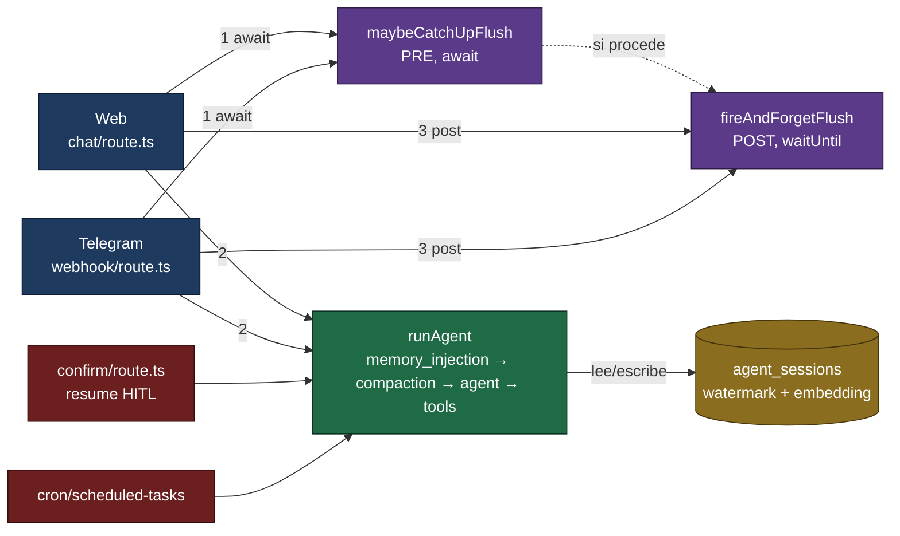
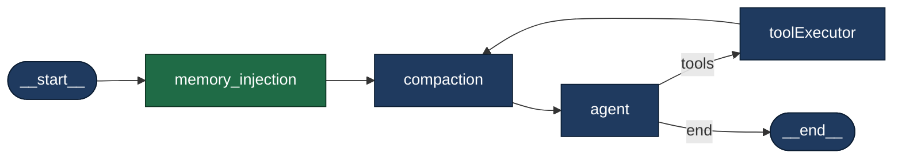
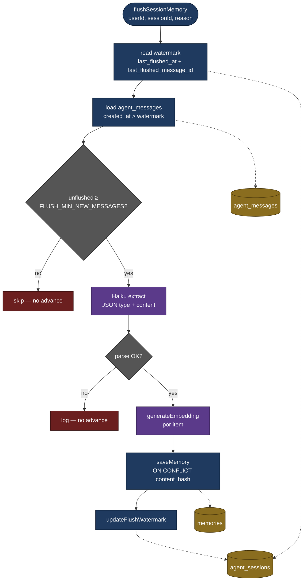

# Plan — Memoria de largo plazo

> **Estado:** **Implementado y conectado** (Web + Telegram). Los `todos` del frontmatter quedaron marcados `completed` porque cada uno es verificable en código: migración [`00005_memories.sql`](../../packages/db/supabase/migrations/00005_memories.sql) (tabla `memories`, RLS, RPC `match_memories`, watermark en `agent_sessions`), [`packages/db/src/queries/memories.ts`](../../packages/db/src/queries/memories.ts), `getFlushState` / `updateFlushWatermark` / `updateLastUserInputEmbedding` en [`packages/db/src/queries/sessions.ts`](../../packages/db/src/queries/sessions.ts), [`packages/agent/src/embeddings.ts`](../../packages/agent/src/embeddings.ts), [`nodes/memory_injection_node.ts`](../../packages/agent/src/nodes/memory_injection_node.ts), [`memory_flush.ts`](../../packages/agent/src/memory_flush.ts), `memoryFlushPending` en [`state.ts`](../../packages/agent/src/state.ts), el cableado del grafo en [`graph.ts`](../../packages/agent/src/graph.ts) y los disparadores de [`apps/web/src/lib/memory/trigger.ts`](../../apps/web/src/lib/memory/trigger.ts) usados por `/api/chat` y el webhook de Telegram. **Cron y resume HITL son no-op**; **Heartbeat** usa la excepción curada descrita abajo.
>
> **Este documento sigue siendo un plan**, no la autoridad de runtime: para lo que corre hoy manda el código y [`docs/architecture.md`](../architecture.md); lo que aquí aparece como *roadmap v2* o *futuro* no está implementado.

Este documento describe el **diseño y la implementación** de la memoria de largo plazo. El bloque siguiente es el **prompt original** usado para generar un primer borrador; se conserva por contexto, pero si entra en conflicto con las secciones posteriores, **prevalece lo documentado bajo *Diseño vigente***. Esa es la misma convención que usa `docs/memory/short_memory_plan.md`.

> **Qué NO es esta memoria.** No confundir con: **memoria corta / compaction** (ventana del turno — [`short_memory_plan.md`](./short_memory_plan.md)); **checkpointer / continuidad HITL** (estado del grafo por `thread_id`, tablas `checkpoints*`); **estado operacional de Cases / Work** (lo que está pasando en el negocio); ni **Business Brain / conocimiento organizacional** (lo que la organización sabe — [`../brain/gbrain-evaluation-and-plan.md`](../brain/gbrain-evaluation-and-plan.md)). Esta memoria guarda hechos duraderos **sobre el usuario operador**, tipados `episodic` / `semantic` / `procedural`, extraídos por flush y recuperados por embedding + inyección.

> **Plan complementario**: para curación de hechos ya guardados (UI + skill `memory-curate`), endurecimiento del extractor frente a datos transaccionales de negocio, y TTL/decay con HITL, ver [`memory_curation_plan.md`](./memory_curation_plan.md). La curación y el extractor endurecido **ya están reflejados en código**; el estado detallado y los próximos pasos del roadmap están en ese archivo. Ese documento NO reemplaza este plan; aborda problemas detectados en producción tras la implementación inicial.

## Prompt original (referencia histórica)

**Objetivo**

Agregar memoria a largo plazo al agente: extracción de recuerdos al final de cada sesión e inyección de recuerdos relevantes al inicio de la siguiente. El sistema usa Supabase, donde ya existen tablas de mensajes y perfil de usuario.

**Insights clave**

- Dos procesos completamente separados: extracción (post-sesión, asíncrono) y recuperación (inicio de sesión, síncrono). No se mezclan.
- Tres tipos de memoria con clasificación explícita: `episodic` (qué hizo y cuándo), `semantic` (preferencias y conocimiento durable), `procedural` (cómo opera, sus rutinas).
- El prompt de extracción es conservador: solo extrae lo que seguirá siendo verdad en la próxima sesión. Nada trivial, nada de conversación de relleno. Si no hay nada relevante, no escribe nada.
- La recuperación es enfocada, no total: buscar por similitud semántica al input actual, retornar máximo 5–8 recuerdos. Inyectar todo el baúl sería Context Rot otra vez.
- Score de relevancia: cada recuerdo tiene un campo `retrieval_count`. Cada vez que se recupera, sube. Los recuerdos con score bajo se archivan eventualmente.
- Búsqueda con pgvector: Supabase tiene `pgvector` nativo. Embeddings al momento de guardar; búsqueda por cosine similarity.

**Lo que hay que construir (según el prompt original)**

1. Tabla `memories` en Supabase.
2. `memory_flush.ts` — extracción post-sesión con Haiku.
3. `memory_injection_node.ts` — nuevo nodo en el grafo.
4. Actualizar el grafo: `__start__ → memory_injection → compaction → agent → tools → compaction → ...`.

**Lo que NO se toca:** `compaction_node`, `agent_node`, `toolExecutorNode`, HITL, checkpointer, `iterationCount`.

## Notas de alineación con el código actual

Al validar el prompt contra `graph.ts`, `state.ts`, `compaction_node.ts`, `chat/route.ts` y `telegram/webhook/route.ts` se identificaron estas desviaciones; el **diseño vigente** las resuelve:

1. El `SystemMessage` efectivo del grafo se construye desde `effectiveSystemPrompt` (variable local en `runAgent`) **antes** de entrar al grafo. Escribir `state.systemPrompt` dentro de un nodo **no** altera el `SystemMessage` ya en `state.messages`. El nodo de inyección debe reescribir el **primer `SystemMessage`** en `state.messages` conservando su `id` (swap in-place vía `messagesStateReducer`), anteponiendo el bloque de memoria y preservando íntegro el contenido original del prompt.
2. `runAgent` entra con historia previa (hasta 12 mensajes de `getSessionMessages`) antes de la `HumanMessage` actual. El “input actual” es el **último** `HumanMessage` del estado, no el primero.
3. Compaction preserva el primer `SystemMessage` por `id`. Si el nodo **añadiera** un segundo `SystemMessage`, este quedaría fuera de `keepIds` y sería borrado con `RemoveMessage`. Por eso se reescribe el primero en vez de añadir uno nuevo.
4. Sesiones web/Telegram nunca se cierran explícitamente (no existe transición `status = 'closed'`). El patrón correcto es **flush perezoso con watermark**, no “al cerrar sesión”.
5. OpenRouter **sí** expone `/v1/embeddings`. Se usa `google/gemini-embedding-001` a 1536 dims (MRL) por su MTEB multilingual líder y su coste marginal en este volumen.
6. Cron (`autoApproveTools=true`) queda **excluido** de inyección y extracción: su sesión es determinista y compartida entre ejecuciones; contaminaría la memoria con hechos del sistema y rompería la decisión existente de arrancar sin historia (`graph.ts`, líneas 446–459).
7. Heartbeat (`channel='heartbeat'`) no usa short-term ni retrieval semántico basado en el texto técnico del tick. Como excepción de producto, puede inyectar un set pequeño y curado de memorias activas `procedural`/`semantic` para proactividad estable; no genera embeddings ni actualiza topic-shift.
8. Resume HITL (`resumeDecision` presente) **no** debe re-inyectar ni contar como nuevo turno: reutiliza el `checkpointThreadId` y retoma el grafo desde el interrupt. El nodo de inyección detecta ese caso y hace no-op.

---

# Diseño vigente

## Objetivo

Añadir memoria de largo plazo **sin tocar** `compaction_node`, `agent_node`, `toolExecutorNode`, HITL ni `getCheckpointer`. Dos procesos independientes colgados como:

- **Inyección**: un nodo nuevo al inicio del grafo (`memory_injection_node`).
- **Extracción**: un helper fuera del grafo (`flushSessionMemory`), disparado desde los endpoints de Web y Telegram, nunca desde el cron runner.

Clave del diseño: el **embedding del `userInput`** que necesita la inyección se **reutiliza** para detectar cambio de tema frente al embedding del turno anterior, que vive persistido en `agent_sessions`. Con eso obtenemos la señal principal de "cierre natural" sin una llamada LLM adicional.

## Arquitectura

Tres diagramas independientes para evitar la sopa visual: **(A) flujo por turno** (quién llama a qué), **(B) topología del grafo** (nodos dentro de `runAgent`) y **(C) flushSessionMemory** (pipeline de extracción).

### A. Flujo por turno — canal → runAgent → flush

Muestra el orden temporal dentro de un turno y cómo se conectan canales, helper de trigger, grafo y Supabase.



Tabla complementaria (quién hace qué por canal):

| Canal | Catch-up PRE | Inyección en runAgent | Flush POST |
|---|---|---|---|
| Web (`chat/route.ts`) | sí | sí | sí |
| Telegram mensajes (`webhook/route.ts`) | sí | sí | sí |
| Telegram callbacks (resume HITL) | no | no (guard resume) | no |
| `chat/confirm/route.ts` (resume HITL) | no | no (guard resume) | no |
| Cron (`autoApproveTools=true`) | no | no (guard cron) | no |
| Heartbeat (`channel='heartbeat'`) | no | sí, set curado `procedural`/`semantic` sin embeddings | no |

### B. Topología del grafo (dentro de `runAgent`)



El único nodo **nuevo** es `memory_injection` (verde). El resto se conserva intacto.

### C. Pipeline `flushSessionMemory`



APIs externas llamadas: `Haiku` (`anthropic/claude-haiku-4.5` vía OpenRouter / `COMPACTION_MODEL_ID`, extracción) y `generateEmbedding` (`google/gemini-embedding-001` vía OpenRouter, 1536 dims).

### D. Composición del SystemMessage que ve el modelo

El `SystemMessage` que llega al LLM principal se ensambla en `runAgent` y `memory_injection_node` a partir de **varios bloques** con orígenes distintos. Entender esta composición es clave para debug y para entender por qué el agente "sabe" o "no sabe" algo.

| Bloque | Origen | Cuándo se incluye | Tamaño típico |
|---|---|---|---|
| `agent_base_prompt` | `profiles.agent_system_prompt` (editable por el usuario desde `/settings`) | Siempre | 100–500 tokens |
| `user_profile_block` | `profiles.email` y `profiles.phone` del turno actual | Solo si al menos uno tiene valor | 20–60 tokens |
| `date_context` | Runtime (`new Date()` + `userTimezone`) | Siempre | ~80 tokens |
| `ambiguityAddendum` + reglas de tools | Constantes por tool habilitada (calendar, github, bash, etc.) | Según tools activas | 500–2000 tokens |
| `[MEMORIA DEL USUARIO]` | `memories` (Web/Telegram: `memory_injection_node` → RPC `match_memories`; Heartbeat: set curado `procedural`/`semantic` sin embeddings) | Web/Telegram: matches ≥ `MATCH_THRESHOLD`; Heartbeat: hasta 8 recuerdos activos curados | 0–800 tokens |
| `[ATAJO — ESTE TURNO]` / `[ATAJO CRON]` | Heurísticas en `runAgent` | Condicional (intent de schedule, cron) | 150–400 tokens |

**Orden de concatenación** (dentro de `runAgent`, antes de pasar al grafo):

```
systemPrompt                              ← agent_base_prompt
  + userProfileBlock                      ← email/phone si existen
  + dateContext
  + ambiguityAddendum
  + (reglas de tools: github_create, bash, calendar, file_tools, schedule_task, manage_scheduled_tasks…)
  + (CRON_SCHEDULED_EXECUTION_ADDENDUM)   ← solo en cron
  + (atajo schedule_task)                 ← solo si detectó intent
```

Luego el nodo `memory_injection_node` **reescribe** este `SystemMessage` añadiendo al final el bloque `[MEMORIA DEL USUARIO]` con los hechos recuperados de `memories` (si los hay). Ese reescrito es lo que finalmente llega al modelo, junto con los 12 mensajes de historial (`agent_messages`), las schemas de tools habilitadas y el `HumanMessage` del turno.

**Notas sobre persistencia y RAM**:

- `runAgent` es esencialmente *stateless* entre requests: cada turno **reconstruye** el contexto desde DB (`profiles`, `agent_messages`, `memories`, `user_integrations`, `user_tool_settings`). No hay estado vivo en proceso entre dos peticiones HTTP.
- Los **checkpoints de LangGraph** (HITL pendiente, estado interno del grafo) se persisten vía `PostgresSaver` (paquete `@langchain/langgraph-checkpoint-postgres`) en tablas **propias** (`checkpoints`, `checkpoint_blobs`, `checkpoint_writes`, `checkpoint_migrations`), **no** en una columna de `agent_sessions`. El vínculo entre checkpoint y turno es el `thread_id` (que `runAgent` construye como `${sessionId}-${Date.now()}` en turnos normales, y reusa en resume HITL). Si `DATABASE_URL` no está disponible, el checkpointer cae a `MemorySaver` (RAM, solo dev).
- Los campos de `profiles.email` y `profiles.phone` (migración `00007`) son la **fuente canónica** de contacto del usuario. El prompt de extracción de memoria larga los excluye explícitamente para **evitar duplicados** en `memories`; en cambio, contactos de **terceros** (email del contador, teléfono de un socio, etc.) sí pueden entrar como `semantic` si el usuario los comparte deliberadamente.

## Triggers de extracción (flushSessionMemory)

**Default — POST fire-and-forget**, disparado tras `runAgent` en `chat/route.ts` y `telegram/webhook/route.ts` **solo si** `pendingConfirmation` es `null` (un turno con HITL pendiente no cerró todavía). Se dispara si **cualquiera** de estas señales se cumple:

| Señal | Fuente | Umbral inicial |
|---|---|---|
| Cambio de tema | `memory_injection_node` (cosine `last_user_input_embedding` ↔ `current`) | `< 0.55` |
| Cuenta | watermark vs `count(agent_messages)` | `≥ 15` mensajes sin flushear |
| Idle | watermark vs `NOW()` | `≥ 30 min` desde `last_flushed_at` |

Además se exige un mínimo de **3** mensajes sin flushear para no gastar Haiku en turnos triviales, incluso si hay shift.

**Excepción — PRE-await (catch-up)**: ejecutado **antes** de `runAgent` cuando:

- La sesión entrante tiene `last_message_at - last_flushed_at ≥ 20 min` (volvió tras un hueco), **o**
- El usuario cambió de canal y existe otra sesión del mismo `user_id` con mensajes sin flushear (watermark atrasado).

En ese caso se paga 1–3 s de latencia **una vez** (el primer turno tras el hueco) a cambio de que la inyección de ese mismo turno vea la memoria actualizada.

**Nunca**:

- En `chat/confirm/route.ts` (resume HITL del mismo turno). El flush se disparará cuando el turno realmente termine.
- En `cron/scheduled-tasks/route.ts`. Las sesiones `channel = 'cron'` no entran al pipeline de memoria.

## Constantes (ajustables por env)

| Constante | Default | Variable de entorno |
|---|---|---|
| `TOPIC_SHIFT_THRESHOLD` | `0.55` | `MEMORY_TOPIC_SHIFT_THRESHOLD` |
| `BACKSTOP_IDLE_MIN` | `30` | `MEMORY_BACKSTOP_IDLE_MIN` |
| `BACKSTOP_MAX_UNFLUSHED` | `15` | `MEMORY_BACKSTOP_MAX_UNFLUSHED` |
| `FLUSH_MIN_NEW_MESSAGES` | `3` | `MEMORY_FLUSH_MIN_NEW_MESSAGES` |
| `CATCHUP_IDLE_MIN` | `20` | `MEMORY_CATCHUP_IDLE_MIN` |
| `RETRIEVE_TOP_K` | `8` | `MEMORY_RETRIEVE_TOP_K` |
| `MATCH_THRESHOLD` | `0.50` | `MEMORY_MATCH_THRESHOLD` |
| `EMBEDDING_MODEL` | `google/gemini-embedding-001` | `MEMORY_EMBEDDING_MODEL` |
| `EMBEDDING_DIM` | `1536` | `MEMORY_EMBEDDING_DIM` |

> `FLUSH_MIN_NEW_MESSAGES` actúa como **piso de eficiencia**: aunque las señales shift/count/idle se disparen, no se lanza `flushSessionMemory` si hay menos de 3 filas en `agent_messages` con `created_at > last_flushed_at` (menos de 3 mensajes sin flushear desde el watermark). Sirve para evitar pagar una llamada a Haiku en turnos tan cortos (1 user + 1 assistant = 2) que no producen recuerdos útiles. Con ≥ 3 hay al menos un ida-y-vuelta completo más arranque → suficiente contexto para extraer.

> `MATCH_THRESHOLD` actúa como **piso de relevancia** en la recuperación: el RPC `match_memories` filtra `similarity >= threshold` antes del `LIMIT top_k`. Sin este piso, con pocas memorias en la base el agente recibía siempre las 8 mejores aunque fueran irrelevantes (cosenos ~ 0.1). Default **0.50** (antes 0.35): más precisión, menos ruido; bajar a `0.35-0.45` para más recall. Migraciones `00006` (piso) y `00008` (default 0.50 en la RPC).

## Observabilidad (`packages/agent/logs/memory.log`)

Análogo a `compaction.log`, el sistema emite un log estructurado por bloques separados con `═` para cada evento del pipeline. El módulo vive en `packages/agent/src/nodes/memory_log.ts` y se llama desde los tres puntos de integración (`memory_injection_node`, `trigger.ts`, `memory_flush.ts`).

### Eventos

| EVENT | Origen | Cuándo |
|---|---|---|
| `INJECT` | `memory_injection_node` | Cada turno: muestra user input, embedding, topic-shift (cosine + threshold + shift bool), retrieval (top-K, threshold, matches con similarity + retrieval_count), e inyección (si reescribió o no el SystemMessage). |
| `TRIGGER` | `trigger.ts` | PRE (`maybeCatchUpFlush`) y POST (`fireAndForgetFlush`) de cada turno con mensaje del usuario: muestra decisión (`fire` / `skip` / `sibling_flush`), razón, señales (shift, unflushed count, idle minutes) y thresholds. |
| `FLUSH` | `memory_flush.ts` | Corrida completa: mensajes cargados (con cap y cold-start flag), latencia de Haiku, preview del raw, items válidos/descartados, items guardados (INSERTED / DEDUPED) y avance de watermark. |
| `SKIP`  | `memory_flush.ts` | Early return antes de correr Haiku (session_not_found, cron_channel, below_min, haiku_error, parse_error). |

### Configuración (env vars)

| Variable | Default | Efecto |
|---|---|---|
| `MEMORY_LOG_FILE` | `packages/agent/logs/memory.log` | Ruta del archivo. `off` / `0` / `false` desactiva. |
| `MEMORY_LOG_VERBOSE` | `off` | Si `1`/`true`/`on`: incluye el `memoryBlock` completo en INJECT y el transcript enviado a Haiku en FLUSH. |
| `MEMORY_LOG_PREVIEW_CHARS` | `120` | Corte de previews de una línea. |
| `MEMORY_LOG_TRANSCRIPT_CHARS` | `3000` | Corte del transcript en VERBOSE. |

El I/O es `appendFile` asíncrono con try/catch silencioso (no rompe el turno si falla). En modo no-verbose el overhead por turno es despreciable (una escritura de ~1-3 KB al archivo local).

## Observabilidad ejecutiva (`packages/agent/logs/turn_summary.log`)

### Propósito

`turn_summary.log` es un **dashboard ejecutivo por turno**: un único bloque que consolida la información clave de todas las piezas (profile, short-term, compaction, long-term retrieval, decisión del agente) en un formato legible a simple vista. No reemplaza a `memory.log` ni a `compaction.log` — los complementa:

| Quieres ver… | Ve a… |
|---|---|
| "Resumen de este turno, una mirada rápida" | `turn_summary.log` |
| "Qué memorias se recuperaron con qué similarity score" | `memory.log` bloque `INJECT` |
| "Qué decidió el trigger y por qué (señales)" | `memory.log` bloque `TRIGGER` |
| "Qué se extrajo en el flush, cuántas se dedup-earon" | `memory.log` bloque `FLUSH` |
| "Etapas de compactación de corto plazo (microcompact, LLM)" | `compaction.log` |

Cada turno emite exactamente un bloque en `turn_summary.log`, crosreferenciable por timestamp con los eventos de `memory.log`/`compaction.log` del mismo turno.

### Configuración (env vars)

| Variable | Default | Efecto |
|---|---|---|
| `TURN_LOG_FILE` | `packages/agent/logs/turn_summary.log` | Ruta del archivo. `off`/`0`/`false` desactiva. |
| `TURN_LOG_DISABLED` | `off` | `1`/`true`/`on` apaga el log sin tocar código. |
| `TURN_LOG_VERBOSE` | `off` | `1`/`true`/`on` no trunca el `USER INPUT` (default corta a 200 chars). |

I/O `appendFile` asíncrono con try/catch silencioso, fire-and-forget desde `runAgent`. Overhead despreciable.

### v1 Lite — implementado

Recolectamos sólo la información accesible **desde `runAgent`** (sin tocar nodos del grafo ni `GraphState`). Los campos que requerirían instrumentación interna de nodos quedan marcados como **n/a** con redirección al log detallado.

**Opción A (acercamiento a v2, sin parsear archivos):** además de lo anterior, cada bloque incluye (1) fila **`mem search (env)`** con la resolución de `MEMORY_RETRIEVE_TOP_K` y `MEMORY_MATCH_THRESHOLD` (misma lógica que `memory_injection_node`); (2) sección **`[PROMPT SNAPSHOT]`** con caracteres y tokens aproximados (`≈ chars÷4`) del primer `SystemMessage`, del resto de la ventana y del sub-bloque `[MEMORIA DEL USUARIO…]`, más **previews** en una línea por ítem `- …`; (3) **`model`** en `[AGENT DECISION]` (`CHAT_MODEL_ID`). Sigue sin incluir etapas de compaction ni `sim` por memoria (eso sigue en `compaction.log` / `memory.log`).

Formato del bloque:

```
================================================================
 TURN 2026-04-23T14:05:12.301Z   elapsed=2.30s
 user=ale@ejemplo.com (7f3a-…)  session=a1b2-…  channel=web
 thread=a1b2-…-1745421912301
----------------------------------------------------------------
USER INPUT:
  "pásale mi email a Julia"

[CONTEXT BUILDERS]  (fuentes consultadas en DB)
  profile           tz=America/Mexico_City  email=ale@ejemplo.com  phone=+52 33…
  short-term        loaded 12 msgs from agent_messages (6 user / 4 assistant / 2 tool)
                    (stages de compaction → compaction.log para este turno)
  long-term         retrieved=3  injected=true  (detalle → memory.log bloque INJECT)
  integrations      google_calendar, gmail
  tool_settings     8 tools enabled: get_user_preferences, calendar_list_events, …

[AGENT DECISION]
  tools_called      send_email
  status            PENDING_HITL

[LONG-TERM FLUSH EVAL - POST-turn]
  flush_eval        n/a (ver memory.log bloque TRIGGER tras el turno)

================================================================
 END TURN   outcome=pending_hitl   warnings=0
================================================================
```

Mapeo de campos y su origen:

| Campo | Origen | Notas |
|---|---|---|
| timestamp, elapsed | `new Date()` al entrar / salir de `runAgent` | |
| user, session, channel | `AgentInput` (routes los pasan) | `channel` se infiere a "cron" si `autoApproveTools=true`, sino "web" |
| thread | `threadId` construido por `runAgent` | En resume HITL reusa el del interrupt |
| USER INPUT | `input.message` | Trunca a 200 chars en no-verbose |
| profile | `userTimezone`, `userEmail`, `userPhone` (de `AgentInput`) | `name`/`language` actualmente no se pasan → n/a |
| short-term | `priorRaw` (rows crudas de `agent_messages`) | Breakdown por rol se calcula antes del mapeo a `BaseMessage` |
| long-term | **Conteo en `runAgent`**: solo el tramo del bloque inyectado **hasta** el separador `\n\n---\n\n` que añade `memory_injection_node` antes del resto del system; cada ítem = línea `-(episodic\|semantic\|procedural) …` | No confundir con el número de filas en `memories` si el contador antiguo mezclaba el prompt entero; ver fix en `graph.ts` `extractMemoriaUserBlockStats` |
| integrations | `input.integrations` filtrado por status=active | |
| tool_settings | `input.enabledTools` filtrado por `enabled=true` | |
| AGENT DECISION | `toolCallNames[]` + `pending` (`PENDING_HITL` vs `COMPLETED`) | |
| FLUSH EVAL | **n/a en v1 Lite** — la decisión vive en `memory.log` bloque `TRIGGER` | |

### v2 Enriquecida — futuro (no implementado)

La versión v2 incluye el detalle fino por memoria, compaction por etapa, breakdown de tokens del prompt ensamblado y la evaluación de flush en el mismo bloque. Requiere instrumentación **dentro** de los nodos (propagar un `turnCollector` a través de `GraphState`) y un pequeño cambio de orquestación en routes para que `trigger.ts` sume su sección antes del cierre del bloque.

**Diseño de referencia (copiar cuando se implemente v2):**

> **Ejemplo ilustrativo, no una captura real.** Todos los valores del bloque siguiente son inventados para mostrar el *formato* propuesto: usuario, ids, timestamps, similitudes, umbrales y el `model:` que aparece en `[AGENT DECISION]`. No los leas como estado actual del runtime — los defaults vigentes de modelo viven en [`packages/agent/src/model.ts`](../../packages/agent/src/model.ts) (hoy `openai/gpt-5.4-mini` para el agente principal) y los umbrales vigentes en la sección *Constantes* de este documento.

```
================================================================
 TURN 2026-04-23T14:05:12.301Z   elapsed=2.30s
 user=ale@ejemplo.com  user_id=7f3a...e2  session=a1b2...  channel=telegram
 thread=a1b2...-1745421912301   turn_number=14
----------------------------------------------------------------
USER INPUT:
  "pásale mi email a Julia"

[CONTEXT BUILDERS]  (fuentes consultadas en DB)
  profile         profiles row        -> name=Alejandro Torres, tz=America/Mexico_City,
                                         lang=es, email=ale@ejemplo.com, phone=+52 33...
  short-term      agent_messages(12)  -> last 12 msgs loaded (6 user / 4 assistant / 2 tool)
  compaction      stage1 (microcompact): cleared 2 old tool results
                  stage2 (LLM summary): SKIPPED (8.4k / 96k tokens -> below threshold)
  long-term                           -> retrieval block below
  integrations    user_integrations   -> google_calendar=active, gmail=active
  tool settings   user_tool_settings  -> 8 tools enabled / 14 total

[LONG-TERM RETRIEVAL - INJECT]  (runs before the agent)
  query embedded:  model=google/gemini-embedding-001  dim=1536  latency=180ms
  search params:   threshold=0.50  top_k=8
  returned 3 memories (sim >= 0.50):
    - "le gusta el futbol, equipo: Atlas"        type=semantic  sim=0.42  uses=3
    - "trabaja en negocios de diseño"            type=semantic  sim=0.38  uses=7
    - "tiene reunión recurrente los jueves"      type=episodic  sim=0.36  uses=1
  injection:       SystemMessage rewritten with [MEMORIA DEL USUARIO] block (3 items)

[PROMPT ASSEMBLED]  (what the model actually sees)  — *los `0.XXk` en el desglose son ~miles de tokens estimados, no el `MATCH_THRESHOLD` de recuperación*
  system message                                                    total: 2.10k tokens
    - agent_base_prompt     (from profiles.agent_system_prompt)         0.40k
    - user_profile_block    (from profiles: name/tz/lang/email/phone)   0.12k
    - long_term_memories    (3 items retrieved this turn)               ~0.35k
    - date_context          (runtime-generated current date/time)       0.05k
    - (tool call guidance, HITL rules, etc. from base prompt)           1.18k
  conversation history      (12 msgs from agent_messages)           total: 1.80k tokens
  tool schemas              (8 enabled tools, names+params)         total: 2.30k tokens
  user input                (current turn HumanMessage)             total: 0.02k tokens
  ----------------------------------------------------------------
  TOTAL INPUT TO MODEL                                                  6.22k tokens

[AGENT DECISION]
  model:           openai/gpt-4o-mini
  tools called:    send_email(to=julia@..., subject=..., body=...)
  risk level:      high -> requires_confirmation=true
  status:          PENDING HITL (tool_calls.status=pending_confirmation)
  output tokens:   142   cost_est: $0.0008

[LONG-TERM FLUSH EVAL - POST-turn]
  topic_shift:     true   (cos=0.31 < threshold=0.40 vs previous user input)
  unflushed msgs:  5      (min=3)
  idle_min:        0.2    (backstop=45, catchup=20)
  decision:        FIRE   reason=topic_shift+count_met
  flush (async):   saved=2  deduped=1  embed_failed=0  latency=1.40s  haiku_latency=0.9s
  watermark:       last_flushed_at moved: 14:01:05 -> 14:05:12
                   last_flushed_message_id: msg-abc -> msg-xyz

================================================================
 END TURN   outcome=pending_hitl   warnings=0
================================================================
```

**Cambios requeridos para implementar v2** (tentativo, a revisar cuando se aborde):

- Añadir `turnCollector` a `GraphState` (shape reducido: `{ compaction: {...}, retrieval: {...}, promptTokens: {...}, agent: {...} }`).
- `compaction_node` emite su sub-bloque (`stage1`, `stage2`, decisión, tokens) al collector.
- `memory_injection_node` emite detalle por memoria (sim, type, uses), latency del embedding, parámetros (`threshold`, `top_k`).
- `agentNode` captura model id, output tokens, cost estimado y el full tool_calls con args.
- Route.ts: antes de escribir el bloque, consulta a `trigger.ts` el shape de la decisión PRE/POST (puede hacerse en dry-run para no ejecutar el flush dos veces) y la añade al collector.
- `turn_log.ts` aprende a renderizar el formato enriquecido cuando el collector trae los campos finos; si faltan, cae a v1 Lite.

La ganancia principal de v2 es tener en un solo lugar el **tokenómetro del prompt** (desglose por bloque) y los **sim scores por memoria**, muy útiles para afinar `MATCH_THRESHOLD` y entender por qué el modelo eligió una acción. Hoy esos datos están en `memory.log` y pueden cruzarse por timestamp, así que v1 Lite es funcionalmente suficiente para la mayoría de debugging.

### Backlog — evitar hechos casi duplicados al extraer (no implementado)

**Situación hoy.** Cuando el agente “aprende” algo de la conversación y lo guarda en memoria larga, el sistema **evita repeticiones exactas** del mismo texto (normalizado: mayúsculas, espacios, etc.). Pero si en dos conversaciones el usuario expresa **la misma idea con palabras distintas** —por ejemplo, “es fan del Barcelona” y “sigue al Barça con pasión”— el sistema **puede guardar las dos** como entradas separadas. Eso no rompe nada, pero en el tiempo la base de recuerdos puede llenarse de **casi el mismo dato** varias veces. El asistente entonces inyecta variaciones redundantes o pierde aire de contexto en memoria poco añadida.

**Para qué serviría la mejora.** Reducir ruido y dar sensación de “memoria coherente”: menos filas inútiles, resúmenes de perfil más limpios y menos riesgo de que el usuario perciba al agente como que **no unifica** lo que ya sabe. El esfuerzo y el umbral adecuado conviene **validarlos con uso real** (si en la práctica casi nunca pasa, puede no compensar añadir lógica).

**Enfoque tentativo (detalle técnico).** Tras el hash actual, **antes** de insertar un recuerdo **nuevo** a nivel de texto, comprobar si en la base ya hay algo **muy parecido en significado** usando el **mismo vector** (embedding) del candidato: por ejemplo, una búsqueda vía `match_memories` con un **umbral alto** (p. ej. `≥ 0.80`) y pocos resultados. Si el mejor match lo supera, **omitir el insert** o, en una versión más rica, **actualizar** la memoria existente (texto o embedding) en lugar de duplicar. Coste aproximado: **un viaje a la base de datos por ítem** a guardar, sin un segundo pago al modelo de embeddings. Constantes, nombre de variable de entorno (si aplica) y si se prefiere “skip” o “merge” se definirán al implementar.

**Nota:** el umbral de “¿me lo inyecto al leer?” (`MEMORY_MATCH_THRESHOLD`, hoy del orden de **0.5**) y el de “¿es un duplicado al guardar?” (pensado **más alto**, p. ej. 0.8) **no son lo mismo**; responden a preguntas distintas y no deben mezclarse en configuración ni en la documentación.

## Archivos a crear

### 1. Migración SQL

`packages/db/supabase/migrations/00005_memories.sql`:

```sql
create extension if not exists vector;

-- ============================================================
-- memories
-- ============================================================
create table public.memories (
  id                uuid primary key default uuid_generate_v4(),
  user_id           uuid not null references public.profiles(id) on delete cascade,
  type              text not null check (type in ('episodic','semantic','procedural')),
  content           text not null,
  content_hash      text not null,
  embedding         vector(1536),
  embedding_model   text not null default 'google/gemini-embedding-001',
  embedding_dim     int  not null default 1536,
  retrieval_count   int  not null default 0,
  created_at        timestamptz not null default now(),
  last_retrieved_at timestamptz,
  unique (user_id, content_hash)
);

alter table public.memories enable row level security;

create policy "Users can manage own memories"
  on public.memories for all
  using (auth.uid() = user_id);

-- Índice vectorial. Se crea inmediatamente con lists bajo; para volumen real
-- conviene recalibrar (lists ≈ sqrt(rows)) o migrar a HNSW más adelante.
create index memories_embedding_ivfflat
  on public.memories
  using ivfflat (embedding vector_cosine_ops)
  with (lists = 100);

create index memories_user_created_idx
  on public.memories (user_id, created_at desc);

-- ============================================================
-- agent_sessions — watermark + topic-shift state
-- ============================================================
alter table public.agent_sessions
  add column if not exists last_message_at              timestamptz,
  add column if not exists last_flushed_at              timestamptz,
  add column if not exists last_flushed_message_id      uuid,
  add column if not exists last_user_input_embedding    vector(1536);

-- Trigger para mantener last_message_at al día al insertar en agent_messages.
create or replace function public.touch_session_last_message_at()
returns trigger as $$
begin
  update public.agent_sessions
     set last_message_at = new.created_at,
         updated_at      = now()
   where id = new.session_id;
  return new;
end;
$$ language plpgsql security definer;

drop trigger if exists on_agent_message_touch_session on public.agent_messages;
create trigger on_agent_message_touch_session
  after insert on public.agent_messages
  for each row execute procedure public.touch_session_last_message_at();

-- ============================================================
-- RPC: match_memories — búsqueda por cosine similarity
-- ============================================================
create or replace function public.match_memories(
  p_user_id      uuid,
  p_query_embedding vector(1536),
  p_match_count  int default 8
)
returns table (
  id              uuid,
  type            text,
  content         text,
  retrieval_count int,
  similarity      float
)
language sql
stable
security definer
as $$
  select m.id, m.type, m.content, m.retrieval_count,
         1 - (m.embedding <=> p_query_embedding) as similarity
    from public.memories m
   where m.user_id = p_user_id
     and m.embedding is not null
   order by m.embedding <=> p_query_embedding asc
   limit p_match_count;
$$;

-- Solo el propietario consulta; la función ya filtra por user_id. El servidor
-- pasa siempre el user_id resuelto; no se expone al cliente directamente.
revoke all on function public.match_memories(uuid, vector, int) from public;
grant execute on function public.match_memories(uuid, vector, int) to service_role;
```

> **Nota sobre RLS**: `memories` usa la misma política que las tablas existentes (`auth.uid() = user_id`). El servidor utiliza `createServerClient` (service role), que pasa el RLS; si algún día se consulta desde el cliente, la policy ya está lista.

### 2. `packages/db/src/queries/memories.ts`

Tres funciones, todas idempotentes:

- `saveMemory(db, { userId, type, content, embedding, embeddingModel, embeddingDim })` — inserta un renglón; `ON CONFLICT (user_id, content_hash) DO NOTHING`; el `content_hash` se calcula en TypeScript como `sha1(type + ':' + normalize(content))` con `normalize` = trim + lowercase + colapso de espacios.
- `searchMemories(db, { userId, embedding, limit })` — llama `db.rpc('match_memories', { p_user_id, p_query_embedding, p_match_count })`.
- `incrementRetrievalCount(db, ids)` — `UPDATE memories SET retrieval_count = retrieval_count + 1, last_retrieved_at = NOW() WHERE id = ANY(ids)`.

Exportar desde `packages/db/src/index.ts`.

### 3. Extender `packages/db/src/queries/sessions.ts`

Tres funciones nuevas:

- `getFlushState(db, sessionId)` → `{ lastFlushedAt, lastFlushedMessageId, lastMessageAt, lastUserInputEmbedding }`.
- `updateFlushWatermark(db, sessionId, { lastFlushedAt, lastFlushedMessageId })`.
- `updateLastUserInputEmbedding(db, sessionId, embedding: number[])`.

Exportar desde `packages/db/src/index.ts`.

### 4. `packages/agent/src/embeddings.ts`

Función única:

```ts
export async function generateEmbedding(text: string): Promise<number[]>
```

- `fetch` a `https://openrouter.ai/api/v1/embeddings` con `OPENROUTER_API_KEY`.
- Body: `{ model: MEMORY_EMBEDDING_MODEL, input: text, encoding_format: 'float' }`.
- Timeout duro (p. ej. 10 s) con `AbortController`.
- Retorna `response.data[0].embedding` recortado/validado a `EMBEDDING_DIM` elementos.
- Errores se propagan; el caller decide si degrada silenciosamente.

### 5. `packages/agent/src/nodes/memory_injection_node.ts`

Factory `createMemoryInjectionNode({ db, userId })` → nodo asíncrono de LangGraph.

Lógica:

1. **Guard cron**: si `state.autoApproveTools` → `return {}`.
2. **Camino Heartbeat**: si `state.channel === "heartbeat"`, no generar embedding ni llamar `match_memories`; listar memorias activas `procedural` y `semantic`, acotadas por conteo/tamaño, y reescribir el primer `SystemMessage` con el bloque curado. No marcar `memoryFlushPending`.
3. **Guard resume HITL**: si el último mensaje no es un `HumanMessage` nuevo (detectable porque `state.messages` no trae input de este turno — es decir, no hay un `HumanMessage` posterior al último `SystemMessage` o a la última `ToolMessage`) → `return {}`.
4. Localizar el **último** `HumanMessage` en `state.messages`. Si no existe → `return {}`.
4. Llamar `generateEmbedding(userInput)` (una sola vez por turno).
5. Leer `last_user_input_embedding` y `last_flushed_at` vía `getFlushState`.
6. Calcular `topicShift`:
   - `topicShift = true` si hay `last_user_input_embedding` y `cosine(prev, current) < TOPIC_SHIFT_THRESHOLD`.
   - Si no hay previo (primera inyección), `topicShift = false`.
7. Ejecutar `searchMemories(db, { userId, embedding: current, limit: RETRIEVE_TOP_K })`.
8. Si hay resultados, construir bloque `[MEMORIA DEL USUARIO]` con líneas tipo `- (semantic) <content>`. Limitar a ≤ 1500 caracteres para no inflar contexto.
9. Reescribir **el primer `SystemMessage`** del `state.messages`:
   - Tomar su `id` y concatenar `memoryBlock + '\n\n---\n\n' + existingContent`.
   - Emitir un mensaje nuevo con el mismo `id` para que `messagesStateReducer` haga swap in-place.
10. `incrementRetrievalCount(db, ids)` (fire-and-forget dentro del nodo — no bloquea el turno si falla).
11. Persistir el embedding actual: `updateLastUserInputEmbedding(db, sessionId, current)`.
12. Retornar `Partial<GraphStateType>`:
    - `messages`: el reemplazo del `SystemMessage` (solo si hubo memoria que inyectar).
    - `memoryFlushPending: topicShift` (para que el caller sepa si debe disparar flush post).

### 6. `packages/agent/src/memory_flush.ts`

Función pura exportada:

```ts
export interface FlushInput {
  db: DbClient;
  userId: string;
  sessionId: string;
  reason: 'shift' | 'count' | 'idle' | 'catchup';
}
export async function flushSessionMemory(input: FlushInput): Promise<{
  extracted: number;
  skipped: boolean;
  reason: string;
}>
```

Pasos:

1. `getFlushState(db, sessionId)`.
2. Cargar mensajes desde `agent_messages` con `created_at > last_flushed_at` (o todos si `null`), ordenados asc, límite 200.
3. Si `messages.length < FLUSH_MIN_NEW_MESSAGES` → `{ skipped: true, reason: 'below_min' }`.
4. Serializar transcript (role + content, truncado por mensaje) y llamar a `createCompactionModel().invoke(...)` con el prompt conservador.
5. Prompt (es):
   > Extrae únicamente hechos que seguirán siendo verdad en la próxima conversación con este usuario. Clasifica cada uno como `episodic` / `semantic` / `procedural`. Devuelve un array JSON `[{ "type": "...", "content": "..." }]`. Si no hay nada digno de recordar, devuelve `[]`. No incluyas texto fuera del JSON.
6. Parsear respuesta; si falla → log y salir sin actualizar watermark (se reintenta al próximo disparo).
7. Para cada `{ type, content }`:
   - `embedding = generateEmbedding(content)`,
   - `content_hash = sha1(type + ':' + normalize(content))`,
   - `saveMemory(...)` con `ON CONFLICT DO NOTHING`.
8. `updateFlushWatermark(db, sessionId, { lastFlushedAt: NOW(), lastFlushedMessageId: lastId })`.

Errores de Haiku / embedding no detienen el caller; se propagan al log. El watermark **solo** avanza si hubo intento exitoso (o lista vacía válida), para garantizar catch-up idempotente.

### 7. Extender `packages/agent/src/state.ts`

Añadir:

```ts
memoryFlushPending: Annotation<boolean>({
  reducer: (_prev, next) => next,
  default: () => false,
}),
```

Justificación: el nodo de inyección detecta el shift con el embedding que ya pagó; el caller (`chat/route.ts`, `telegram/webhook/route.ts`) necesita saberlo para decidir si dispara el flush post-turno. No se mueve el flush dentro del grafo porque debe correr **después** de que `runAgent` devuelva y la respuesta ya fue enviada al usuario. El campo viaja en el snapshot final del checkpointer y se lee vía `app.getState(...)`.

### 8. Actualizar `packages/agent/src/graph.ts`

- Importar `createMemoryInjectionNode` y ampliar `AgentInput` opcionalmente con nada nuevo (el nodo toma `db` y `userId` del estado y del closure).
- Instanciar el nodo dentro de `runAgent`:

```ts
const memoryInjection = createMemoryInjectionNode({ db, userId });
```

- Reordenar el grafo:

```
__start__ → memory_injection → compaction → agent → (tools | __end__)
tools → compaction
```

- Inicializar `memoryFlushPending: false` en el graphInput del caso no-resume.
- Devolver `memoryFlushPending` dentro de `AgentOutput`:

```ts
export interface AgentOutput {
  response: string;
  toolCalls: string[];
  pendingConfirmation: PendingConfirmation | null;
  memoryFlushPending: boolean;
}
```

- Leer el valor desde el `snapshot` final del checkpointer, igual que se lee `messages`/`__interrupt__`.

### 9. Exportar desde `packages/agent/src/index.ts`

```ts
export { flushSessionMemory } from "./memory_flush";
export type { FlushInput } from "./memory_flush";
```

### 10. Helper compartido: `apps/web/src/lib/memory/trigger.ts`

Para evitar duplicar lógica entre `chat/route.ts` y `telegram/webhook/route.ts`:

```ts
export async function maybeCatchUpFlush(deps): Promise<void>
export function fireAndForgetFlush(deps, reason): void
```

- `maybeCatchUpFlush`: lee `getFlushState`, calcula si hay que awaitear un flush pre-runAgent (idle ≥ `CATCHUP_IDLE_MIN` o cambio de canal con watermark atrasado).
- `fireAndForgetFlush`: chequea condiciones post-turno (shift / count / idle) y dispara el flush en background. En entorno Vercel usa `waitUntil` (importado condicionalmente desde `next/server`); en Node largo usa `.catch(console.error)`.

### 11. Modificar `apps/web/src/app/api/chat/route.ts`

- Antes de `runAgent`: `await maybeCatchUpFlush({ db, userId: user.id, sessionId: session.id })`.
- Tras `runAgent` y **solo si** `result.pendingConfirmation === null`: `fireAndForgetFlush({ db, userId, sessionId, memoryFlushPending: result.memoryFlushPending }, 'post-turn')`.

### 12. Modificar `apps/web/src/app/api/telegram/webhook/route.ts`

Mismo patrón que el de Web:

- `maybeCatchUpFlush` antes del `runAgent` del flujo de mensajes (no en el de callback_query, que es resume HITL).
- `fireAndForgetFlush` tras `runAgent` si no hay `pendingConfirmation`.

### 13. NO modificar

- `apps/web/src/app/api/chat/confirm/route.ts`: es un resume HITL. El flush se dispara desde el endpoint que originó el turno, cuando ese turno realmente cierre.
- `apps/web/src/app/api/cron/scheduled-tasks/route.ts`: el cron no inyecta ni extrae memoria. Sesiones `channel = 'cron'` quedan fuera del pipeline.
- `apps/web/src/app/api/cron/heartbeat/route.ts`: Heartbeat no extrae memoria ni carga short-term; sólo puede inyectar contexto persistente curado (`procedural`/`semantic`) desde `memory_injection_node`.

## Nota de despliegue (serverless / Vercel)

El `fireAndForgetFlush` puede ser interrumpido si la función serverless termina al devolver la respuesta. Mitigaciones, en orden:

1. **Preferido**: `waitUntil(promise)` desde `next/server` (Edge) o `unstable_after` (Next.js 15+) — la plataforma espera a que el promise termine sin retrasar la respuesta al usuario.
2. **Alternativa**: mover el flush a una cola (Inngest, QStash, Supabase Edge Function + pg_cron).
3. **Fallback**: `.catch(console.error)` — funciona perfectamente en procesos Node largos (Docker, Railway, Fly). En serverless puede perder flushes sueltos, pero el **watermark** garantiza que el siguiente disparo (turno nuevo o catch-up) procese los mensajes que quedaron sin flushear.

## Qué NO se toca (intención original preservada)

No se reescribe ni altera la lógica de `compaction_node`, `agent_node`, `toolExecutorNode`, la maquinaria de `interrupt()` / HITL, ni `getCheckpointer`. La memoria larga cuelga como **procesos adicionales** (nodo al inicio del grafo + helper fuera del grafo) sin romper ese núcleo.

- `iterationCount` sigue siendo el guard de `MAX_TOOL_ITERATIONS` (ver `short_memory_plan.md`). Este plan no lo reinicia, ni lo lee, ni lo modifica.
- `compactionCount` tampoco se toca.
- El nodo de inyección reescribe **solo** el contenido del primer `SystemMessage` (por `id`); cualquier otro mensaje queda como está.
- El bloque `[MEMORIA DEL USUARIO]` pasa por `compaction_node` como parte del primer `SystemMessage`, que ya está en `keepIds`. Su tamaño está acotado (≤ 1500 chars) para no inflar la estimación de tokens que dispara la etapa 2 de compaction.

### Límite de la continuidad cross-channel

“Cruce de canales” en este plan significa que un **hecho durable** extraído en
web puede recuperarse en Telegram (y viceversa). No significa que ambos canales
compartan los últimos mensajes ni que el modelo pueda reconstruir exactamente
una lista, query result, opción numerada o borrador transitorio producido en la
otra sesión.

No se debe ampliar `memory_flush` para guardar cada respuesta como memoria:
contaminaría retrieval con datos efímeros/obsoletos y mezclaría memoria personal
con resultados operacionales. Los follow-ups generales cross-channel se
resolverán, si la evidencia los prioriza, mediante turnos recientes y
**turn artifacts** tenant-scoped con provenance y TTL. Ver
[Gu OS Cross-channel Continuity Architecture](../manuals/gu-os-cross-channel-continuity-architecture.md).

## Criterios de aceptación

- Inyección: en un turno normal, el primer `SystemMessage` visto por `agent_node` contiene el bloque `[MEMORIA DEL USUARIO]` cuando hay recuerdos relevantes, y su contenido original se preserva íntegro.
- Inyección en cron (`autoApproveTools=true`): no corre (no genera embedding, no toca DB, no modifica el `SystemMessage`).
- Inyección en Heartbeat (`channel='heartbeat'`): no genera embedding ni usa similitud semántica contra el checklist; puede inyectar hasta un set pequeño de memorias activas `procedural`/`semantic` y no dispara flush.
- Inyección en resume HITL: no corre (no duplica embedding ni incrementa `retrieval_count`).
- Extracción: solo corre cuando hay ≥ `FLUSH_MIN_NEW_MESSAGES` sin flushear y al menos una señal (shift / count / idle). No corre si hay `pendingConfirmation`.
- Watermark: tras un flush exitoso, `last_flushed_at` y `last_flushed_message_id` avanzan; tras un fallo (parse o embedding), no avanzan.
- Dedup: dos turnos que describen el mismo hecho generan UN solo renglón en `memories` (por `UNIQUE (user_id, content_hash)`).
- Cruce de canales: un **recuerdo durable** extraído en sesión Web aparece en búsqueda de sesión Telegram del mismo `user_id` (y viceversa); este criterio no promete transcript ni result sets exactos compartidos.
- Compaction: con inyección activa, las pruebas existentes de `compaction_node` siguen pasando (preservación del primer `SystemMessage`, `iterationCount`, etc.).

## Validación técnica

- `npm run type-check -w @agents/agent` y `npm run type-check -w @agents/db`.
- `npm run test:compaction-node -w @agents/agent` (no debe romperse por el bloque extra en el `SystemMessage`).
- Prueba manual: dos turnos con cambio claro de tema → primer turno sin bloque, segundo turno con bloque de memoria extraída del primero.
- Prueba manual: alternar Web ↔ Telegram con el mismo usuario → el segundo canal ve recuerdos generados en el primero.
- Prueba manual: una tarea cron con `autoApproveTools=true` no escribe filas en `memories` y no altera el `SystemMessage`.
