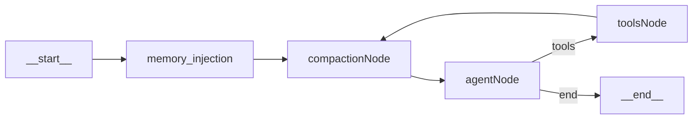

# Plan de implementación: compaction node en el grafo

Este documento describe el **diseño y la implementación vigente** de la memoria de **corto plazo** (compaction). El bloque siguiente es el **prompt original** usado para generar el plan (texto congelado); si entra en conflicto con las secciones posteriores, prevalece lo documentado bajo *Estado implementado*.

# Prompt usado para generar este plan

```
Objetivo
Agregar un compaction_node al grafo existente que gestione automáticamente el crecimiento del historial de mensajes, evitando Context Rot sin perder contexto crítico.

Insights clave
Dos etapas en orden de costo: microcompact primero (gratis, reemplaza tool results viejos con [tool result cleared], preserva los últimos 5), LLM compaction después (solo si supera el 80% de la ventana configurada)
El umbral es 80%, no 95% — se necesita buffer para que la compactación misma quepa en la ventana
El LLM que compacta es Haiku, no Sonnet — es una tarea mecánica, no necesita el modelo más potente
El prompt de compactación genera un resumen de 9 secciones estructuradas. Si el modelo devuelve un bloque <analysis>, se elimina antes de reinyectar — mejora calidad sin gastar tokens extra
Circuit breaker: después de 3 fallos consecutivos, el nodo devuelve los mensajes sin compactar en lugar de hacer loop infinito
El edge crítico es tools → compaction, no tools → agent. Cada tool result nuevo pasa por microcompact antes de llegar al agente
```

**Nota sobre el plan original y `iterationCount`:** el prompt histórico decía «no se toca el iterationCount» en el sentido de **no romper el límite de iteraciones de tools** (`MAX_TOOL_ITERATIONS`) ni el flujo agent ↔ tools ↔ HITL. La implementación **sí añadió `iterationCount` al `GraphState`** con reducer **aditivo**, porque antes el guard se basaba en contar `AIMessage` con `tool_calls` en `state.messages`; cuando la etapa 2 de compaction **elimina** mensajes viejos, ese conteo baja y el límite deja de aplicarse. El campo dedicado cuenta cada vez que el `agent_node` emite tool calls, de forma **independiente del tamaño del historial**. No hay conflicto con checkpointer ni con HITL: solo cambia la **fuente de verdad** del contador.

---

## Objetivo

Agregar un `compaction_node` al loop del agente para prevenir **Context Rot**, con dos etapas (microcompact y LLM compaction), manteniendo intactas las responsabilidades de `agent_node`, `toolExecutorNode`, HITL y checkpointer. El límite de iteraciones de tools se conserva vía `state.iterationCount` y `shouldContinue`.

## Estado implementado (código actual)

- **`GraphState`** centralizado en [`packages/agent/src/state.ts`](../../packages/agent/src/state.ts): `messages`, `sessionId`, `userId`, `systemPrompt`, `pendingConfirmation`, `autoApproveTools`, `compactionCount`, `iterationCount`.
- **`messages`** usa el reducer estándar de LangGraph **`messagesStateReducer`**: hace append como antes, pero además entiende **`RemoveMessage`** y reemplazo por `id`, necesario para que la etapa 2 pueda borrar mensajes viejos, no solo concatenar un resumen.
- **Topología del grafo** en [`packages/agent/src/graph.ts`](../../packages/agent/src/graph.ts):
  - `__start__` → `memory_injection` → `compaction` → `agent` → (`tools` | `__end__`)
  - `tools` → `compaction` → `agent` → …
  - El nodo `memory_injection` se añadió **después** de este plan, al implementar la memoria larga personal ([`long_term_memory_plan.md`](./long_term_memory_plan.md)); corre una sola vez por turno, antes de compaction, y no cambia las etapas ni las responsabilidades descritas aquí.
- **Checkpointer** por `thread_id` (Postgres o memoria); sin cambio de semántica respecto al diseño previo al compaction.
- **Modelo de compaction:** [`createCompactionModel()`](../../packages/agent/src/model.ts) — default `anthropic/claude-haiku-4.5` vía OpenRouter, override opcional `COMPACTION_MODEL_ID`; separado del modelo principal del agente (`MAIN_AGENT_MODEL_ID` / `createChatModel`).

## Topología (referencia rápida)



## Detalle de implementación

### Etapa 1 — microcompact (costo ~0)

- Sobre `ToolMessage` antiguos (todos salvo los últimos **5** resultados de tool): reemplazar contenido por `"[tool result cleared]"`, conservando `tool_call_id` y `id` para swap in-place con el reducer.
- Idempotente: no reescribe si ya está limpio o falta `id` en el mensaje.

### Etapa 2 — LLM compaction (condicional)

- Estimación de tokens: heurística **caracteres / 4** sobre el contenido de mensajes (+ serialización de `tool_calls` en `AIMessage`).
- Umbral: `tokens >= floor(COMPACTION_WINDOW_TOKENS * COMPACTION_THRESHOLD)`. Por defecto ventana **120_000** y fracción **0.8** (80%). Ajustables por env `COMPACTION_WINDOW_TOKENS` y constante/export `COMPACTION_THRESHOLD` en el nodo.
- Prompt pide resumen en **9 secciones** fijas (español). Se eliminan bloques `<analysis>...</analysis>` antes de reinyectar.
- Tras éxito: `RemoveMessage` para ids no preservados + nuevo `SystemMessage` con prefijo `[CONTEXTO COMPACTADO]`.
- **Preservación:** primer `SystemMessage` del historial, última `HumanMessage`, y los últimos **5** mensajes operativos (`AIMessage` / `ToolMessage`) con `id`; el resto candidato a borrado (salvo los ya cubiertos por la regla anterior).

### Circuit breaker (fallos del compactador LLM)

- `compactionCount` en estado: fallos **consecutivos** de la etapa 2.
- Tras **3** fallos, el nodo **omite la etapa 2** (no llama a Haiku) pero puede seguir aplicando microcompact; `compactionCount` deja de subir en ese camino hasta que un compaction LLM tenga éxito (entonces se resetea a 0).
- No bloquea el grafo ni introduce bucles infinitos de reintentos al compactador.

### Logging (observabilidad)

- Archivo por defecto: `packages/agent/logs/compaction.log` (ignorado en git vía `.gitignore`).
- Variables de entorno relevantes: `COMPACTION_LOG_FILE`, `COMPACTION_LOG_VERBOSE`, `COMPACTION_LOG_PREVIEW_CHARS`, `COMPACTION_LOG_SUMMARY_CHARS`, `COMPACTION_LOG_TRANSCRIPT_PREVIEW_CHARS`.
- Implementación: [`packages/agent/src/nodes/compaction_log.ts`](../../packages/agent/src/nodes/compaction_log.ts).

### Pruebas automatizadas

- Script: `npm run test:compaction-node -w @agents/agent` → [`compaction_node.selftest.ts`](../../packages/agent/src/nodes/compaction_node.selftest.ts).

## Criterios de aceptación

- Todo resultado de tool pasa por microcompact antes de volver a `agent` (`tools` → `compaction` → `agent`).
- Microcompact preserva los últimos 5 `ToolMessage` íntegros y limpia los anteriores (con `id`).
- LLM compaction solo corre cuando la estimación supera el umbral configurado (default 80% de la ventana).
- La salida compactada no contiene bloques `<analysis>` visibles en el mensaje inyectado.
- Tras 3 fallos consecutivos de la etapa LLM, el nodo omite esa etapa sin bloquear el grafo.
- Sin cambios funcionales en HITL, ejecución de tools ni checkpointer; el guard `MAX_TOOL_ITERATIONS` sigue aplicando vía `iterationCount` en estado.

## Riesgos y mitigación

- Estimación imperfecta de ventana: umbral conservador (80%) y ventana configurable.
- Pérdida de contexto útil: preservación de últimos tool results + cola operativa + resumen estructurado.
- Inestabilidad del compactador: circuit breaker + passthrough con microcompact.

## Validación técnica

- `npm run type-check -w @agents/agent`
- `npm run test:compaction-node -w @agents/agent`
- Conversación con múltiples tool calls y verificación de edges.
- Por encima de umbral: resumen en 9 secciones y sin tags `<analysis>` en el `SystemMessage` inyectado.
- Forzar 3 fallos del compactador (mock) y confirmar omisión de etapa 2 sin loop.
