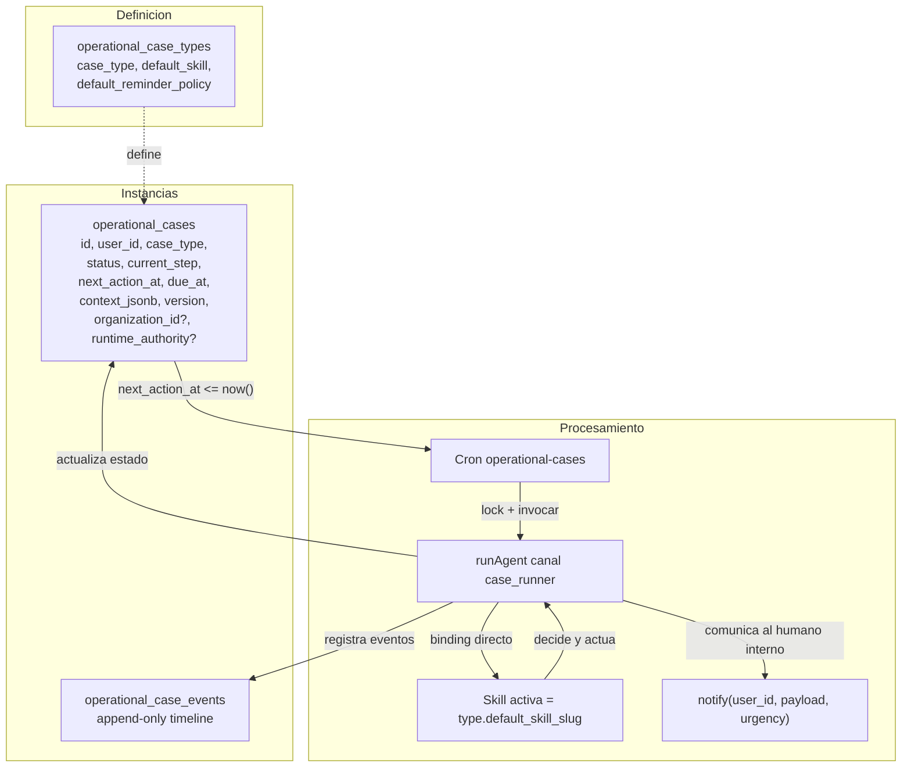
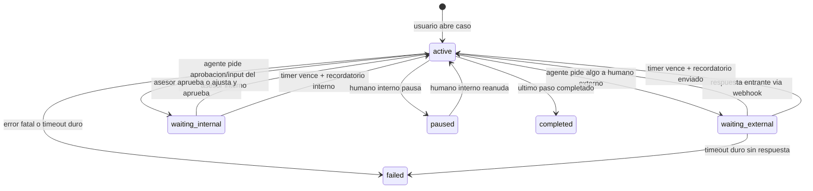
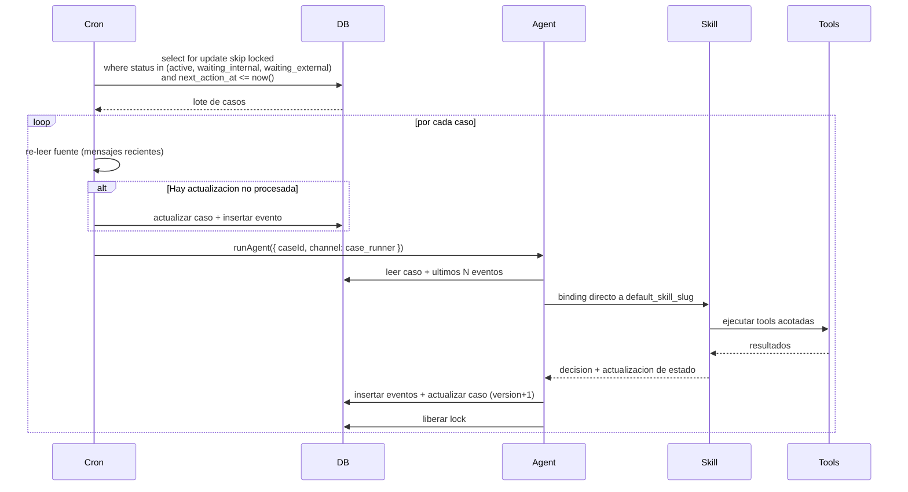
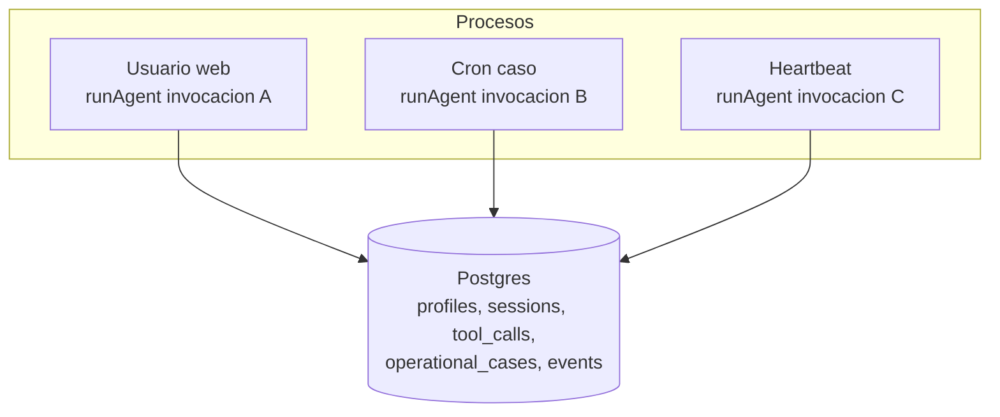
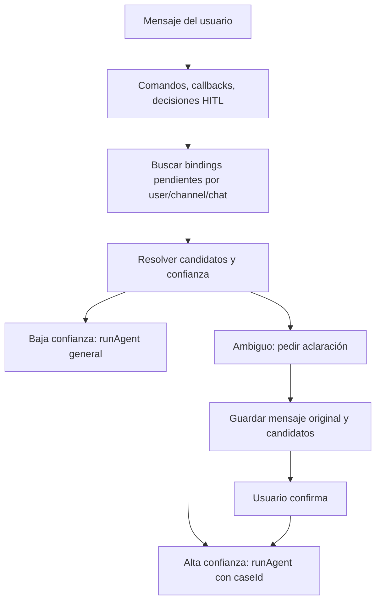
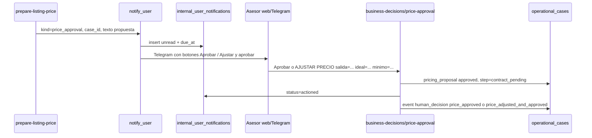
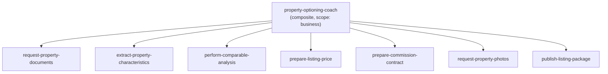
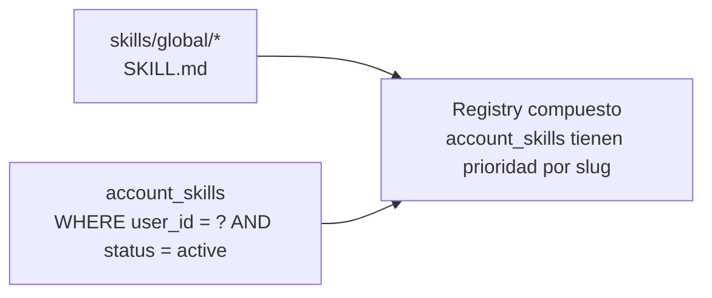

# Subsistema de Casos operacionales — Arquitectura

> Este documento sobrevive al plan. Describe **cómo funciona** el subsistema una vez implementado, separado del plan de ejecución y de las decisiones temporales.
>
> Plan asociado: [`plan.md`](plan.md). Consideraciones futuras: [`future-considerations.md`](future-considerations.md).
> Marco de pruebas: [`testing-framework.md`](testing-framework.md) (N0–N5). **Playbook de autoría:** [`authoring-playbook.md`](authoring-playbook.md). Visión de autoría NL: [`use-case-authoring-vision.md`](use-case-authoring-vision.md). Claridad de ramas: [`step-branch-clarity-plan.md`](step-branch-clarity-plan.md).

---

## 1. Por qué existe

El runtime actual de Gu OS (LangGraph + skills + tools + HITL + Heartbeat + scheduled tasks) cubre bien:

- conversaciones turn-by-turn,
- pausas cortas con HITL dentro de un turno,
- pulsos periódicos exception-first,
- tareas programadas one-shot/recurrentes con prompts.

No cubre bien procedimientos operativos **multi-día** que combinan: pasos secuenciales, esperas a humanos externos (dueño que no responde), recordatorios escalonados, deadlines, eventos asíncronos entrantes, reanudación, y memoria de "dónde voy" separada del thread de chat.

Ese es el hueco que llena el subsistema de casos operacionales.

---

## 2. Modelo conceptual

- **Tipo de caso (`operational_case_types`)** define el "qué procedimiento es" (`property_optioning`, `lead_qualification`, etc.) y a qué skill compuesta apunta por default.
- **Instancia (`operational_cases`)** es la unidad viva. Tiene estado, paso actual, deadline, contexto y versión para optimistic locking.
- **Eventos (`operational_case_events`)** son la historia append-only. Reconstrucción completa siempre disponible.
- **Sujetos (`case_subjects`)** son la identidad duradera de algo que el Caso rastrea y que tiene historia propia: compromisos hoy, visitas más adelante. La fila es un **ancla de identidad sin estado** — no lleva status ni fechas — y todo lo que cambia vive en `case_facts` con `subject_id`, de modo que un cambio **supersede** en vez de sobreescribir y la historia queda reconstruible. Su hijo append-only `case_subject_external_refs` guarda referencias externas que llegan tarde o cambian, como un conjunto con procedencia por fila en vez de un valor que se reescribe.

Los dos campos con `?` en el diagrama son **opcionales por diseño** y se explican en §2.3: un Caso sin ellos es exactamente el Caso user-scoped que este subsistema siempre tuvo.

### 2.1 Paso del flujo, habilidad raíz y `current_step`

Detalle completo, ejemplos y criterios de autoría: [`authoring-playbook.md`](authoring-playbook.md).

| Concepto | Dónde | Rol |
|----------|--------|-----|
| **Habilidad raíz** (compuesta) | `operational_case_types.default_skill_slug` | Única habilidad que el cron invoca por `case_type` (p. ej. `property-optioning-coach`). |
| **Paso del flujo** | `operational_flow_jsonb[]` con `step_key` | Hito de negocio para UI, readiness y pruebas; `step_key` = valores posibles de `current_step`. |
| **Habilidades del paso** | `step_skills[]` (atómicas, 0..n) | Catálogo de comportamientos del hito; la raíz elige cuál aplicar según estado — **no** es cola automática del array. |
| **`current_step`** | `operational_cases` | Puntero al hito (`step_key`), no al slug de una habilidad. |
| **`status`** | `operational_cases` | Modo del motor (`active`, `waiting_external`, …). |
| **`context_jsonb`** | `operational_cases` | Sub-progreso dentro del hito (flags, artefactos parciales). |

`operational_flow_jsonb` documenta y prueba; **no** es autoridad de
transiciones. En tenants con definición fijada, `workflow_definitions` +
evaluator/guards gobiernan la transición; el `SKILL.md` raíz propone y
orquesta trabajo dentro de ese contrato.

### 2.2 Relación con Studio y raíces durables

Studio → Diseño es la superficie primaria de autoría asistida:

1. router provisional;
2. discovery model-backed con doctrina `skill-authoring`, catálogos del tenant
   y evidencia del transcript;
3. `Esto entendí` + confirmación explícita;
4. materialización idempotente;
5. revisión común antes del editor, publicación, activación o ejecución.

No toda creación usa este subsistema. `case_workflow` materializa una
`workflow_definition`; `durable_task` y `schedule` cuelgan de
`durable_tasks → work_runs → work_items`; `reusable_skill` materializa
`account_skills`. Sólo el primer tipo crea/dirige expedientes comerciales en
`operational_cases`.

Readiness y conexiones usan los resolvers compartidos de Studio; una
integración disponible no debe evaluarse con lógica distinta en Ajustes.

### 2.3 Tenencia por Organización y autoridad de runtime

La migración `00081` añadió dos columnas a `operational_cases`. Ambas son
**opcionales y aditivas**: no cambian el comportamiento de ningún Caso existente.

**`organization_id` — nullable.** Un Caso con `organization_id = NULL` conserva
**exactamente** la semántica user-scoped descrita en el resto de este documento. El
valor **nunca se infiere del usuario**: se pasa explícitamente o no se pasa.

Precisión sobre el mecanismo, porque es una frontera de seguridad: las guardas
**RESTRICTIVE** que introduce `00081` **sí participan en la evaluación de toda fila**,
incluidas las legacy. Lo que preserva el comportamiento anterior es cómo están
escritas — la guardia de tenencia es
`organization_id is null or is_active_org_member(organization_id)` y las de escritura
son `organization_id is null` — de modo que **para las filas con `NULL` las guardas
preservan la semántica legacy user-scoped**, no que dejen de aplicarse. Y ahí siguen
haciendo trabajo real: el `with check` de la guardia de UPDATE impide que un dueño
autenticado **adopte** su propio Caso legacy dentro de una Organización asignándole
`organization_id`.

Sobre las filas que sí tienen Organización:

- lectura por **membresía activa** (`is_active_org_member`), no por propiedad de fila;
- policies **RESTRICTIVE** de guardia de tenencia en `operational_cases`, `case_facts`,
  `case_artifacts`, `case_approvals`, `operational_case_events`, `case_subjects` y
  `case_subject_external_refs`;
- escritura **solo desde el servidor** (service role + `authorizeOrgAction`);
- la unique `(id, organization_id)` es el destino de los **FK compuestos** que hacen
  estructuralmente imposible que una fila hija pertenezca a otro tenant que su Caso.
  Es una garantía del schema, no una convención de código.

**Dos formas de tenencia hija, ambas estructurales.** Las tablas hijas más antiguas
*denormalizan* la clave del tenant y la comparan contra el Caso padre. `case_subjects` y
`case_subject_external_refs` usan la otra forma que el kernel ya tenía —la de
`operational_case_events`— y **no llevan `organization_id` en absoluto**: la Organización se
**deriva** del Caso padre a través del FK `case_id`. La diferencia importa porque elimina la
superficie del problema en vez de vigilarla: donde no hay columna, no hay valor que pueda
discrepar del padre. Sobre esa base, la FK **compuesta** `(subject_id, case_id)` en
`case_facts` y en las referencias externas hace imposible que un hecho o una referencia se
enganchen al sujeto de otro Caso —y por tanto de otro tenant— sin ningún trigger.

**`runtime_authority` (`legacy` / `gu_os`) — nullable y sin default.** Dice *qué
runtime decide* sobre una Oportunidad. La ausencia de default es deliberada: un Caso
de relación se crea en `legacy` porque el sistema legacy sigue decidiendo, y la
autoridad solo se mueve mediante una **operación gobernada autorizada** — nunca
implícitamente al crear el Caso, y nunca por el hecho de que Gu OS pueda leerlo.

**Relaciones entre Casos.** `case_relationships` (`00083`) representa vínculos
Caso↔Caso tipados — `duplicate_of`, `superseded_by`, `split_from`,
`transaction_association` — con una sola arista activa por `(from, to, type)` y FK
compuestos que obligan a que ambos Casos sean de la misma Organización. Es una
**arista, no una mutación**: resolver un duplicado no reescribe filas de Caso, que es
lo que permite reconstruir el linaje.

**Identidad del despertar del supervisor.** El índice parcial único
`uq_operational_case_events_supervisor_wake` da identidad estructural a una
reconsideración por `(Caso, wake lógico)`. Existe porque el lease optimista de
`markCaseProcessing` cerca a un worker vencido fuera de la **fila del Caso** —la versión
se movió— pero no fuera del timeline append-only, y porque una reconsideración
*programada* no tiene fila de `source_events` sobre la cual colapsar. Una guarda
leer-y-si-falta-escribir no cierra ninguno de los dos huecos bajo concurrencia, así que
la identidad es del schema.

**Alcance de runtime — importante.** Nada de lo anterior cambia el cron ni el runtime
de casos descritos en §4. La **admisión** que crea Casos Oportunidad sombra a partir
de `source_events` **no la ejecuta hoy ninguna ruta HTTP ni ningún cron**: vive en
`apps/web/src/lib/relationship-admission/`, no la importa ninguna route ni runner, y se
ejercita por selftests, evals y verificadores operados a mano contra staging. Lo mismo
aplica a la resolución duplicado/supersesión y al **supervisor de Caso**
(`apps/web/src/lib/relationship-supervisor/`), que registra postura, compromisos y Work
`agent_proposed` en modo sombra: está implementado y **no está cableado** a ninguna
route ni runner, y su evidencia hospedada corre por `npm run verify:supervisor`. El
`lead_opportunity` sí declara su habilidad raíz por `default_skill_slug`, que es el
binding que el case-runner usaría —pero ese runner no lo invoca hoy. Este subsistema,
tal como corre hoy, sigue siendo el camino de los Casos operativos user-scoped.

---

## 3. Ciclo de vida de un caso

Estados:

| Estado | Significado |
|---|---|
| `active` | El sistema (cron) procesará en `next_action_at`. |
| `waiting_external` | Esperando input externo (dueño, lead). El cron solo dispara recordatorios/escalación según `due_at` y reminder policy. |
| `waiting_internal` | Esperando input o aprobación del asesor/inmobiliario (ej. aprobación de precio). El cron puede enviar recordatorios internos; la decisión llega por web (Pendientes) o Telegram. |
| `paused` | El humano interno lo detuvo a propósito; el cron lo ignora. |
| `completed` | Todos los pasos completos. El caso es solo lectura/auditoría. |
| `failed` | Error fatal o se excedió un timeout duro sin recuperación posible. |

**Sobre el estado inicial.** El diagrama muestra el camino que corre hoy en el
producto: un humano abre el Caso. Existe además un **segundo camino de creación ya
implementado** — la admisión de Relationship Operations materializa un Caso Oportunidad
sombra a partir de un `source_event`, con `organization_id` y `runtime_authority='legacy'`
(§2.3). Se omite del diagrama a propósito, porque **ninguna ruta HTTP ni cron lo ejecuta
hoy**: se ejercita por verificadores operados a mano contra staging. Dibujarlo como una
transición del ciclo de vida sugeriría un flujo de runtime que no existe.

---

## 4. Procesamiento (cron + agente)

**Reglas duras del cron:**

- El scheduler externo debe invocar `POST /api/cron/operational-cases` con el mismo `CRON_SECRET` que los otros runners. Conviene **desfasar** este job respecto a `scheduled-tasks` y `heartbeat` (p. ej. minutos impares en pg_cron) para evitar picos simultáneos; ver **[docs/tools-design/runbook-scheduled-tasks.md](../tools-design/runbook-scheduled-tasks.md)** § Stagger.
- El cron es **determinístico**. No usa LLM. Solo decide "este caso vence" e invoca `runAgent` con `caseId`.
- El cron **siempre re-lee la fuente** antes de actuar para evitar recordatorios molestos sobre estado obsoleto.
- El cron toma **lock por caso** con `select ... for update skip locked`; nunca dos workers procesan el mismo caso a la vez.

**Reglas duras del agente (cuando se invoca con `caseId`):**

- Lee `operational_cases` + últimos N eventos antes de razonar.
- **Binding directo de skill**: salta el selector. La skill es `operational_case_types.default_skill_slug`.
- Cualquier escritura al caso usa `version` para optimistic locking; si choca, reintenta.
- Decisiones de juicio comercial (precio, contrato, publicación) **siempre HITL**.

### Detalle: límite de lote, cola en memoria y concurrencia (implementación actual)

La ruta `POST /api/cron/operational-cases` no procesa “solo los primeros N casos y descarta el resto”. Comportamiento real:

| Pieza | Comportamiento |
|---|---|
| **Lectura desde Postgres** | `getDueOperationalCases` trae un **lote acotado** de filas vencidas. El caller del cron pasa `limit` (p. ej. 100). La query en `packages/db` **caps** el valor a **máximo 200** por invocación. Si hay más casos vencidos que ese límite, el **sobrante sigue en base** con `next_action_at` en el pasado y se atenderá en **la siguiente ejecución** del cron (o en la misma si el primer lote ya avanzó y vació cola). |
| **Cola en esta invocación** | Todos los casos devueltos en ese lote entran en una **cola en memoria**. Varios **workers** (ver abajo) van sacando de la cola de uno en uno; **cada worker espera** a que termine `processCase` antes de tomar el siguiente. |
| **`OPERATIONAL_CASES_CONCURRENCY`** | Número de workers **en paralelo dentro de una misma** invocación HTTP del cron. Es **global** a esa corrida (no “por usuario”). El valor se **acota entre 1 y 20** en código. No aumenta cuántos casos se **leen** de Postgres; solo cuántos `runAgent` corren a la vez sobre el lote ya cargado. |
| **Lock por caso** | `markCaseProcessing` implementa un lease corto vía `version` + `next_action_at`. Si dos invocaciones del cron se solapan, un caso puede devolver `skipped` para la segunda; **no se pierde**: volverá a salir como vencido en otro tick. |

**Aclaración importante:** el límite de concurrencia **no** significa que los casos 6–50 “no se atienden” en esa corrida: se atienden **después** en la misma petición, en serie por worker, en orden de salida de la cola. Lo que **sí** puede quedar fuera es lo que **no entró en el lote** por el `limit` de la query (p. ej. >100 si el cron pide 100).

### Señales de degradación y cómo escalar con criterio

Cuando el volumen suba, vigilar:

| Señal | Qué suele indicar |
|---|---|
| **Cola de vencidos que no baja** (muchas filas con `next_action_at <= now()` por varios ticks) | El cron no alcanza a drenar: duración de cada `runAgent` muy alta, lote muy pequeño, o frecuencia del cron baja. |
| **Duración del request del cron** cerca del timeout del hosting | Demasiados casos por invocación o pasos demasiado pesados; riesgo de cortes a medias. |
| **Aumento de `skipped`** en logs | Solapamiento de schedulers o contención de `version`; revisar que no haya dos crons pegándole al mismo endpoint con la misma ventana. |
| **402 / rate limit** del proveedor LLM | Demasiada concurrencia o demasiados casos activos a la vez. |
| **Presión en pool de Postgres** | Muchas sesiones concurrentes de agente escribiendo en el mismo proyecto. |

**Palancas típicas (en orden de “menos riesgo” a “más invasivo”):**

1. **Aumentar la frecuencia del cron** (p. ej. cada 1–2 min en lugar de 5) para drenar el mismo límite de filas más veces por hora.
2. **Subir el `limit` del lote** en la llamada a `getDueOperationalCases` (respetando cap 200 en DB o subiendo ese cap de forma consciente) si el código y el timeout lo permiten.
3. **Subir `OPERATIONAL_CASES_CONCURRENCY` dentro del rango 1–20** solo si hay margen de costo LLM, límites de API y CPU/memoria del despliegue.
4. **Aligerar el trabajo por tick**: skills más cortas, menos tools por paso, o pasos que no invoquen al LLM cuando se pueda hacer con SQL determinista.
5. **Observabilidad**: métricas de “casos vencidos pendientes”, latencia p95 del cron, y ratio ok/skipped/error por tick.

Cuando ni con frecuencia + lote + concurrencia razonable se estabiliza la cola, **volver a leer** la sección de motor durable en [`future-considerations.md`](future-considerations.md) (Temporal/Inngest): no es el primer remedio, pero es el camino cuando el patrón cron+lote deja de ser mantenible.

---

## 5. Concurrencia con turnos del usuario

Los casos no compiten con turnos web/Telegram del usuario. Cada `runAgent` es invocación independiente con su propio thread:

- Si el usuario pregunta sobre un caso mientras el cron lo procesa, el `runAgent` del usuario lee el caso (lectura no bloquea), pero al escribir respeta el lock; si el caso está bloqueado, responde con la última versión visible y avisa "se está procesando".
- Costos LLM acotados con concurrencia limitada en cada cron (`OPERATIONAL_CASES_CONCURRENCY` similar a `HEARTBEAT_CONCURRENCY`).

---

## 6. Webhook de eventos externos

Una respuesta entrante de un humano externo (ej. el dueño manda foto del predial por Telegram) debe poder despertar el caso inmediatamente, sin esperar el siguiente tick del cron.

Patrón:

1. El webhook del canal (`/api/telegram/webhook`) detecta que el mensaje viene de un `chat_id` asociado a un caso `waiting_external`.
2. Inserta un evento `external_response` en `operational_case_events`.
3. Actualiza `operational_cases.next_action_at = now()` para que el siguiente tick del cron lo procese.
4. Opcional: dispara procesamiento inmediato si la concurrencia lo permite.

Esta asociación se mantiene en `operational_cases.external_contact_jsonb` (`{ channel, chat_id }`).

---

## 6.1 Routing conversacional durable (usuario interno)

Además de respuestas de contactos externos, el sistema soporta conversaciones
multi-turn del usuario interno (inmobiliario/asesor) que pueden iniciar o
continuar casos operacionales. Este routing no debe depender sólo del último
mensaje ni de regex de intención: usa un binding durable entre canal y caso.

Tabla:

| Tabla | Rol |
|---|---|
| `operational_case_conversation_bindings` | Vínculo entre `user_id`, canal/chat/sesión y `case_id` mientras un caso espera input conversacional (`awaiting_user`) o una aclaración (`clarification_needed`). |

Estados del binding:

| Estado | Significado |
|---|---|
| `awaiting_user` | El caso puede recibir una respuesta futura del usuario por ese canal. |
| `clarification_needed` | Llegó un mensaje ambiguo; el sistema preguntó a qué caso/flujo corresponde. |
| `resolved` | El binding cumplió su propósito y ya no enruta mensajes. |
| `expired` | El binding venció por política de tiempo. |
| `cancelled` | El usuario o sistema lo canceló explícitamente. |

Flujo de routing:

Reglas:

- Un binding pendiente **no significa** que todo mensaje siguiente pertenece al
  caso. Sólo declara que existe un candidato activo.
- Mensajes claramente no relacionados (analytics, agenda, preguntas generales,
  etc.) se responden como conversación general y **no cierran** el binding.
- Mensajes ambiguos deben pedir aclaración con:
  - tipo de caso (`case_type` / display name),
  - resumen humano del caso,
  - estado técnico (`status / current_step`),
  - ID corto del caso.
- No crear casos nuevos por keywords inmobiliarios si no hay intención clara o
  aclaración positiva.
- `paused` significa pausa deliberada; no representa intake pendiente. La espera
  conversacional se modela con el binding `awaiting_user`.

### Paridad web/Telegram y límite cross-channel actual

Las decisiones del **usuario interno** no requieren la bandeja web: web chat y
Telegram ejecutan el mismo `resolvePendingDecisionTurn` antes del agente general
y comparten el **contrato HITL** (`hitl-action-contract`) + finalizador post-turno
(`operational-case-post-turn`: invariants, recoveries de contrato/publicación).
La bandeja **Pendientes** complementa el chat con descubrimiento, evidencia y
acciones estructuradas; no es el único lugar para aprobar, corregir o responder.
Además, cuando el caso se opera en web, los follow-ups operativos
(`notify_user` / HITL / resumen de publicación) se espejan al timeline del chat
web y se evita el push Telegram sorpresivo (`getActiveCaseInternalChannel` +
`deliverInternalCaseFollowUp`).

**Frontera de producto:** paridad completa del journey del asesor interno.
El contacto externo opera por canales conversacionales populares (Telegram hoy;
WhatsApp y similares después). `property_data_review` del contacto externo
permanece ligado a su chat externo y no contradice esta paridad interna.

La continuidad operacional usa `case_id`, pero el binding conversacional actual
sigue siendo **por canal**: el índice activo es `(case_id, channel)` y
`findPendingConversationBindings` filtra por `channel`. Por ello una aclaración
abierta en Telegram no está garantizada como aclaración pendiente al responder
en web; el segundo canal puede re-derivar el caso o tratar el texto como general.
Esto es una limitación conocida, no una razón para crear hoy una conversación
universal. Dirección y criterios de activación:
[Gu OS Cross-channel Continuity Architecture](../manuals/gu-os-cross-channel-continuity-architecture.md).

### Bindings rutables vs bindings crudos

Los adapters (Telegram y web) **no** enrutan contra la lista cruda de bindings
pendientes. Primero hidratan cada binding con su `OperationalCase` y filtran a
**bindings rutables** vía `resolveRoutableConversationBindings`:

| Criterio | Efecto |
|---|---|
| Caso `paused`, `completed` o `failed` | Ignorado (`case_not_routable`) |
| Caso de otro `case_type` cuando hay intención de property optioning | Ignorado |
| Caso Real con sesión E2E lab activa | Ignorado (`e2e_isolation`) |
| Caso E2E no adoptable por la sesión activa | Ignorado |

El resultado incluye `ignoredBindings` con razón para telemetría. Las decisiones
de creación, clarificación y fallback determinístico usan sólo `routableBindings`.

Implementación: `conversational-routing-orchestrator.ts`,
`e2e-lab-routing-isolation.ts`.

### Precedencia de intake sobre aclaración

Cuando hay **un único** binding rutable y el caso está en `intake` con
`intake_status !== complete`, un mensaje con **datos de propiedad** (p. ej.
«Casa en venta en Las Fuentes…») continúa ese caso directamente
(`single_binding_intake_continuation`). **No** se pide aclaración «continuar vs
nueva» en ese escenario.

La aclaración sí aplica cuando:

- el mensaje es una frase de inicio vacía («quiero opcionar») con caso(s) activos;
- el usuario pide explícitamente otra propiedad (`looksLikeNewCaseIntent`);
- hay **múltiples** casos candidatos.

Motor: `resolveTelegramConversationRoute` en `conversational-case-routing.ts`.

### Destino documental (`document_request_target`)

Tras completar intake conversacional, el asesor elige quién aporta documentos:

| Valor | Comportamiento |
|---|---|
| `internal_user` | El asesor sube documentos **en el chat** (Telegram, web u otro canal futuro) y confirma con «listo». |
| `external_contact` | El agente/cron solicita al contacto vía `telegram_send_message_to_contact`. |

Esto es una **decisión de rama** del paso `awaiting_documents` (`PATTERN_STEP_BRANCH_DECISION`): mismo hito (reunir expediente), distinto responsable y `waiting_*`. La verdad de ejecución está en código + `context_jsonb`; el panel de Preparación operativa debe **explicar** ambas ramas (no ejecutar el IF). Al fijar el destino se emite `human_decision` con `kind=step_branch_selected` (idempotente; ver [`step-branch-selected.ts`](../../apps/web/src/lib/operational-cases/step-branch-selected.ts)). Plan: [`step-branch-clarity-plan.md`](step-branch-clarity-plan.md).

Reglas adicionales (2026-06):

- Si el asesor **sube archivos antes** de elegir destino, el sistema **infiere**
  `internal_user` (`document_request_target_decided_by=inferred`) y deja de
  repetir la pregunta interno/externo por archivo.
- Los acuses consolidados (álbum Telegram / varios archivos) pueden incluir pista
  por tipo de documento; la lista canónica vive en `case-document-collection.ts`.
- El mensaje post-intake combina confirmación de propiedad + checklist +
  privacidad + elección (`buildPostIntakeDocumentRequestMessage`).

### Vinculación de contacto externo (casos Real)

Si el asesor elige «externo» pero el caso **no** tiene contacto verificado
(`hasOperationalCaseVerifiedExternalContact`), no se rechaza la intención: entra
un subflujo de setup:

1. Se genera un token en `external_contact_link_tokens` (migración `00049`).
2. El asesor recibe un deep link `https://t.me/<bot>?start=ec_<token>` para
   reenviar al dueño/contacto.
3. El contacto abre el enlace → webhook `/start ec_<token>` →
   `verifyExternalContactLink` cablea `external_contact_jsonb.chat_id`, marca
   `external_contact_status=verified` y fija `document_request_target=external_contact`.
4. El pipeline existente (cron/agente + bloque «external responder» del webhook)
   solicita documentos y procesa respuestas entrantes.

Estado intermedio en contexto: `external_contact_setup_status=pending`.

En **E2E lab**, el contacto externo se simula/cablea automáticamente
(`ensureConversationalE2ELabExternalContact`); no requiere deep link.

Implementación: `external-contact-link.ts`, `document-request-target.ts`.

Este patrón es canal-agnóstico. Telegram usa `channel='telegram'` + `chat_id`;
web chat puede usar `channel='web'` + `session_id`. Para canales futuros
(WhatsApp, email), extender el check de `channel` en la migración y reutilizar el
mismo resolver. Deuda menor de adapters: Telegram aún duplica el paso 2 de
intención/creación inline; ver [`future-considerations.md`](future-considerations.md) §10.

---

## 7. Notificación al humano interno

Capa `notify(user_id, payload, urgency)` en [`apps/web/src/lib/notify/index.ts`](../../apps/web/src/lib/notify/index.ts):

- Lee `user_notification_preferences.channels_priority_jsonb` (default `["web", "telegram"]`).
- **Siempre** persiste una fila en `internal_user_notifications` (canal web = inbox/action item), independientemente de si el usuario tiene la consola abierta.
- Intenta entrega push por otros canales configurados (hoy: Telegram vía `getTelegramChatId`).
- Urgencia `high` intenta todos los canales habilitados; `normal`/`low` se detiene tras el primer canal exitoso (excepto web, que ya quedó almacenado).

Tablas (migración `00035_persistent_notifications.sql`):

| Tabla | Rol |
|---|---|
| `internal_user_notifications` | Pendientes del asesor: título, cuerpo, `kind`, `status` (`unread` → `read` / `actioned` / `dismissed`), `due_at`, `action_url`, metadata |
| `external_contact_notifications` | Seguimiento de mensajes a contactos externos (Telegram hoy): intentos, `next_reminder_at`, escalación |

API y UI:

- `GET/PATCH/DELETE /api/notifications` — listar pendientes unread, marcar estado y limpiar bandeja (ver scopes abajo).
- Consola web → **Pendientes** (`/chat/pending`): bandeja dedicada con notificaciones internas, tarjetas **HITL** (`tool_calls` en `pending_confirmation`), recordatorios agrupados, vencimiento/escalación y acciones inline cuando aplica (`price_approval`, `contract_review`, `property_data_review`).
- La bandeja hace **auto-sync** mientras la pestaña está visible (30s dev / 60s prod) y al volver a la pestaña; no hay botón manual de refrescar.
- Menú **Opciones** en la bandeja: ver/ocultar atendidos recientes; **Limpiar bandeja** → historial de atendidos o pendientes de laboratorio (casos `case_type_settings_test`).

**Scopes `DELETE /api/notifications`:**

| Scope | Efecto |
|---|---|
| `resolved-history` | Borra notificaciones `read` / `actioned` / `dismissed` del usuario. |
| `settings-test` | Limpia pendientes de casos de laboratorio en Ajustes: notificaciones, rechaza tool calls bloqueantes y cierra recordatorios huérfanos. |
| `stuck-case` (+ `case_id`) | Rechaza tools pendientes del caso y lo pausa (salvaguarda manual). |

Recordatorios (mismo cron `POST /api/cron/operational-cases`):

- Antes de procesar casos vencidos, el cron consulta `internal_user_notifications` con `status = unread` y `due_at <= now()`.
- Reenvía vía `notify()` con `kind = internal_notification_reminder` y respeta cooldown desde `metadata_jsonb.last_reminder_at`.
- Los defaults de cadencia se resuelven en `apps/web/src/lib/engagement-policies/registry.ts` por audiencia, intención, canal, prioridad y `kind`:
  - `internal_user + approval + price_approval`: `due_at` automático **+4h** si el caller no lo envía; cooldown **4h**.
  - `internal_user + approval + tool_confirmation_pending`: recordatorio de que hay acciones HITL sin resolver; cooldown **4h**, máx. **3** intentos, escalación a **24h** con prioridad `high`.
  - `external_contact/prospect/owner + reminder/followup`: cooldown **24h**, max intentos **3** antes de escalar al asesor.
  - `high` priority puede reducir cooldown interno a **1h**.
- **Overrides por cuenta (V1):** `user_notification_preferences.engagement_policy_overrides_jsonb` (`by_audience`, `by_kind`) permite ajustar cooldown, máx. intentos, escalación y **ventana de entrega** (días de la semana + horario local + timezone). UI en **Ajustes → Proactividad → Políticas de entrega** (`/settings?view=proactivity&section=delivery-policies`); API `GET/POST /api/notification-preferences`. Migración `00036_notification_engagement_policy_overrides.sql`.
- **Ventana de entrega:** si `respectWorkingHours` está activo y el envío cae fuera de la ventana configurada, el cron **reprograma** (`due_at` / `next_reminder_at`) al siguiente horario permitido en lugar de descartar el recordatorio. Defaults: asesor interno **08:00–21:00** (lun–dom); contacto externo **09:00–20:00** (lun–sáb). Timezone: `profiles.timezone` del asesor (contactos externos usan el mismo proxy en V1).
- Recordatorios HITL en Telegram reconstruyen botones **Aprobar/Cancelar** desde `pending_tool_call_id`; si el `tool_call` ya no está en `pending_confirmation`, el cron cierra la notificación como obsoleta en lugar de mandar un nudge pasivo.
- **Resolución del pendiente cross-sesión:** el `tool_call` que respalda el aviso HITL se busca en **todas** las sesiones del asesor (`listPendingCaseToolCalls`), no solo en `case_runner`. Una confirmación puede originarse en un chat de Telegram/web; restringir a `case_runner` dejaba `pendingReference = null`, lo que producía un recordatorio anónimo (sin identificar el caso) y sin `pending_tool_call_id` (sin botones). El webhook resuelve `approve:`/`reject:` por el `session_id` del propio `tool_call`, así que los botones funcionan sin importar el canal de origen. Si aun así no se resuelve el `tool_call`, el texto de respaldo identifica el caso por título/zona.
- **Self-heal de recordatorios HITL:** antes de reenviar un `tool_confirmation_pending`, el cron revalida pendientes por `case_id`. Si encuentra `tool_call` vivo pero la notificación estaba degradada (sin `Caso:` o sin `pending_tool_call_id`), refresca `body` y metadata para que recordatorios/escalaciones salgan accionables con contexto y botones en Telegram. Si no queda ningún pendiente (aunque falte `pending_tool_call_id`), marca la notificación como `actioned` para cortar recordatorios huérfanos.
- Tras **atender** un pendiente (PATCH `actioned`/`dismissed` o handler de business decision), los recordatorios ligados al mismo `source_notification_id` se cierran en cascada para evitar avisos huérfanos.
- **Pendiente (futuro):** overrides por `case_type`/canal individual en UI; timezone por contacto externo; defer también en el primer push inmediato de Telegram (hoy aplica principalmente a recordatorios del cron).

### 7.1 HITL de negocio vs HITL de ejecución de tools

Son capas distintas:

| Capa | Cuándo | Mecanismo | Ejemplo |
|---|---|---|---|
| **HITL de tool** | Antes de ejecutar una tool `medium`/`high` | LangGraph `interrupt()` + tarjetas en **Pendientes** y botones Aprobar/Rechazar en web/Telegram | `calendar_create_event`, `telegram_send_message_to_contact` |
| **HITL de negocio** | Después de que el agente preparó una decisión comercial | `notify_user` crea pendiente persistente; el humano decide por UI o texto estructurado | Aprobación de `pricing_proposal` (`kind = price_approval`), revisión de datos (`property_data_review`) |

Texto libre (Telegram/web) para HITL de negocio pasa por el **router compartido de pendientes** antes del agente: consultas de solo lectura (precio/estado), gates de decisión, escape de preguntas laterales en captura de datos, y una 2ª opinión LLM **solo** cuando un gate sticky está a punto de responder «no entendí». Detalle: [`pending-decision-routing.md`](pending-decision-routing.md).

#### HITL de tool en casos operativos (anti-spam del cron)

Cuando un tick del cron llega a un caso con **tool calls en `pending_confirmation`**, el runtime **no** vuelve a invocar `runAgent` (evita duplicar tarjetas «Aprobación del agente»). En su lugar:

1. Pone `operational_cases.next_action_at = null` hasta que el humano resuelva el HITL.
2. Upsert de notificación `kind = tool_confirmation_pending` vía `notify()` (reutiliza la activa del mismo caso/kind).
3. Los recordatorios de esa notificación siguen la política de engagement (4h / 3 intentos / escalación 24h).

Al **aprobar o rechazar** la tool (`POST /api/chat/confirm` o callback Telegram):

- Se cierran notificaciones `tool_confirmation_pending` del caso.
- Si ya no quedan tools pendientes, se fija `next_action_at = now()` para que el siguiente tick retome el flujo.

En la bandeja web, la tarjeta accionable del `tool_call` prevalece sobre la notificación `tool_confirmation_pending` del mismo caso (deduplicación en UI).

Flujo **price_approval** (implementado):

Reglas de producto actuales:

- **Aprobar precio**: aprueba la propuesta tal cual y avanza a `contract_pending`.
- **Ajustar y aprobar**: el asesor envía montos concretos; se aplican, se aprueban y avanza (un solo paso, sin segunda confirmación).
- **Rechazar / pedir revisión**: no expuesto en UI/Telegram en este MVP; requiere rama completa (motivo → skill replantea → nueva notificación) antes de activarse.
- **Mensaje canónico de propuesta** (`formatPricingProposalForApproval`): incluye salida/ideal/mínimo, desglose por fuente, línea **Contraste Avaclick** (informativa, siempre que exista promedio Avaclick) y **Advertencia** sólo cuando `data_quality.source_conflict` supera el umbral (≥30% entre mediana de mercado por m² o total implícito del sujeto vs promedio Avaclick).
- **Idempotencia post-persist**: si `operational_case_persist_comparables_analysis` ya dejó `pricing_proposal` y disparó `price_approval_requested`, un tick posterior no re-notifica (`price_approval_already_notified`).

Handler compartido: [`apps/web/src/lib/business-decisions/price-approval.ts`](../../apps/web/src/lib/business-decisions/price-approval.ts). Telegram enruta callbacks `price_approve:*` / `price_adjust:*` y respuestas textuales parseadas en el webhook.

Flujo **property_data_review** (implementado):

- Skill/coach solicita revisión con `notify_user(kind=property_data_review)`.
- El asesor confirma o corrige desde **Pendientes** (inline) o Telegram (`property_data_confirm` / `property_data_correct`).
- Handler compartido: [`apps/web/src/lib/business-decisions/property-data-review.ts`](../../apps/web/src/lib/business-decisions/property-data-review.ts); API `POST /api/business-decisions/property-data-review`.

Flujo **contract_data_review** + `commission_terms` (implementado):

- Modelo neutral en `context_jsonb.commission_terms`:
  `commission_pct`, `exclusive`, `duration_months`,
  `collaboration.enabled` (tríestado), `collaboration.compensation.mode|value|currency`,
  `confirmation`.
- Evaluador missing-only: [`packages/agent/src/operational-cases/contract-commercial-terms.ts`](../../packages/agent/src/operational-cases/contract-commercial-terms.ts).
  `enabled=false` limpia compensación; `enabled=true` no exige detalle.
- Preflight preventivo al generar contrato; remediación owned dedupeada por conjunto de faltantes.
- HITL dinámico (web formulario / Telegram botones Sí-No + texto validado) con respuestas parciales:
  [`contract-data-review.ts`](../../apps/web/src/lib/business-decisions/contract-data-review.ts).
- Mappers de borde EasyBroker/Ungga no mutan el canónico; overrides auditables en
  `publication.destinations.<destino>.commercial_override`.
  - EasyBroker: `commission_pct` → `operations[].commission = { type: "percentage", value }`;
    colaboración → `share_commission` + `shared_commission_percentage` solo `50` o `null`.
  - Ungga: `commission_pct` → campo **Comisión (%)** del modal Operación (CLI);
    el % opcional al colaborador no se mapea.

---

## 8. Skills compuestas y atómicas

Una skill compuesta (`property-optioning-coach`) usa `includes` para combinar atómicas. Cada atómica es un SKILL.md con `allowed_tools` acotado; la composite hereda la unión.

Doctrina:

- La composite describe la **secuencia esperada** y los **gates HITL**.
- Las atómicas son reusables fuera del caso (ej. `request-property-documents` puede invocarse standalone).
- Promoción a `account_skills`: cuando una composite es específica de un cliente (ej. variante de Alebrixe), se mueve de `skills/global/` a `account_skills` de ese cliente.

---

## 9. Account skills V1: cómo se integra

El runtime de skills (`packages/agent/src/skills/runtime.ts`) compone el registry así:

- Si una `account_skill` y una global tienen el mismo slug, **gana la account**. Esto permite que un cliente customice una skill global sin perder la base.
- `includes` puede mezclar orígenes (una composite global puede incluir una atómica de cuenta y viceversa).
- Validación Zod idéntica para ambos orígenes.

---

## 10. Tool readiness y provisioning (credenciales por cuenta)

Antes de activar o probar un **tipo de caso privado** con skill propia, la UI puede
diagnosticar si las tools declaradas en metadata (`allowed_tools` + `includes`)
están listas: catálogo, adapter, integración OAuth/vínculo, y **secretos por
cuenta** cuando aplica.

| Pieza | Rol |
|---|---|
| `GET /api/tool-readiness?case_type_id=…` | Resuelve sólo metadata de skills (no compone el body completo) y devuelve por tool: estado, categoría, si bloquea prueba controlada, acción sugerida y `account_provider` cuando aplica (`easybroker`, `easybroker_web`, `ungga_api`, `ungga`). |
| `account_tool_secrets` | Migración `00024_account_tool_secrets.sql`. Una fila por `(user_id, provider)`: `config_jsonb` público para la UI, secretos cifrados en columna dedicada. Estados `pending_test` → `active` / `invalid` tras `POST …/test`. Providers inmobiliarios: `easybroker` (API key write), `easybroker_web` (email/password MLS), `ungga_api`, `ungga`. |
| `account_assets` | Assets privados por cuenta requeridos por `operational_flow_jsonb.required_assets` o assets temporales de prueba declarados por `asset_profile.test` / `test_assets` (plantillas, watermarks, fotos de prueba, etc.). El archivo vive en Supabase Storage y la tabla guarda metadata/ruta. |
| `GET/PUT/DELETE /api/account-tool-secrets` | CRUD sin exponer secretos en GET; PUT valida contra `apps/web/src/lib/account-tool-providers.ts`. |
| `POST /api/account-tool-secrets/[provider]/test` | Prueba de conexión por provider (API ping o sesión Playwright según provider); actualiza `status` y puede cerrar solicitudes abiertas en `global_tool_requests` para tools cubiertas por ese provider. |
| `global_tool_requests` | Migración `00023_global_tool_requests.sql`. Backlog cuando falta capacidad global o recurso de tenant; `GET/POST /api/global-tool-requests`. |
| `operational-case-tests` + `run-tool` | Casos de prueba por `case_type` con contexto de muestra (`test-context-samples.ts`); `POST …/run-tool` ejecuta una tool con args derivados del caso (opcional `case_id` para no usar siempre el último). |
| UI Casos de uso | **Preparación operativa**: revisar lista, expandir tool, conectar providers inline (mismo form que Ajustes), probar tool con vista previa legible de resultados. **Checks de activación**: checklist alineada con bloqueos de readiness. Marco N0–N5: [`testing-framework.md`](testing-framework.md). Modelo de autoría: [`authoring-playbook.md`](authoring-playbook.md). |
| UI Ajustes | Vista **Integraciones** (`/settings?view=integrations`): tabs **Conexiones** (OAuth/vínculo: Google, GitHub, Telegram), **Canales** y **Credenciales por cuenta** (API keys/tokens/credenciales web cifrados). Vista **Capacidades** (`/settings?view=capabilities`): **Habilidades activadas**, **Herramientas permitidas** y **Solicitudes** (backlog `global_tool_requests`; `/settings/tool-requests` redirige a `section=requests`). |
| POC Playwright | `pocs/easybroker-mls-cli/` y `pocs/ungga-cli/`; instalar browsers con `npm run setup:pocs` en la raíz del monorepo. |

Los adapters en `realestate-adapters.ts` **priorizan** secretos por cuenta y
**caen** a variables de entorno solo para despliegues legacy
(`EASYBROKER_API_KEY`, `UNGGA_INTERNAL_API_*`). Búsqueda MLS invoca el CLI
EasyBroker con credenciales `easybroker_web`. Si `storage-state.json` expira,
el CLI reintenta con email/password y sólo pide login asistido cuando EasyBroker
exige CAPTCHA/MFA o bloquea la automatización. Contrato de filtros MLS para
**valuación/comparables**: zona/colonia, operación, tipo de propiedad y banda
de área canónica (residencial `strict` asimétrica −15%/+85%; ejemplo 146 m² →
124–270). Recámaras/baños/estacionamientos **no** son filtros duros de
comparables (sí pueden usarse en búsquedas de opciones para comprador/rentador
con `min_*`). `easybroker_search_closed_deals` aplica y verifica
`Estatus=Solo cerradas`; si no puede verificarlo, no reporta activas como
históricas. `shared_commission_only` sigue disponible cuando el caso lo
requiere. Detalle: `realestate-credentials.ts`.

### 10.1 Doctrina de personalización: global code, account configuration

La regla base es: **las tools runtime viven como código global y reusable; la
personalización del cliente vive en datos/configuración por cuenta**.
Para una explicación conceptual de skills user-facing, skills de referencia,
tools técnicas y wrappers de negocio, ver
[`../skills-tools-architecture.md`](../skills-tools-architecture.md).

Orden recomendado antes de escribir código nuevo:

1. **Configuración/assets por cuenta**: plantillas DOCX, watermarks, logos,
   API keys, tokens, preferencias simples. Se modelan en tablas como
   `account_assets` o `account_tool_secrets`.
2. **Flow/policy por caso de uso**: `operational_flow_jsonb`,
   `activation_policy_jsonb` y `required_assets` declaran qué pasos,
   mensajes, pruebas y recursos requiere cada caso sin cambiar código.
3. **Skills por cuenta**: cuando cambia el playbook operativo de un cliente,
   se usa `account_skills`. La skill instruye y acota tools, pero no ejecuta
   código arbitrario.
4. **Tool global nueva**: se agrega código en el repo sólo cuando aparece una
   capacidad reusable para varias cuentas o casos (ej. render DOCX desde una
   plantilla, aplicar watermark, crear listing en un API externo).
5. **Código específico por usuario/cuenta**: evitarlo en V1. Si algún día es
   indispensable, debe vivir en un modelo explícito de sandbox/plugin con
   aislamiento, versionado, permisos, observabilidad y límites de recursos; no
   mezclado directamente en el runtime global.

Ejemplo: `generate_document_from_template` es una tool global. El contrato de
Alebrixe no es código: es un asset privado de esa cuenta. El mismo renderer
puede servir a otra cuenta si esa cuenta sube su propia plantilla y su flow
declara el `asset_key` correspondiente.

Perfil declarativo de assets:

- `TOOL_CATALOG[].asset_profile.account` describe assets persistentes que una
  tool necesita de forma genérica (ej. watermark de `image_watermark`).
- `TOOL_CATALOG[].asset_profile.test` describe assets temporales para pruebas
  individuales en Settings y qué argumento llenan (`param`, ej. `image_paths`).
- El flow del caso puede declarar `required_assets` / `test_assets` para cambiar
  labels, `asset_key`, límites o copy sin tocar código.
- `min_count`, `max_count` y `collection` permiten colecciones de archivos; la
  UI muestra un cargador compacto con "Agregar fotos" en vez de campos fijos.
  Para `easybroker_upload_images`, la prueba permite hasta 30 fotos temporales.

### 10.2 Orden de publicación EasyBroker / Ungga (publication runner)

La orquestación vive en `publication-workflow` + `publication-runner` (no en el
LLM). Fuente de verdad: `context_jsonb.publication` (proyecciones legadas
`publish_approvals` / `published`). El agente **no** puede escribir esas raíces
vía `operational_case_update_state`.

Feature flag / rollout por caso (precedencia de caso sobre cuenta):
`context.publication_mode` o `publication.mode` ∈ `off | shadow | active`
(default explícito **`off`** si se setea). `shadow` calcula reconcile/preflight
sin side effects; `active` habilita el runner. En `property_optioning`, si el
modo **no** está seteado, al entrar a publicación se auto-habilita `active`
(`propertyOptioningPublicationEnablementPatch`) para no dejar casos reales
atascados tras aprobar la descripción. Flags legados
`context.publication_workflow_v1 === false` /
`publication.feature_enabled=false` también desactivan.

Para casos existentes, `reconcilePublicationCase` (first-touch / lab / admin)
reconstruye `publication` desde artefactos **y** verificación API cuando
hay credenciales: EasyBroker por `internal_id`/listing (status, campos,
conteo/títulos de imágenes); Ungga por GU-ID/draft. Resultado ambiguo →
`unknown_outcome` (nunca “cura” automática). Deduplica pendientes con
metadata real. Si Ungga no tiene GU-ID confirmado, lo deja en
`draft_pending` (no reintenta borradores huérfanos).

Caso legado de recuperación `97d9ba19-687d-4fd6-8b7d-75be29b5f285`: conservar
`EB-WL4498`, verificar remotamente las cinco imágenes/títulos, corregir
manifest, publicar solo tras pass y revisar Ungga antes de cualquier
reintento. Usar un caso nuevo para E2E limpio.

Orden por destino (EasyBroker antes que Ungga):

1. Aprobación humana one-by-one (`easybroker_publish_approval` /
   `ungga_publish_approval`) — callbacks idempotentes (`claim unread`).
2. Draft técnico:
   - EasyBroker: `easybroker_create_listing` → `status=not_published`.
     Colaboración desde `commission_terms.collaboration` (mapper de borde;
     % incompatible → warning, sin mutar canónico). Comisión al propietario
     (`commission_pct`) → `operations[].commission`. Override auditable solo
     en `publication.destinations.<destino>.commercial_override`.
   - Ungga: `ungga_publish_listing(action=prepare_draft)` (enrich desde
     `case_id`; `commission_pct` → Comisión (%) vía lápiz en tarjeta Operación
     con confirmación **palomita**, verificación read-only al reabrir el modal,
     persistencia canónica con **Guardar cambios** del editor + relectura antes
     de `publish_draft` — un “Guardar como borrador” prematuro puede dejar
     comisión `null`; omitir strings vacíos; CLI real con
     `UNGGA_CLI_DRY_RUN=false` salvo tests). Solo el GU-ID creado por CLI es
     canónico (`creation_source=cli`); no adoptar `Tipo Importada /
     Origen EasyBroker`.
3. Media: `easybroker_upload_images(case_id, listing_id)` es el dueño de la
   secuencia. Si la cuenta tiene asset de watermark, el adapter aplica y
   persiste `photo_manifest.watermarked_path` **antes** de llamar a EasyBroker;
   si no hay asset, sube originales sin bloquear. Ignora `upload_path` inventados
   por el LLM y deriva pares desde el manifest. Persist `public_url` en el
   manifest tras el upload.
4. Preflight condicional (`publication-preflight`, watermark/manifest reales):
   `pass` → publicar; `waiting` → reanudar; `review_required` →
   `publication_review_required`; `blocked`/`unknown_outcome` → no reintentar
   side effects automáticamente. Ungga no avanza si EasyBroker no está
   remotamente publicado u omitido.
5. Publish:
   - EasyBroker: `easybroker_publish_listing` (PATCH `status=published`) tras
     snapshot remoto.
   - Ungga: `ungga_publish_listing(action=publish_draft)` solo con el GU-ID CLI
     canónico; revalida comisión antes de Publicar; exige `published_url`.
     Timeout/kill → `unknown_outcome` en fase + ledger; sin auto-retry de
     `prepare_draft`. Retry de `publish` solo si el ledger prueba
     `*_not_called` / pre-side-effect.

El ledger `publication_operations` se cierra con el resultado real del
adapter (`succeeded` / `failed` / `unknown_outcome`), no solo porque terminó
el tick del agente.

**Ownership del runner:** ticks delegados llevan `publicationRunnerOwned=true`
(además de prefijos de telemetría). Eso preserva `next_action_at` y bloquea
auto-follow-up recursivo aunque el `source` sea `publish_destination_*` /
`publication_review_*` / `cron_publication:*`. `nextPublicationAction` no
descarta `*_in_flight` hacia `all_destinations_resolved`.

**Cierre:** requiere evidencia publicada (Ungga: `published_url` del mismo
GU-ID CLI; no basta GU-ID ni imports EasyBroker). No cierra con ledger
`claimed/running` ni `package_ready_machine_work_in_flight`. Recuperación:
`reopenPrematurelyClosedPublicationCase` + un resumen correctivo idempotente.
Runbook lab: [`apps/web/scripts/lab/README.md`](../../apps/web/scripts/lab/README.md)
(reopen → retry publish, mismo GU-ID CLI).

Side effects externos se registran en `publication_operations` (clave única
`(case_id, destination, operation_key)`). Todos los disparadores (Telegram,
web, lab refresh, auto-follow-up) pasan por `requestPublicationProgress` con
`markCaseProcessing` — sin `skipLock` recursivo.

En casos E2E controlados / settings test el cron **no** continúa el caso (limpia
`next_action_at` y marca `cron_suppressed`). El sustituto es el observador del
lab (`buildSettingsTestCaseResponse`): si `nextPublicationAction` indica trabajo
de máquina (`wait_remote_media`, `validate`, `publish`, etc.) y el lease/resume
ya venció, dispara `package_ready_lab_auto_continue` →
`requestPublicationProgress`. Decisiones humanas usan el patrón
`deferredControlledE2ETick` / callback directo al mismo runner.

Para publicación real, el orden técnico EasyBroker sigue siendo:

1. `image_watermark` genera fotos marcadas en `account-assets` usando
   `listing_photo_watermark` u otro asset de watermark de la cuenta.
2. `easybroker_create_listing` crea la ficha con API key `easybroker` y debe
   mantenerse `risk='high'` / HITL. El payload base viene del paquete aprobado:
   título, descripción, operación, tipo, precio, ubicación, área y recámaras.
   Por seguridad se crea como `status=not_published` salvo override explícito.
   Si no recibe `agent`, usa como default el email guardado en
   `account_tool_secrets` para `easybroker_web`; EasyBroker resuelve ese email
   al usuario/agente visible en su panel.
3. `easybroker_upload_images` recibe el `listing_id` devuelto por create y
   adjunta las fotos generadas por `image_watermark` enviando URLs firmadas /
   públicas cortas a EasyBroker.
4. Tras preflight pass, `easybroker_publish_listing` cambia a `published`.

El adapter write debe guardar en el resultado IDs/URLs devueltos por EasyBroker
y registrar errores por imagen sin perder el listing ya creado. `create` devuelve
`public_url` (la liga pública/listing que entrega la API) y `agent_url` (derivada
para el panel interno `/agent/properties/{slug}`). La validación operativa mínima
es: dry-run/HITL del paquete aprobado → create listing → upload imágenes →
publish → devolver URL para confirmación.
Las fotos de publicación no son `account_assets` persistentes; son artefactos
operativos/caso. La limpieza automática de artefactos temporales queda pendiente
si no existe todavía un job/política para `tool-test-artifacts` o
`case-artifacts`.

Para validar la integración antes de correr el flow completo, Settings expone
una prueba real controlada de `easybroker_create_listing`: requiere escribir
`CREAR BORRADOR`, fuerza `status=not_published` y prefija el título con
`[PRUEBA - BORRAR]`. Si la prueba crea una ficha, se debe borrar manualmente en
EasyBroker al terminar la validación.

`easybroker_upload_images` también admite prueba real controlada: requiere
escribir `FOTOS A BORRADOR`, intenta reutilizar el último `listing_id` exitoso de
`easybroker_create_listing` para el usuario y, si no existe, exige que se indique
un `listing_id` real (no `REEMPLAZA-CON-LISTING-ID`). Usa las fotos temporales
resueltas desde `asset_profile.test`. EasyBroker reemplaza el arreglo de imágenes
de esa ficha, por lo que sólo debe usarse contra borradores de prueba.
El contrato real de EasyBroker valida `images[].url` con máximo 255 caracteres;
por eso el adapter no debe enviar signed URLs largas de Supabase directamente.
Cuando hay `NEXT_PUBLIC_SITE_URL` público (o `EASYBROKER_PUBLIC_ASSET_BASE_URL`),
manda una URL corta de Gu OS (`/api/public/account-assets/{id}/image.ext`) que
redirige temporalmente al objeto privado. Si la foto vive en `case-documents`
(sin fila previa en `account_assets`), el upload hace upsert de un pointer
`easybroker_image__*` para reutilizar ese mismo endpoint corto.

Entornos:

- **Local**: EasyBroker no puede abrir `localhost`. Para prueba real controlada de
  upload se debe exponer `localhost:3000` con un túnel HTTPS, por ejemplo
  `ngrok http 3000`, y configurar en `apps/web/.env.local`
  `EASYBROKER_PUBLIC_ASSET_BASE_URL=https://<subdominio-ngrok>` sin barra final.
  Reiniciar `npm run dev` después de cambiar env vars.
- **Producción / GCP**: configurar `NEXT_PUBLIC_SITE_URL` con el dominio público
  HTTPS de Gu OS (dominio propio, Load Balancer, Cloud Run público o el endpoint
  estable que corresponda). Si se quiere desacoplar EasyBroker del dominio
  canónico de la app, usar `EASYBROKER_PUBLIC_ASSET_BASE_URL` con una base pública
  equivalente. El endpoint `/api/public/account-assets/{id}/image.ext` debe ser
  accesible desde internet para que EasyBroker descargue las imágenes.

#### Contrato real observado de `POST /v1/properties`

El contrato operativo se basa en el OpenAPI Markdown publicado por EasyBroker en
`https://dev.easybroker.com/llms.txt` y validación real contra la cuenta. Puntos
importantes para no repetir la iteración:

- `operations[]` requiere `type`, `amount`, `currency` y `active`; para renta de
  largo plazo el `type` aceptado es `rental`. `unit` puede enviarse como `total`.
- `location.name` debe ser el string completo de ubicación registrada (por
  ejemplo `Colomos Providencia, Guadalajara, Jalisco`), compatible con
  `/v1/locations`.
- En `POST /properties`, `location` acepta solo: `name`, `street`,
  `exterior_number`, `interior_number`, `cross_street`, `postal_code`,
  `latitude` y `longitude`. No enviar ahí `city_area`, `city`, `region`, `type`
  o `full_name`; esos aparecen en respuestas/lookup, pero producen
  `422 Unpermitted parameters` en create.
- `show_exact_location` va top-level, no dentro de `location`.
- El adapter (`buildEasyBrokerCreatePayload`) es el dueño del contrato: construye
  por **allowlist** (OpenAPI `PropertyBody`) y **no** hace passthrough de
  `custom_fields` / `custom_fields_json`. Campos internos del caso como
  `legal_address` o `area_construida_m2` nunca deben ir top-level.
- Sanitizers relevantes: strings vacíos y placeholders (`N/D`, `N/A`) se
  omiten; `internal_id` máximo 15 caracteres (un UUID de caso se omite);
  `lot_width` / `lot_length` / tamaños en `0` se omiten; `covered_space` no se
  envía en MX; `operations[].commission` se arma desde `commission_terms.commission_pct`
  como `{ type: "percentage", value }` (omitido si ausente/inválido);
  `shared_commission_percentage` solo `50` o `null`; `agent` debe
  ser email de cuenta EasyBroker; `street` se normaliza si el LLM mandó la
  dirección completa.
- `tags` son strings libres y sí se envían. `features` solo si matchean el
  catálogo de la cuenta (`GET /v1/features`, match exacto/normalizado). Si el
  catálogo no está disponible o no hay match, se omiten y se registran en
  `dropped_fields` sin bloquear el create.
- El endpoint crea siempre una ficha nueva (`POST`), no hace upsert. Repetir la
  prueba real controlada crea otro borrador.
- Para propiedades `not_published`, la UI de EasyBroker puede ordenar
  "Publicación más reciente" por `published_at` (nulo), mientras que
  "Actualización más reciente" usa `updated_at`; por eso un borrador recién
  creado puede aparecer primero sólo con orden por actualización.

---

## 11. Convenciones operativas

| Convención | Detalle |
|---|---|
| Canal `case_runner` | Nuevo valor agregado a `agent_sessions.channel_check`. Se usa en `runAgent({ channel: 'case_runner', caseId })`. |
| Sesión por caso | `getOrCreateSession(db, userId, 'case_runner', { caseId })`. Una sesión persistente por caso para auditoría unificada. |
| Idempotencia de eventos | Cuando el cron detecta una desincronización (ej. respuesta externa ya integrada), inserta un evento `state_changed` con `payload.reason: 'reconciled'`. |
| Bloqueo de tools fuera de allowlist | Igual que Heartbeat: el canal `case_runner` puede tener su propia allowlist conservadora si lo amerita. |
| Tracing | Cada turno del agente emite `AgentTurnEvent`; los eventos persistidos llevan `turn_id` correlacionado. |
| Un caso con hechos no se puede borrar (comportamiento actual, sin resolver) | `operational_cases → case_facts` es `on delete cascade`, pero `case_facts` tiene un trigger append-only que rechaza el `DELETE` del cascade. En la práctica **un caso que ya tiene hechos no es borrable**, y el `DELETE` falla con `case_facts is append-only` en lugar de con un error de permisos o de negocio. Es una inconsistencia entre las dos decisiones (cascade vs. append-only), no un fallo de ninguna de ellas por separado: la evidencia es deliberadamente inmutable, pero el `on delete cascade` sugiere que el borrado debería funcionar. Verificado contra PostgreSQL real el 2026-09-01. Resolver requiere una decisión de producto sobre qué significa borrar un caso (borrado lógico, retención de evidencia, o `on delete restrict` explícito); queda **abierto**, fuera del alcance de R1 SL-0. |

---

## 12. Métricas y observabilidad mínimas

Para evitar casos zombie y degradación silenciosa:

- Casos abiertos por `case_type` y por edad (>7d, >30d, >90d).
- Tasa de completados vs fallidos por `case_type`.
- Tiempo promedio en cada `current_step`.
- Recordatorios enviados por caso (alertar si >3 sin respuesta).
- Locks no liberados (alertar si un caso está `for update` >5 min).

Implementación inicial: vistas SQL sobre `operational_cases` + `operational_case_events`. Dashboards visuales pueden venir después.
