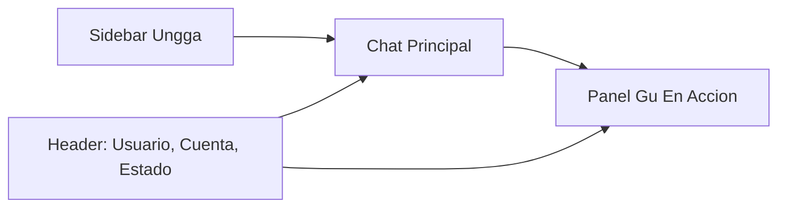

# Plan De Consola Gu

## Objetivo

Convertir la web actual de chat, ajustes y memoria en una experiencia de escritorio tipo consola de Gu: mas moderna, mas alineada a Ungga y capaz de mostrar progresivamente que hace el agente.

## Enfoque Recomendado

El rediseño se trabajara por fases para no bloquear la mejora visual con la instrumentacion avanzada.

### Fase 1: UI Shell Y Chat Mejorado — entregado

- Crear una estructura visual consistente para la app web: sidebar, header, fondo, cards y lenguaje visual Ungga.
- Redisenar `/chat` como pantalla principal de consola.
- Resolver el auto-scroll inicial en `apps/web/src/app/chat/chat-interface.tsx`.
- Stick-to-bottom + burbuja «ir al último mensaje» (chrome del canal, estilo Telegram): el viewport solo se pega al final cuando el usuario ya está cerca del fondo; si sube el historial aparece un botón flotante sobre el composer. Implementado en `chat-interface.tsx` (no es ítem de paridad HITL web↔Telegram).
- Integrar mejor el avatar o imagen de Gu que ya viene de `business_brain.agent_identity`.
- Mantener el backend actual request/response para reducir riesgo.

### Fase 2: Panel "Gu En Accion" Con Datos Existentes — entregado (con refinamientos futuros)

- Agregar un panel derecho en chat con estado del agente, confirmaciones pendientes, herramientas recientes y memorias relevantes.
- Usar datos ya existentes de `agent_messages`, `tool_calls` y `memories`.
- No mostrar razonamiento interno crudo; mostrar estados operativos curados.
- Refuerzo por turno: correlacion `turn_id` en mensajes y tool calls (persistencia en DB: migracion Supabase [`00013_agent_turn_correlation.sql`](../../packages/db/supabase/migrations/00013_agent_turn_correlation.sql); **aplicada en los entornos Ungga activos**; nuevos clones/despliegues siguen el flujo habitual de migraciones desde el repo); respuesta de `/api/chat` con `memoryUsed` (corto/largo plazo y previews legibles) y secciones de Flujo, Habilidades, Herramientas, Aprendizajes recientes.
- La caja expandible de contexto base debe separar lo pre-turno de la evidencia del turno: Business Brain cargado, habilidades disponibles para seleccion y herramientas configuradas van en "Contexto preparado"; skill elegida, tools ejecutadas y memoria aplicada van en las tarjetas del turno. Ese modelo se escribio originalmente en `docs/business-brain-evolution-roadmap.md` ("Skill selection and tool availability model"), hoy **superseded** y reducido a un stub: el detalle tecnico vigente vive en [`../tools-design/skill-routing.md`](../tools-design/skill-routing.md) y lo implementado en [`../architecture.md`](../architecture.md).
- Actividad del turno: datos de sesion + payload en el flujo de chat; timeline en vivo vía SSE (Fase 3, ver abajo).
- Preparar el panel para mostrar presencia del colaborador: voz, adjuntos, actividad proactiva y estado de heartbeat (Fase 4 / paralelo).

### Fase 3: Eventos En Vivo / Streaming Operativo

- Disenar una tabla o canal de eventos tipo `agent_turn_events` para registrar pasos del turno (pendiente; hoy los eventos viven solo en memoria del proceso).
- **Entregado (primer incremento):** SSE paralelo sin cambiar el JSON final de `POST /api/chat`: rutas **`GET /api/chat/events?turnId=…`** (`apps/web/src/app/api/chat/events/route.ts`) y fan-out en memoria (`apps/web/src/lib/agent-turn-events.ts`). El cliente abre `EventSource` desde `chat-interface.tsx` durante el turno activo.
- Emitir eventos como memoria cargada, herramienta iniciada, herramienta completada, confirmacion requerida y turno terminado (emitidos desde el agente; consumo en panel como timeline en vivo).
- Evolucion para produccion multi-instancia: persistir eventos en `agent_turn_events` o publicarlos por Supabase Realtime/canal equivalente; el panel debe poder recuperar eventos recientes aunque el cliente se reconecte o el request sea atendido por otro proceso.
- Evaluar Langfuse como observabilidad tecnica complementaria, no como UI final para el usuario.

### Fase 4: Interaccion Multimodal Y Presencia

- Agregar voz en tiempo real para hablar con el colaborador como una persona disponible.
- Agregar mensajes de voz asincronos estilo WhatsApp.
- Permitir adjuntar files, imagenes y videos para dar contexto al agente.
- Representar la actividad proactiva del colaborador: Heartbeat como rutina del sistema y scheduled tasks como automatizaciones programadas por el usuario.
- Diferenciar claramente entre actividad iniciada por el usuario en chat, actividad programada por el usuario (`scheduled_tasks`) y actividad proactiva del colaborador (`heartbeat_runs`).

## Layout Propuesto Para Desktop

- **Sidebar:** árbol en `APP_NAV_TREE` (`apps/web/src/lib/navigation/app-navigation.ts`), renderizado por `AppNav` dentro de `AppShell`: **Chat** (Conversación, Pendientes), **Operaciones** (Flujos en curso, Plantillas de flujos), **Proactividad**, **Conocimiento** (Memoria), **Configuración** (Perfil del usuario, Perfil del agente, Capacidades del agente, Integraciones, Cuenta y sesión). Modo expandido/compacto con iconos; estado persistido en `localStorage`.
- **Chat central:** conversacion, input fijo, confirmaciones HITL integradas; burbuja de salto al final cuando el historial no está pegado abajo.
- **Input multimodal:** texto, adjuntos, mensaje de voz y futura voz en tiempo real.
- **Panel derecho:** Gu visual, estado, tools recientes, memoria, checklist de trabajo, heartbeat, scheduled tasks y presencia.
- **Admin futuro:** selector de usuario/cuenta arriba cuando `is_ungga_admin` aplique.

## Archivos Clave

- `apps/web/src/components/app-shell.tsx`: layout global (sidebar, header dinámico, area de contenido).
- `apps/web/src/components/app-nav.tsx`: navegacion lateral; scroll al top al cambiar de ruta.
- `apps/web/src/lib/navigation/app-navigation.ts`: arbol `APP_NAV_TREE` (labels, hrefs, matchers).
- `apps/web/src/app/chat/page.tsx`: carga inicial del chat, perfil, sesion y mensajes.
- `apps/web/src/app/chat/chat-interface.tsx`: UI del chat, scroll (stick-to-bottom + jump-to-bottom), input y confirmaciones.
- `apps/web/src/app/settings/page.tsx`: carga de datos de ajustes (server); enruta por `?view=` y `?section=`.
- `apps/web/src/app/settings/settings-form.tsx`: UI de ajustes por vista (perfil, agente, capacidades, integraciones, proactividad, cuenta); tabs client-side con `history.replaceState` dentro de la misma vista.
- `apps/web/src/app/settings/settings-page-meta.ts`: titulos y descripciones del header segun vista/seccion activa.
- `apps/web/src/app/memory/page.tsx`: entrada a memorias.
- `apps/web/src/app/globals.css`: tokens visuales globales.
- `apps/web/src/app/api/chat/route.ts`: POST request/response del turno completo (contrato estable).
- `apps/web/src/app/api/chat/events/route.ts`: SSE de eventos operativos por `turnId` (auth Supabase).

## Alineacion con roadmap Business Brain

- La **correlacion persistente por turno** se alineo con el roadmap tecnico de entonces (`docs/business-brain-evolution-roadmap.md`, secciones *Operational streaming* / *Turn correlation en la DB*; ese documento quedo **superseded** y su cuerpo vive en el historial de Git): migracion `00013` (aplicada en los entornos Ungga activos), indices, escritura desde el agente.
- **Heartbeat proactivo** ya cuenta con runtime base: cron `POST /api/cron/heartbeat`, tabla `heartbeat_runs`, canal `agent_sessions.channel='heartbeat'`, allowlist de herramientas solo-lectura y modelo configurable (`HEARTBEAT_MODEL_ID`). Settings muestra configuracion/historial; la consola debe mostrar presencia viva desde `heartbeat_runs`.
- **Scheduled tasks** ya existen como herramienta conversacional y runner cron (`scheduled_tasks` + `scheduled_task_runs`). La consola debe mostrar su presencia como automatizaciones programadas por el usuario, separadas de Heartbeat.

## Decisiones De Producto

- La consola normal sera por usuario/cuenta autenticada.
- La vista admin sera una fase separada con selector de cuenta y controles de auditoria.
- La UI no expondra chain-of-thought; expondra actividad operativa comprensible.
- La UI no debe insinuar que todas las habilidades o herramientas estan cargadas en el prompt antes de una solicitud. Debe distinguir: contexto base persistente, habilidades candidatas, herramientas configuradas, habilidad seleccionada del turno, herramientas ejecutadas y memoria aplicada.
- La UI de producto debe leer de datos persistidos y seguros (`agent_messages`, `tool_calls`, `memories` o futuras tablas de eventos). Los logs (`turn_summary.log`, `memory.log`, `compaction.log`) son para debug/desarrollo, no para la experiencia normal del usuario.
- Langfuse se considerara para trazas internas y debugging, no como reemplazo del panel de producto.
- El logo de la cuenta/inmobiliaria aparecera como identificador de marca; mientras no exista logo propio, se usara Ungga como default.
- El colaborador podra tener actividad proactiva via heartbeat, que debe mostrarse como presencia/actividad autonoma y no como mensaje manual del usuario.
- Las scheduled tasks deben mostrarse como trabajo programado por el usuario, no como iniciativa autonoma de Gu; comparten runner externo con Heartbeat pero tienen semantica y auditoria distintas.

## Estado Actual

- Completado (Fase 1): shell visual de `/chat`, header de marca/cuenta, avatar de colaborador, input con iconos de adjuntos/voz/envio, scroll independiente del chat y panel derecho; auto-scroll inicial del chat alineado al comportamiento esperado.
- **Shell global de app (post-Fase 1):** `AppShell` unifica chat, memoria, operaciones y configuracion con sidebar Ungga colapsable; ajustes organizados por `?view=` (sin sub-items profundos en el sidebar); sub-navegacion por tabs dentro del contenido (capacidades, integraciones, proactividad).
- Completado (Fase 2 en producto): panel derecho con Flujo, Contexto preparado expandible (Business Brain, habilidades disponibles para seleccion y herramientas configuradas), Memoria del turno (corto/largo plazo, previews expandibles cuando el backend los envia), Habilidades del turno, Herramientas del turno, Aprendizajes recientes (ultimas memorias activas por cuenta); correlacion por `turn_id` en mensajes y `tool_calls` con columnas persistentes (**migracion `00013`**, aplicada en los entornos Ungga activos); UI sin exponer chain-of-thought.
- Tarjeta superior del panel («Colaborador en acción»): mini-dashboard en tres métricas: **Heartbeat** (activado en `profiles.business_brain.heartbeat`; estado vivo Activo/Inactivo con ícono), **Programadas** (conteo de `scheduled_tasks` activas cargado en `page.tsx`), **Por aprobar** (única confirmación HITL pendiente en la vista de chat cuando aplica).
- Plan Cursor export emparejado: `.cursor/plans/gu_console_ui_3b083b6d.plan.md` (misma vision por fases; revisar YAML de estado vs texto de este doc).
- Pendiente Fase 2 (refinamiento): confirmaciones HITL mas ricas en panel, timeline de actividad de sesion mas alla del ultimo turno, mensajes anteriores/paginacion si el producto lo pide.
- **Fase 3 — primer incremento entregado:** SSE paralelo `/api/chat/events` + fan-out en memoria (`agent-turn-events`); cliente con `EventSource` en `chat-interface`. **Queda pendiente:** persistencia o bus compartido multi-instancia (`agent_turn_events`, Realtime u otro) y reconexion con historial de eventos fuera del proceso.
- **Actividad proactiva en UI:** la tarjeta inferior del panel consume datos vivos: ultima corrida de Heartbeat con indicador de corazon pulsante, cadencia configurada, proxima scheduled task y conteo de tareas activas/pausadas. Settings mantiene la configuracion y gestion detallada.
- Pendiente Fase 4 / paralelo: voz realtime, mensajes de voz async, adjuntos reales desde chat, vista admin Ungga con selector de cuenta/usuario.

## Historico — Primer Incremento

El primer entregable fue Fase 1 (shell + chat + panel basico + scroll). Esa base ya esta desplegada; las fases siguientes se documentan arriba.
